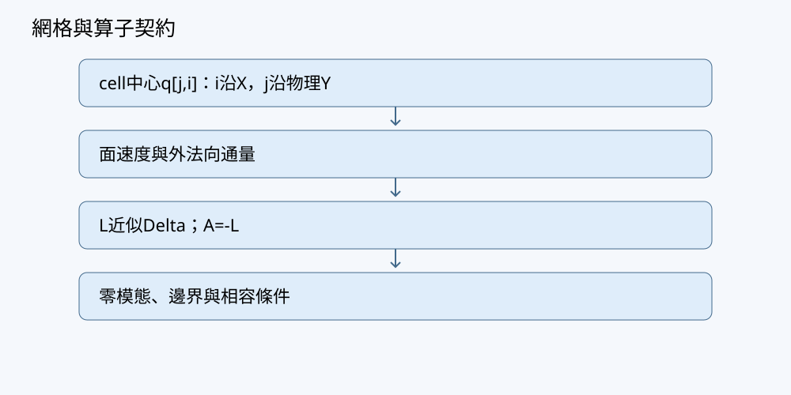

# 第03章 梯度、散度、旋度與積分守恆

## 學習目標與先備知識

本章把局部的梯度、散度與旋度，接到邊界上的通量與環流。讀完後，讀者應能：

1. 說明三種算子的輸入、輸出、單位與幾何意義。
2. 在散度定理與 Stokes 定理的適用條件下，正確選取邊界方向。
3. 由控制體收支推得「流出為正」的守恆式，並在小格網上逐面核對。
4. 用解析場及自足的 NumPy 程式，比較體積積分與邊界通量，且分辨恆等式檢查和物理模型驗證。

先備知識是前章的偏導數、全微分與二維定積分。本文採右手座標系：$X$ 向右、$Y$ 向上、$Z$ 朝觀者。二維網格的 `q[j,i]` 沿 $i$ 指向 $+X$、沿 $j$ 指向 $+Y$；本章二維通量均指**每單位厚度**的量。

## 問題與直覺

想像在合成池域中畫一個封閉的小方框。水攜帶的物質可能從東面流出，也可能從西面流入。若只量東面的速度，就無法知道框內物質是否增加：必須把**每一面的外向通量**相加，並計入來源與儲量變化。

圖中的箭頭可協助辨認局部算子，但圖像不能代替面積、法向與單位的計算。



梯度描述純量場在各方向的變化；散度描述向量場在一點附近的淨外流趨勢；旋度描述局部環流趨勢。「某處速度很大」不代表散度大：等量流入與流出時，淨外流仍可為零。同樣，散度為零也不代表速度為零，更不代表沒有旋轉。把局部導數積起來，才得到可與整個控制體邊界核對的量。

## 數學與物理推導

### 三種局部算子

對可微的純量場 $c(x,y,z)$，梯度是列向量：

$$
\nabla c=
\begin{pmatrix}
\partial_xc\\
\partial_yc\\
\partial_zc
\end{pmatrix}.
$$

它指向 $c$ 增加最快的方向；沿單位方向 $\boldsymbol e$ 的變化率為 $\nabla c\cdot\boldsymbol e$。若 $c$ 是濃度，單位為 $\mathrm{kg/m^3}$，則梯度單位為 $\mathrm{kg/m^4}$。梯度不是流量；還需要材料定律，例如擴散通量可能與負梯度成正比，才能由它推得物質輸送。

對速度場 $\boldsymbol u=(u_x,u_y,u_z)$，散度為

$$
\nabla\cdot\boldsymbol u
=\partial_xu_x+\partial_yu_y+\partial_zu_z.
$$

速度單位為 $\mathrm{m/s}$，散度單位為 $\mathrm{s^{-1}}$。散度是局部淨外流的密度，不應直接稱為某一面的流量。三維旋度則為向量：

$$
\nabla\times\boldsymbol u=
\begin{pmatrix}
\partial_yu_z-\partial_zu_y\\
\partial_zu_x-\partial_xu_z\\
\partial_xu_y-\partial_yu_x
\end{pmatrix}.
$$

在只含 $x,y$ 分量、且不隨 $z$ 變化的二維問題，常用其 $z$ 分量 $\partial_xu_y-\partial_yu_x$；正值對應從 $+Z$ 觀看的逆時針環流趨勢。它與「整片區域繞某點轉了幾圈」不是同一個量。

### 散度定理、法向與守恆

設 $\Omega$ 是有界控制體，其邊界分段光滑，$\boldsymbol n$ 是幾乎處處有定義的**單位外法向**；若 $\boldsymbol F$ 在包含 $\Omega$ 的鄰域足夠光滑，例如連續可微，則散度定理給出

$$
\int_\Omega\nabla\cdot\boldsymbol F\,dV
=\int_{\partial\Omega}\boldsymbol F\cdot\boldsymbol n\,dA.
$$

右側採「流出為正」。矩形的東、西、北、南面外法向依序是 $(1,0)$、$(-1,0)$、$(0,1)$、$(0,-1)$。因此西面若有指向 $+X$ 的通量，點積為負，代表**流入**。定理不是說每面的通量都為正，也不是說只取速度大小即可。

以濃度 $c$、物質通量 $\boldsymbol J$、體積來源 $s$ 表示局部收支：

$$
\partial_tc+\nabla\cdot\boldsymbol J=s.
$$

若 $c$ 為 $\mathrm{kg/m^3}$，$\boldsymbol J$ 為 $\mathrm{kg/(m^2\,s)}$，則 $s$ 為 $\mathrm{kg/(m^3\,s)}$。對固定控制體積分，且可合法交換時間微分與積分時，

$$
\frac{d}{dt}\int_\Omega c\,dV
=-\int_{\partial\Omega}\boldsymbol J\cdot\boldsymbol n\,dA
+\int_\Omega s\,dV.
$$

也就是「儲量增加率＝來源率－淨流出率」。若控制體移動，必須改用相對於移動邊界的通量；不能原封不動套用固定控制體公式。


相鄰兩格共享一面：左格的外法向指向右，右格的外法向指向左。**同一個面通量只計算一次、在兩格收支中符號相反**，內部面因此抵消。即使每格的淨通量不為零，將所有格子相加後，總收支也只剩外邊界與來源。這是保守離散的核心，不要求每個面上的通量都等於零。

### Stokes 定理與方向配對

對可定向、分段光滑的曲面 $S$，及在其鄰域足夠光滑的向量場 $\boldsymbol F$，Stokes 定理為

$$
\int_S(\nabla\times\boldsymbol F)\cdot\boldsymbol n\,dA
=\oint_{\partial S}\boldsymbol F\cdot d\boldsymbol\ell.
$$

邊界走向必須和選定的曲面法向符合右手規則。對位於 $XY$ 平面、法向取 $+Z$ 的區域，邊界從 $+Z$ 看為逆時針；若改取 $-Z$，邊界走向也要反轉。左式是旋度穿過曲面的通量，右式是沿邊界**切向**的環流；它與散度定理的外法向通量是不同運算。若場有奇點、曲面未能定向，或邊界與法向方向不相容，不能不加條件地套用等式。

## 逐步手算例題

### 例一：四個小格的共享面如何抵消

取 $2\times2$ 的二維格網，$\Delta x=\Delta y=1\,\mathrm m$，每單位厚度計。令通量場為

$$
\boldsymbol J=(x,y)\ \mathrm{kg/(m^2\,s)},\qquad
0\leq x,y\leq2\,\mathrm m.
$$

這裡係數的單位已包含在場的定義內，使通量單位如上。單格的「東、西、北、南」面外向通量依次為 $x_E$、$-x_W$、$y_N$、$-y_S$，因面長均為 $1\,\mathrm m$。例如左下格 $(i,j)=(0,0)$：

| 面 | 面座標 | 外向通量，每單位厚度 |
|---|---:|---:|
| 東 | $x=1$ | $+1$ |
| 西 | $x=0$ | $0$ |
| 北 | $y=1$ | $+1$ |
| 南 | $y=0$ | $0$ |

故該格淨流出為 $2\,\mathrm{kg/(m\,s)}$。右下格的西面在 $x=1$，外向通量為 $-1$；這恰好抵消左下格東面的 $+1$。同理，上下格共享的水平面亦成對抵消。

逐格計算，每格淨流出均為 $2\,\mathrm{kg/(m\,s)}$，四格合計為 $8\,\mathrm{kg/(m\,s)}$。再只看大方框外邊界：東面 $x=2$ 的通量積分是 $2\times2=4$，北面同為 $4$；西、南面均為 $0$，合計亦為 $8$。最後從局部量核對：

$$
\nabla\cdot\boldsymbol J=\partial_xx+\partial_yy=2,
\qquad
\int_\Omega\nabla\cdot\boldsymbol J\,dA=2(2\times2)=8.
$$

三種算法一致。若無來源，總儲量變化率應為 $-8\,\mathrm{kg/(m\,s)}$，而不是 $+8$。此例的通量場只用來檢查幾何與守恆；它不主張合成池域可以無限期維持這樣的濃度收支。

### 例二：旋度與環流的方向檢查

在單位正方形 $S=[0,1]^2$，取 $\boldsymbol F=(-y,x,0)$，曲面法向為 $+Z$。先算局部旋度：

$$
(\nabla\times\boldsymbol F)_z
=\partial_x(x)-\partial_y(-y)=2.
$$

因面積為 $1$，左式曲面積分為 $2$。按逆時針順序沿底、右、頂、左四條邊計算：

- 底邊 $y=0$，向右行，$\boldsymbol F\cdot d\boldsymbol\ell=0$。
- 右邊 $x=1$，向上行，$\boldsymbol F\cdot d\boldsymbol\ell=dy$，積分為 $1$。
- 頂邊 $y=1$，向左行，$\boldsymbol F\cdot d\boldsymbol\ell=-dx$；因 $x$ 從 $1$ 走到 $0$，積分為 $1$。
- 左邊 $x=0$，向下行，點積為 $0$。

環流合計 $2$，與旋度面積分相符。若沿順時針行走卻仍保留 $+Z$ 法向，會得到 $-2$；這不是定理失效，而是方向配對錯誤。此場的散度為 $0$，也同時展示「無淨外流」可以與「有環流」並存。

## 實作與程式

以下程式只需 Python 3.10+ 與 NumPy，在 CPU 上建立小型合成格網；不連設備，不取得現場資料。它以**面通量**為輸入，不把格心值誤當面值。`fx[j,i_face]` 儲存朝 $+X$ 的通量，形狀為 `(Ny,Nx+1)`；`fy[j_face,i]` 儲存朝 $+Y$ 的通量，形狀為 `(Ny+1,Nx)`。外面左、下面的外向貢獻須取負號。對本例常數通量單位約定為 $\mathrm{kg/(m^2\,s)}$，二維總量均按每單位厚度表示。

初始條件為每格 $c=10\,\mathrm{kg/m^3}$；邊界條件在此一步診斷中是程式明定的四側面通量，沒有另行求解濃度的邊界值；來源 $s=0\,\mathrm{kg/(m^3\,s)}$。令 $\Delta t=0.1\,\mathrm s$，以守恆式更新一次。這是一個收支診斷，而非由流體方程求速度的模型。

```python
import hashlib
import json
import numpy as np

def finite_array(name, value, shape):
    a = np.asarray(value, dtype=float)
    if a.shape != shape or not np.all(np.isfinite(a)):
        raise ValueError(f"{name}: 形狀或有限值不合契約")
    return a

def audit(c, fx, fy, source, dx, dy, dt):
    ny, nx = np.shape(c)
    if not (isinstance(nx, int) and isinstance(ny, int)
            and nx > 0 and ny > 0):
        raise ValueError("格網必須非空")
    if not np.all(np.isfinite([dx, dy, dt])) or min(dx, dy, dt) <= 0:
        raise ValueError("間距與步長須為有限正數")
    c = finite_array("c", c, (ny, nx))
    fx = finite_array("fx", fx, (ny, nx + 1))
    fy = finite_array("fy", fy, (ny + 1, nx))
    source = finite_array("source", source, (ny, nx))

    # 每格淨外流率；陣列中相鄰格共用同一個面值。
    net = ((fx[:, 1:] - fx[:, :-1]) * dy
           + (fy[1:, :] - fy[:-1, :]) * dx)
    area = dx * dy                         # 每單位厚度的格子體積
    old_mass = float(np.sum(c) * area)
    new_c = c + dt * (source - net / area)
    new_mass = float(np.sum(new_c) * area)

    boundary = float(
        np.sum(fx[:, -1] - fx[:, 0]) * dy
        + np.sum(fy[-1, :] - fy[0, :]) * dx
    )
    generated = float(np.sum(source) * area)
    balance_error = new_mass - old_mass - dt * (generated - boundary)
    return new_c, net, boundary, balance_error

nx, ny = 2, 2
dx = dy = 1.0
dt = 0.1
settings = {"nx": nx, "ny": ny, "dx_m": dx, "dy_m": dy,
            "dt_s": dt, "flux": "J=(x,y)", "source": 0.0}
settings_hash = hashlib.sha256(
    json.dumps(settings, sort_keys=True).encode("utf-8")
).hexdigest()

x_faces = np.arange(nx + 1, dtype=float) * dx
y_faces = np.arange(ny + 1, dtype=float) * dy
fx = np.broadcast_to(x_faces, (ny, nx + 1)).copy()
fy = np.broadcast_to(y_faces[:, None], (ny + 1, nx)).copy()
c0 = np.full((ny, nx), 10.0)
source = np.zeros((ny, nx))
c1, net, boundary, error = audit(c0, fx, fy, source, dx, dy, dt)

assert np.allclose(net, 2.0)
assert np.isclose(boundary, 8.0)
assert np.allclose(c1, 9.8)
assert abs(error) < 1e-12

try:
    broken = fx.copy()
    broken[0, 1] = np.nan
    audit(c0, broken, fy, source, dx, dy, dt)
except ValueError:
    pass
else:
    raise AssertionError("非有限通量未被拒絕")
```

設定雜湊用來標識這份**設定文字**，不表示資料已驗證，也不保證不同軟體環境的浮點輸出逐位相同。若實際保存實驗，還應連同單位、程式版本、輸入陣列與輸出診斷一併記錄。

## 測試與預期結果

以上程式未在此執行；下列均為由公式推得的**預期**結果。

| 測試 | 預期與判準 |
|---|---|
| 正常解析場 | 四格 `net` 各為 $2$；外邊界 `boundary` 為 $8$；每格由 $10$ 變成 $9.8$。 |
| 全零通量邊界情形 | 把 `fx`、`fy` 都設為零且 `source=0`，則濃度與總量不變。 |
| 非零來源 | 保持零通量，令各格 `source=1`，則每格經 $0.1\,\mathrm s$ 增加 $0.1\,\mathrm{kg/m^3}$；總量增加等於來源積分乘時間。 |
| 故障輸入 | 面陣列形狀不符、含 `NaN`，或 $\Delta x\leq0$，應拒絕，不生成貌似合理的圖。 |
| 方向故障 | 若把西面符號錯取為正，例一的邊界總值將無法與逐格總和一致，應以收支斷言偵出。 |

浮點加總通常以容差檢查；「差額接近零」驗證的是這次離散收支的內部一致性，不驗證指定通量是池域真實通量。上述一次更新的 $c_1$ 恰好為正，並不證明任意通量、來源與步長下皆非負。對這種指定面通量的更新，若一步移走超過格內原有質量，就可能得到負濃度；須檢查資料與時間步長，不能事後裁零而不記錄改變的總量。

數值穩定、守恆、能量下降、非負性及物理可信度是不同判準。本章程式核對**守恆代數**；沒有為此更新提出能量泛函，也沒有據此宣稱能量下降或長時間穩定。

## 除錯與常見陷阱

**把通量分量當外向通量。** 在西面，朝 $+X$ 的 `fx[:,0]` 是流入，對外向總和貢獻為負；在南面，朝 $+Y$ 的 `fy[0,:]` 同理。先畫出外法向，再做點積，比背誦正負號可靠。

**共享面計算兩次卻使用不同值。** 若左右兩格各自估算其共同面，一個得到 $f_L$、另一個得到 $f_R$，兩者未必精確抵消。守恆更新應明定單一共享面值。週期邊界若把同一物理面儲存兩份，還須同步，計算總量時不可把它當兩個獨立外邊界。

**混同網格、影像與座標方向。** `q[0,0]` 是左下格；一般影像的首個 row 常畫在上方。若要繪圖，應使用 `origin='lower'` 或明示翻轉。此處採格心儲量與面通量，並非節點取樣；節點資料若要積分，須另定權重。

**忘記幾何因子。** 面通量要乘面積，體積來源要乘體積。二維每單位厚度的矩形，直立面的面積因子是 $\Delta y$，水平面是 $\Delta x$，格子體積因子是 $\Delta x\Delta y$；若明定厚度 $h$，三者還要乘 $h$。

**將定理用在不符條件的場。** 有跳躍或奇點的場可能需要分區、弱形式或額外的界面通量處理；不能只在奇點代入偏導便宣布積分定理失效。分區後的內界面也要核對兩側法向與通量。

**由守恆直接推論正確。** 一個把所有面通量都誤設為零的程式也會完美守恆，但可能完全不符合欲描述的輸送。因此至少要同時核對解析例、邊界設定、來源單位及輸入假設。

## 養殖與相場案例

設合成池域中有一片水平區域，$c$ 表示溶質質量濃度，$\boldsymbol J$ 表示輸送通量。若水流攜帶溶質穿過區域邊界，採樣或模型必須說明量到的是濃度、速度，還是已相乘並包含擴散的**總物質通量**。只知道某個感測點濃度上升，不能直接斷言該區有正來源：上游流入、邊界條件改變及局部來源都可能造成相同現象。沒有獨立資料時，這只是合成模型的收支推論，不是現場驗證，更不構成投餌、加藥或設備控制建議。

同一個積分守恆語言也為後續相場章搭橋，但不能把不同物理量混為一談。例如若序參量滿足守恆形式 $\partial_t\phi+\nabla\cdot\boldsymbol J_\phi=0$，週期或適當零外向通量邊界下，其區域積分保持不變；非守恆形式則通常沒有這項結論。這只取決於方程與邊界，不表示溶氧跨越管理閾值是物理相變。相場自由能是否下降也需要另外檢查其演化定律、邊界與時間離散，不能從「質量守恆」四字推得。

## 習題

1. **手算。** 在 $\Omega=[0,2]\times[0,1]$ 上，令 $\boldsymbol F=(2x,-y)$。求散度積分，並逐邊求外向通量。說明西邊與南邊的符號。
2. **程式。** 修改本章程式，令所有面通量為零、各格來源為 $3\,\mathrm{kg/(m^3\,s)}$。在原格網與時間步長下，求預期的新濃度、總量變化與收支差額；列出至少一項應拒絕的故障輸入。
3. **反例。** 有人聲稱「若 $\nabla\cdot\boldsymbol u=0$，則任何閉合曲線的環流都為零」。以本章的一個場反駁，並寫出適用的積分定理。
4. **整合。** 在固定二維控制體中，初始總溶質質量為每單位厚度 $12\,\mathrm{kg/m}$。某段 $2\,\mathrm s$ 內，外向邊界通量率恆為 $1.5\,\mathrm{kg/(m\,s)}$，來源積分率恆為 $0.5\,\mathrm{kg/(m\,s)}$。求末總量；若四格面通量計算得到的逐格淨流出總和是 $2.0\,\mathrm{kg/(m\,s)}$，應如何診斷？這些數據是否證明物理模型已驗證？

## 習題解答

1. $\nabla\cdot\boldsymbol F=2-1=1$，區域面積為 $2$，故散度積分是 $2$。東邊 $x=2$、$\boldsymbol n=(1,0)$，通量為 $\int_0^1 4\,dy=4$；西邊 $x=0$，通量為 $0$。北邊 $y=1$、$\boldsymbol n=(0,1)$，通量為 $\int_0^2(-1)\,dx=-2$；南邊 $y=0$，通量為 $0$。合計 $4-2=2$。西邊取 $-X$、南邊取 $-Y$ 外法向；本題兩處場分量恰為零，不能因此省略法向的符號規則。
2. 零面通量使每格 `net=0`；每格濃度增加 $3(0.1)=0.3\,\mathrm{kg/m^3}$，由 $10$ 變為 $10.3$。四格每格面積為 $1\,\mathrm{m^2}$，每單位厚度的總量增加 $4(0.3)=1.2\,\mathrm{kg/m}$。來源積分率為 $12\,\mathrm{kg/(m\,s)}$，乘 $0.1\,\mathrm s$ 亦得 $1.2\,\mathrm{kg/m}$；收支差額預期接近浮點零。把 `source` 中一格改為無窮大、把 `fy` 改成錯誤形狀，或設定非正 `dt`，都應拒絕。
3. 取 $\boldsymbol u=(-y,x)$。其散度是 $\partial_x(-y)+\partial_yx=0$，但在單位正方形逆時針邊界上的環流為 $2$。散度定理約束的是閉邊界**外法向通量**；環流由 Stokes 定理及旋度聯繫，本例旋度的 $z$ 分量為 $2$。把兩種邊界積分混同，才會得到錯誤聲稱。
4. 儲量變化率為來源減淨流出，即 $0.5-1.5=-1.0\,\mathrm{kg/(m\,s)}$；兩秒後總量為 $12-2=10\,\mathrm{kg/m}$。若逐格淨流出合計 $2.0$，卻由外邊界得到 $1.5$，先檢查內部共享面是否使用同一數值且符號相反，再檢查面長、邊界是否重複計數及法向方向；不應用裁改末總量掩蓋差額。即使修到完全一致，所證實的仍是離散收支一致，並非通量、來源或整個物理模型已獲獨立觀測驗證。

## 本章小結

梯度、散度、旋度分別連接方向變化、淨外流與環流。散度定理把控制體內的散度積分化為**外法向**邊界通量；Stokes 定理把旋度的曲面通量化為方向配對的**切向**邊界環流。守恆計算的可靠起點，是明確的量綱、格心與面的位置、共享面唯一值，以及「儲量變化＝來源－淨流出」的符號約定。解析核對與故障拒絕能檢查實作，卻不能單獨替代物理驗證。

## 參考來源

- [F1：FiPy 有限體積離散與邊界](https://pages.nist.gov/fipy/en/latest/numerical/discret.html)：供後續有限體積通量與邊界處理參照。本章手算和程式自足，不依賴 FiPy。
- [F2：FEniCSx Poisson 與弱形式](https://jsdokken.com/dolfinx-tutorial/chapter1/fundamentals.html)：供後續由通量積分轉入弱形式時參照；本章未使用其程式介面。

上述來源不代表本章合成池域的物性或現場結果已被驗證。