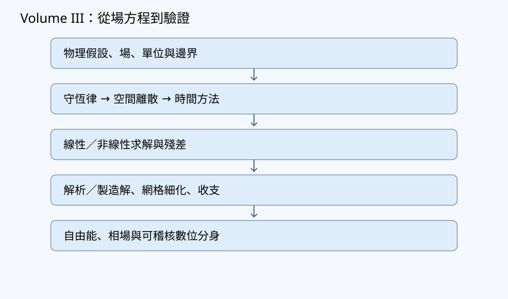

# 第23章 參數反推與可辨識性

## 學習目標與先備知識

正向模擬從參數出發預測場；參數反推則從有限且帶誤差的觀測，尋找能解釋觀測的參數。本章完成一個合成擴散係數反推，並回答比「算出一個數」更重要的問題：資料是否足以分辨欲求的參數？

讀完後，讀者應能建立帶單位與誤差權重的最小平方目標，計算預測對參數的靈敏度，利用 Jacobian 的秩辨認不可辨識組合，區分正則化所得的唯一解與資料本身提供的資訊，並把校準資料與獨立檢查資料分開。

先備知識包括一維擴散初邊值問題、矩陣乘法、偏導數與最小平方。以下只用合成資料；預先指定的「真值」僅用於檢查反推流程，不是養殖場量測所得的物性。

## 問題與直覺

設一段長度為 $L$ 的封閉水槽，其濃度起初在空間上不均勻。經過一段時間，擴散會削弱濃度起伏。若量得起伏隨時間衰減，能否倒推出擴散係數 $D$？

答案取決於還有什麼未知量。若起始起伏幅度已知，兩個不同時刻的讀數有機會識別衰減率；若只量一個時刻，而起始幅度也未知，較大的起始幅度配上較快的衰減，可能和較小幅度配上較慢的衰減給出同一讀數。最佳化器仍可能回傳一組數值，但「有解」不等於「參數由資料決定」。



本章把模型、觀測、求解器及驗證資料分開存放。正向方程的離散誤差、量測噪聲及模型漏掉的輸送機制，也不能一律當作參數變動來吸收。

## 數學與物理推導

### 正向問題與可觀測量

考慮一維區間 $0\leq x\leq L$、時間 $t\geq0$ 上的合成溶質模型：

$$
\partial_t c=D\,\partial_{xx}c,\qquad
\partial_xc(0,t)=\partial_xc(L,t)=0,
$$

$$
c(x,0)=\bar c+A\cos\!\left(\frac{\pi x}{L}\right).
$$

其中 $x$ 用公尺、$t$ 用秒、$c,\bar c,A$ 用 $\mathrm{kg/m^3}$，$D>0$ 用 $\mathrm{m^2/s}$；來源為零。兩端齊次 Neumann 條件表示擴散通量 $-D\partial_xc$ 為零，故總量不因邊界流失。初值中的餘弦模態符合兩端條件，其解析解是

$$
c(x,t)=\bar c+
A\exp\!\left(-D\frac{\pi^2t}{L^2}\right)
\cos\!\left(\frac{\pi x}{L}\right).
$$

令 $k=\pi/L$。若觀測位於 $x=0$，扣除已知背景值後，預測為

$$
g(t;D,A)=A e^{-Dk^2t}.
$$

此例使用解析正向解，使反推概念不被空間離散誤差遮蔽；實務若改用格網求解，必須另外進行網格及時間步長細化。解析解也僅在上述初值、邊界、常數 $D$ 與零來源的假設下適用。

### 加權最小平方與資料切分

令觀測為 $y_n=g(t_n;\theta)+\epsilon_n$，參數列向量為 $\theta=(D,A)^{\mathsf T}$。若每筆觀測的標準差 $\sigma_n>0$ 已有合理估計，可最小化無因次化的殘差平方：

$$
\Phi_{\mathrm{data}}(\theta)
=\frac12\sum_{n\in\mathcal T}
\left(\frac{g(t_n;\theta)-y_n}{\sigma_n}\right)^2.
$$

$\mathcal T$ 僅含訓練資料。權重不能在看到殘差後任意調整，以便讓結果顯得吻合。若誤差相互相關，應使用協方差矩陣而非把各點當獨立；若有系統偏差，縮小標稱噪聲也無法消除模型誤差。

可以加入先驗或正則化，例如

$$
\Phi(\theta)=\Phi_{\mathrm{data}}(\theta)
+\frac{\lambda}{2}
\left(\frac{D-D_{\rm ref}}{D_{\rm scale}}\right)^2,
\qquad \lambda\geq0.
$$

$D_{\rm scale}$ 令懲罰項無因次。當資料無法識別 $D$ 時，$\lambda>0$ 可以選出唯一數值，但它利用的是額外假設；不能把該數值描述為單由資料量得。正則化中心、強度與選取程序均須報告，且不得利用保留作獨立檢查的資料偷偷調參。

### 靈敏度、尺度與秩

預測對兩個參數的偏導為

$$
\frac{\partial g}{\partial D}
=-k^2t\,A e^{-Dk^2t},
\qquad
\frac{\partial g}{\partial A}=e^{-Dk^2t}.
$$

將不同時刻的偏導排成 Jacobian：每個**橫列**是一個觀測，每個**縱行**是一個參數。對兩個互異且有限的觀測時間 $t_1,t_2$，若 $A\ne0$，兩個縱行一般線性獨立；若只有一個讀數，矩陣最多秩一，兩個未知參數不可能同時局部識別。若 $A=0$，所有讀數都是背景值，$\partial g/\partial D=0$，無論量多少個時刻，此實驗都不能從該模態估出 $D$。

秩是局部、無噪聲的判準，並非精度保證。時間太接近時，兩個靈敏度方向可能幾乎平行；時間都很早時，對 $D$ 的變化很小；時間都很晚時，訊號可能衰減到噪聲以下。計算條件數前還須處理尺度：$D$ 與 $A$ 的單位不同，直接比較未縮放 Jacobian 的奇異值並無清楚物理意義。可使用無因次參數 $d=D/D_{\rm scale}$、$a=A/A_{\rm scale}$，再把各觀測除以其 $\sigma_n$，檢查縮放後矩陣的奇異值。滿秩但最小奇異值很小，代表噪聲可能被大幅放大。

資料切分按觀測時間預先進行。例如用兩個早期時刻校準，以未參與擬合的較晚時刻檢查預測。驗證點殘差小仍不足以證明模型在其他初值、邊界或場域有效；但若殘差呈現系統性偏差，就有理由檢查模型假設，而非只追加參數。

## 逐步手算例題

### 例一：兩個時刻識別單一擴散係數

為便於手算，設定合成水槽 $L=\pi\,\mathrm m$，故 $k=1\,\mathrm{m^{-1}}$。已知 $A=2\,\mathrm{kg/m^3}$，選定測試真值 $D_\star=0.1\,\mathrm{m^2/s}$。於 $x=0$ 測量相對於背景值的起伏，在 $t_1=2\,\mathrm s$ 與 $t_2=5\,\mathrm s$ 的無噪聲預期值是

$$
y_1=2e^{-0.2}\approx1.63746,\qquad
y_2=2e^{-0.5}\approx1.21306
\quad(\mathrm{kg/m^3}).
$$

第一步，取兩筆資料比值以消去已知或共同的幅度：

$$
\frac{y_2}{y_1}
=e^{-Dk^2(t_2-t_1)}.
$$

第二步，取對數，得到

$$
D=\frac{\log y_1-\log y_2}{k^2(t_2-t_1)}
=\frac{0.3}{3}=0.1\,\mathrm{m^2/s}.
$$

第三步，檢查量綱：對數比值無因次，$k^2(t_2-t_1)$ 的單位是 $\mathrm{s/m^2}$，所以結果是 $\mathrm{m^2/s}$。若讀數帶噪聲，對數比值不再恰好給真值；若某讀數不為正，這個對數公式也不能直接使用。真值在本例中只是生成資料的設定，不可用它來選觀測點後再宣稱完成盲測。

### 例二：一筆資料無法同時識別幅度與擴散

仍取 $k=1\,\mathrm{m^{-1}}$，只在 $t=2\,\mathrm s$ 量得 $y=2e^{-0.2}$。若 $(D,A)=(0.1,2)$，模型吻合。然而對任意選定的 $D'>0$，令

$$
A'=y e^{2D'},
$$

就有 $A'e^{-2D'}=y$。例如取 $D'=0.2\,\mathrm{m^2/s}$，則 $A'=2e^{0.2}\approx2.44281\,\mathrm{kg/m^3}$，仍給相同讀數。無數組參數位於同一條等預測曲線。

此時 Jacobian 只有一個橫列：

$$
J=\begin{pmatrix}-2Ae^{-2D}&e^{-2D}\end{pmatrix},
$$

秩至多為一，不可能對兩個未知量具有滿秩識別。即使在最佳化目標中偏好 $D=0.1$，所得結果也含有偏好的貢獻。增加一個不同時間的觀測，比單純更換最佳化器更能處理這項資訊缺口。

## 實作與程式

以下 NumPy／CPU 程式以解析正向解反推**一個**未知 $D$；幅度、背景、初始與邊界條件均事先給定。它以固定候選網格進行可重現的小型搜索，非通用最佳化器。訓練資料僅用 $t=2,5\,\mathrm s$，保留 $t=8\,\mathrm s$ 作獨立檢查。合成噪聲由固定數值指定，不假稱是真實量測。

```python
import hashlib
import json
import numpy as np

L = float(np.pi)             # m
A = 2.0                      # kg/m^3，已知初始模態幅度
background = 10.0           # kg/m^3
D_true = 0.1                # m^2/s，僅用於生成與測試
sigma = 0.02                # kg/m^3，示範用誤差尺度

t_train = np.array([2.0, 5.0])  # s
t_hold = np.array([8.0])        # s
noise_train = np.array([0.01, -0.02])  # kg/m^3
noise_hold = np.array([0.015])         # kg/m^3

def predict(times, diffusivity):
    times = np.asarray(times, dtype=float)
    diffusivity = np.asarray(diffusivity, dtype=float)
    if (times.ndim != 1 or not np.all(np.isfinite(times))
            or np.any(times < 0)
            or not np.all(np.isfinite(diffusivity))
            or np.any(diffusivity <= 0)):
        raise ValueError("時間或擴散係數不合契約")
    return background + A * np.exp(
        -diffusivity[..., None] * (np.pi / L)**2 * times
    )

y_train = predict(t_train, D_true) + noise_train
y_hold = predict(t_hold, D_true) + noise_hold

def fit_grid(times, observed, std, candidates):
    times = np.asarray(times, dtype=float)
    observed = np.asarray(observed, dtype=float)
    candidates = np.asarray(candidates, dtype=float)
    if (times.ndim != 1 or times.size == 0
            or observed.shape != times.shape
            or not np.all(np.isfinite(observed))
            or not np.isfinite(std) or std <= 0
            or candidates.ndim != 1 or candidates.size == 0):
        raise ValueError("觀測、權重或候選形狀不合契約")
    predicted = predict(times, candidates)
    residuals = (predicted - observed[None, :]) / std
    scores = 0.5 * np.sum(residuals**2, axis=1)
    index = int(np.argmin(scores))
    return float(candidates[index]), float(scores[index])

candidates = np.linspace(0.02, 0.20, 1801)  # m^2/s
D_fit, train_score = fit_grid(t_train, y_train, sigma, candidates)
hold_residual = y_hold - predict(t_hold, D_fit)

settings = {
    "L_m": L, "A_kg_m3": A, "background_kg_m3": background,
    "sigma_kg_m3": sigma, "train_times_s": t_train.tolist(),
    "hold_times_s": t_hold.tolist(),
    "candidate_count": int(candidates.size),
}
settings_hash = hashlib.sha256(
    json.dumps(settings, sort_keys=True).encode("utf-8")
).hexdigest()

assert 0.02 <= D_fit <= 0.20
assert np.all(np.isfinite(hold_residual))

try:
    fit_grid(t_train, np.array([np.nan, 1.0]), sigma, candidates)
except ValueError:
    pass
else:
    raise AssertionError("非有限觀測未被拒絕")
```

程式未把 `D_true` 傳進 `fit_grid`。設定雜湊識別設定欄位，不包含觀測陣列的完整內容；若要封存可稽核實驗，還須另存資料、噪聲生成規則、程式版本及殘差。保留資料只在完成擬合後評估，不能反覆查看其結果來挑選候選區間或誤差尺度，否則它不再是獨立檢查。

## 測試與預期結果

以下均為推導所得的預期，未執行程式。

| 情形 | 預期診斷 |
|---|---|
| 無噪聲、候選含 $0.1$ | 訓練資料由同一解析式生成時，$D=0.1\,\mathrm{m^2/s}$ 的目標值為零。 |
| 程式所列小噪聲 | 最佳候選應在 $0.1\,\mathrm{m^2/s}$ 附近，但一般不會恰等於真值；保留點殘差一般不為零。 |
| 零初始起伏 $A=0$ | 預測不隨 $D$ 變；即使搜尋器回傳一個候選值，也不可報告已識別 $D$。 |
| 單時刻、未知 $A$ 與 $D$ | Jacobian 秩至多一；需回報不可辨識，而非只顯示一組擬合值。 |
| 非法輸入 | `NaN` 觀測、非正誤差尺度、負時間或非正擴散係數應被拒絕。 |

進一步可預先固定多組噪聲種子，重複生成訓練資料，報告所得 $D$ 的分散程度；種子數與噪聲模型要事先指定。那是**假定噪聲模型下**的敏感度實驗，不能直接稱為現場信賴區間。也應分開細化候選搜尋間距與正向 PDE 格網：前者檢查最佳化離散程度，後者檢查正向求解誤差，兩者都不能替代獨立資料。

## 除錯與常見陷阱

**把小殘差當作唯一性證據。** 例二可達零殘差，卻有無數組 $(D,A)$。先檢查可觀測量、Jacobian 秩與縮放後的靈敏度，再討論最佳化結果。若不同參數只以乘積或比值進入方程，也要檢查是否只能識別該組合。

**混用噪聲與單位。** 若 `observed` 是 $\mathrm{kg/m^3}$，`sigma` 也須是同單位；不能將一組以其他濃度單位記錄的資料直接送入。若有 mg/L 資料，因 $1\,\mathrm{mg}=10^{-6}\,\mathrm{kg}$、$1\,\mathrm L=10^{-3}\,\mathrm{m^3}$，故 $1\,\mathrm{mg/L}=10^{-3}\,\mathrm{kg/m^3}$；觀測值與其誤差尺度要一起轉換。

**以正則化掩蓋資料不足。** 正則化改善數值求解或限制不合理解，卻沒有替實驗增加獨立讀數。報告結果時應明列先驗中心、尺度及強度，並檢查改變它們後估計值是否大幅移動。

**發生資料洩漏。** 若先看保留資料，再修改模型、選取觀測時間或調整候選範圍，最後同一資料不能當未曾使用的檢查。可以坦承其已成為開發資料，另取得獨立資料。

**讓參數吸收模型錯誤。** 未建模的平流、來源、位置偏差或時間同步誤差，都可能使擬合出的「有效 $D$」改變。擬合後應檢查殘差隨時間與位置的結構，而非只看總平方和。

此反推例沒有時間步進格網，因此不以 CFL 或能量下降診斷它的最佳化。正向擴散方程的連續總量守恆、任何替代數值求解器的離散守恆、估計濃度的非負性、反推的數值穩定及參數的物理可信，仍是分開的檢查項目。

## 養殖與相場案例

合成池域的溶氧傳輸可能同時涉及給定流速、擴散、邊界交換與耗氧。若只在單一位置量測短時間濃度，擴散係數、邊界交換率及來源強度可能互相補償；「擬合得好」不表示每個參數都被辨認。改善實驗設計的方向是增加具有不同靈敏度的時刻或位置、記錄邊界資料，並保留一部分情況作外部檢查。這些都是合成模型的方法示範，不提供現場管理閾值或操作建議。

相場模型也有參數反推問題，例如界面寬度與動力學時間尺度可能在有限解析度的影像中互相混淆。使用影像前須先說清可觀測量如何由序參量生成；影像看起來逼真不構成物理驗證。溶氧跨越管理閾值更不是相變。若未能分辨模型參數，應報告可辨識的組合與假設，而非用一張精細渲染圖遮住不確定性。

## 習題

1. **手算：** 設 $L=\pi\,\mathrm m$、$A=3\,\mathrm{kg/m^3}$、$\bar c$ 已知，在 $t=1,3\,\mathrm s$ 的無噪聲起伏讀數分別為 $3e^{-0.2}$ 與 $3e^{-0.6}\,\mathrm{kg/m^3}$。求 $D$，並檢查單位。
2. **程式：** 將本章程式的訓練噪聲設為零，保留點噪聲亦設為零。寫出應加入的斷言，以及把 `sigma` 改成零時應有的行為。說明為何縮密候選網格不等於細化 PDE 網格。
3. **反例：** 某實驗只在 $t=0$ 量得 $g(0;D,A)$，卻聲稱能同時估計 $D$ 與 $A$。計算該觀測的兩個靈敏度，指出聲稱的錯誤；說明即使無噪聲也無法補救的原因。
4. **整合：** 同時估計 $D$ 與 $A$，使用兩個不同的正時間觀測，另保留第三個時刻檢查。列出使兩參數局部可辨識的必要條件，提出兩項造成「滿秩但估計仍不可靠」的原因，並說明加入 $D$ 的正則化後應如何報告結果。

## 習題解答

1. 兩讀數的對數差為 $(-0.2)-(-0.6)=0.4$，時間差為 $2\,\mathrm s$；$k=\pi/L=1\,\mathrm{m^{-1}}$。故 $D=0.4/(1^2\times2)=0.2\,\mathrm{m^2/s}$。讀數比值無因次，分母單位為 $\mathrm{s/m^2}$，量綱正確。
2. 可將 `noise_train[:]` 與 `noise_hold[:]` 設為零，並在擬合後加入 `assert np.isclose(D_fit, D_true)`、`assert np.isclose(train_score, 0.0)` 及 `assert np.allclose(hold_residual, 0.0)`；本章候選集合包含 $0.1$。`sigma=0` 應使 `fit_grid` 拋出 `ValueError`，而非除以零。縮密候選網格只改善參數搜尋的解析度；此程式使用解析正向解，根本沒有 PDE 空間格網可供細化。
3. $g(0;D,A)=A$，因此 $\partial g/\partial D=0$、$\partial g/\partial A=1$。資料只告訴我們 $A$，完全不含 $D$；減小噪聲到零仍不會產生原本不存在的靈敏度。
4. 在模型與已知 $L,\bar c$ 的假設下，至少須有互異時刻、非零幅度，以及可用且具合理訊噪比的觀測；兩觀測對參數的 Jacobian 須滿秩。時間過近會使靈敏度方向幾乎平行；時間過晚會使起伏落到噪聲以下，兩者均可能令估計不可靠。未建模的來源或錯誤邊界也會造成偏差。加正則化後應報告資料目標、正則化公式與強度、參考值及尺度，並比較不同合理強度的結果；保留時刻不得參與強度選取後還被稱為獨立驗證。

## 本章小結

反推流程始於明確的正向模型、單位、觀測算子及資料誤差，而不是始於最佳化指令。最小平方提供一種比較預測與資料的方法；靈敏度與 Jacobian 秩說明資料是否有能力區分參數，尺度與噪聲則決定區分得有多可靠。正則化可以選解，不能憑空創造資料資訊。合成真值供測試，保留資料供獨立檢查；校準成功不等於物理驗證。

## 參考來源

- [F1：FiPy 有限體積離散與邊界](https://pages.nist.gov/fipy/en/latest/numerical/discret.html)：若將本章解析正向解替換為有限體積模型，可參照其離散與邊界處理；本章程式不依賴 FiPy。
- [F3：PETSc 線性系統求解器](https://petsc.org/release/manual/ksp/)：較大型正向及靈敏度問題的求解診斷參考；本章沒有宣稱使用或測試其求解器。

參考來源不替本章合成參數提供現場物性依據，也不代表所示反推已通過獨立物理驗證。