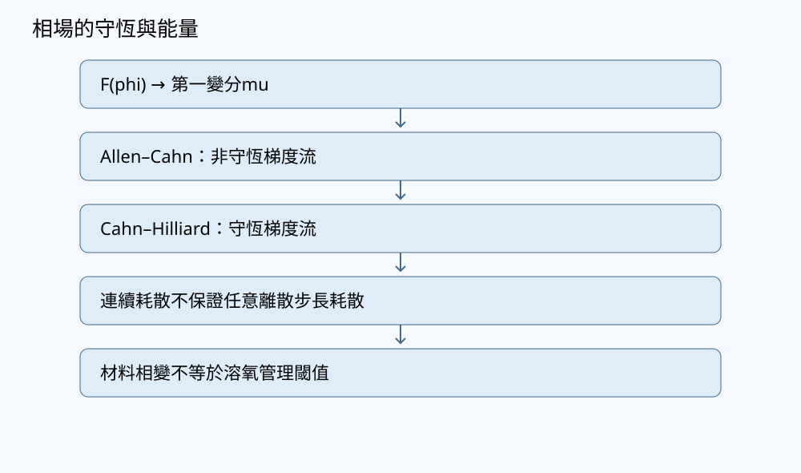

# 第28章 Cahn–Hilliard與相分離

## 學習目標與先備知識

本章建立守恆序參量的 Cahn–Hilliard（CH）方程，並以小型週期格網檢查質量、自由能及零模態。讀完後，應能說明為何 CH 需要為序參量與化學勢各指定一組邊界條件；由自由能變分推出四階方程及其連續耗散律；並辨別連續耗散與顯式時間離散的實際表現。實作將刻意使用容易檢查、但步長受限的顯式法，不宣稱它適合大型相分離計算。

先備概念包括 Laplacian 的負半定性、週期邊界的面通量抵消、離散自由能，以及 Allen–Cahn 方程。兩種相場模型可以使用相同的雙井自由能，卻採用不同的梯度流：Allen–Cahn 一般不守恆；本章的 CH 在指定邊界下守恆。

## 問題與直覺

設 $\phi$ 為表示合成兩組分偏向的**無因次序參量**，不是溶氧濃度，也不是已經量測的池塘物性。正、負值分別偏向雙井自由能的兩側。局部自由能傾向令 $\phi$ 接近 $+1$ 或 $-1$；梯度能則懲罰過於急遽的空間變化，兩者競爭形成界面。

如果一處的組分偏向增加，而系統沒有來源，就須由別處轉移而來。這是 CH 與逐點向自由能低處移動的 Allen–Cahn 模型的重要差異。CH 的驅動量不是單純的 $\phi$ 梯度，而是**化學勢 $\mu$ 的梯度**：化學勢不均才驅動守恆通量。總量不變不表示每格都不變；相分離恰是局部變化與全域收支並存。



## 數學與物理推導

### 無因次化、自由能與化學勢

先從有因次座標 $x_{\rm phys}$、時間 $t_{\rm phys}$ 出發，選參考長度 $\ell_0>0$、參考能量密度 $f_0>0$、參考梯度係數 $K_0>0$ 及遷移率 $\mathcal M_0>0$。令 $x=x_{\rm phys}/\ell_0$，選時間尺度 $t_0=\ell_0^2/(\mathcal M_0 f_0)$，並以 $f_0$ 為能量密度尺度。於此約定下，若梯度係數為 $K$、遷移率為 $\mathcal M$，無因次參數為 $\kappa=K/(f_0\ell_0^2)$ 與 $M=\mathcal M/\mathcal M_0$。本章的格距、時間及下列算例一律採這套無因次量；任意指定的數字不能當作現場材料常數。

在二維域 $\Omega$ 定義每單位厚度的無因次自由能

$$
F[\phi]=\int_\Omega\left[
W(\phi)+\frac{\kappa}{2}|\nabla\phi|^2
\right]\,dA,
\qquad
W(\phi)=\frac{(\phi^2-1)^2}{4},
\qquad \kappa>0.
$$

令 $\phi$ 有微小擾動 $\varepsilon v$。對 $F[\phi+\varepsilon v]$ 在 $\varepsilon=0$ 求導，並對梯度項分部積分：

$$
\left.\frac{dF[\phi+\varepsilon v]}{d\varepsilon}\right|_{\varepsilon=0}
=
\int_\Omega
\bigl(\phi^3-\phi-\kappa\Delta\phi\bigr)v\,dA
+\int_{\partial\Omega}\kappa(\boldsymbol n\cdot\nabla\phi)v\,ds.
$$

在週期邊界，兩側邊界貢獻互相抵消；在自然零梯度邊界，取 $\boldsymbol n\cdot\nabla\phi=0$。此時化學勢，即自由能對 $\phi$ 的變分導數，是

$$
\mu=\frac{\delta F}{\delta\phi}
=\phi^3-\phi-\kappa\Delta\phi.
$$

取常數 $M>0$，定義守恆通量 $\boldsymbol J=-M\nabla\mu$，守恆式給

$$
\boxed{\quad
\partial_t\phi=-\nabla\cdot\boldsymbol J
=\nabla\cdot(M\nabla\mu),\qquad
\mu=\phi^3-\phi-\kappa\Delta\phi.
\quad}
$$

若 $M$ 為常數，第一式為 $\partial_t\phi=M\Delta\mu$。把第二式代入第一式會出現 $\Delta^2\phi$，故是四階空間問題。只給一組通常用於二階擴散問題的邊界資料，並不足以完整規定此四階問題。

### 兩組邊界條件與耗散

本章採週期邊界：$\phi$ 與 $\mu$ 及其相應跨邊界通量在成對邊界一致。另一種常用的封閉域選擇，是同時給

$$
\boldsymbol n\cdot\nabla\phi=0,
\qquad
\boldsymbol n\cdot\nabla\mu=0
\qquad\text{於 }\partial\Omega.
$$

前者讓上述自由能變分的邊界項消失；後者使組分通量的外法向分量為零。它們是**兩個不同用途的條件**，不能把「$\phi$ 無梯度」誤當作已經保證沒有組分穿越邊界。若採其他邊界自由能或接觸角模型，條件及耗散式也須相應重推。

積分守恆式，週期或零通量邊界給

$$
\frac{d}{dt}\int_\Omega\phi\,dA
=-\int_{\partial\Omega}\boldsymbol J\cdot\boldsymbol n\,ds=0.
$$

再以化學勢乘守恆式、分部積分，且使用相容的自由能邊界條件：

$$
\frac{dF}{dt}
=\int_\Omega\mu\,\partial_t\phi\,dA
=-\int_\Omega M|\nabla\mu|^2\,dA\leq0.
$$

這稱為 CH 的 $H^{-1}$ 梯度流耗散：演化受守恆約束，耗散由化學勢的梯度決定，而不是 Allen–Cahn 式的 $\int\mu^2$。常數化學勢使耗散為零；它不要求每格 $\phi$ 相同，也不單憑此判定該狀態是全域能量最低點。

### 半離散與顯式步長

令 $q[j,i]=\phi_{j,i}$ 為均勻二維格心值，形狀 $(N_y,N_x)$；$i$ 沿 $+X$、$j$ 沿 $+Y$，格心是 $((i+1/2)h_x,(j+1/2)h_y)$。設 $L$ 為週期五點 Laplacian，它在加權內積下對稱、負半定，且 $L\boldsymbol1=0$。採與 $L$ 配對的離散梯度能，便有

$$
F_h=h_xh_y\sum_{j,i}\left[
W(q_{j,i})
+\frac{\kappa}{2}
\left(\frac{q_{j,i+1}-q_{j,i}}{h_x}\right)^2
+\frac{\kappa}{2}
\left(\frac{q_{j+1,i}-q_{j,i}}{h_y}\right)^2
\right],
$$

其中右方及上方差分各計一次週期面。其離散變分導數是 $\mu_h=q^3-q-\kappa Lq$。半離散方程 $\dot q=ML\mu_h$ 因 $\sum L\mu_h=0$ 而守恆；亦因 $L$ 負半定而滿足 $dF_h/dt\leq0$。

然而 forward Euler 更新

$$
q^{n+1}=q^n+\Delta t\,ML\bigl((q^n)^3-q^n-\kappa Lq^n\bigr)
$$

**不保證任意 $\Delta t$ 都令 $F_h$ 下降**。對常值背景 $\bar q$ 附近的小擾動，若 $L$ 模態的特徵值是 $\lambda\leq0$，線性化放大因子為

$$
G=1+\Delta t\,M\lambda
\bigl(3\bar q^2-1-\kappa\lambda\bigr).
$$

高頻下 $\lambda$ 的大小隨 $h^{-2}$ 增大；$\kappa\lambda^2$ 項使顯式步長常須隨 $h^4$ 縮小。若 $3\bar q^2-1+\kappa|\lambda|<0$，該模態的線性增長反而是自旋分解區域可能出現的**物理模型機制**，不能把所有增長一律判為數值爆炸。此線性分析也不是任意大振幅、任意多步計算的充分穩定定理。

## 逐步手算例題

### 例一：$2\times2$ 週期棋盤格

為使每一步可手算，取 $h_x=h_y=1$、$M=1$、$\kappa=0.1$、$\Delta t=0.1$，四格依序為

$$
q^0=\begin{pmatrix}0.5&-0.5\\-0.5&0.5\end{pmatrix}.
$$

週期 $2\times2$ 網格的東西鄰格會指向同一個格子，但 Laplacian 的兩個方向貢獻仍各計一次；對此棋盤模態，$Lq^0=-8q^0$。於正值格，

$$
\mu^0=(0.5)^3-0.5-0.1(-8)(0.5)=0.025.
$$

負值格則為 $-0.025$，故 $L\mu^0=-8\mu^0$。更新後正值格成為 $0.5+0.1(-0.2)=0.48$；負值格成為 $-0.48$。初值與新值的格值總和都為零。

此棋盤格每格的離散能量密度可寫為 $W(a)+4\kappa a^2$。起初 $a=0.5$，密度為 $0.140625+0.1=0.240625$；一步後 $a=0.48$，密度為 $0.14807104+0.09216=0.24023104$。四格面積均為一，所以總自由能預期由 $0.9625$ 降至 $0.96092416$。這只驗證**此例此步**下降，不能升格為顯式法對所有步長的保證。

### 例二：常數模態與相分離擾動

令所有格子均為 $q=0.3$。不論 $\kappa$ 為何，$Lq=0$，故 $\mu=0.3^3-0.3=-0.273$ 也是常數，$L\mu=0$。顯式更新完全不動；每格能量密度為 $W(0.3)=(0.09-1)^2/4=0.207025$。注意化學勢不必等於零，**化學勢的空間梯度**為零才使通量消失。

再看小振幅棋盤格，取 $\kappa=0.01$、正負格振幅 $a=0.1$，其 $Lq=-8q$。正值格的化學勢為 $0.1(0.01-1+0.08)=-0.091$；若 $\Delta t=0.01$、$M=1$，新振幅為 $0.1+0.01(0.728)=0.10728$。模態在這一步增長，但平均仍為零。是否進一步形成可信界面，須檢查解析模型、網格解析度、步長細化及自由能，而不能只看振幅變大就宣稱已得到相分離的驗證。

## 實作與程式

以下是自足的 NumPy CPU 範例。它採**週期邊界、常數遷移率、零來源、無因次量**；只適合小格網教學。程式計算質量 $h_xh_y\sum q$、週期面定義的離散自由能、最小最大值與零模態。它以能量檢查拒絕一步更新；這是故障偵測，不是對任意初值保證能找到可接受步長的定理。程式不把 $\phi$ 裁進 $[-1,1]$。

```python
import numpy as np


def check(q, hx, hy, mobility, kappa, dt):
    q = np.asarray(q, dtype=float)
    if q.ndim != 2 or min(q.shape) < 3 or not np.all(np.isfinite(q)):
        raise ValueError("q must be a finite 2D array, at least 3x3")
    p = np.array([hx, hy, mobility, kappa, dt], dtype=float)
    if not np.all(np.isfinite(p)) or np.any(p <= 0):
        raise ValueError("hx, hy, mobility, kappa, dt must be positive finite")
    return q


def lap(q, hx, hy):
    return (
        (np.roll(q, 1, axis=1) - 2*q
         + np.roll(q, -1, axis=1)) / hx**2
        + (np.roll(q, 1, axis=0) - 2*q
           + np.roll(q, -1, axis=0)) / hy**2
    )


def free_energy(q, hx, hy, kappa):
    gx = (np.roll(q, -1, axis=1) - q) / hx
    gy = (np.roll(q, -1, axis=0) - q) / hy
    density = (q*q - 1)**2 / 4 + kappa*(gx*gx + gy*gy)/2
    return float(hx*hy*np.sum(density))


def diagnostics(q, hx, hy, kappa):
    return {
        "mass": float(hx*hy*np.sum(q)),
        "zero_mode": float(np.mean(q)),
        "free_energy": free_energy(q, hx, hy, kappa),
        "minimum": float(np.min(q)),
        "maximum": float(np.max(q)),
    }


def euler_candidate(q, hx, hy, mobility, kappa, dt):
    q = check(q, hx, hy, mobility, kappa, dt)
    mu = q**3 - q - kappa*lap(q, hx, hy)
    if not np.all(np.isfinite(mu)):
        raise FloatingPointError("non-finite chemical potential")
    result = q + dt*mobility*lap(mu, hx, hy)
    if not np.all(np.isfinite(result)):
        raise FloatingPointError("non-finite candidate")
    return result


def guarded_step(q, hx, hy, mobility, kappa, dt,
                 max_halvings=24):
    q = check(q, hx, hy, mobility, kappa, dt)
    if max_halvings < 0:
        raise ValueError("max_halvings must be nonnegative")
    old_f = free_energy(q, hx, hy, kappa)
    old_mass = hx*hy*np.sum(q)
    area = hx*hy*q.size
    for attempt in range(max_halvings + 1):
        trial_dt = dt / (2**attempt)
        try:
            candidate = euler_candidate(
                q, hx, hy, mobility, kappa, trial_dt)
            new_f = free_energy(candidate, hx, hy, kappa)
        except FloatingPointError:
            continue
        new_mass = hx*hy*np.sum(candidate)
        energy_tol = 1e-12*max(1.0, abs(old_f))
        mass_tol = 1e-12*max(1.0, abs(old_mass), area)
        if (np.isfinite(new_f)
                and new_f <= old_f + energy_tol
                and abs(new_mass - old_mass) <= mass_tol):
            return candidate, trial_dt, attempt
    raise RuntimeError("no acceptable Euler step; state unchanged")


if __name__ == "__main__":
    ny = nx = 8
    yy, xx = np.indices((ny, nx))
    q0 = 0.02*((-1.0)**(xx + yy))
    hx = hy = 1.0
    mobility, kappa, requested_dt = 1.0, 0.1, 0.01
    print("initial:", diagnostics(q0, hx, hy, kappa))
    q1, used_dt, halvings = guarded_step(
        q0, hx, hy, mobility, kappa, requested_dt)
    print("used_dt, halvings:", used_dt, halvings)
    print("next:", diagnostics(q1, hx, hy, kappa))
```

`np.indices` 的首軸是物理 $Y$ 的 $j$，次軸是物理 $X$ 的 $i$；若另行繪圖，應標示物理座標並採 `origin='lower'`。`zero_mode` 是格值平均，`mass` 是它乘以總面積；二維量均按每單位厚度解讀。週期面由 `np.roll` 配對，能量的向東、向北差分各只計一次；程式未把週期面當成額外格子重複加入質量。

## 測試與預期結果

以下為依推導所列的**預期測試**，並未聲稱已執行程式。

| 類別 | 輸入及操作 | 預期 |
|---|---|---|
| 正常：棋盤模態 | 將例一擴成至少 $4\times4$ 週期棋盤格，作一步 $\Delta t=0.1$ 更新 | 每一正值格由 $0.5$ 到 $0.48$，負值格相反；平均維持零，前述每格自由能密度下降。|
| 邊界：常數場 | 至少 $3\times3$，全設為 $0.3$ | `lap(q)` 及 `lap(mu)` 均為零；質量、零模態和自由能不變。|
| 故障：超大請求步長 | 對非均勻有限初值逐步增大請求 `dt` | 若候選能量上升，`guarded_step` 應折半重試；若限制次數內都不合格，應拋錯並保持原狀，不能回傳未診斷的場。|
| 故障：非法輸入 | 設 `kappa=0`、`hx=np.nan`，或在 `q` 中放入無窮大 | 應拒絕輸入。|
| 空間細化診斷 | 在固定物理域上逐次把兩方向格距折半，以可比較的平滑初值檢查可接受步長 | 高頻四階項提示所需顯式步長可能約縮為原先的 $1/16$；這是尺度分析，非未執行實驗的觀測階。|

能量容差只是吸收浮點運算誤差；若變化小到與容差同級，結果只能報為「容差內未見上升」，不得宣稱嚴格下降。質量容差同理。對一般初值，還應記錄每次實際採用的步長及折半次數；只報請求步長會錯述所計算的時間。

## 除錯與常見陷阱

**把守恆、耗散及非負混為一談。** 週期 Laplacian 的列和為零，使顯式候選即使步長太大，仍可能在浮點誤差內保持總量；這不能保證自由能下降或數值有界。CH 的 $\phi$ 是序參量，本模型沒有承諾逐格落在 $[-1,1]$，更不能在每一步強迫裁切：裁切會改變守恆量，也掩蓋超限步長或界面解析不足。若使用的是物理組分濃度，須另建立變數定義及適用的物理限制，不能沿用這項序參量語意。

**把兩次 Laplacian 的符號弄反。** 本卷 $L$ 近似 $\Delta$，週期下負半定；化學勢含 $-\kappa Lq$，演化是 $+ML\mu$。若把第二個號寫反，高頻的四階項會變成反擴散。可先用棋盤格檢查 $Lq=-8q$（當兩格距皆為一），再逐項核對例一的 $\mu$ 與一步結果。

**把能量檢查當成通用求解保證。** 折半是局部接受策略，不證明長時間準確，也不能取代時間與空間細化。若一步被拒絕，先查浮點有限性、邊界、自由能定義與步長；不能悄悄改寫輸出。對更大問題可考慮經適當推導的隱式或能量穩定格式，但仍須記錄非線性求解容差、真殘差與實際離散能量。小殘差不等於小解誤差。

**混淆相分離增長與計算故障。** 雙井模型在某些均勻背景附近容許長波擾動增長；這應伴隨總量守恆及自由能耗散，而非無限制的高頻爆炸。觀察某一張圖上的斑塊，無法分辨真實模型機制、網格混疊與時間步長誤差；應同看模態、收支、能量及細化結果。

## 養殖與相場案例

可將本章週期小格網視為一塊**純合成、無因次的材料相分離測試域**，用來驗證相場程式的數學收支，而不是把池塘溫度或溶氧硬塞進雙井自由能。週期邊界代表數學上的重複域；真實池岸既不是週期接合，也未必滿足兩組零通量邊界條件。若將來為特定材料建立有因次 CH 模型，必須重新量測或推定能量、遷移率、梯度係數及邊界作用，並以獨立資料驗證。

合成養殖資料中的溶氧即使跨過管理閾值，也不會因此變成兩相材料；管理界線不是自由能的雙井極小值。逼真的相分離渲染也只能展示所選模型的輸出，不能當成池塘物理驗證。任何查詢代理只能唯讀呈現參數、邊界、質量、能量及細化證據，不得自行修改模型，更不得連接投餌、加藥或其他真實設備。

## 習題

1. **手算。** 在 $2\times2$ 週期格網取 $h_x=h_y=1$、$M=1$、$\kappa=0.1$，令棋盤格正值振幅 $a=0.25$，負值為 $-a$。計算正值格的 $Lq$、$\mu$ 及以 $\Delta t=0.01$ 更新後的振幅；判斷第一步總量。

2. **程式。** 用本章函式建立 $6\times6$ 全為 $0.3$ 的陣列，取任意有效正參數。寫出預期的 `zero_mode`、`minimum`、`maximum`，並指出如何檢查 `euler_candidate` 沒有改動常數場。若把格距同時折半但維持格數，質量會如何變化？

3. **反例。** 有人說：「CH 質量守恆，所以每個格子的 $\phi$ 必在 $[-1,1]$，而且顯式法任意步長都使自由能下降。」分別給出反駁；其中步長部分可沿用例一的棋盤模態，找一個使一步振幅絕對值變大的步長並比較能量。

4. **整合。** 對常數 $M$ 的封閉二維域，列出自由能與無通量演化所需的兩組邊界條件，推導總量收支與自由能收支。若改加來源 $s(x,y,t)$，說明來源的無因次量綱語意及兩個收支式新增的項。

## 習題解答

1. 棋盤格滿足 $Lq=-8q$，正值格為 $Lq=-2$。因此
   $$
   \mu=a^3-a+8\kappa a
   =0.015625-0.25+0.2=-0.034375.
   $$
   化學勢仍是正負交替，正值格 $L\mu=-8(-0.034375)=0.275$；新振幅為 $0.25+0.01(0.275)=0.25275$。兩個正值格與兩個負值格成對，更新前後格值總和為零，乘格面積後總量亦為零。此時小擾動增加與總量守恆並不矛盾。

2. 常數場的 `zero_mode`、`minimum`、`maximum` 均預期為 $0.3$。可比較候選陣列與初始陣列的最大絕對差，預期只可能有浮點表示誤差；亦可檢查 `lap(q)` 與 `lap(mu)` 為零。原格距下質量為 $36(0.3)h_xh_y$。若只把兩格距折半而維持 $6\times6$ 格數，總面積變成四分之一，故質量也變為原來的四分之一；這改變了物理域大小，**不是**固定物理域的網格細化。

3. 守恆只約束格值之和；例如四格 $(1.2,-1.2,0,0)$ 的總和是零，卻已有值超出 $[-1,1]$。對例一的棋盤格，$\mu=(a^2-1+8\kappa)a=0.05a$，所以顯式更新的振幅因子為 $1-8\Delta t(0.05)=1-0.4\Delta t$。取 $\Delta t=6$，由 $a=0.5$ 得新振幅 $a'=-0.7$，絕對值由 $0.5$ 增為 $0.7$。其每格能量密度原為 $0.240625$；新值為
   $$
   W(0.7)+4(0.1)(0.7)^2
   =\frac{(0.49-1)^2}{4}+0.196
   =0.261025.
   $$
   故總自由能上升，雖然正負格的總量依然抵消。大步長的這個結果是數值反例，不是可信的相分離預測。

4. 取 $\boldsymbol n\cdot\nabla\phi=0$ 使自由能變分的邊界項消失，並取 $\boldsymbol n\cdot\nabla\mu=0$ 使 $\boldsymbol J=-M\nabla\mu$ 的外法向通量為零。無來源時，
   $$
   \frac{d}{dt}\int_\Omega\phi\,dA=0,\qquad
   \frac{dF}{dt}=-\int_\Omega M|\nabla\mu|^2\,dA\leq0.
   $$
   若方程改為 $\partial_t\phi=\nabla\cdot(M\nabla\mu)+s$，因 $\phi$ 無因次且時間已無因次化，$s$ 的語意是「每單位無因次時間的序參量變化率」。積分後總量率新增 $\int_\Omega s\,dA$，自由能率新增 $\int_\Omega\mu s\,dA$。後一項可為正，故有來源時不能再無條件宣稱總自由能下降。

## 本章小結

CH 以化學勢梯度搬運守恆序參量；雙井局部能與梯度能共同決定界面。週期邊界或相容的兩組零通量條件，使連續模型與相配的半離散模型具備質量守恆、自由能耗散。顯式全離散則須另外檢查實際步長與實際自由能，四階項帶來約 $h^4$ 的嚴格尺度。零模態、加權質量、自由能及最小最大值各回答不同問題；沒有一項可單獨取代模型驗證，也不能以裁切序參量掩蓋數值故障。

## 參考來源

- [F1 FiPy：有限體積離散與邊界](https://pages.nist.gov/fipy/en/latest/numerical/discret.html)：供對照共享通量與邊界收支。
- [F6 FiPy：Cahn–Hilliard 相分離示範](https://pages.nist.gov/fipy/en/latest/generated/examples.cahnHilliard.mesh2D.html)：供對照守恆相場示例；其序參量與參數慣例未必等同本章的 $[-1,1]$ 雙井設定，不可直接照搬。