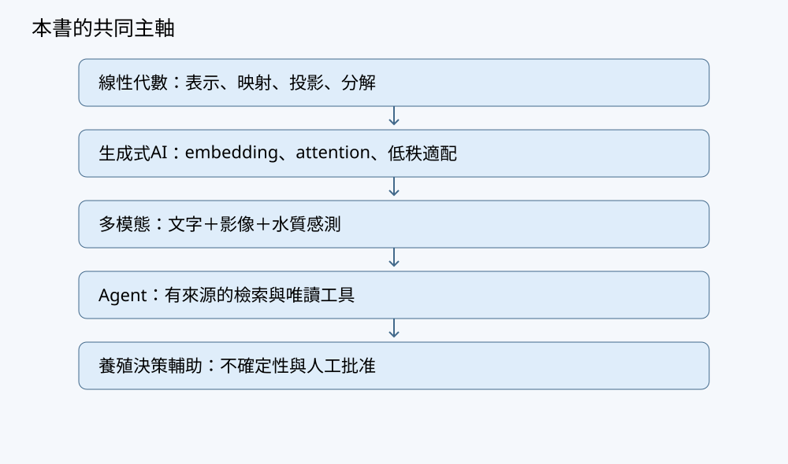
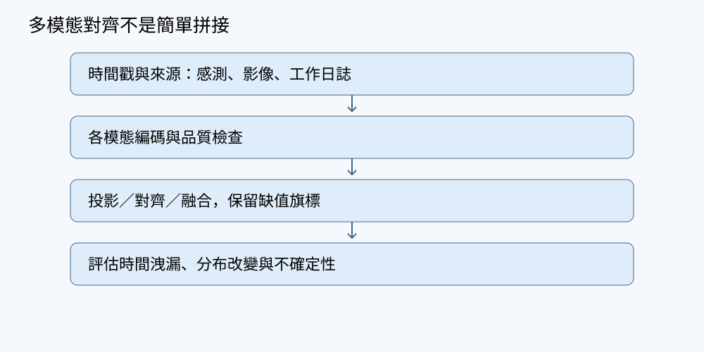

# 從生成式 AI 到智慧水產養殖：線性代數、 多模態與 Agent 實作


> 編輯狀態：completed_model_review_pending_human。模型稿件與模型審稿不是人工審定教材。





## 目錄


- [導讀](#preface)

- [第01章 從生成式AI問題看見線性代數](#ch01)

- [第02章 向量、內積與相似度](#ch02)

- [第03章 矩陣與線性映射](#ch03)

- [第04章 線性方程、消去法與秩](#ch04)

- [第05章 子空間、基底與座標](#ch05)

- [第06章 正交、投影與最小平方](#ch06)

- [第07章 特徵值、對稱矩陣與穩定性](#ch07)

- [第08章 奇異值分解與低秩近似](#ch08)

- [第09章 共變異數、PCA與資料洩漏](#ch09)

- [第10章 範數、條件數與正則化](#ch10)

- [第11章 梯度、Jacobian與反向傳播](#ch11)

- [第12章 Embedding、線性層與機率輸出](#ch12)

- [第13章 注意力的矩陣運算](#ch13)

- [第14章 低秩更新與LoRA](#ch14)

- [第15章 潛在空間、VAE與擴散模型](#ch15)

- [第16章 影像、文字與水質的共同表示](#ch16)

- [第17章 時間序列、缺值與狀態估計](#ch17)

- [第18章 Agent的檢索、記憶與工具介面](#ch18)

- [第19章 風險、限制與人類覆核](#ch19)

- [第20章 專題：可稽核的養殖決策輔助系統](#ch20)

- [附錄](#appendix)


<a id="preface"></a>


# 導讀：先理解表示，再理解決策

生成式人工智慧可以把一段描述接成下一段文字，把文字提示轉成影像，也能根據多種輸入提出下一步行動。這些能力容易讓人把「流暢」誤認成「理解」，把「能提出建議」誤認成「能安全執行」。本書選擇從線性代數開始，目的不是把每個模型都簡化成矩陣乘法，而是建立一套能逐步核對的語言：資料是什麼形狀？運算保留了什麼資訊？哪些假設沒有被檢查？當輸出有誤時，我們究竟能追查到哪一層？

全書以一座虛構的水產養殖池「池A」為共同場景。工作人員記錄水溫、溶氧與酸鹼值，攝影機提供水面畫面，值班日誌記下清潔、設備維護與人員觀察。讀者不需要有養殖背景；本書也不會替真實物種設定生存或操作閾值。場景的作用是讓抽象數學一直對應到資料、感測誤差、時間與責任，而不是給出可直接部署的養殖配方。

最初，池A只是幾個數字。我們把它們整理成向量，比較方向與距離，再學會用矩陣描述多筆量測和特徵轉換。接著，線性方程告訴我們何時能唯一解出未知數；秩與零空間則揭示資料不能告訴我們什麼。這一步十分重要：擁有更多欄位，不一定擁有更多獨立資訊。

到了投影、最小平方與矩陣分解，我們開始處理「答案不可能完全吻合資料」的情況。與其強求每筆量測都被解釋，不如明確定義誤差、比較可行模型並記錄限制。PCA與低秩近似能壓縮表示，但被丟掉的小變異不一定沒有安全意義。數值穩定性也不是程式細節；若微小輸入擾動造成巨大係數變化，再漂亮的公式都可能在現場失效。

生成式AI部分把這些觀念接到embedding、線性層、attention與低秩適配。你會看到向量與矩陣如何支撐模型，也會看到線性代數不能單獨解釋的地方：機率模型、非線性函數、資料選擇與訓練目的。讀者不需要先下載大型模型，就能用小型數值例觀察運算；理解三個token的attention，比不明所以地呼叫大型API更適合作為起點。

多模態部分把水質、影像與文字放回同一條資料路徑。不同模態具有不同單位、採樣頻率、延遲和缺值方式；把向量串接起來不代表問題已解決。模型必須說清楚如何對齊時間、如何處理缺失，以及什麼情況下應回報「資料不足」。特徵對齊與語義對齊也不是同一件事，相似分數不能直接當成健康診斷。

最後，agent利用檢索工具查找有來源的作業文件，整理觀察並提出待覆核的建議。本書刻意把建議與設備控制分開。讀者可以在模擬環境完成資料讀取、檢索、風險檢查與審批記錄，但所有真實增氧、投餌、加藥與水體管理仍需由專業人員制定規範並驗證。即使公式正確，感測器位置、物種差異或過時文件仍可能讓決策失效。

## 如何閱讀與驗證

建議依章節順序閱讀。每章先讀場景問題，自己完成手算，再對照推導與答案；程式實驗用來驗證計算，不是代替思考。遇到公式時先寫出每個物件的shape，再問乘法是否合法、假設是否成立、結果的單位是否合理。遇到圖表時則檢查它代表真實資料、合成資料，還是概念示意。

習題包括基本計算、觀念辨析與養殖應用。應用題通常不只有一個數字答案，而要求說清楚資料限制與判斷依據。若你可以寫出「不知道，因為缺少哪些資料」，而不是硬給一個結論，便已掌握本書重要的學習成果。

本書以Markdown為主，公式採LaTeX語法，原創圖表採本地SVG。`examples/linalg_lab.py`是由編輯端另行撰寫的基礎驗證程式；章節內模型生成的其他片段並不因此自動取得「已測試」資格。出版前仍應由人類教師檢查推導、例題、程式與來源。字數報告只計中文字元，不把長程式碼當作充足教學內容。

## 學習路徑

- 想補數學基礎：先完成第1～10章，能解釋解的存在性、投影、分解與數值誤差。
- 想理解生成式AI：在前述基礎上完成第11～15章，逐步核對張量形狀與非線性邊界。
- 想做多模態系統：接續第16～17章，重視時間對齊、資料切分與缺值。
- 想做agent：完成第18～20章，把來源、工具、人工覆核與可重現評估放進設計。

這些路徑不是互不相關的選修。全書的共同問題始終是：如何讓每個計算步驟都能被理解、被檢查，並在不確定時保留拒絕行動的能力？


<a id="ch01"></a>


# 第01章 從生成式AI問題看見線性代數

## 學習目標與先備知識

讀完本章，你應該能夠：用標量、向量、矩陣、張量描述一筆養殖資料的形狀（shape）與單位；把「模型輸出」和「真實現況」分開看待；並寫出第一個 $y=Wx$ 的最小數值例子。先備知識只要高中數學的座標與乘法，以及看得懂 `for` 迴圈與串列（list）。本章不預設你懂微積分、機率或深度學習，這些會在後面章節逐步補上。

全書用同一個虛構案例貫穿：虛構池A的水質感測器、水面影像與工作日誌。這套資料全是教學合成，不含任何真實物種的適用閾值，也不能拿去操作真實設備。閱讀時請把「這是用來練習符號的假資料」放在心上，不要把書中任何數字當成現場標準。

## 從池A提出問題

假設池A週邊有三種量測：水溫 `temperature_c`（攝氏）、溶氧 `do_mg_l`（mg/L）、酸鹼值 `ph`（無量綱）。某日感測器每十分鐘回報一次，於是「一個時間點」是一個長度為3的向量，「一整天」是一疊向量。管理員又上傳了一張水面影像，並在日誌寫下「池水看起來偏濁」。最後他們希望一個 agent 能讀懂這些材料，查詢標準作業程序（SOP），提出唯讀的檢查計畫。

要讓電腦處理這串問題，第一步不是選模型，而是寫**資料字典**：每一欄叫什麼、是什麼單位、形狀多大、缺值怎麼標。以下是池A的最小字典草稿。

| 名稱 | 型別 | 形狀 | 單位 | 備註 |
|---|---|---|---|---|
| `temperature_c` | 標量 | $1$ | 攝氏 | 單一感測器讀值 |
| `sensor_vec` | 向量 | $3$ | 混合 | 一筆時間點觀測 $[t,\ do,\ ph]$ |
| `day_matrix` | 矩陣 | $n\times 3$ | 混合 | 每列一筆觀測 |
| `image_patch` | 張量 | $H\times W\times C$ | 灰階或RGB | 影像區塊 |
| `log_token` | 離散 | 序列 | — | 文字切詞 |
| `tool_call` | 結構化 | dict | — | 欄位依 SOP 而定，唯讀查詢參數 |

這張表本身就是線性代數：我們用「形狀」固定每一種資料可以被哪些運算接受，用「單位」避免把攝氏和 mg/L 直接相加。`tool_call` 那一列則提醒我們，文字與數值之外還有「動作」這種資料，它一樣要被結構化，才能被檢查與記錄。各種形狀如何階層式堆疊，見圖 `figures/shapes.svg`。

## 概念與推導

**標量（scalar）**是單一數，例如 `do_mg_l = 6.2`。**向量（vector）**是一串數；本書一律約定向量為**列向量（column vector，直向排列）**，寫成 $\mathbf{x}\in\mathbb{R}^{d}$，$d$ 是維度。若無特別說明，$x$ 就代表直的柱狀，不是橫的列。這個約定看似吹毛求疵，卻是後面所有形狀檢查不出錯的基礎。

**矩陣（matrix）**是把數字排成二維表。$W\in\mathbb{R}^{m\times d}$ 表示 $m$ 列、$d$ 欄。當它作用在 $\mathbf{x}\in\mathbb{R}^{d}$ 上，得到

$$\mathbf{y}=W\mathbf{x},\qquad \mathbf{x}\in\mathbb{R}^{d},\ W\in\mathbb{R}^{m\times d},\ \mathbf{y}\in\mathbb{R}^{m}.$$

形狀檢查是：$(m\times d)(d\times 1)=(m\times 1)$，中間的 $d$ 必須一致。這條規則日後會反覆出現，請當成肌肉記憶。

為什麼是這樣乘？把 $W$ 的第 $i$ 列寫成 $\mathbf{w}_i^{\mathsf T}$，則 $y_i=\mathbf{w}_i^{\mathsf T}\mathbf{x}$，也就是「第 $i$ 個輸出是輸入特徵的一組加權和」。若 $W$ 的第二欄全是0，代表第二個感測特徵完全不影響輸出；若某一列是另一列的兩倍，兩項輸出就完全相關。換句話說，矩陣的列編碼了輸出、欄編碼了輸入，這種「列對輸出、欄對輸入」的讀法，是往後看懂注意力與線性層的關鍵。

**張量（tensor）**就是更高維的數字陣列。影像 $H\times W\times C$ 是三維張量；一個批次（batch）的感測資料是三維：$\text{batch}\times\text{time}\times\text{feature}$。以池A為例，若一天有 $T=144$ 個十分鐘時間點、一批 $B=7$ 天，則整批形狀是 $7\times 144\times 3$，索引 `X[b, t, k]` 表示第 $b$ 天第 $t$ 時的第 $k$ 個量測。名稱嚇人，本質只是「多一層索引」。這裡要分清兩件事：張量的**維數**（有幾層索引，例如三維張量）與矩陣的**秩（rank）**（線性獨立的方向數，後面章節才定義）是不同概念，初學時最容易把兩者混為一談。

**批次寫法**：把 $n$ 筆觀測疊成 $X\in\mathbb{R}^{n\times d}$，每列一筆。同一組權重對整批做映射時，慣例寫成

$$Y=XW^{\mathsf T},\qquad X\in\mathbb{R}^{n\times d},\ W\in\mathbb{R}^{m\times d},\ Y\in\mathbb{R}^{n\times m}.$$

這裡用轉置 $W^{\mathsf T}$ 把 $W$ 從 $m\times d$ 變成 $d\times m$，使 $(n\times d)(d\times m)=(n\times m)$。這和逐筆算 $W\mathbf{x}$ 再疊起來的結果相同，原因是矩陣乘法對每一列獨立作用：輸出矩陣的第 $i$ 列恰好等於 $W\mathbf{x}_i$ 的轉置。

最後要強調一句：**模型不是現實**。$y=Wx$ 只是我們對世界的線性描述。真實池水的溶氧受光合作用、耗氧、溫度、對流等非線性與延遲影響；線性代數是骨架，不是完整真相。任何後續的 agent 建議都必須經人工覆核。

## 手算例題

令一個 $2\times 3$ 的權重與一筆三維感測特徵為

$$W=\begin{bmatrix}2&-1&0\\1&1&3\end{bmatrix},\qquad \mathbf{x}=\begin{bmatrix}1\\2\\3\end{bmatrix}.$$

要算 $\mathbf{y}=W\mathbf{x}$。先確認形狀：$(2\times 3)(3\times 1)=(2\times 1)$，合法。

第一列與 $\mathbf{x}$ 做內積：$2\cdot 1+(-1)\cdot 2+0\cdot 3=2-2+0=0$。
第二列與 $\mathbf{x}$ 做內積：$1\cdot 1+1\cdot 2+3\cdot 3=1+2+9=12$。

所以

$$\mathbf{y}=\begin{bmatrix}0\\12\end{bmatrix}.$$

若換成一整批兩筆，$X=\begin{bmatrix}1&2&3\\0&1&1\end{bmatrix}$，則 $Y=XW^{\mathsf T}$。先寫 $W^{\mathsf T}=\begin{bmatrix}2&1\\-1&1\\0&3\end{bmatrix}$，再逐列乘：

第一筆：$[1,2,3]\cdot[2,-1,0]^{\mathsf T}=0$，與 $[1,2,3]\cdot[1,1,3]^{\mathsf T}=12$；第二筆：$[0,1,1]\cdot[2,-1,0]^{\mathsf T}=-1$，$[0,1,1]\cdot[1,1,3]^{\mathsf T}=4$。故 $Y=\begin{bmatrix}0&12\\-1&4\end{bmatrix}$，形狀 $2\times 2$，與 $XW^{\mathsf T}$ 的預期一致。

這裡刻意每一步都寫出中間值，因為後面章節的梯度推導會需要你回頭核對這些小數字。

## Python實驗

以下用 `numpy` 重現上面的計算。程式由讀者在自己的隔離環境執行；本書不代為執行，也不連任何真實設備。

```python
import numpy as np
np.random.seed(42)

# 單筆：y = W @ x
W = np.array([[2, -1, 0],
              [1,  1, 3]], dtype=float)      # shape (2, 3)
x = np.array([[1], [2], [3]], dtype=float)   # shape (3, 1) column vector，直向排列

y = W @ x
print("W.shape =", W.shape, " x.shape =", x.shape, " y.shape =", y.shape)
print("y =\n", y)

# 批次：Y = X @ W.T
X = np.array([[1, 2, 3],
              [0, 1, 1]], dtype=float)       # shape (2, 3)，每列一筆
Y = X @ W.T
print("Y.shape =", Y.shape)
print("Y =\n", Y)
```

預期輸出（數值可人工核對）：

```
W.shape = (2, 3)  x.shape = (3, 1)  y.shape = (2, 1)
y =
 [[ 0.]
 [12.]]
Y.shape = (2, 2)
Y =
 [[ 0. 12.]
 [-1.  4.]]
```

注意 `np.random.seed(42)` 只讓亂數可重現，**不代表**統計結果可靠；真正評估仍要靠資料切分與不確定性分析。

## 連回生成式AI、多模態與Agent

為什麼標量到矩陣值得先學？因為生成式AI的每個零件都能用這套符號寫出來。詞嵌入是查表得到向量；線性層就是 $W\mathbf{x}$；注意力的 Q、K、V 都是矩陣；影像與文字要對齊，靠的是把兩種特徵投影到同一空間後比相似度（對比學習的直覺）。到最後，一個 agent 要「檢索 SOP、呼叫工具、提出計畫」，中間仍是不斷的向量比較與矩陣乘法，只是外面包了一層決策流程（檢索增強與推理行動的架構見 R8、R7）。多模態融合的形狀約定見圖 `figures/fusion.svg`，全書地圖見 `figures/roadmap.svg`。

但要牢記分工：模型負責產生表示與候選建議，安全控制、劑量與投餌決策**不能**外包給模型。線性代數只是骨架，非線性、統計、因果推論與控制不可被省略，更不能假裝已證明。當 agent 說「建議提高增氧」時，那是一個待檢查的候選，不是已驗證的行動；可信控制鏈與人類覆核的位置見圖 `figures/agent-safety.svg`。

## 常見錯誤與限制

第一，把矩陣乘法當可交換：$AB$ 通常不等於 $BA$，形狀也常常根本不能相乘。第二，混淆列與欄：中文的「行」容易歧義，本書一律叫**列（row）**與**欄／直行（column）**，向量預設是直的。第三，忽略單位：把 25（攝氏）和 6.2（mg/L）相加沒有物理意義。第四，把 seed 當萬靈丹；固定亂數只保證重現，不保證代表性。第五，把 $\mathbf{y}=W\mathbf{x}$ 的輸出當成事實，忘了它只是線性近似。

還有一類限制與本節主題直接相關：**線性模型無法表達飽和與交互作用**。真實溶氧對溫度的反應不是一條永久直線，模型在訓練分布之外可能嚴重失準。因此後續章節會談殘差、不確定性與可行性檢查，讓「模型輸出」永遠只是流程中的一環，而不是終點。

## 習題

**習題1（基本計算）** 令 $W=\begin{bmatrix}1&0&-2\\3&1&1\end{bmatrix}$，$\mathbf{x}=\begin{bmatrix}2\\1\\4\end{bmatrix}$，求 $W\mathbf{x}$ 並標出形狀。

**習題2（觀念）** 若 $X\in\mathbb{R}^{5\times 3}$、$W\in\mathbb{R}^{4\times 3}$，則 $XW^{\mathsf T}$ 的形狀為何？若改成 $XW$ 可以嗎？為什麼？

**習題3（養殖應用）** 池A一日有三筆感測向量：$[25,6.2,7.4]$、$[25,6.1,7.4]$、$[31,4.0,7.0]$（單位分別為攝氏、mg/L、無量綱）。若只把前兩筆相加再除以2，得到什麼？這個結果能不能直接用來判斷池水健康？請說明理由。

## 習題解答

**習題1** 形狀 $(2\times3)(3\times1)=(2\times1)$。第一列：$1\cdot2+0\cdot1+(-2)\cdot4=2-8=-6$；第二列：$3\cdot2+1\cdot1+1\cdot4=6+1+4=11$。故 $W\mathbf{x}=[-6,\ 11]^{\mathsf T}$。

**習題2** $XW^{\mathsf T}$：$(5\times3)(3\times4)=(5\times4)$，合法。$XW$ 需要 $(5\times3)(4\times3)$，中間 $3\ne4$，故不合法。轉置在此正是為了對齊內維度。

**習題3** 前兩筆平均為 $[(25+25)/2,(6.2+6.1)/2,(7.4+7.4)/2]=[25,6.15,7.4]$。這只是兩筆高度相似觀測的平均，取樣極小、未經標準化、未考慮不確定性，**不能**用來判斷健康；第三筆 $[31,4.0,7.0]$ 與前兩筆差異很大，更提醒我們不能只看平均。此外，本教材不提供任何真實物種的適用閾值，模型或平均數的輸出都不能代替養殖專業人員的現場判斷，也不能自動觸發投餌、加藥或增氧。

## 本章小結

本章建立了四個基本物件：標量、向量、矩陣、張量，以及它們的形狀與單位。核心式子 $y=Wx$ 與批次版 $Y=XW^{\mathsf T}$ 貫穿全書，而「列對輸出、欄對輸入」是讀懂後續章節的鑰匙。最重要的一句話是：模型不是現實。往後我們會依序補上向量與內積、矩陣映射、消去法與秩，慢慢把虛構池A的資料串成一條可稽核的流程。

## 參考來源

- R1：NumPy linear algebra reference
- R2：Deep Learning, Chapter 2: Linear Algebra
- R3：Attention Is All You Need
- R4：Learning Transferable Visual Models From Natural Language Supervision
- R5：LoRA: Low-Rank Adaptation of Large Language Models
- R6：Denoising Diffusion Probabilistic Models
- R7：ReAct: Synergizing Reasoning and Acting in Language Models
- R8：Retrieval-Augmented Generation for Knowledge-Intensive NLP Tasks


<a id="ch02"></a>


# 第02章 向量、內積與相似度

## 學習目標與先備知識

本章把一筆觀測表示成向量，建立理解 embedding、跨模態對齊與 Agent 檢索所需的幾何語言。讀完後，你應能計算向量加法、線性組合、歐幾里得範數、內積、夾角與餘弦相似度；解釋距離與相似度回答的問題有何不同；辨認零向量造成的例外；並區分「兩筆水質特徵相似」與「養殖狀態健康」。

先備知識只有實數四則運算、平方根與基本 Python。本書的單筆向量一律預設為列向量，例如 $x\in\mathbb{R}^d$，其矩陣形狀記為 $\operatorname{shape}(x)=d\times1$。若有多筆資料，才會組成批次矩陣，且每一列放一筆觀測。NumPy 的一維陣列形狀為 `(d,)`，沒有明確的列向量或行向量方向，本章用它簡潔地表示單筆向量。

## 從池A提出問題

虛構的池 A 每次觀測包含三項實體量：

$$
r=
\begin{bmatrix}
\text{temperature\_c}\\
\text{do\_mg\_l}\\
\text{ph}
\end{bmatrix}
\in\mathbb{R}^3,
\qquad
\operatorname{shape}(r)=3\times1.
$$

三個分量依序是攝氏溫度、溶氧濃度與無量綱的酸鹼值。它們的單位與數值尺度不同，例如溫度增加一個單位與溶氧增加一個單位並不代表相同變化。因此，不應直接把原始分量相加，也不宜在沒有縮放的情況下計算距離或相似度。

假設訓練時段中，第 $j$ 個特徵的平均數與標準差分別為 $\mu_j$ 與 $s_j$。當 $s_j>0$ 時，可將原始值 $r_j$ 標準化為

$$
x_j=\frac{r_j-\mu_j}{s_j}.
$$

此時 $x_j=1$ 表示該值高於訓練平均一個訓練標準差，$x_j=-1$ 則表示低一個訓練標準差。$\mu_j$ 與 $s_j$ 必須只由訓練集估計；驗證集與測試集只能套用，不可重新計算。若 $s_j=0$，代表訓練資料中的該欄沒有變化，公式會除以零。此時應依預先制定的資料規則移除該特徵或另行處理，而不是任意把結果設為零。

標準化後，我們可以比較池 A 兩個時刻相對於訓練基準的偏移模式。然而，模式相似不表示兩次觀測都健康：兩筆資料也可能以相似方向偏離正常範圍。健康判斷還需要物種、成長階段、時間、設備狀態與現場專業規範。本章資料皆為教學合成資料，不提供任何真實物種的適用閾值。

## 概念與推導

令 $x,y\in\mathbb{R}^d$，且 $\operatorname{shape}(x)=\operatorname{shape}(y)=d\times1$。向量相等表示對應分量全部相等。向量加法逐分量進行：

$$
x+y=
\begin{bmatrix}
x_1+y_1\\
\vdots\\
x_d+y_d
\end{bmatrix}
\in\mathbb{R}^d.
$$

幾何上，可以先沿著 $x$ 移動，再沿著 $y$ 移動，終點就是 $x+y$。加法要求兩向量具有相同維度，而且對應位置應代表相同特徵。若一個向量的第一項是溫度，另一個向量的第一項是酸鹼值，即使維度相同，也不能直接視為可比較資料。

給定純量 $a,b\in\mathbb{R}$，向量

$$
z=ax+by\in\mathbb{R}^d,
\qquad
\operatorname{shape}(z)=d\times1
$$

稱為 $x,y$ 的線性組合。純量倍數改變長度，也可能改變方向：當 $a>0$ 時，$ax$ 與 $x$ 同向；當 $a<0$ 時，兩者反向；當 $a=0$ 時，結果是零向量。線性組合是後續線性模型的核心，但「代數上可算」不等於「物理上有意義」。

向量的歐幾里得範數定義為

$$
\lVert x\rVert_2
=\sqrt{x^\mathsf{T}x}
=\sqrt{x_1^2+\cdots+x_d^2}.
$$

範數一定大於或等於零，而且 $\lVert x\rVert_2=0$ 當且僅當 $x$ 是零向量。兩個向量端點之間的歐幾里得距離為

$$
d(x,y)=\lVert x-y\rVert_2.
$$

距離關心端點相隔多遠，因此同方向但長度差很多的向量仍可能距離很大。距離為零也當且僅當兩個向量完全相等。

內積定義為

$$
x^\mathsf{T}y=\sum_{j=1}^{d}x_jy_j\in\mathbb{R}.
$$

$x^\mathsf{T}$ 的形狀是 $1\times d$，乘上形狀為 $d\times1$ 的 $y$，結果是純量。若對應分量多半同號，乘積傾向為正；若多半異號，乘積傾向為負。不過內積同時受方向與長度影響，不能單獨當成尺度無關的相似度。

當 $x$ 與 $y$ 都不是零向量時，內積具有幾何表示：

$$
x^\mathsf{T}y
=\lVert x\rVert_2\lVert y\rVert_2\cos\theta,
$$

其中 $\theta\in[0,\pi]$ 是兩向量的夾角。整理可得餘弦相似度：

$$
\operatorname{cos\_sim}(x,y)
=
\frac{x^\mathsf{T}y}
{\lVert x\rVert_2\lVert y\rVert_2}.
$$

也可以先把向量正規化為單位向量

$$
\hat{x}=\frac{x}{\lVert x\rVert_2},
\qquad
\hat{y}=\frac{y}{\lVert y\rVert_2},
$$

再計算 $\hat{x}^\mathsf{T}\hat{y}$。正規化後兩者的範數均為 $1$，因此可看出餘弦相似度比較的是方向，而不是原始長度。其值介於 $-1$ 與 $1$：接近 $1$ 表示同向，接近 $0$ 表示近似正交，接近 $-1$ 表示反向。

對單位向量還可推得距離與餘弦的關係：

$$
\begin{aligned}
\lVert\hat{x}-\hat{y}\rVert_2^2
&=(\hat{x}-\hat{y})^\mathsf{T}(\hat{x}-\hat{y})\\
&=\hat{x}^\mathsf{T}\hat{x}
-2\hat{x}^\mathsf{T}\hat{y}
+\hat{y}^\mathsf{T}\hat{y}\\
&=2-2\operatorname{cos\_sim}(x,y).
\end{aligned}
$$

第一步使用範數定義，第二步展開乘法，最後利用兩個單位向量與自己的內積皆為 $1$。因此，資料都先正規化為單位長度時，較大的餘弦相似度對應較小的歐幾里得距離；未正規化時則不能直接作此推論。

若 $c>0$，則 $x$ 與 $cx$ 的餘弦相似度為 $1$；若 $c<0$，相似度為 $-1$。但若任一向量是零向量，分母便為零，正規化、夾角與餘弦相似度都未定義。程式應回報例外或缺值，而不是靜默傳回零。

## 手算例題

假設池 A 兩筆標準化水質特徵為

$$
x=
\begin{bmatrix}
1\\-1\\2
\end{bmatrix},
\qquad
y=
\begin{bmatrix}
2\\-1\\1
\end{bmatrix},
\qquad
x,y\in\mathbb{R}^3.
$$

兩者均為 $3\times1$ 列向量，分量順序皆為溫度、溶氧與酸鹼值。先計算線性組合：

$$
2x-y=
\begin{bmatrix}
2\\-2\\4
\end{bmatrix}
-
\begin{bmatrix}
2\\-1\\1
\end{bmatrix}
=
\begin{bmatrix}
0\\-1\\3
\end{bmatrix}.
$$

兩向量的內積為

$$
x^\mathsf{T}y
=(1)(2)+(-1)(-1)+(2)(1)
=2+1+2=5.
$$

兩個範數分別為

$$
\lVert x\rVert_2
=\sqrt{1^2+(-1)^2+2^2}
=\sqrt6,
$$

$$
\lVert y\rVert_2
=\sqrt{2^2+(-1)^2+1^2}
=\sqrt6.
$$

所以餘弦相似度為

$$
\operatorname{cos\_sim}(x,y)
=\frac{5}{\sqrt6\sqrt6}
=\frac56
\approx0.833.
$$

夾角約為

$$
\theta=\cos^{-1}\left(\frac56\right)\approx33.6^\circ.
$$

再計算兩點的距離：

$$
\lVert x-y\rVert_2
=
\left\lVert
\begin{bmatrix}
-1\\0\\1
\end{bmatrix}
\right\rVert_2
=\sqrt{(-1)^2+0^2+1^2}
=\sqrt2.
$$

兩筆觀測的偏移方向頗相近，但並非完全相同。$0.833$ 既不是健康機率，也不是安全分數。若訓練平均不適合目前情境，或感測器已漂移，再精確的相似度也可能缺乏決策價值。

## Python實驗

以下程式要求輸入為相同長度的一維 NumPy 向量，並拒絕零向量。輸入是 `x=[1,-1,2]` 與 `y=[2,-1,1]`。

```python
import numpy as np

def cosine_similarity(x, y):
    x = np.asarray(x, dtype=float)
    y = np.asarray(y, dtype=float)

    if x.ndim != 1 or y.ndim != 1:
        raise ValueError("輸入必須是一維向量")
    if x.shape != y.shape:
        raise ValueError("兩向量形狀必須相同")

    nx = np.linalg.norm(x)
    ny = np.linalg.norm(y)
    if nx == 0.0 or ny == 0.0:
        raise ValueError("零向量的餘弦相似度未定義")

    return float(np.dot(x, y) / (nx * ny))

x = np.array([1.0, -1.0, 2.0])
y = np.array([2.0, -1.0, 1.0])

print("distance =", np.linalg.norm(x - y))
print("cosine =", cosine_similarity(x, y))
```

預期輸出：

```text
distance = 1.4142135623730951
cosine = 0.8333333333333335
```

讀者應在隔離環境執行。浮點運算的末位可能略有差異。真實資料流程還須保存特徵順序、單位、訓練集縮放參數、時間戳、感測器識別碼及缺值標記，否則相同形狀不代表相同語意。

## 連回生成式AI、多模態與Agent

生成式 AI 常將文字片段表示為高維向量，也就是 embedding。內積或餘弦相似度可用於找出幾何方向接近的文字表示；之後的注意力機制也會用內積比較查詢與鍵。然而，向量接近只反映模型學到的表示關係，不保證內容真實，也不等同模型已理解因果。

多模態系統可以把池 A 的感測資料、水面影像與工作日誌投影到共同空間，再比較相似度。不同模態即使最後維度相同，也不會自動具有共同語意；對齊能力仍取決於配對資料、訓練目標與適用範圍。

Agent 可以把目前狀態轉成查詢向量，檢索相關且有來源的 SOP。高相似文件只是候選資料，仍須檢查來源、版本、時效、設備與適用條件。完整流程還要進行資料有效性檢查並取得人工批准；本章示範不連接設備，也不產生投餌、加藥或增氧指令。

## 常見錯誤與限制

常見錯誤之一是把內積與餘弦相似度混為一談：內積同時受長度與方向影響，餘弦主要比較方向。第二是忽略單位、特徵順序與縮放來源，使數值較大的欄位不當地主導結果。第三是把零向量的相似度設為零，掩蓋數學上未定義及資料可能失效的事實。

另一個錯誤是把「標準化」與「正規化」混為一談。標準化逐一使用各特徵的訓練平均與標準差；正規化則將整個向量除以自己的範數。兩者目的不同，也可能依序同時使用。

此外，高相似度不代表健康、因果關係或操作安全。標準化會受離群值與訓練時段影響，餘弦相似度也不會自動發現感測漂移、過期資料或錯誤補值。線性代數只是表示與運算的骨架，不能取代統計、不確定性分析、非線性模型、因果推論及控制約束。

## 習題

1. **基本計算**：令 $a=[1,2]^\mathsf{T}$、$b=[3,-1]^\mathsf{T}$。求 $a+b$、$2a-b$、$a^\mathsf{T}b$ 與 $\lVert a\rVert_2$。
2. **觀念題**：非零向量 $u$ 與 $4u$ 的餘弦相似度是多少？兩者是否必定距離很近？請說明。
3. **養殖應用題**：池 A 的當前標準化向量為 $q=[0,0,0]^\mathsf{T}$，歷史紀錄為 $h=[1,-1,1]^\mathsf{T}$。能否計算兩者的餘弦相似度？能否只由 $q$ 判定水質健康？
4. **比較題**：令 $p=[1,0]^\mathsf{T}$、$q=[3,0]^\mathsf{T}$、$r=[1,1]^\mathsf{T}$。比較 $p$ 與另外兩者的距離及餘弦相似度。

## 習題解答

1. $a+b=[4,1]^\mathsf{T}$，$2a-b=[-1,5]^\mathsf{T}$，$a^\mathsf{T}b=1$，$\lVert a\rVert_2=\sqrt5$。
2. 相似度為 $1$，因為方向相同。距離是 $\lVert u-4u\rVert_2=3\lVert u\rVert_2$，所以不一定很近。
3. 不能計算，因為 $\lVert q\rVert_2=0$，公式分母為零。零向量可能表示各值等於訓練平均，也可能源自缺值補零；沒有原始量測、時間與情境便不能判定健康。
4. $\lVert p-q\rVert_2=2$，餘弦相似度為 $1$；$\lVert p-r\rVert_2=1$，餘弦相似度為 $1/\sqrt2$。因此距離較近者不一定方向更相似。

## 本章小結

向量承載有固定順序的特徵，線性組合以係數混合向量，範數描述長度，內積連結分量運算與幾何方向。距離衡量端點差異，餘弦相似度比較方向，兩者不可互換；只有單位向量的距離才能直接由餘弦換算。餘弦對零向量未定義，也不能當成健康或安全分數。池 A 的資料必須先確認單位、縮放來源、時間與有效性，才能將相似度用於表示、檢索與多模態對齊。

## 參考來源

- [R1] NumPy linear algebra reference：本章 Python 範例所用的 `numpy.dot` 與 `numpy.linalg.norm` 介面參考。
- [R2] *Deep Learning*, Chapter 2: Linear Algebra：向量、範數與內積等線性代數背景參考。


<a id="ch03"></a>


# 第03章 矩陣與線性映射

## 學習目標與先備知識

上一章用向量描述一筆觀測，本章學習如何用矩陣把三維特徵轉成二維表示。讀完後，你應能檢查矩陣乘法的形狀、手算乘積與轉置，理解運算順序為何重要，並分辨線性映射和仿射映射。先備知識只有向量加法、純量乘法與基本 Python；不需要微積分。

本章遵循全書約定：單筆向量預設為**列向量**（column vector），寫成直立的一行。批次矩陣則把每筆觀測排成水平的一排，也就是一個 **row**。由於中文「行、列」在不同用法中容易混淆，下文談矩陣位置時會附上英文 row 或 column。

## 從池A提出問題

虛構池A記錄三項感測量：`temperature_c`（攝氏）、`do_mg_l`（溶氧，mg/L）與 `ph`（無量綱）。假設我們想讓模型把每筆三維特徵轉成二維表示，供後續與水面影像、工作日誌的表示銜接。應如何安排數字，才能讓同一套權重處理一筆或多筆觀測？

攝氏、mg/L 與無量綱數值不能因為都寫成數字，就直接視為可比較的尺度。本章只練習形狀與運算：例題輸入是假設已整理好的**教學合成特徵**，不是池A實測值，也不是任何物種的適用閾值。二維輸出的兩個座標只是計算結果，不自動代表水質優劣。

如果日後要對原始感測量做縮放，縮放方式也屬於模型流程的一部分。用資料估計平均值與標準差時，應只根據訓練資料估計，再將相同設定套用到驗證或測試資料；否則未來資料的資訊可能提前流入模型。本章的整數例題並未示範估計縮放參數，不能把其輸出解讀為經驗證的感測表示。

## 概念與推導

令單筆輸入 $x\in\mathbb R^3$ 為列向量，權重 $W\in\mathbb R^{2\times3}$，輸出 $y\in\mathbb R^2$。形狀 $2\times3$ 表示 $W$ 有兩個水平 row、三個垂直 column。運算 $y=Wx$ 時，取 $W$ 的每個 row，依序與 $x$ 的三個分量相乘再相加。於是兩個 row 各產生一個數，組成二維列向量。

一般地，假設 $A\in\mathbb R^{m\times d}$、$B\in\mathbb R^{d\times k}$，其中 $m,d,k$ 為正整數，則
$$
AB\in\mathbb R^{m\times k},
\qquad
(AB)_{ij}=\sum_{\ell=1}^{d}A_{i\ell}B_{\ell j}.
$$
下標 $i$ 指第 $i$ 個 row，$j$ 指第 $j$ 個 column。相接的兩個 $d$ 必須相等，因為每個乘積都要配對相同數量的分量；留下的 $m$ 與 $k$ 決定結果形狀。這是檢查乘法能否進行的第一步，還不是檢查模型是否合理的最後一步。

也可以把 $W$ 想成一份固定的「配方」：每個輸出座標有自己的三個係數。輸入改變時，係數不變，三個輸入分量依係數重新組合。例如某個係數為零，表示該輸出座標的算式沒有直接使用對應分量；這不表示感測量在現實中不重要。權重的意義取決於特徵定義與取得權重的方法，單看矩陣中的正負號不足以判斷實際影響。

轉置把 row 與 column 互換。對 $W\in\mathbb R^{2\times3}$，有 $W^T\in\mathbb R^{3\times2}$，且 $(W^T)_{ij}=W_{ji}$。若把 $n$ 筆三維觀測水平排列，每個 row 放一筆，得到 $X\in\mathbb R^{n\times3}$，批次輸出便是
$$
Y=XW^T\in\mathbb R^{n\times2}.
$$
取 $X$ 的第 $r$ 個 row 並轉置，得到單筆列向量 $x_r\in\mathbb R^3$；$Y$ 的第 $r$ 個 row 正是 $(Wx_r)^T$。因此單筆公式與批次公式使用同一組權重，只是存放資料的方向不同。若有偏移量 $b\in\mathbb R^2$，每筆都要加上同一個 $b$，而不是只對批次中的第一筆相加。

矩陣乘法通常**不可交換**。例如令
$$
A=\begin{bmatrix}1&2\\0&1\end{bmatrix},
\qquad
B=\begin{bmatrix}1&0\\3&1\end{bmatrix}
\quad(A,B\in\mathbb R^{2\times2}),
$$
逐項配對可得
$$
AB=\begin{bmatrix}7&2\\3&1\end{bmatrix},
\qquad
BA=\begin{bmatrix}1&2\\3&7\end{bmatrix}.
$$
以左上角為例，$AB$ 算的是 $1(1)+2(3)=7$，$BA$ 算的卻是 $1(1)+0(0)=1$。順序改變了配對對象，結果便可能改變。若矩陣不是方形，交換後甚至可能因相接維度不符而無法相乘。

在連續映射中，靠近輸入的矩陣先作用。例如對合適形狀的列向量 $x$，$A(Bx)$ 表示先做 $B$，再做 $A$，可寫成 $(AB)x$；若改成 $(BA)x$，兩個步驟的先後便顛倒。這與「先整理特徵再投影」和「先投影再整理」不一定等價的直覺相通。不過實際資料整理未必是線性映射，不能只憑這個比喻省略其定義。

不可交換不表示所有運算規則都失效。只要形狀相合，矩陣乘法仍有結合律，例如 $(AB)C=A(BC)$；也有分配律，例如 $A(u+v)=Au+Av$。結合律容許我們調整*分組*，卻不容許把 $A$ 與 $B$ 對調。單位矩陣 $I_d\in\mathbb R^{d\times d}$ 的對角線元素為 $1$、其餘為 $0$；對 $x\in\mathbb R^d$，$I_dx=x$，表示不改變輸入。這些規則有助於整理計算，但每次仍須先核對形狀。

轉置也會改變乘積的順序。若 $A\in\mathbb R^{m\times d}$、$B\in\mathbb R^{d\times k}$，則
$$
(AB)^T=B^TA^T\in\mathbb R^{k\times m}.
$$
可以從元素檢查：左側第 $i$ 個 row、第 $j$ 個 column 是 $(AB)_{ji}=\sum_{\ell=1}^{d}A_{j\ell}B_{\ell i}$；右側同一位置是 $\sum_{\ell=1}^{d}(B^T)_{i\ell}(A^T)_{\ell j}$，兩式逐項相等。不能只把各矩陣加上轉置符號，卻保留原來順序。

最後要分清「能相乘」與「屬於哪種映射」。令 $f(x)=Wx$。對同維度向量 $u,v$ 與純量 $a,c$，
$$
f(au+cv)=W(au+cv)=aWu+cWv=af(u)+cf(v).
$$
這叫線性；特別取零向量便有 $f(0)=0$。若加入 $b\in\mathbb R^2$，令 $g(x)=Wx+b$，則稱為仿射。當 $b\ne0$，$g(0)=b\ne0$；例如 $g(2x)=2Wx+b$，但 $2g(x)=2Wx+2b$，兩者不相等。偏移量改變輸出起點，因此不能把這個完整映射稱為線性。

零向量測試是一個快速排除法：只要映射把零送到非零，就一定不線性；但把零送到零，仍不能單憑這一點斷言它線性，還須檢查加法與純量乘法是否保持。對本章的 $Wx$，分配律提供了所需理由。這個區別有助於日後辨識模型中的不同運算，而不只是記住公式名稱。

## 手算例題

取教學權重與一筆三維特徵：
$$
W=\begin{bmatrix}1&2&0\\-1&0&3\end{bmatrix}\in\mathbb R^{2\times3},
\qquad
x_1=\begin{bmatrix}2\\1\\1\end{bmatrix}\in\mathbb R^3.
$$
先核對相接維度：$(2\times3)(3\times1)$ 可以相乘，結果是 $2\times1$。第一個輸出分量為 $1(2)+2(1)+0(1)=4$；第二個為 $-1(2)+0(1)+3(1)=1$。所以
$$
Wx_1=\begin{bmatrix}4\\1\end{bmatrix}\in\mathbb R^2.
$$
再取 $x_2=(1,0,2)^T\in\mathbb R^3$。它的第一個分量是 $1(1)+2(0)+0(2)=1$；第二個是 $-1(1)+0(0)+3(2)=5$，故 $Wx_2=(1,5)^T$。

把兩筆輸入各放在一個水平 row：
$$
X=\begin{bmatrix}2&1&1\\1&0&2\end{bmatrix}\in\mathbb R^{2\times3},
\qquad
W^T=\begin{bmatrix}1&-1\\2&0\\0&3\end{bmatrix}\in\mathbb R^{3\times2}.
$$
批次乘法的形狀是 $(2\times3)(3\times2)\rightarrow2\times2$，逐筆結果排成
$$
Y=XW^T=\begin{bmatrix}4&1\\1&5\end{bmatrix}\in\mathbb R^{2\times2}.
$$
例如右下角可獨立核對為 $1(-1)+0(0)+2(3)=5$。$Y$ 的兩個 row 對應兩筆觀測，兩個 column 對應兩個輸出座標；不要把「兩筆」誤認為「二維」。

若為每筆輸出加上同一個教學偏移量 $b=(1,-1)^T\in\mathbb R^2$，單筆結果由 $(4,1)^T$ 變成 $(5,0)^T$，另一筆由 $(1,5)^T$ 變成 $(2,4)^T$。批次結果則是把 $(1,-1)$ 分別加到 $Y$ 的每個 row，形狀仍為 $2\times2$。偏移量改變數值，卻不會改變觀測筆數或輸出維度。

## Python實驗

以下用 NumPy 表達相同運算。輸入是程式中的教學合成矩陣；預期輸出供讀者核對，可在隔離環境自行執行。

```python
import numpy as np

W = np.array([[1, 2, 0], [-1, 0, 3]])  # (2, 3)
X = np.array([[2, 1, 1], [1, 0, 2]])    # (2, 3)
WT = W.T                                # (3, 2)
Y = X @ WT                              # (2, 2)

print(X.shape, WT.shape, Y.shape)
print(Y)
```

預期輸出：

```text
(2, 3) (3, 2) (2, 2)
[[4 1]
 [1 5]]
```

`@` 是矩陣乘法，不是逐項相乘。NumPy 中 `X[0]` 的形狀是 `(3,)`，沒有明示直立或水平；`W @ X[0]` 可得到兩個數，但教材推導仍以單筆列向量為準。先寫下數學形狀，再看程式輸出形狀，較不容易讓程式庫的表示方式掩蓋概念。

## 連回生成式AI、多模態與Agent

生成式AI中的線性層常用矩陣改變特徵維度；多模態系統也可能分別把文字、影像與感測資料轉為向量，再學習適合比較的表示。池A的三維感測特徵映成二維，只是這類運算的縮小示意。它沒有證明工作日誌與水面影像已經對齊，也沒有替二維座標賦予可靠的養殖意義。

在後續故事裡，特徵可能進入模型，模型再協助檢索有來源的作業程序（SOP），Agent 據此提出建議。然而從特徵到建議的每一步都可能有錯；資料有效性檢查和人工批准不能因矩陣運算正確就省略。本章示範不連真實設備，不產生投餌、加藥或增氧指令。

## 常見錯誤與限制

若 $X\in\mathbb R^{2\times3}$、$W\in\mathbb R^{2\times3}$，直接寫 $XW$ 會遇到相接維度 $3$ 與 $2$ 不同，乘法沒有定義；應依每個 row 一筆的約定寫 $XW^T$。另一個錯誤是以為轉置會改變元素正負號：轉置只交換位置。還要避免把 $AB$ 與 $BA$ 視為同義，或把 $Wx+b$ 因為含有矩陣便稱為線性。

維度相合只保證運算可做，不保證輸入尺度、權重或解讀方式恰當。三維映至二維也可能讓不同輸入得到相同輸出；資訊是否遺失及如何描述，留待後續章節深入討論。線性代數是生成式AI的骨架之一，非線性、統計、因果推論與控制不能由本章公式取代。模型建議不能代替養殖專業，安全操作須由現場專業人員制定。

## 習題

1. **基本計算：**沿用手算例題的 $W$，令 $z=(0,2,1)^T$。求 $Wz$，並標註輸出形狀。
2. **觀念：**若 $h(x)=Wx+b$，其中 $b=(1,0)^T$，$h$ 是否為線性映射？請用零向量檢查。
3. **養殖應用：**池A有四筆三維教學合成感測特徵，每個 row 一筆，組成 $X\in\mathbb R^{4\times3}$；投影權重為 $W\in\mathbb R^{2\times3}$。應寫 $XW$ 還是 $XW^T$？輸出形狀為何？它能否直接決定現場操作？

## 習題解答

1. 第一個分量為 $1(0)+2(2)+0(1)=4$；第二個為 $-1(0)+0(2)+3(1)=3$。故 $Wz=(4,3)^T\in\mathbb R^2$，形狀為 $2\times1$。
2. 不是。$h(0)=W0+b=b=(1,0)^T\ne0$，不符合線性映射把零送到零的條件；它是仿射映射。
3. 應寫 $XW^T$。因為 $W^T\in\mathbb R^{3\times2}$，所以 $(4\times3)(3\times2)$ 得到 $Y\in\mathbb R^{4\times2}$。這只是四筆資料的二維表示，不能直接決定現場操作；仍需檢查資料、參照適用程序並由人員批准。

## 本章小結

矩陣乘法沿相接維度配對：單筆列向量用 $y=Wx$，每個 row 一筆的批次用 $Y=XW^T$。轉置交換位置，乘法通常不可交換；結合律則只容許改變分組。$Wx$ 是線性映射，$Wx+b$ 在 $b\ne0$ 時是仿射映射。算式正確是必要的起點，並非池A狀態或安全決策已獲證明。

## 參考來源

- R1：NumPy linear algebra reference，https://numpy.org/doc/stable/reference/routines.linalg.html
- R2：*Deep Learning*, Chapter 2: Linear Algebra，https://www.deeplearningbook.org/contents/linear_algebra.html


<a id="ch04"></a>


# 第04章 線性方程、消去法與秩

## 學習目標與先備知識

本章處理「已知部分觀測，想反推背後未知量」的線性問題。讀者需已熟悉第02章的列向量、內積與第03章的矩陣乘法、轉置。全書採用列向量：若 $x\in\mathbb{R}^d$、$W\in\mathbb{R}^{m\times d}$，則 $y=Wx\in\mathbb{R}^m$；批次觀測 $X\in\mathbb{R}^{n\times d}$ 每列一筆觀測，$n$ 為觀測筆數。本章先建立「線性方程組」的語言，再用高斯消去求小規模系統，最後用秩（rank）判斷解是無解、唯一解，還是無窮多解。

本章目標：能用增廣矩陣與初等列運算手算小規模系統；能說明主元、秩、自由變數的意義；能判斷感測器數據是否「可識別」。本節不預設微積分或機率知識。所有資料皆為教學合成，不提供真實物種適用閾值。

## 從池A提出問題

池A有溫度感測器 $T_1$ 與溶氧感測器 $D_1$、$D_2$。為校正漂移，假設感測器讀數與真值成線性關係，且讀數與真值同單位（溫度皆為攝氏 $\mathrm{temperature\_c}$、溶氧皆為 $\mathrm{do\_mg\_l}$）。取兩組「已知真值」的溫度校正點：

- 第一組：真值 $\theta=20$ 攝氏時，$T_1$ 讀數 $8$；
- 第二組：真值 $\theta=25$ 攝氏時，$T_1$ 讀數 $12$。

把讀數寫成「斜率 $\times$ 真值 $+$ 截距」：$T_1=a_1\theta+b_1$。未知數是斜率與截距 $a_1,b_1$，兩組校正點各給一個方程，共兩個未知數、兩個方程。這是典型的線性方程組：已知係數與右端，求未知參數。

## 概念與推導

**線性方程組。** 形如 $Ax=b$ 的方程組中，$A\in\mathbb{R}^{m\times n}$ 是係數矩陣，$x\in\mathbb{R}^n$ 是未知向量，$b\in\mathbb{R}^m$ 是常數項。把 $A$ 與 $b$ 併成增廣矩陣 $\left[\,A\mid b\,\right]$（形狀 $m\times(n{+}1)$），可用「初等列運算」逐步化簡：交換兩列、某列乘非零常數、某列加上另一列的倍數。這些運算不改變解集合，因為它們相當於對增廣矩陣左乘可逆的初等矩陣，方程組兩邊同時做可逆線性組合，解集合保持不變。

**高斯消去與主元。** 目標是化簡成列階梯形（row echelon form）：每一非零列的第一個非零項（主元，pivot）比上一列更靠右，且主元下方全為零。若再將每個主元縮放成1，並讓主元上方也變零，即得簡化列階梯形（reduced row echelon form）。主元所在的變數稱主元變數；沒有主元的變數稱自由變數（free variable），它們可任取，其餘變數由它們決定。這裡「列」指矩陣的 row，運算作用對象；變數對應的是係數矩陣的 column（行）。

**秩與一致性。** 矩陣的秩是其列階梯形中非零列的數目，也等於主元個數。記 $r=\operatorname{rank}(A)$，$r'=\operatorname{rank}([A\mid b])$。判斷法則：
- 若 $r<r'$，系統不一致，無解（會推出 $0=c\neq0$）。
- 若 $r=r'=n$（未知數個數），解唯一。
- 若 $r=r'<n$，系統一致但有 $n-r$ 個自由變數，解有無窮多個。

**為什麼自由參數個數是 $n-r$。** 把 $Ax=b$ 化到列階梯形後，每個主元對應一個可被唯一解出的變數，剩餘 $n-r$ 個變數沒有主元，即自由變數。若系統一致，把自由變數當成參數，其餘主元變數可由它們唯一表示，因此解集合由 $n-r$ 個自由參數決定，是一個仿射集合（$b\neq0$ 時一般不是向量空間），其維數為 $n-r$。若增廣矩陣多出一列主元（$r'>r$），代表某列化成 $0=c\neq0$，系統無解。直覺上：每個獨立方程消去一個自由度；獨立方程數不足以鎖定所有未知數時，剩下的自由度就是「不可識別」的部分——不同的未知數組合給出相同觀測，模型無法分辨。

## 手算例題

以校正 $T_1$ 的方程組示範，未知數按 $(a_1,b_1)$ 排列：

$$
\begin{cases}
20a_1+b_1=8\\
25a_1+b_1=12
\end{cases}
\qquad
\left[\begin{array}{cc|c}
20 & 1 & 8\\
25 & 1 & 12
\end{array}\right]
$$

先消去兩列 $a_1$ 的差異：$R_2\leftarrow R_2-R_1$ 得 $\left[\,5\;0\mid 4\,\right]$。把此列除以 5 得 $R_2'=\left[\,1\;0\mid 0.8\,\right]$，即 $a_1=0.8$。再用 $R_2'$ 消去第一列的 $20a_1$：$R_1\leftarrow R_1-20R_2'=\left[\,0\;1\mid 8-20(0.8)\,\right]=\left[\,0\;1\mid -8\,\right]$，即 $b_1=-8$。完整簡化列階梯化為
$\left[\begin{smallmatrix}1&0&0.8\\0&1&-8\end{smallmatrix}\right]$，兩個變數皆為主元變數。

核對第二組：$25(0.8)+(-8)=20-8=12$，成立。此 $2\times2$ 係數矩陣 $\begin{bmatrix}20&1\\25&1\end{bmatrix}$ 的行列式 $20-25=-5\neq0$，秩為 2，等於未知數個數，故唯一解 $(a_1,b_1)=(0.8,-8)$。

**無解例。** 讓兩列係數相同而右端不同：$\left[\begin{smallmatrix}20&1&8\\20&1&9\end{smallmatrix}\right]$。$R_2\leftarrow R_2-R_1=\left[\,0\;0\mid1\,\right]$，即 $0=1$，矛盾。此增廣矩陣列階梯形有一列 $\left[\,0\;0\mid1\,\right]$，$r=1$、$r'=2$，故無解。這正是感測器資料自相矛盾時的數學表現。

**不可識別情形（相依感測器）。** 改看溶氧：兩支感測器 $D_1,D_2$ 都校正到同一真值 $\delta$（$\mathrm{do\_mg\_l}$），模型為 $D_1=\delta+\epsilon_1$、$D_2=\delta+\epsilon_2$，其中 $\epsilon_1,\epsilon_2$ 是未知固定偏移。現在加入「相依」條件：$D_2$ 實際上是 $D_1$ 加上固定偏移 $0.3\,\mathrm{mg/L}$，即 $D_2=D_1+0.3$，故 $\epsilon_2-\epsilon_1=0.3$。在同一時刻觀測 $D_1,D_2$，對未知 $x=(\delta,\epsilon_1,\epsilon_2)$ 寫出三條方程（兩條讀值、一條相依）：

$$
\begin{bmatrix}
1 & 1 & 0\\
1 & 0 & 1\\
0 & -1 & 1
\end{bmatrix}
\begin{bmatrix}\delta\\\epsilon_1\\\epsilon_2\end{bmatrix}
=
\begin{bmatrix}D_1\\D_2\\0.3\end{bmatrix}
\qquad
\operatorname{rank}\!\begin{pmatrix}1&1&0\\1&0&1\\0&-1&1\end{pmatrix}=2
$$

依列寫出：$R_1=[1,1,0]$、$R_2=[1,0,1]$、$R_3=[0,-1,1]$，且 $R_3=R_2-R_1$；右端也滿足 $0.3=D_2-D_1$，故第三列是前兩列的線性組合，獨立方程仍只有 2 列。對 3 個未知數，自由參數個數為 $3-2=1$：$\delta$ 與兩個偏移無法被分離，任意 $\delta$ 都可由調整 $\epsilon_1$（並隨之定 $\epsilon_2$）吸收，模型只能確定 $D_1-D_2=\epsilon_1-\epsilon_2$ 這類組合，這就是秩不足造成的不可識別。要打破它，需引入獨立真值參考（如標準溶液）增加一條含 $\delta$ 的獨立方程，把有效秩提升到等於未知數個數。

## Python實驗

以下用 NumPy 解 $T_1$ 校正方程並檢查秩（請在隔離環境自行執行，本教材不在此宣告執行結果）：

```python
import numpy as np

# 真值 theta=20、25（攝氏）對應 T1 讀數 8、12（攝氏）
A = np.array([[20.0, 1.0],
              [25.0, 1.0]])   # shape (2,2)
b = np.array([8.0, 12.0])     # shape (2,)

print("rank(A) =", np.linalg.matrix_rank(A))   # 預期 2
x = np.linalg.solve(A, b)                       # 解 (a1, b1)
print("a1, b1 =", x)                            # 預期 [0.8, -8.0]
print("residual =", A @ x - b)                  # 預期 [0., 0.]
```

**無解示範：** 兩列係數相同、右端不同（感測器自相矛盾）：

```python
# 20*a + b = 8 且 20*a + b = 9
A2 = np.array([[20.0, 1.0],
               [20.0, 1.0]])   # shape (2,2)
b2 = np.array([8.0, 9.0])      # shape (2,)
Aug = np.hstack([A2, b2[:, None]])   # 增廣矩陣 shape (2,3)
print("rank(A2) =", np.linalg.matrix_rank(A2))          # 預期 1
print("rank(Aug) =", np.linalg.matrix_rank(Aug))        # 預期 2
# rank(A2) < rank(Aug) => 無解
```

**相依感測器示範（一致但欠定、含相依方程）：** 兩支溶氧感測器在同一時刻觀測 $D_1=6.2$、$D_2=6.5$（滿足 $D_2=D_1+0.3$），未知為 $(\delta,\epsilon_1,\epsilon_2)$：

```python
B = np.array([[1.0, 1.0, 0.0],   # D1 = delta + e1
              [1.0, 0.0, 1.0],   # D2 = delta + e2
              [0.0, -1.0, 1.0]]) # e2 - e1 = 0.3（相依）  shape (3,3)
c = np.array([6.2, 6.5, 0.3])    # shape (3,)
print("rank(B) =", np.linalg.matrix_rank(B))   # 預期 2
sol = np.linalg.lstsq(B, c, rcond=None)
print("one solution:", sol[0])   # 無窮解中的一個；非唯一
print("check:", B @ sol[0] - c)  # 預期近 [0., 0., 0.]
```

$B$ 為 $3\times3$ 方陣但奇異（秩 2），`np.linalg.solve` 會失敗，應改用 `lstsq`。`lstsq` 回傳無窮解集合中一個（最小範數）代表，約 $(4.23,1.97,2.27)$，代回 $B\@sol[0]-c$ 應近零；但換一個自由變數取值會得到另一組解，不是唯一真值。這正說明相依感測器使系統不可識別，秩不足時不應輸出確定結論。無解段以 `matrix_rank` 比較 $\operatorname{rank}(A)$ 與 $\operatorname{rank}([A\mid b])$，展示 $r<r'$ 的判準。

## 連回生成式AI、多模態與Agent

線性可識別性在多模態與 agent 場景反覆出現。Embedding 層與注意力中的線性投影（依全書契約，批次 $Q=XW_Q^\top\in\mathbb{R}^{n\times d_k}$，其中 $X\in\mathbb{R}^{n\times d}$、$W_Q\in\mathbb{R}^{d_k\times d}$）都是線性映射：當輸入特徵線性相依（例如兩支感測器永遠同步），對應參數無法由資料唯一決定，須靠正則化或先驗打破退化，與本節自由變數同構。具體而言，參數能否被識別取決於訓練目標與資料設計，而非僅看層本身是否線性；秩不足的參數子空間不會改變輸出，梯度在其中不產生訊號。

對 pool A 的 agent 而言，感測融合先問「這些感測器是否提供獨立資訊」。若以 $X\in\mathbb{R}^{n\times d}$ 表示 $n$ 筆觀測、$d$ 支感測器，$\operatorname{rank}(X)<d$ 只能說明觀測特徵存在線性相依；某個水質狀態向量是否可識別，還要看具體觀測方程 $y=Hx$ 的係數矩陣 $H$ 之秩是否等於狀態維數。當 $H$ 秩不足，狀態不可識別，agent 應標記為資料不足，轉請人工覆核，而非輸出看似確定的建議。線性代數在此是骨架，但真實池受非線性、統計與因果因素影響，秩的判斷不能取代現場專業判斷，亦不構成任何投餌、加藥或增氧指令。

## 常見錯誤與限制

1. **把秩當成行列式。** 只有方陣行列式非零才等價於滿秩；一般矩陣用列階梯形的非零列數判斷秩。
2. **混淆列與行。** 本節列運算作用在矩陣的「列（row）」上；變數對應係數矩陣的 column（行），中文「行」有時指 column，本節凡指運算對象皆稱列，凡指變數對應欄皆稱行。
3. **用浮點直接判秩。** 浮點有誤差，秩判斷需設容差（NumPy `matrix_rank` 內含此機制），不可用 `==0`。
4. **解出唯一解就當真實。** 唯一解只在假設線性模型成立下表示可識別；模型本身是否成立需非線性與因果分析，不可省略。
5. **忽略單位。** 真值與讀數須同單位；混用會造成方程不一致或參數單位錯亂。

## 習題

1. **基本計算：** 解方程組 $\begin{cases}2x+y=5\\ x-y=1\end{cases}$，寫出增廣矩陣、做連續高斯消去到列階梯形，並指出主元與秩。
2. **觀念：** 若 $A\in\mathbb{R}^{3\times2}$ 且 $\operatorname{rank}(A)=2$，則 $Ax=b$ 對任意 $b$ 是否一定有解？若存在解，是否唯一？說明。
3. **養殖應用：** pool A 兩支溶氧感測器在同一時刻觀測，模型為 $D_1=\delta+\epsilon_1$、$D_2=\delta+\epsilon_2$，並已知 $D_2=D_1+0.3$。未知向量 $x=(\delta,\epsilon_1,\epsilon_2)$。寫出含相依條件的 $3\times3$ 係數矩陣 $B$ 與右端向量，求其秩，並說明 agent 應如何處理。

## 習題解答

1. 增廣矩陣 $\left[\begin{array}{cc|c}2&1&5\\1&-1&1\end{array}\right]$。先 $R_1\leftarrow R_1-2R_2$ 得 $\left[\,0\;3\mid3\,\right]$；把此列除以 3 得 $R_1'=\left[\,0\;1\mid1\,\right]$，即 $y=1$。再 $R_2\leftarrow R_2+R_1'$（原 $R_2=\left[\,1\;-1\mid1\,\right]$）得 $\left[\,1\;0\mid2\,\right]$，即 $x=2$。此時為 $\left[\begin{smallmatrix}0&1&1\\1&0&2\end{smallmatrix}\right]$，交換兩列得列階梯形 $\left[\begin{smallmatrix}1&0&2\\0&1&1\end{smallmatrix}\right]$，兩個變數皆為主元變數，秩 $=2$，等於未知數個數，唯一解 $(2,1)$。
2. $A$ 是 $3\times2$，$\operatorname{rank}(A)=2$。$Ax=b$ 有解當且僅當 $b$ 落在 $A$ 的行空間（column space）；對任意 $b\in\mathbb{R}^3$ 不保證在此行空間內，故不一定有解。但若存在解，因秩 $=2=$未知數個數，自由參數個數為 $2-2=0$，解唯一。
3. 含相依條件的系統為 $\begin{bmatrix}1&1&0\\1&0&1\\0&-1&1\end{bmatrix}x=\begin{bmatrix}D_1\\D_2\\0.3\end{bmatrix}$，第三列係數與右端皆為前兩列之差（$R_3=R_2-R_1$），故 $\operatorname{rank}(B)=2<3$，系統欠定，自由參數個數為 $1$，$\delta$ 與偏移不可分離。agent 應標記「感測器相依、不可識別」，拒絕自動校正，轉請現場人員加入獨立真值參考。

## 本章小結

本章以 pool A 感測器校正為引，建立線性方程組、高斯消去、主元、秩與自由變數的語言，並給出一致性法則：$r<r'$ 無解、$r=r'=n$ 唯一解、$r=r'<n$ 無窮解，以及「一致系統的仿射解集合維數為 $n-r$」的推導。手算例題展示 $2\times2$ 解法、行列式判滿秩、一個無解例的增廣秩計算，再以「兩溶氧感測器同一時刻觀測且相依」說明秩不足造成不可識別：相依條件使第三列成前兩列之線性組合，獨立列仍只 2 列。Python 段以 `matrix_rank`、`solve` 與 `lstsq` 演示唯一解、無解（以 $r<r'$ 判準）與一致但欠定的差異，並說明奇異方陣不可用 `solve`。這些概念是後續正交投影、最小平方、條件數與 agent 資料有效性檢查的基礎：當線性骨架秩不足時，任何下游模型都應先標記資料不足並交由人工覆核，而非輸出偽確定結論，更不能自行下達控制指令。

## 參考來源

- R1：NumPy linear algebra reference（`matrix_rank`、`solve`、`lstsq` 函式）
- R2：Deep Learning, Chapter 2: Linear Algebra（線性系統與秩的基本框架）


<a id="ch05"></a>


# 第05章 子空間、基底與座標

## 學習目標與先備知識

本章要回答：一組向量能生成哪些向量？其中有沒有重複方向？如何用基底、維度與座標描述空間？我們會用池A的教學合成水質資料辨認冗餘特徵，並說明座標轉換何時保留資訊、何時造成資訊遺失。

先備知識是向量加法、數乘與矩陣乘法。向量預設為列向量（column vector，直向排列）；「列向量」在本書是固定複合詞，不由單字「列」推斷方向。矩陣位置則用橫列（row）與縱行（column）；以下以英文 column 向量指矩陣中的直向特徵，避免與 row 混淆。池A特徵包含 `temperature_c`（攝氏）、`do_mg_l`（溶氧 mg/L）與 `ph`（無量綱）；本章數值都是教學合成，不代表真實養殖閾值。

## 從池A提出問題

假設紀錄中除了溫度、溶氧、pH，又多存一欄「溶氧的兩倍」。欄位數從三個變成四個，但新增欄是否帶來新的資訊？要回答這個問題，我們需檢查特徵是否線性獨立，以及它們張成的空間有幾個獨立方向。

這種檢查可協助理解資料表示，但不能單獨判斷特徵是否有預測價值，也不能判斷水質是否適合養殖。秩較高不保證特徵有意義或資料品質良好。

## 概念與推導

給定向量 $v_1,\ldots,v_k\in\mathbb R^d$，它們的**張成空間**是所有線性組合形成的集合：

$$
\operatorname{span}(v_1,\ldots,v_k)
=\left\{\sum_{i=1}^{k}c_i v_i:c_i\in\mathbb R\right\}.
$$

這個集合包含零向量：令所有係數為零即可得到。兩個線性組合相加，或將其中一個乘上純量，結果仍是線性組合，所以張成空間對加法與數乘封閉，因而是子空間。例如 $(1,0)^T$ 與 $(0,1)^T$ 張成整個 $\mathbb R^2$，因為任意 $(x,y)^T=x(1,0)^T+y(0,1)^T$。

若方程 $c_1v_1+\cdots+c_kv_k=0$ 只有 $c_1=\cdots=c_k=0$ 這個解，這組向量稱為**線性獨立**；若有非零係數解，則稱為線性相依。相依表示至少一個向量能由其他向量組合出來，加入它不會擴大原有張成空間。例如若 $v_2=3v_1$，便有 $-3v_1+v_2=0$，所以兩者相依。

若把 $v_1,\ldots,v_k\in\mathbb R^d$ 放成矩陣 $A$ 的各個 column，則 $A\in\mathbb R^{d\times k}$，線性組合寫成 $Ac=c_1v_1+\cdots+c_kv_k$，其中 $c\in\mathbb R^k$。因此解 $Ac=0$，只有零解才表示這些 column 向量獨立。排列方式會改變方程形狀，計算時須先確認向量放在矩陣哪個方向。

一組向量若線性獨立，且張成某個子空間，便是該子空間的**基底**。基底向量的數量稱為空間的**維度**。給定基底 $b_1,\ldots,b_r$，若 $x=a_1b_1+\cdots+a_rb_r$，係數 $a_1,\ldots,a_r$ 就是 $x$ 在這組基底下的座標。基底固定時座標唯一：若同一向量有兩組座標，相減後得到基底向量的線性組合等於零；基底獨立，係數差只能全為零。

對矩陣 $A\in\mathbb R^{m\times n}$，各 row 向量張成的子空間稱為**列（row）空間**，位於 $\mathbb R^n$；各 column 向量張成的子空間稱為**行（column）空間**，位於 $\mathbb R^m$。兩者維度相等，稱為矩陣的秩 $\operatorname{rank}(A)$。初等列（row）運算保留列空間與秩，但可能改變行（column）空間；要求原矩陣行空間的基底，須取原矩陣中對應主元的 column 向量。

矩陣的**零空間**為 $\{x\in\mathbb R^n:Ax=0\}$，其維度稱為零度 $\operatorname{nullity}(A)$。秩零度定理為

$$
\operatorname{rank}(A)+\operatorname{nullity}(A)=n.
$$

輸入有 $n$ 個座標方向，其中一些方向可能被 $A$ 映成零；零度計數被消去的自由方向，秩計數仍可區分的方向。若解 $Ax=0$ 有 $q$ 個自由變數，零空間便有 $q$ 個基底方向，故零度為 $q$。

## 手算例題

池A有三筆教學合成觀測，每列一筆、每行一項特徵，矩陣為 $X\in\mathbb R^{3\times4}$：

$$
X=
\begin{bmatrix}
20&6&7&12\\
22&5&8&10\\
24&4&7&8
\end{bmatrix}.
$$

四個特徵 column 向量記為 $v_1,v_2,v_3,v_4\in\mathbb R^3$，依序代表溫度、溶氧、pH、兩倍溶氧。逐項可見

$$
v_4=(12,10,8)^T=2(6,5,4)^T=2v_2.
$$

所以 $-2v_2+v_4=0$ 是非零係數關係，四個 column 向量線性相依。

檢查前三個 column 向量。假設 $av_1+bv_2+cv_3=0$。用第二筆減第一筆、第三筆減第二筆，得到

$$
2a-b+c=0,\qquad 2a-b-c=0.
$$

兩式相減得 $2c=0$，故 $c=0$，再由任一式得 $b=2a$。代回第一筆方程：

$$
20a+6b+7c=20a+12a+0=32a=0.
$$

故 $a=0$，進而 $b=c=0$。前三個 column 向量線性獨立，四個 column 向量張成的行空間（column space）維度為 $3$；它位於 $\mathbb R^3$，不是位於 $\mathbb R^4$ 的列空間（row space）。兩者維度同為矩陣秩 $3$。

再用零空間核對。令 $z=(z_1,z_2,z_3,z_4)^T\in\mathbb R^4$。由第四個特徵 column 向量等於第二個的兩倍，可知 $z_2+2z_4=0$；前三個 column 向量獨立，故另外有 $z_1=z_3=0$。因此

$$
z=t(0,-2,0,1)^T,\qquad t\in\mathbb R.
$$

直接代入可核對 $X(0,-2,0,1)^T=0$，因為每筆的溶氧項與末欄相消。零空間由一個方向張成，零度為 $1$；故 $\operatorname{rank}(X)+\operatorname{nullity}(X)=3+1=4$，等於輸入欄數。

## Python實驗

以下 NumPy 程式檢查矩陣秩及兩倍溶氧欄的關係。輸入是上例的教學合成矩陣，預期輸出為秩 $3$，以及零向量差。程式供讀者在隔離環境執行。

```python
import numpy as np

X = np.array([
    [20, 6, 7, 12],
    [22, 5, 8, 10],
    [24, 4, 7, 8],
], dtype=float)

print(np.linalg.matrix_rank(X))
print(X[:, 3] - 2 * X[:, 1])
```

預期輸出：

```text
3
[0. 0. 0.]
```

浮點資料的秩會受數值容差影響；近似相依不等於精確相依。秩也不能直接解讀成特徵的重要性或水質評分。

## 連回生成式AI、多模態與Agent

池A的感測器、影像與工作日誌可經特徵處理形成模型輸入。若一個特徵只是另一個的倍數，新增欄位不會增加線性獨立方向。這能揭露精確冗餘，卻不能證明模型不需要其中任何一欄：尺度、雜訊及後續處理也會影響用途。秩描述線性結構，不直接描述因果或預測效果。

換基底可以用不同座標記錄同一向量。以兩個數值 $x_1,x_2$ 為例，改用「和、差」座標：

$$
\begin{bmatrix}s\\d\end{bmatrix}
=
\begin{bmatrix}1&1\\1&-1\end{bmatrix}
\begin{bmatrix}x_1\\x_2\end{bmatrix},
\qquad
\begin{bmatrix}x_1\\x_2\end{bmatrix}
=
\frac12
\begin{bmatrix}1&1\\1&-1\end{bmatrix}
\begin{bmatrix}s\\d\end{bmatrix}.
$$

輸入與輸出向量形狀皆為 $2\times1$，轉換矩陣形狀為 $2\times2$。令轉換矩陣為 $P$，可算得 $P^2=2I$，所以 $P^{-1}=\frac12P$。例如 $(x_1,x_2)^T=(5,3)^T$，則 $(s,d)^T=(8,2)^T$；逆轉換給出 $x_1=(8+2)/2=5$、$x_2=(8-2)/2=3$。轉換可逆，資訊保留。

若只留下和 $s=8$，則 $(5,3)$、$(6,2)$ 都有相同的和，卻有不同的差，無法唯一還原原數值。這是從二維輸入映到一維輸出，不同輸入會落到同一輸出，資訊因此遺失。

多模態模型會把感測器、影像和文字特徵映到表示空間。即使形狀相同，也不能因此認定語義相同；是否保留原始資訊，要看轉換是否可逆，以及模型保留哪些方向。池A流程中的特徵、模型、SOP檢索與Agent建議都需要資料有效性檢查，不能只看欄位數量。

冗餘檢查不是操作許可。示範不連真實設備，也不下投餌、加藥或增氧指令；安全操作須由現場專業人員制定，模型建議不能取代養殖專業。

## 常見錯誤與限制

多一個欄位不等於多一個獨立方向；要檢查線性獨立。列（row）空間與行（column）空間位於不同向量空間，但維度相同。秩零度定理中的 $n$ 是矩陣欄數，也就是輸入維度，不是觀測筆數。本章 $X\in\mathbb R^{3\times4}$，輸入向量有四個座標，因此秩與零度相加為 $4$。

基底不唯一，座標依基底改變；若轉換可逆，同一向量仍可完整還原。只保留部分座標則可能遺失資訊。真實感測資料常有測量誤差，兩欄接近成比例不代表精確相依；即使數學上有冗餘，也不能只憑秩刪除特徵。

線性代數是生成式AI的骨架，非線性、統計、因果推論與控制不可省略。資料的線性依賴不等於實際因果關係，模型表示空間的維度也不等於它掌握的知識量。

## 習題

1. **基本計算：** $u=(1,2)^T$、$v=(3,6)^T$ 是否線性獨立？它們張成的空間維度是多少？
2. **觀念：** 若 $A\in\mathbb R^{5\times3}$ 且秩為 $2$，其零空間維度是多少？能否單憑秩判斷模型預測準確？
3. **養殖應用：** 池A特徵為溫度、溶氧與兩倍溶氧。加入第三項後，獨立方向是否必定增加？它在零空間關係中代表什麼？
4. **座標與資訊：** 對 $x=(4,1)^T$，計算和、差座標。若只保留和，能否唯一還原 $x$？舉出另一個和相同的輸入。

## 習題解答

1. $v=3u$，兩向量相依；其張成空間由非零向量 $u$ 張成，維度為 $1$。
2. 秩零度定理給 $2+\operatorname{nullity}(A)=3$，所以零空間維度為 $1$。不能；秩不描述預測誤差、目標或資料分布。
3. 不會增加。令 $v_{\rm do}$ 與 $v_{\rm 2do}$ 為特徵 column 向量，則 $-2v_{\rm do}+v_{\rm 2do}=0$。若 $X$ 的欄依序儲存特徵，對應係數向量 $c$ 滿足 $Xc=0$；它表示特徵間的冗餘。
4. $s=4+1=5$、$d=4-1=3$，座標為 $(5,3)^T$。只保留和不能唯一還原，例如 $(3,2)^T$ 也有和 $5$。

## 本章小結

張成空間收集所有線性組合；線性獨立排除可由其他向量組成的方向；基底是獨立且足以張成子空間的一組向量，基底數量就是維度。對 $A\in\mathbb R^{m\times n}$，列（row）空間位於 $\mathbb R^n$，行（column）空間位於 $\mathbb R^m$，兩者維度都是秩；零空間維度是零度，且秩加零度等於 $n$。換基底若可逆便能還原座標，只保留部分資訊則可能無法還原。池A的冗餘特徵能用這些工具描述，但線性結構不等於預測能力或養殖安全判斷。

## 參考來源

線性代數主題與 NumPy 線性代數介面可參照給定來源 **R1**、**R2**。本章數值為教學合成，未用以驗證真實養殖決策。


<a id="ch06"></a>


# 第06章 正交、投影與最小平方

## 學習目標與先備知識
本章要建立四件事：第一，理解正交、正交基底與投影的幾何意義；第二，會用Gram–Schmidt把一組線性獨立向量變成正交歸一基底；第三，知道QR分解的概念，並用它解最小平方而不必顯式求逆；第四，理解正規方程$A^\top A\hat x=A^\top y$的限制，知道何時該改用QR、SVD或正則化。先備知識只有：向量內積、矩陣乘法、線性組合與轉置。全程預設向量為column vector，$x\in\mathbb R^d$，$W\in\mathbb R^{m\times d}$，$y=Wx\in\mathbb R^m$；批次$X\in\mathbb R^{n\times d}$以每列（row）一筆觀測，$Y=XW^\top$。本章只用到高中數學與基本Python，不預設微積分、機率或深度學習。

## 從池A提出問題
虛構養殖池A在三日同一時段記錄溶氧$do\_mg\_l$與時間$t$（日）。所有資料皆為教學合成，不是真實物種適用閾值，也不代表任何現場安全範圍。資料字典為：$t$是感測器時間，$y$是溶氧量測，$A$是設計矩陣。因為感測器有噪聲，三點不會正好落在一條直線上，所以我們想找一條直線$\hat y=a+bt$，使三個預測值與量測值的殘差平方和最小。

線性代數把這個問題改寫為投影：量測向量$y\in\mathbb R^3$是空間中的一點，而所有可能的直線$a+bt$所形成的集合，是$A$的各個column（欄）所張成的column space$S$。$S$是由$(1,1,1)$與$(0,1,2)$兩方向張成的二維平面。若$y$不在這個平面上，最佳直線就是$y$在$S$的投影。要理解這個「最近點」為何唯一、如何計算，正是本章主題。必須先說清楚：此擬合只描述這三筆模擬資料，不能推論因果，也不能作為投餌、加藥或增氧指令的依據。

## 概念與推導
設$u_1,\dots,u_k\in\mathbb R^n$。若對所有$i\ne j$都有$u_i^\top u_j=0$，稱這組向量正交；若再加上$\|u_i\|=1$，則稱為正交歸一組。正交組必線性獨立：若$\sum c_i u_i=0$，兩邊與$u_j$取內積得$c_j\|u_j\|^2=0$，故$c_j=0$。這個性質是正交基底好用的根源——每個基底方向貢獻互不干擾。

投影的幾何直覺是「垂直落下」。若$q_1,\dots,q_k$是正交歸一組，子空間$S=\operatorname{span}\{q_i\}$，則任意$y\in\mathbb R^n$在$S$的投影為
$$
\operatorname{proj}_S(y)=\sum_{i=1}^k (q_i^\top y)\,q_i .
$$
係數$q_i^\top y$就是$y$沿$q_i$方向的分量。為什麼這是最佳近似？因為對任意$s\in S$，
$$
\|y-s\|^2=\|y-\hat y\|^2+\|\hat y-s\|^2,
$$
其中$\hat y=\operatorname{proj}_S(y)$，且$y-\hat y$與整個$S$正交。右邊第一項固定，第二項只能大於等於零，故$s=\hat y$時距離最小，且此$\hat y$唯一。這說明投影誤差下界只對該子空間內所有向量成立；若真實關係不在子空間中，換更小子空間或更大子空間都是模型選擇問題，本章無法單獨回答。

Gram–Schmidt把線性獨立向量$a_1,\dots,a_k$逐步正交化。先取$u_1=a_1$；對每個$j\ge2$，先減去已經在$u_1,\dots,u_{j-1}$上的分量：
$$
u_j=a_j-\sum_{i=1}^{j-1}\frac{q_i^\top a_j}{q_i^\top q_i}u_i,
$$
再令$q_j=u_j/\|u_j\|$。若分母用$q_i^\top q_i$，即使$q_i$只正交未歸一也正確。把$A=[a_1\ \cdots\ a_d]\in\mathbb R^{n\times d}$逐欄做此過程，就得到$A=QR$，其中$Q\in\mathbb R^{n\times d}$的columns正交歸一，$R\in\mathbb R^{d\times d}$是上三角且對角為正。$R$記錄每一步的歸一與投影係數，因此QR把原始欄轉成「方向清楚」的正交資訊[R1]。

最小平方問題：給$A\in\mathbb R^{n\times d}$與$y\in\mathbb R^n$，求$x\in\mathbb R^d$使$\|Ax-y\|_2^2$最小。假設$y$不在column space中；最佳近似$\hat y=A\hat x$必是$y$在該子空間的投影，因此殘差$r=y-A\hat x$要與$A$的每個column正交，即$A^\top r=0$。展開得正規方程
$$
A^\top A\,\hat x=A^\top y .
$$
若$A$的columns線性獨立，$A^\top A$對稱正定因而可逆，理論上$\hat x=(A^\top A)^{-1}A^\top y$；但這是表示式，不是首選演算法。原因是條件數會被平方：$\kappa(A^\top A)=\kappa(A)^2$，當特徵高度相關或尺度差很大時，直接求逆會大幅放大浮點誤差與輸入擾動。較穩健的做法是先做QR，再解上三角系統$R\hat x=Q^\top y$；$Q$是正交矩陣，不放大二範數。也可用SVD或NumPy的`lstsq`，這些方法不依賴顯式求逆[R1,R2]。若columns線性相依，$\hat x$不唯一，必須移除冗餘特徵、加正則化或改用偽逆，並報告自由度。

## 手算例題
池A三日模擬量測：$t=(0,1,2)$，$y=(1,2,2)$。模型$\hat y=a+bt$，所以設計矩陣與未知數為
$$
A=\begin{bmatrix}1&0\\1&1\\1&2\end{bmatrix},\quad
x=\begin{bmatrix}a\\b\end{bmatrix}.
$$
第一欄是常數項$(1,1,1)$，第二欄是時間$(0,1,2)$。先計算兩個乘積：
$$
A^\top A=\begin{bmatrix}3&3\\3&5\end{bmatrix},\quad
A^\top y=\begin{bmatrix}1+2+2\\0+2+4\end{bmatrix}=\begin{bmatrix}5\\6\end{bmatrix}.
$$
正規方程為
$$
\begin{cases}3a+3b=5,\\3a+5b=6.\end{cases}
$$
兩式相減得$2b=1$，故$b=1/2$；代回第一式$3a+3/2=5$，$3a=7/2$，$a=7/6$。預測為
$$
\hat y=\left(\frac76,\frac{10}{6},\frac{13}{6}\right).
$$
殘差
$$
y-\hat y=\left(-\frac16,\frac26,-\frac16\right),
$$
殘差平方和為$1/36+4/36+1/36=6/36=1/6$。驗算$A^\top r=0$：第一分量$(-1+2-1)/6=0$；第二分量$(0\cdot(-1)+1\cdot2+2\cdot(-1))/6=0$，符合正規方程的要求。

用Gram–Schmidt獨立核對：取$a_1=(1,1,1)$，$a_2=(0,1,2)$。因為$a_1$已是正交方向，令$u_1=a_1$。$a_2$在$u_1$上的投影係數是$(u_1^\top a_2)/(u_1^\top u_1)=3/3=1$，所以$u_2=a_2-u_1=(-1,0,1)$。$y$在$\operatorname{span}\{u_1,u_2\}$的投影為
$$
\frac{y^\top u_1}{u_1^\top u_1}u_1+\frac{y^\top u_2}{u_2^\top u_2}u_2
=\frac53(1,1,1)+\frac12(-1,0,1)
=\left(\frac76,\frac{10}{6},\frac{13}{6}\right),
$$
與正規方程結果一致。這也示範正交的好處：兩個係數$5/3$與$1/2$各自獨立計算，不必解聯立方程。

## Python實驗
以下片段在隔離環境以NumPy執行，不需安裝其他套件；輸入固定為上述三筆資料，輸出可人工核對。程式不以顯式求逆作為主要數值方法。
```python
import numpy as np

t = np.array([0.0, 1.0, 2.0])
y = np.array([1.0, 2.0, 2.0])
A = np.column_stack([np.ones_like(t), t])

coef, residuals, rank, sv = np.linalg.lstsq(A, y, rcond=None)
pred = A @ coef
r = y - pred

print("coef =", np.round(coef, 4))
print("rank =", rank)
print("pred =", np.round(pred, 4))
print("SSE =", np.round(r @ r, 4))
print("norm(r) =", np.round(np.linalg.norm(r), 4))
```
預期輸出：
```
coef = [1.1667 0.5   ]
rank = 2
pred = [1.1667 1.6667 2.8333]
SSE = 0.1667
norm(r) = 0.4082
```
其中$1.1667\approx7/6$，$1.6667\approx10/6$，$2.8333\approx13/6$，SSE$=1/6$，$\|r\|=\sqrt{1/6}\approx0.4082$。`lstsq`回傳最小平方解，內部採用穩定分解。`residuals`只有在特定條件下才給出殘差平方和，故本實驗直接計算$r^\top r$較清楚，也避免對回傳值語意誤解。

## 連回生成式AI、多模態與Agent
正交與投影是生成式AI的骨架之一。詞嵌入或影像特徵都可看成向量，檢索時以內積或餘弦比較方向；注意力機制中的線性投影把輸入映到$Q,K,V$子空間，其中$Q,K\in\mathbb R^{n\times d_k}$、$V\in\mathbb R^{n\times d_v}$，softmax逐列形成加權平均[R3]。多模態對齊常把不同模態的特徵投影到共同空間，再以相似度配對，例如影像與文字的對比學習[R4]。低秩近似、LoRA與PCA都依賴SVD或QR這種由正交概念建立的分解[R5]。

在池A的Agent情境中，可以把當下感測向量投影到訓練時建立的表示，用於唯讀檢索SOP與提出工具計畫，並把檢索來源與信心程度一併呈現給人類[R8]。但要強調三點限制：投影相似不等於因果，也不等於健康或病害診斷；線性探針只是近似；Agent不應自動下投餌、加藥或增氧指令，必須由現場專業人員覆核。線性代數提供骨架，非線性、統計、因果推論與控制不可被省略或假裝已證明。

## 常見錯誤與限制
第一，看到$(A^\top A)^{-1}A^\top y$就以為必須實際求逆；應優先QR或SVD，並檢查秩與條件數。第二，忘記最小平方的關鍵條件是殘差與column space正交，卻用平均絕對誤差代替，導致與投影不一致。第三，特徵單位不同或高度相關時$A^\top A$可能病態，係數對少量擾動極敏感。第四，三筆資料的直線不提供區間估計；本章未引入機率模型，不能說「統計顯著」。第五，投影只是相對於選定子空間與基底的最佳近似，換基底或換特徵都會改變結果。第六，任何擬合都不能代替養殖專業與現場安全程序。第七，把訓練殘差小當成預測好；三點配兩參數本來就容易貼合，這不代表新時段可靠。第八，忽略欄的尺度差異：某特徵數值範圍遠大於另一個時，條件數會更差，宜先標準化，且標準化參數只能由訓練集估計，驗證與測試集只套用，否則會資料洩漏。第九，不要用單一固定seed當成統計可靠性保證。第十，若$A$的columns線性相依，解不唯一，必須明說自由度，不能任意挑一組解就宣稱是唯一模型。

## 習題
1. 基本計算：對$t=(0,1,2)$、$y=(2,2,4)$，求最小平方直線$\hat y=a+bt$，並算殘差平方和。
2. 觀念：給$A\in\mathbb R^{5\times3}$且columns線性獨立，說明$A^\top A$為何可逆，並解釋為何用QR解最小平方通常比直接求$(A^\top A)^{-1}$穩定。
3. 養殖應用：池A量測$t=(0,1,2)$的溶氧$y=(1.0,2.0,2.0)$。若第三筆因校正改為$2.2$，重算$\hat y$的斜率，並說明此變化為何不能直接當成真實池水惡化或改善的證據。

## 習題解答
1. 先算$A^\top A=\begin{bmatrix}3&3\\3&5\end{bmatrix}$，$A^\top y=\begin{bmatrix}2+2+4\\0+2+8\end{bmatrix}=\begin{bmatrix}8\\10\end{bmatrix}$。解$3a+3b=8$、$3a+5b=10$，相減得$2b=2$，所以$b=1$；代回$3a+3=8$，$a=5/3$。預測$\hat y=(5/3,8/3,11/3)$。殘差$=(2-5/3,\ 2-8/3,\ 4-11/3)=(1/3,-2/3,1/3)$，平方和$=1/9+4/9+1/9=6/9=2/3$。可驗算$A^\top r=0$。
2. 若$A$的columns線性獨立，則$Ax=0$只有$x=0$。對任意$z\ne0$，$z^\top A^\top A z=\|Az\|^2>0$，故$A^\top A$對稱正定，因而可逆。直接求逆會把條件數平方，把浮點誤差與輸入擾動放大；QR先做正交變換，$Q$不放大二範數，解上三角系統$R\hat x=Q^\top y$通常更穩健，且可利用$A$是否滿秩來檢查病態。
3. 新資料$y=(1.0,2.0,2.2)$，$A^\top y=(5.2,\ 0+2.0+4.4)=(5.2,6.4)$。方程$3a+3b=5.2$、$3a+5b=6.4$，相減得$2b=1.2$，所以$b=0.6$。原斜率$0.5$，現為$0.6$。這只是三筆合成量測與模型設定的變化：未考慮感測誤差、時序相關、其他水質變數與因果，也不能分辨是校正修正或真實變化，故不能宣稱池水真實惡化或改善，更不能據此自動調整設備。

## 本章小結
正交基底把投影化為係數相加，使每個方向互不干擾；Gram–Schmidt提供由線性獨立向量建立正交基底的步驟，並導出QR分解；最小平方把擬合寫成投影，等價於正規方程$A^\top A\hat x=A^\top y$。但計算時應避免顯式求逆，改用穩定分解，並檢查秩、條件數與殘差是否與column space正交。這些工具往後支撐PCA、正則化、注意力與Agent檢索，但都只是在給定假設下的線性近似，不能取代統計、因果推論、控制與養殖專業判斷。

## 參考來源
[R1] NumPy linear algebra reference。 [R2] Deep Learning, Chapter 2: Linear Algebra。 [R3] Attention Is All You Need。 [R4] Learning Transferable Visual Models From Natural Language Supervision。 [R5] LoRA: Low-Rank Adaptation of Large Language Models。 [R8] Retrieval-Augmented Generation for Knowledge-Intensive NLP Tasks。


<a id="ch07"></a>


# 第07章 特徵值、對稱矩陣與穩定性

## 學習目標與先備知識

本章把矩陣看成「沿某些特殊方向放大、縮小或反向」的線性映射。讀完後，讀者應能計算二階矩陣的特徵值與特徵向量，理解實對稱矩陣的譜定理，以二次型判斷正定或半正定，並用譜半徑分析離散線性動態。

先備知識包括矩陣乘法、轉置、行列式、線性獨立與正交。方陣可逆若且唯若其行列式非零；這項性質將用來推導特徵方程。所有向量預設為列向量。以下資料皆為教學合成資料，動態模型只描述特定資料附近的局部變化，不代表真實池況。

## 從池A提出問題

池A記錄 `temperature_c`、`do_mg_l` 與 `ph`。這些量具有不同單位，不能直接相加比較。本章假設它們已使用訓練集估計的平均數與標準差轉成無單位偏差；驗證與測試資料只能套用相同統計量。現在取兩個轉換後的特徵，組成狀態

$$
x_t=
\begin{bmatrix}
x_{t,1}\\
x_{t,2}
\end{bmatrix}\in\mathbb R^2，
$$

其中 $t$ 是離散時點。設定虛構局部模型

$$
x_{t+1}=Ax_t,\qquad A\in\mathbb R^{2\times2}。
$$

矩陣通常會同時混合兩個座標，因此只觀察矩陣元素，不容易預測反覆更新的結果。我們希望找出經過 $A$ 作用後方向不變、只有長度與正負改變的向量，再判斷偏差會消失、維持或放大。若另以 $x^TAx$ 表示某種綜合偏差，也要知道它是否可能為負。這三個問題分別通往特徵向量、譜半徑與正定性。

## 概念與推導

對方陣 $A\in\mathbb R^{d\times d}$，若非零向量 $v\in\mathbb R^d$ 滿足

$$
Av=\lambda v，
$$

則 $v$ 稱為特徵向量，純量 $\lambda$ 稱為對應的特徵值。當 $\lambda>1$ 時，該方向被放大；當 $0<\lambda<1$ 時被縮小；當 $\lambda<0$ 時還會反向。零向量不能當特徵向量，因為它對每個 $\lambda$ 都滿足等式，無法指出特殊方向。

移項可得

$$
(A-\lambda I)v=0，
$$

其中 $I\in\mathbb R^{d\times d}$ 是單位矩陣。若 $A-\lambda I$ 可逆，兩邊左乘其逆矩陣便得到 $v=0$，與定義矛盾。因此它必須不可逆，也就是

$$
\det(A-\lambda I)=0。
$$

這是特徵方程。先解出 $\lambda$，再將每個特徵值代回齊次方程，即可求出對應方向。

一般矩陣的特徵向量不一定足以組成基底；實對稱矩陣則有更好的結構。若 $A=A^T$，譜定理保證其特徵值皆為實數，並存在由完整正交單位特徵向量基底組成的矩陣

$$
Q=[q_1,\ldots,q_d]\in\mathbb R^{d\times d},
\qquad Q^TQ=QQ^T=I，
$$

使得

$$
A=Q\Lambda Q^T,\qquad
\Lambda=\operatorname{diag}(\lambda_1,\ldots,\lambda_d)。
$$

這裡 $Q$ 的第 $i$ 個直欄（column）是 $q_i$。對任意 $x\in\mathbb R^d$，令 $z=Q^Tx$，便有 $x=Qz$，所以

$$
Ax=Q\Lambda z。
$$

幾何上，$Q^T$ 先把向量改寫成特徵基底座標，$\Lambda$ 分別縮放各座標，$Q$ 再將結果轉回原座標。正交轉換不改變向量長度，因此伸縮完全由特徵值控制。

二次型是由向量與方陣產生的純量：

$$
x^TAx\in\mathbb R。
$$

對實對稱矩陣，代入 $x=Qz$ 可得

$$
x^TAx
=z^TQ^TQ\Lambda Q^TQz
=z^T\Lambda z
=\sum_{i=1}^d\lambda_i z_i^2。
$$

由於每個 $z_i^2\ge0$，若所有特徵值皆大於零，則每個 $x\ne0$ 都滿足 $x^TAx>0$，此時 $A$ 為正定。若所有特徵值皆不小於零，則 $x^TAx\ge0$，此時稱為半正定。半正定矩陣可含零特徵值，因此可能有非零向量使二次型等於零。

矩陣的譜半徑定義為

$$
\rho(A)=\max_i|\lambda_i|。
$$

對固定的離散線性系統，反覆代入可得

$$
x_t=A^tx_0。
$$

若 $A$ 可對角化為 $A=P\Lambda P^{-1}$，則 $A^t=P\Lambda^tP^{-1}$，每個特徵方向的分量乘上 $\lambda_i^t$。更一般地，即使矩陣不可對角化，只要 $\rho(A)<1$，仍有 $A^tx_0\to0$。不可對角化時可能出現乘著 $\lambda_i^t$ 的多項式因子，不能只用獨立特徵方向描述過程。

若存在 $|\lambda_i|>1$，沿其特徵方向的非零分量會放大；但初始向量若完全沒有該分量，軌跡未必顯示放大。當 $\rho(A)=1$ 時更不能只靠譜半徑下結論。例如 $A=I$ 使狀態保持不變，而某些不可對角化矩陣即使特徵值皆為一，狀態仍可能逐步增長。

## 手算例題

考慮對稱矩陣

$$
A=
\begin{bmatrix}
0.8&0.1\\
0.1&0.8
\end{bmatrix}。
$$

它可視為兩個標準化特徵之間的虛構局部更新，但係數不是生理機制。特徵方程為

$$
\det(A-\lambda I)
=
\begin{vmatrix}
0.8-\lambda&0.1\\
0.1&0.8-\lambda
\end{vmatrix}
=(0.8-\lambda)^2-0.01=0。
$$

因此 $0.8-\lambda=\pm0.1$，得到

$$
\lambda_1=0.9,\qquad \lambda_2=0.7。
$$

對 $\lambda_1=0.9$，

$$
(A-0.9I)v=
\begin{bmatrix}
-0.1&0.1\\
0.1&-0.1
\end{bmatrix}v=0，
$$

所以兩個座標相等，可取單位特徵向量

$$
q_1=\frac1{\sqrt2}
\begin{bmatrix}1\\1\end{bmatrix}。
$$

對 $\lambda_2=0.7$，方程要求兩座標互為相反數，可取

$$
q_2=\frac1{\sqrt2}
\begin{bmatrix}1\\-1\end{bmatrix}。
$$

兩者內積為零，故令

$$
Q=\frac1{\sqrt2}
\begin{bmatrix}
1&1\\
1&-1
\end{bmatrix},
\qquad
\Lambda=
\begin{bmatrix}
0.9&0\\
0&0.7
\end{bmatrix}，
$$

便有 $A=Q\Lambda Q^T$。

取初始狀態 $x_0=[2,0]^T$。其特徵座標是

$$
z_0=Q^Tx_0=
\begin{bmatrix}
\sqrt2\\
\sqrt2
\end{bmatrix}。
$$

一步後先縮放為

$$
z_1=\Lambda z_0=
\begin{bmatrix}
0.9\sqrt2\\
0.7\sqrt2
\end{bmatrix}，
$$

再轉回原座標：

$$
x_1=Qz_1=
\begin{bmatrix}
1.6\\
0.2
\end{bmatrix}。
$$

直接計算 $Ax_0$ 也會得到同一結果。進一步地，

$$
x_t
=Q
\begin{bmatrix}
0.9^t&0\\
0&0.7^t
\end{bmatrix}
z_0。
$$

因為 $\rho(A)=0.9<1$，兩個分量最終都趨近零。又因兩個特徵值皆為正數，$A$ 正定。例如

$$
x_0^TAx_0
=[2,0]
\begin{bmatrix}
1.6\\
0.2
\end{bmatrix}
=3.2>0。
$$

這只證明此矩陣的數學性質，不表示池A的實際環境會自行恢復穩定。

## Python實驗

以下用 NumPy 的 `eigh` 計算實對稱矩陣的特徵分解，再比較重建結果與六個時點的狀態。回傳矩陣 `Q` 的每一個直欄（column）是一個特徵向量，不是每一橫列（row）。

```python
import numpy as np

A = np.array([[0.8, 0.1],
              [0.1, 0.8]])
x = np.array([2.0, 0.0])  # shape: (2,)

values, Q = np.linalg.eigh(A)
A_rebuilt = Q @ np.diag(values) @ Q.T

print(values)
print(np.round(Q.T @ Q, 6))
print(np.round(A_rebuilt, 6))

for t in range(6):
    print(t, np.round(x, 6))
    x = A @ x
```

預期輸出如下。不同環境可能回傳正負號相反的特徵向量，但 $Q\Lambda Q^T$ 與所代表的特徵方向不受影響。

```text
[0.7 0.9]
[[1. 0.]
 [0. 1.]]
[[0.8 0.1]
 [0.1 0.8]]
0 [2. 0.]
1 [1.6 0.2]
2 [1.3  0.32]
3 [1.072 0.386]
4 [0.8962 0.416]
5 [0.75856 0.42258]
```

這段程式應由讀者在隔離環境執行，不連接感測器或設備。浮點輸出中的微小尾差也不應被解讀成池況差異。

## 連回生成式AI、多模態與Agent

生成式模型的線性層會反覆使用矩陣乘法。特徵分析可協助理解某個方陣沿哪些方向放大表示，但完整模型還包含偏置、非線性、正規化與注意力，不能用單一矩陣的譜取代整體分析。

池A的多模態流程可將感測資料、水面影像與工作日誌分別轉成特徵，再投影到共同表示。若某個線性轉換在少數方向上過度放大，小量輸入差異便可能在後續表示中變得突出；若特徵值接近零，某些方向的資訊則可能被壓縮。這只是代數線索，不等於語義正確或因果證據。

Agent 可以讀取模型摘要、檢索有來源的作業程序，提出唯讀檢查計畫，再把建議送交人工批准。即使局部模型的譜半徑小於一，也不能把「數學狀態收斂」翻譯成「真實池安全」，更不能據此自動投餌、加藥或啟動增氧設備。

## 常見錯誤與限制

特徵向量不是唯一的：若 $v$ 是特徵向量，任何非零倍數 $cv$ 仍是同方向的特徵向量。重複特徵值也可能對應多個線性獨立方向。只有方陣談自身的特徵值；一般長方形資料矩陣應使用後續介紹的奇異值分解。

並非每個實矩陣都有實特徵值，也不是每個方陣都能對角化。正定與特徵值的簡潔等價敘述以實對稱矩陣為前提。電腦算得的極小負特徵值有時來自浮點誤差，但不能在沒有誤差分析時任意改成零。

最後，$\rho(A)<1$ 描述的是固定、無外加輸入的線性離散模型。真實池況還涉及感測漂移、缺值、天候、延遲、非線性、未觀測變數與人工作業。局部模型在資料範圍外可能失效，穩定性也不等於狀態符合任何真實物種需求。

## 習題

1. **基本計算**：求
   $B=\begin{bmatrix}3&1\\1&3\end{bmatrix}$
   的特徵值與兩個互相正交的單位特徵向量，並判斷 $B$ 是否正定。

2. **觀念題**：某實對稱矩陣的特徵值為 $4,0,2$。它是正定、半正定，還是兩者皆非？它是否可逆？說明理由。

3. **養殖應用**：虛構池A的局部模型為 $x_{t+1}=Cx_t$，且 $C$ 可對角化，特徵值為 $0.6$ 與 $1.05$。求譜半徑，描述具有第二特徵方向非零分量時的長期行為，並說明為何不能直接據此下達設備指令。

## 習題解答

1. 特徵方程為 $(3-\lambda)^2-1=0$，所以特徵值為 $4$ 與 $2$。對應的單位特徵向量可取
   $\frac1{\sqrt2}[1,1]^T$
   與
   $\frac1{\sqrt2}[1,-1]^T$。
   兩個特徵值都大於零，因此 $B$ 正定。

2. 所有特徵值皆非負，所以矩陣半正定；因為含有零特徵值，所以不是正定。其行列式等於特徵值乘積 $4\cdot0\cdot2=0$，因此不可逆，且存在非零方向使二次型等於零。

3. $\rho(C)=\max(0.6,1.05)=1.05$。第一特徵方向的分量依 $0.6^t$ 衰減；若初始狀態在第二特徵方向有非零分量，該分量依 $1.05^t$ 放大，所以模型不具漸近穩定性。然而這只是合成資料附近的固定線性近似，沒有納入資料時效、擾動、非線性與設備限制。系統應先檢查資料有效性，再交由現場專業人員覆核。

## 本章小結

特徵向量指出線性映射中方向不變的軸，特徵值描述各軸的縮放與反向。實對稱矩陣具有完整的正交特徵向量基底，因此可作譜分解；其二次型也能由特徵值判斷正定或半正定。對固定離散線性系統，$\rho(A)<1$ 保證 $A^tx_0$ 趨近零，但邊界情況與實務模型仍需額外分析。這些工具能解讀生成式與多模態模型的線性骨架，不能取代非線性建模、統計驗證、因果推論、控制設計與人工安全覆核。

## 參考來源

- [R1] NumPy linear algebra reference。
- [R2] *Deep Learning*, Chapter 2: Linear Algebra。


<a id="ch08"></a>


# 第08章 奇異值分解與低秩近似

## 學習目標與先備知識

一張灰階影像能否用較少的數字近似保存？本章將學會辨認奇異值分解的形狀、以奇異值判斷秩、計算截斷誤差，並評估影像壓縮的限制。先備知識是矩陣乘法、轉置、秩與正交投影；不需要微積分。

為避免「行、列」在中文裡有不同用法，下文談影像格線時稱橫向為「橫列」（row）、縱向為「直行」（column）；$u_i$、$v_i$則一律是直立書寫的**列向量**（column vector）。

## 從池A提出問題

假設池A有一張**教學合成**的灰階水面圖。將像素亮度排成$A\in\mathbb R^{h\times w}$：$h$是橫列數，$w$是直行數，數值越大表示越亮。若畫面有大片相似的明暗帶，逐格記錄可能包含重複資訊。我們希望用幾個簡單圖樣相加來近似$A$。

然而，「整體看起來相似」與「保留值得留意的細節」是兩個問題。假如某個局部圖樣只佔少數像素，刪去它對全圖誤差的影響可能很小，卻仍值得人工查看。本章只研究矩陣表示與壓縮誤差，不從影像推斷池內生物狀態。

## 概念與推導

令$A\in\mathbb R^{m\times d}$為實矩陣，$p=\min(m,d)$。其精簡奇異值分解（SVD）為

$$
A=U\Sigma V^{\mathsf T},
\quad U\in\mathbb R^{m\times p},\quad
\Sigma\in\mathbb R^{p\times p},\quad
V\in\mathbb R^{d\times p}.
$$

$U$與$V$各自的列向量互相正交、長度為$1$，故$U^{\mathsf T}U=V^{\mathsf T}V=I_p$。$\Sigma$是對角矩陣，其對角數字$\sigma_1\geq\cdots\geq\sigma_p\geq0$稱為奇異值。把乘法按對角位置展開：

$$
A=\sum_{i=1}^{p}\sigma_i u_i v_i^{\mathsf T}.
$$

其中$u_i\in\mathbb R^m$、$v_i\in\mathbb R^d$，外積$u_iv_i^{\mathsf T}$的形狀是$m\times d$，秩至多為$1$。非零奇異值的個數等於$\operatorname{rank}(A)$。直覺上，$v_i$指定一個輸入方向；$A$將它送往$u_i$方向，長度放大$\sigma_i$倍。這些方向彼此正交，讓各項的貢獻可以分開計算。

取$0\leq k\leq p$，只保留前$k$項：

$$
A_k=\sum_{i=1}^{k}\sigma_i u_i v_i^{\mathsf T},
\qquad \operatorname{rank}(A_k)\leq k.
$$

對任意矩陣$B$，Frobenius範數定義為$\lVert B\rVert_F=\sqrt{\sum_{a,b}B_{ab}^{\,2}}$，即所有元素平方和的平方根。為何截斷誤差只需查看被捨棄的奇異值？令$C_i=u_iv_i^{\mathsf T}$。不同項$C_i$、$C_j$的對應元素乘積總和，等於$(u_i^{\mathsf T}u_j)(v_i^{\mathsf T}v_j)$；當$i\ne j$時，此值為零。每個$C_i$自身的元素平方和則是$1$。因此，將殘差$A-A_k$逐項平方相加時，交叉項消失，得到

$$
\lVert A-A_k\rVert_F
=\sqrt{\sum_{i=k+1}^{p}\sigma_i^2}.
$$

在所有秩至多為$k$的矩陣中，$A_k$使這項誤差最小。若用算子二範數衡量「單一單位輸入方向可能造成的最大輸出誤差」，當$k<p$時，最佳誤差為$\sigma_{k+1}$。兩種誤差回答不同問題：前者累計所有格子的差異，後者關注最大的方向性偏差；兩者都不直接衡量養殖判讀品質。[R2]

如何選$k$？一種**描述性**指標是保留平方奇異值的比例。若$A$不是零矩陣，可定義

$$
E_k=\frac{\sum_{i=1}^{k}\sigma_i^2}
{\sum_{i=1}^{p}\sigma_i^2}.
$$

它表示原矩陣平方範數中有多少比例留在$A_k$，而不是「重要影像細節的保留率」。例如奇異值為$4,2$時，保留一項的比例是$16/(16+4)=0.8$；仍有第二個方向的明暗差異被刪除。若矩陣全為零，分母也為零，這個比例便不適用；此時不必為了得到比例而任意補上一個數。實務上可比較不同$k$的重建圖、局部區域及用途，再決定可否接受壓縮，不能單憑固定比例宣布安全。

儲存$A_k$的兩組向量與奇異值，約需$k(m+d+1)$個數；原矩陣需$md$個數。若前者不小於後者，單就數值數量已沒有壓縮效益。實際檔案大小還取決於編碼、數值精度與檔頭資訊。增加$k$通常降低重建誤差，卻增加儲存量；這是表示成本與近似程度的取捨，而非越小越好的競賽。

**SVD不是特徵分解。**特徵關係$Av=\lambda v$要求$A$為方陣，並比較輸入與輸出是否沿同一方向；一般實方陣的特徵值甚至可能是負數或複數。SVD可處理長方矩陣，容許輸入方向$v_i$與輸出方向$u_i$不同，奇異值必為非負實數。兩者的聯繫是

$$
A^{\mathsf T}A\,v_i=\sigma_i^2v_i,
\qquad A^{\mathsf T}A\in\mathbb R^{d\times d}.
$$

這個關係可由$Av_i=\sigma_i u_i$及$A^{\mathsf T}u_i=\sigma_i v_i$接連相乘得到。因此，右奇異向量與對稱方陣$A^{\mathsf T}A$的特徵問題相關，但不能說「$A$的奇異值就是$A$的特徵值」。理解關係也不代表計算時必須先形成$A^{\mathsf T}A$；直接使用SVD介面即可。[R1]

## 手算例題

取$2\times2$合成亮度矩陣

$$
A=\begin{bmatrix}3&1\\1&3\end{bmatrix}.
$$

令$v_1=\frac1{\sqrt2}(1,1)^{\mathsf T}$、$v_2=\frac1{\sqrt2}(1,-1)^{\mathsf T}$。兩向量內積為$(1-1)/2=0$，長度都為$1$。逐項相乘：

$$
Av_1=\frac1{\sqrt2}(4,4)^{\mathsf T}=4v_1,
\qquad
Av_2=\frac1{\sqrt2}(2,-2)^{\mathsf T}=2v_2.
$$

在**這個對稱例子**，可取$u_1=v_1$、$u_2=v_2$，奇異值為$4,2$。保留第一項：

$$
A_1=4v_1v_1^{\mathsf T}
=4\begin{bmatrix}1/2&1/2\\1/2&1/2\end{bmatrix}
=\begin{bmatrix}2&2\\2&2\end{bmatrix}.
$$

相減得$A-A_1=\begin{bmatrix}1&-1\\-1&1\end{bmatrix}$，所以$\lVert A-A_1\rVert_F=\sqrt{1+1+1+1}=2$，等於被捨棄的$\sigma_2$。原圖較亮的兩格變暗、較暗的兩格變亮，最後四格相同。即使保留了八成平方範數，原有的交錯明暗仍消失了；這正是整體指標不能取代觀看細節的例子。若改留兩項，$A_2=A_1+2v_2v_2^{\mathsf T}$，第二項恰好補回四格各自的明暗差，殘差為零；增加一項所換得的改善，在這個小例子中可以逐格核對。

## Python實驗

以下只在記憶體中建立$4\times4$合成灰階圖，供讀者於隔離環境自行執行；不讀取攝影機，也不連接設備。`full_matrices=False`取得精簡SVD；當影像不是方形時，前述$m\times p$與$d\times p$形狀尤其值得核對。本例沒有隨機抽樣，因此不需要設定`seed=42`。

```python
import numpy as np

A = np.array([[3., 1., 3., 1.],
              [1., 3., 1., 3.],
              [3., 1., 3., 1.],
              [1., 3., 1., 3.]])
U, s, Vt = np.linalg.svd(A, full_matrices=False)
k = 1
Ak = (U[:, :k] * s[:k]) @ Vt[:k, :]
print(A.shape, U.shape, s.shape, Vt.shape)
print(np.round(s, 6))
print(np.round(Ak, 1))
print(round(np.linalg.norm(A - Ak, "fro"), 6))
```

輸入是程式內的`A`與`k=1`；預期輸出為：

```text
(4, 4) (4, 4) (4,) (4, 4)
[8. 4. 0. 0.]
[[2. 2. 2. 2.]
 [2. 2. 2. 2.]
 [2. 2. 2. 2.]
 [2. 2. 2. 2.]]
4.0
```

這張圖由兩種橫列圖樣重複組成，故只有兩個非零奇異值。若將`k`改為`2`，理論上可重建原矩陣；但浮點運算的殘差未必恰好是零。同理，判斷數值秩須考慮容差，不能只檢查奇異值是否精確等於零。此處$k=1$需存$1(4+4+1)=9$個因子數值，少於原圖的$16$個；但小圖省下的數量有限，不能由此推定一般檔案一定更小。

## 連回生成式AI、多模態與Agent

低秩近似提供理解表示容量的起點：少量方向能保存矩陣的主要變化，卻可能捨棄微弱而關鍵的訊號。日後若將池A影像特徵與文字工作日誌，以及`temperature_c`（攝氏）、`do_mg_l`（mg/L）、`ph`（無量綱）等合成感測資料結合，影像重建誤差不能替代跨模態核對。不同資料還有各自的時間、單位與缺值問題。

生成式AI或許能替壓縮圖寫出流暢描述，但流暢不等於觀察正確。池A的agent取得影像後，仍須檢查資料來源、時間與有效性，才能將其連同感測資料、日誌交給模型參考，並檢索有來源的SOP供人工覆核。SVD是表示工具；它沒有證明描述正確，更沒有完成統計、因果推論或安全控制。

## 常見錯誤與限制

奇異值大，只表示對指定矩陣誤差尺度貢獻大；細小的局部圖樣可能落在小奇異值項。$A_k$的元素也未必維持原亮度範圍：顯示軟體若將超界數值裁切，裁切又引入一項不同於SVD的誤差，應分開記錄。彩色影像也不能不加說明就當作本章的單一灰階矩陣；若分別壓縮各色彩通道，必須另行檢查重組後的色彩偏差，不能沿用灰階例子的結論。

還要區分「秩至多$k$」與「秩一定是$k$」：若保留的位置已有零奇異值，實際秩較小。若最小非零奇異值相對最大奇異值很小，某些方向的資訊便較容易受擾動影響；這與後續的條件數問題有關，但不能只憑一個小奇異值診斷影像來源有誤。最後，手算矩陣恰好對稱，不能假設一般影像也有$u_i=v_i$。

## 習題

1. **基本計算：**$D=\operatorname{diag}(5,3,0)$。取$k=1$，寫出$D_1$、$\operatorname{rank}(D)$及$\lVert D-D_1\rVert_F$。
2. **觀念：**某長方矩陣的奇異值為$7,2,0$。能否說它有特徵值$7,2,0$？保留兩項的Frobenius誤差是多少？
3. **養殖應用：**池A合成影像壓縮後，全圖誤差很小，但人工關注的一小塊水面圖樣消失。能否直接用壓縮圖產生設備操作指令？提出兩項後續檢查。

## 習題解答

1. $D_1=\operatorname{diag}(5,0,0)$；非零奇異值有兩個，故秩為$2$。差矩陣只有一個非零元素$3$，誤差為$3$。
2. 不能。長方矩陣本身沒有通常意義下的特徵值，奇異值也不等同特徵值。保留兩個非零項後只剩$0$，誤差為$0$。
3. 不能。先回看未壓縮原圖並核對取得時間與來源；再由現場人員比對同時段感測資料及觀察紀錄。模型建議不能代替養殖專業，也不應直接連接設備。

## 本章小結

SVD將矩陣拆成正交方向上的秩一項；奇異值決定各項對整體平方誤差的貢獻。截斷SVD能提供可計算的最佳低秩近似，但「重建得像」不等於「保留了判讀關鍵」。下一章將討論資料共同變化形成的方向，以及資料切分為何重要。

## 參考來源

- [R1] NumPy linear algebra reference：`numpy.linalg.svd`與矩陣範數的介面參考。https://numpy.org/doc/stable/reference/routines.linalg.html
- [R2] *Deep Learning*, Chapter 2: Linear Algebra：SVD與低秩表示的線性代數背景。https://www.deeplearningbook.org/contents/linear_algebra.html


<a id="ch09"></a>


# 第09章 共變異數、PCA與資料洩漏

## 學習目標與先備知識

本章要學會三件事。第一，從中心化且標準化的訓練資料計算樣本共變異數，並理解它度量兩變數如何協同偏離平均。第二，用共變異數矩陣找出主成分，即資料變異最大的方向，並計算各主成分解釋的變異比例。第三，理解資料洩漏：若用測試日的平均或標準差去縮放訓練資料，等於把測試日的資訊提前帶入，評估就不再誠實。

你需要先懂向量、矩陣乘法、特徵值與對稱矩陣譜定理（第7章），以及奇異值分解（第8章）。本章假設讀者熟悉基本Python與NumPy，不需要微積分或機率理論。本章所有資料為教學合成，不提供真實物種適用閾值；PCA輸出不得直接觸發投餌、加藥或增氧，安全操作須由現場專業人員制定。

## 從池A提出問題

池A連續記錄溫度（攝氏）、溶氧（mg/L）與pH（無量綱）。假設前7天為訓練時段，第8天為測試時段。若要把三維特徵壓到一維以便畫圖或檢索，該選哪個方向？直覺是選「波動最大」的方向。但三個量綱不同，若未標準化，標準差較大的變數會主導共變異數矩陣，主成分方向可能反映量測尺度而非相對變異。另外，若把訓練加測試共8天的平均一起算，再用同一組統計量處理所有日子，測試日就偷偷參與了縮放器的決定，等於在考試前偷看考卷。本章的實驗規則：縮放器與PCA只用訓練時段擬合，測試日只套用。

## 概念與推導

設訓練批次 $X\in\mathbb{R}^{n\times d}$，其中 $n\ge2$、$d\ge1$，每列一筆觀測；因為以下使用 $n-1$ 作分母，只有一筆觀測時樣本標準差與共變異數未定義。定義第 $i$ 筆觀測為 $x_i=X_{i,:}^T\in\mathbb{R}^d$（列向量）。先求樣本平均 $\bar{x}=\frac{1}{n}\sum_{i=1}^{n}x_i\in\mathbb{R}^d$，再求訓練標準差 $\sigma_j=\sqrt{\frac{1}{n-1}\sum_i(x_{ij}-\bar{x}_j)^2}$。為避免零標準差導致除零，定義安全標準差 $\tilde{\sigma}_j = \sigma_j$ 若 $\sigma_j>0$，否則 $\tilde{\sigma}_j=1$。令 $\Sigma_{\text{safe}}=\mathrm{diag}(\tilde{\sigma}_1,\dots,\tilde{\sigma}_d)\in\mathbb{R}^{d\times d}$。

中心化矩陣為 $Z=X-\mathbf{1}_n\bar{x}^T\in\mathbb{R}^{n\times d}$，其中 $\mathbf{1}_n$ 為 $n$ 維全1列向量。標準化矩陣為 $X_s=Z\Sigma_{\text{safe}}^{-1}\in\mathbb{R}^{n\times d}$，每列一筆標準化觀測。因 $\Sigma_{\text{safe}}$ 為對角矩陣且對角元非零，$\Sigma_{\text{safe}}^{-1}=\mathrm{diag}(1/\tilde{\sigma}_1,\dots,1/\tilde{\sigma}_d)$ 存在。

樣本共變異數矩陣為 $S=\frac{1}{n-1}X_s^T X_s\in\mathbb{R}^{d\times d}$，其 $(j,k)$ 項為兩標準化變數的樣本共變異數。若不做標準化，直接用 $Z$ 計算 $S_c=\frac{1}{n-1}Z^T Z$，則 $S_c$ 是共變異數矩陣；對所有 $\sigma_j>0$ 的欄位，標準化後的子矩陣等價於樣本相關矩陣；零變異欄應標記並通常自PCA移除，若保留shape則其對應列、欄皆為0，不解釋為相關係數。兩者PCA結果可能不同，因標準化消除了尺度效應。分母 $n-1$ 是Bessel修正；在獨立同分布且母體二階矩有限的假設下，$S_c$ 是母體共變異數矩陣的無偏估計（此統計論述為教材背景，非本章證明目標）。$S$ 對稱半正定，可用譜定理對角化：$S=U\Lambda U^T$，其中 $U\in\mathbb{R}^{d\times d}$ 正交，$U$ 的第 $j$ 欄即第 $j$ 個主成分方向，$\Lambda=\mathrm{diag}(\lambda_1\ge\lambda_2\ge\cdots\ge\lambda_d)$。若 $\lambda_j$ 有重複值，對應特徵子空間維度大於1，主成分方向不唯一，任何正交基皆可。

第 $k$ 個主成分解釋變異比例為 $\lambda_k/\sum_{j=1}^{d}\lambda_j$，前提為 $\sum_{j=1}^{d}\lambda_j>0$；若總變異為0，PCA方向任意且解釋變異比例未定義。其幾何意義可從二次型推出：在所有單位向量 $u\in\mathbb{R}^d$ 中，$u^T S u$ 度量沿 $u$ 方向的樣本變異。譜定理保證 $S$ 的特徵向量構成正交基，且 $u^T S u$ 的極值恰在特徵方向取得，最大值對應 $\lambda_1$。因此第一主成分就是使投影後樣本變異最大的方向。

資料洩漏的核心規則：所有統計量（$\bar{x}$、$\Sigma_{\text{safe}}$、$S$、$U$）只從訓練時段估計。對單筆測試觀測 $x\in\mathbb{R}^d$（列向量），先標準化 $z=\Sigma_{\text{safe}}^{-1}(x-\bar{x})\in\mathbb{R}^d$，再投影到前 $k$ 個主成分 $t=U_k^T z\in\mathbb{R}^k$，其中 $U_k\in\mathbb{R}^{d\times k}$ 為前 $k$ 欄。對批次測試 $X_{te}\in\mathbb{R}^{m\times d}$，標準化後投影為 $T=X_{te,s}U_k\in\mathbb{R}^{m\times k}$。測試日的統計量絕不能回灌到 $\bar{x}$、$\Sigma_{\text{safe}}$ 或 $U$。

## 手算例題

先示範重複特徵值的退化情形。訓練集4筆、2維、已中心化：$(1,1),(1,-1),(-1,1),(-1,-1)$，$n=4$，$\bar{x}=(0,0)$。

$S_c=\frac{1}{3}\begin{pmatrix}4&0\\0&4\end{pmatrix}=\begin{pmatrix}4/3&0\\0&4/3\end{pmatrix}$。兩特徵值相同 $\lambda_1=\lambda_2=4/3$，任一正交方向皆為主成分，方向不唯一。此例展示重複特徵值的退化情形，說明為何報告PCA時需檢查特徵值間距。注意各欄樣本變異為 $4/3$ 而非1，故此數據僅已中心化，未標準化。

再示範非退化的原尺度共變異數PCA（未標準化）。訓練集4筆：$(1,2),(2,4),(3,3),(4,5)$，$\bar{x}=(2.5,3.5)$。中心化 $Z$ 各列：$(-1.5,-1.5),(-0.5,0.5),(0.5,-0.5),(1.5,1.5)$。$Z^TZ$ 的 $(1,1)$：$2.25+0.25+0.25+2.25=5$；$(1,2)$：$(-1.5)(-1.5)+(-0.5)(0.5)+(0.5)(-0.5)+(1.5)(1.5)=2.25-0.25-0.25+2.25=4$；$(2,2)=5$。故 $S_c=\frac{1}{3}\begin{pmatrix}5&4\\4&5\end{pmatrix}$。

特徵值：$\lambda_{1,2}=\frac{5\pm4}{3}=3,\;\frac{1}{3}$。第一主成分方向 $\frac{1}{\sqrt2}(1,1)$。解釋變異 $=\frac{3}{3+1/3}=\frac{3}{10/3}=\frac{9}{10}=90\%$。

測試日新點 $(3,4)$ 套用訓練統計量：$z=(3-2.5,\,4-3.5)=(0.5,0.5)$，投影 $t=\frac{1}{\sqrt2}(1,1)\cdot(0.5,0.5)=\frac{1}{\sqrt2}\approx0.707$。若錯誤地改用含測試日的平均（此處以4筆訓練加1筆測試示意），$\bar{x}_{leak}=\frac{4}{5}(2.5,3.5)+\frac{1}{5}(3,4)=(2.6,3.6)$，則 $z_{leak}=(0.4,0.4)$，投影 $t_{leak}=\frac{0.8}{\sqrt2}\approx0.566$。數值改變看似微小，但問題不在大小而在機制：統計量被測試日污染後，若訓練資料量越小、測試日影響越大，評估偏差越嚴重。此處恰因方向未變而差異有限，但一般情形特徵向量也會偏移。

## Python實驗

```python
import numpy as np
np.random.seed(42)
# 合成3維特徵：temperature_c, do_mg_l, ph（單位不同）
train = np.random.randn(30, 3) * np.array([1.0, 2.0, 0.5])
test  = np.random.randn(5, 3)  * np.array([1.0, 2.0, 0.5])

# 樣本共變異數要求至少兩筆；本例不接受缺值或無限值
if train.ndim != 2 or train.shape[0] < 2 or train.shape[1] < 1:
    raise ValueError("訓練資料須為至少兩筆、一個特徵的矩陣")
if not np.isfinite(train).all() or not np.isfinite(test).all():
    raise ValueError("需先處理缺值或非有限資料")

# 只用訓練集估計縮放器
mu_train = train.mean(axis=0)
sigma_train = train.std(axis=0, ddof=1)
sigma_safe = np.where(sigma_train == 0, 1.0, sigma_train)  # 僅處理精確零標準差

# 標準化訓練與測試（測試只套用訓練統計量）
Xs_train = (train - mu_train) / sigma_safe
Xs_test  = (test  - mu_train) / sigma_safe

# 在標準化訓練資料上擬合PCA
S = Xs_train.T @ Xs_train / (len(train) - 1)
w, U = np.linalg.eigh(S)
idx = np.argsort(w)[::-1]
w, U = w[idx], U[:, idx]

# S來自標準化資料，無量綱；tol是數值容差，不是養殖安全閾值
# 容差隨矩陣維度與譜尺度調整，只容許捨入等級的負特徵值
scale = max(1.0, float(np.max(np.abs(w))))
tol = 32 * np.finfo(float).eps * len(w) * scale
if w.min() < -tol:
    raise ValueError("共變異數出現超出容差的負特徵值，應檢查資料與計算")
w = np.maximum(w, 0.0)
total_var = w.sum()
degenerate = total_var <= tol
if degenerate:
    print("警告：總變異為零或數值上過小，不報告解釋變異比例與投影")
    expl = np.full(len(w), np.nan)
else:
    expl = w / total_var

print("解釋變異:", np.round(expl, 4))
print("mu_train:", np.round(mu_train, 3))
print("sigma_train:", np.round(sigma_train, 3))

# 測試集投影到第一主成分
t_test = np.full(len(test), np.nan) if degenerate else Xs_test @ U[:, 0]
print("測試第一主成分:", np.round(t_test, 4))
```

輸入：固定seed=42的 $n=30$ 訓練與 $n=5$ 測試合成矩陣。預期輸出：本例非退化時，`解釋變異` 為三支數，和在浮點誤差內為1，第一支最大；`mu_train` 與 `sigma_train` 為三支數；`測試第一主成分` 為五支浮點數。讀者應在隔離環境執行以核對實際數值；seed固定只保證可重現，不保證統計可靠性。若總變異精確為零，解釋變異比例在數學上未定義；若僅是數值上過小，則本程式選擇不報告比例與投影。兩者都以 `NaN` 標記，不能當成正式比例。程式中 `sigma_safe` 僅處理算得標準差精確為零的欄位；接近零但非零的標準差仍可能放大雜訊，實務應依各特徵單位、量測精度設定並記錄容差，不能把同一絕對容差套到所有物理量。`eigh` 適用於對稱矩陣（見R1），特徵值排序需手動反轉因 `eigh` 預設升序；總變異為零時已加入檢查。此實驗使用標準化後資料，等價於在相關矩陣上做PCA；若改用未標準化資料，則在共變異數矩陣上做PCA，結果可能不同。

## 連回生成式AI、多模態與Agent

池A的感測、水面影像與工作日誌各自有維度與變異尺度。PCA可用訓練時段把高維特徵壓到幾維潛在座標，供後續檢索（第18章）或對比學習（第16章）使用。對agent而言，若它在測試日才「決定」用哪組平均去縮放，就等於讓推理過程接觸答案。安全做法：縮放器與PCA在部署前凍結，agent只能呼叫，不能重估。這與第19章「缺值或過期資料先拒絕執行」的規則一致。PCA結果作為檢索或告警的輸入時，仍需人類覆核；線性投影不能替代因果推論或現場專業判斷。

## 常見錯誤與限制

一是未標準化直接算PCA：各欄標準差差異大時，標準差較大的變數會主導共變異數矩陣，主成分方向可能反映量測尺度而非相對變異。二是把 $n$ 當成分母計算 $S_c$：在指定假設下，$S_c$ 不再是母體共變異數矩陣的無偏估計，需全書保持一致。三是用全資料（含測試）做中心化或求特徵向量，造成洩漏。四是混淆解釋變異與殘差最小化：$90\%$ 是第一主成分保留的總樣本變異比例；「最小化一維正交重建殘差平方和」是選取第一主成分方向的等價性質，兩者表述角度不同。五是忽略PCA只捕捉線性協變異，非線性結構（如時間週期、閾值效應）未必被捕捉。六是重複特徵值時主成分方向不唯一，報告結果應註明此限制。七是時間序列必須按時間切分（前段訓練、後段測試），不能隨機shuffle，否則未來資訊會滲入訓練。八是零變異欄未處理：若保留於PCA，對應特徵值為0，解釋變異計算需檢查分母非零；建議標記並移除。

## 習題

1. **基本計算**：3筆2維標準化訓練資料 $(1,0),(0,1),(-1,-1)$。計算 $\bar{x}$、$S$（分母 $n-1$），並給出兩個特徵值、第一主成分方向（單位向量）與第一主成分解釋變異比例。
2. **觀念**：池A按時間切分，前7天訓練、第8天測試。若你先用7天算出 $\bar{x}$，再發現第8天感測器有一筆漂移筆誤，若把修正後的第8天也併入資料重算 $\bar{x}$，會造成什麼問題？為何正確做法是保留訓練統計量不變，只修正測試集本身？
3. **養殖應用**：池A某週標準化後，溫度與溶氧的共變異數接近0。請說明：(a) 第一主成分大概會落在哪個方向；(b) 這是否代表溫度與溶氧「獨立」；(c) 若PCA第一主成分解釋變異80%，agent是否可以用「80%」作為投餌或加藥的依據？

## 習題解答

1. $\bar{x}=(0,0)$。中心化 $Z$ 即原資料。$Z^TZ=\begin{pmatrix}2&1\\1&2\end{pmatrix}$，交叉項為 $1(0)+0(1)+(-1)(-1)=1$。$S=\frac{1}{2}\begin{pmatrix}2&1\\1&2\end{pmatrix}=\begin{pmatrix}1&1/2\\1/2&1\end{pmatrix}$。特徵值：$\lambda_{1,2}=1\pm\frac{1}{2}=\frac{3}{2},\;\frac{1}{2}$。第一主成分方向 $\frac{1}{\sqrt2}(1,1)$（整體反號亦可）。解釋變異 $=\frac{3/2}{3/2+1/2}=\frac{3}{2}\cdot\frac{2}{4}=\frac{3}{4}=75\%$。
2. 修正第8天並重算 $\bar{x}$ 等於讓測試日的資訊改變訓練統計量，使訓練與測試共享被污染的參數，後續評估可能失真，不保證偏差一定向上；若僅重算原七天且未改資料，則不構成此處所說的洩漏。正確做法：訓練統計量在切分當下凍結；測試日筆誤只影響測試集本身，不回溯修改縮放器。若漂移嚴重，應標記該測試點為缺值或異常，而非回溯改訓練。
3. (a) 標準化後兩變數變異皆為1，共變異數接近0，故 $S\approx I$，特徵值接近但未必相等，第一主成分方向對小擾動敏感；精確相等時方向不唯一。(b) 不代表獨立。零或接近零共變異只表示線性不相關、線性關聯弱；除特定分布假設（如聯合Gaussian）外，不能從零共變異推出獨立，非線性或條件依賴仍可能存在。(c) 不可以。80%解釋變異是線性投影保留的變異比例，不是安全閾值或因果依據；投餌、加藥、增氧必須由現場專業人員依據完整診斷與SOP決定，agent只能提供參考建議。

## 本章小結

本章建立三條主軸：共變異數矩陣以標準化訓練資料與 $n-1$ 分母度量協同變異；PCA透過對稱矩陣譜定理找出變異最大的方向與解釋變異比例；資料洩漏要求所有統計量只從訓練時段估計，測試日只套用。標準化處理不同量綱與零標準差欄位，是否標準化應依分析目的決定；時間序列按時間切分避免未來資訊滲入。共變異數PCA與相關矩陣PCA在尺度差異大時結果不同，選用哪種需依問題決定。這些是後續檢索、融合與agent安全判斷的基礎，但PCA只捕捉線性結構，不能替代因果推論、統計推論或現場專業判斷。

## 參考來源

- R1: NumPy linear algebra reference, https://numpy.org/doc/stable/reference/routines.linalg.html（`eigh` 適用於對稱矩陣的特徵分解）
- R2: Deep Learning, Chapter 2: Linear Algebra, https://www.deeplearningbook.org/contents/linear_algebra.html（對稱矩陣譜定理、二次型極值與特徵值分解的線性代數基礎）


<a id="ch10"></a>


# 第10章 範數、條件數與正則化

## 學習目標與先備知識

本章討論範數、條件數與 ridge 正則化，核心問題是：輸入或量測只改變一點，解或預測會改變多少？你將學會用條件數描述線性系統的敏感程度，並理解 ridge 如何限制係數、同時帶來偏差。

先備知識是向量、矩陣乘法、最小平方與共變異數。第8章介紹的奇異值有助理解二範數條件數；第9章強調的資料切分則提醒我們，縮放所需的平均值與標準差只能用訓練集估計，再套用至驗證集與測試集。

## 從池A提出問題

池A的感測器記錄 temperature_c（攝氏）、do_mg_l（溶氧，mg/L）與 ph（無量綱）。令批次特徵矩陣 $X\in\mathbb{R}^{n\times d}$，每列是一筆觀測；係數 $w\in\mathbb{R}^d$ 是列向量，目標 $y\in\mathbb{R}^n$。模型預測為 $Xw$。

若兩個感測器高度相關，模型可能難以判別它們各自對目標的貢獻。這時小幅量測擾動就可能令係數大幅改變，即使預測變化不大。池A的數值例和程式都是教學合成資料，不提供真實物種適用閾值，也不代表任何養殖操作建議。

## 概念與推導

向量 $x\in\mathbb{R}^d$ 的歐幾里得範數（$L_2$ 範數）為
$$
\|x\|_2=\sqrt{\sum_{j=1}^{d}x_j^2}.
$$
它是向量到原點的距離。矩陣 $A\in\mathbb{R}^{m\times n}$ 的誘導二範數定義為
$$
\|A\|_2=\max_{x\ne0}\frac{\|Ax\|_2}{\|x\|_2}.
$$
因此對所有 $x$，都有 $\|Ax\|_2\leq\|A\|_2\|x\|_2$。矩陣範數衡量映射可能放大向量的程度。直觀上，若某個方向被矩陣拉長很多，該方向的輸入誤差也可能被放大；若某方向幾乎被壓扁，反過來求解時就可能對誤差特別敏感。

考慮可逆方陣 $A\in\mathbb{R}^{n\times n}$ 與方程 $Ax=b$，其中 $b\ne0$。若右側變成 $b+\delta b$，新解與原解的差為 $\delta x=A^{-1}\delta b$。因為 $x=A^{-1}b$，使用範數不等式可得
$$
\|\delta x\|_2\leq\|A^{-1}\|_2\|\delta b\|_2,
\qquad
\|b\|_2=\|Ax\|_2\leq\|A\|_2\|x\|_2.
$$
當 $A$ 可逆且 $b\ne0$ 時，$x\ne0$，所以可除以 $\|x\|_2$ 與 $\|b\|_2$，得到
$$
\frac{\|\delta x\|_2}{\|x\|_2}
\leq
\|A\|_2\|A^{-1}\|_2
\frac{\|\delta b\|_2}{\|b\|_2}.
$$
此處固定 $A$，只考慮右側 $b$ 的擾動。定義
$$
\kappa_2(A)=\|A\|_2\|A^{-1}\|_2.
$$
這是矩陣的二範數條件數，至少為 $1$。條件數越大，最壞情況的相對輸入誤差放大上界越大；它不是每次擾動都會達到的實際放大率。不可逆矩陣的條件數視為無限大。

在線性回歸中，ridge 選擇 $w\in\mathbb{R}^d$ 使
$$
J(w)=\|Xw-y\|_2^2+\lambda\|w\|_2^2,\qquad \lambda>0
$$
最小。第一項是殘差平方和，第二項懲罰係數過大。展開平方項：
$$
J(w)=w^\mathsf{T}X^\mathsf{T}Xw-2w^\mathsf{T}X^\mathsf{T}y+y^\mathsf{T}y
+\lambda w^\mathsf{T}w.
$$
不必先學微積分也能理解最小值條件：沿任意方向 $v\in\mathbb{R}^d$ 微調 $w$，令新係數為 $w+tv$。展開 $J(w+tv)$，含 $t$ 的一次項為
$$
2t\,v^\mathsf{T}\bigl((X^\mathsf{T}X+\lambda I)w-X^\mathsf{T}y\bigr),
$$
另有一個與 $t^2$ 成正比的非負項。若括號內向量不為零，就能選方向 $v$ 使一次項為負。再選足夠小的正 $t$，一次項的負值會大於非負的二次項，因此目標值下降。故最小值必須滿足
$$
(X^\mathsf{T}X+\lambda I)w=X^\mathsf{T}y.
$$
其中 $X^\mathsf{T}X\in\mathbb{R}^{d\times d}$、$I\in\mathbb{R}^{d\times d}$、$X^\mathsf{T}y\in\mathbb{R}^d$。對任意非零 $v\in\mathbb{R}^d$，
$$
v^\mathsf{T}(X^\mathsf{T}X+\lambda I)v
=\|Xv\|_2^2+\lambda\|v\|_2^2>0,
$$
所以左側矩陣正定且可逆。實作時宜用線性方程求解器，不必明算逆矩陣。

正則化通常使係數縮小，可能降低模型對資料偶然起伏的敏感度；但也可能引入偏差，使模型無法完全貼合資料。$\lambda$ 太小可能無法抑制不穩定，太大則可能壓低有用訊號。若模型過度追隨訓練資料的細節，預測在新資料上可能起伏較大；限制係數有時能降低這種變動，代價是引入一些系統性的偏差。這種偏差與變異的折衷應用驗證資料評估，而不是只看訓練誤差。

## 手算例題

令
$$
A=\begin{bmatrix}1&0\\0&0.1\end{bmatrix},\quad
b=\begin{bmatrix}1\\0.1\end{bmatrix},\quad
\delta b=\begin{bmatrix}0\\0.01\end{bmatrix}.
$$
逐列求解 $Ax=b$：第一列給出 $x_1=1$，第二列給出 $0.1x_2=0.1$，所以 $x=(1,1)^\mathsf{T}$。擾動後右側為 $(1,0.11)^\mathsf{T}$，新解為 $(1,1.1)^\mathsf{T}$，故 $\delta x=(0,0.1)^\mathsf{T}$。

右側相對變化為
$$
\frac{\|\delta b\|_2}{\|b\|_2}
=\frac{0.01}{\sqrt{1^2+0.1^2}}
\approx0.00995.
$$
解的相對變化為
$$
\frac{\|\delta x\|_2}{\|x\|_2}
=\frac{0.1}{\sqrt{1^2+1^2}}
\approx0.0707.
$$
實際放大約為 $0.0707/0.00995\approx7.11$ 倍。此對角矩陣的奇異值是 $1$ 與 $0.1$，所以 $\|A\|_2=1$、$\|A^{-1}\|_2=10$，條件數為 $10$；實際放大小於最壞情況上界。小擾動落在矩陣較弱的方向，因此解的相對變化比右側大。

## Python實驗

以下讓兩欄代理特徵高度相關，並對目標值加入一筆小擾動，比較普通最小平方的係數與預測。兩欄是無實體單位的合成代理特徵，不是直接混用攝氏與 mg/L。資料刻意設計得簡單，方便手動檢查；NumPy 的輸出是預期值，非程式已執行結果。

```python
import numpy as np

np.set_printoptions(precision=3, suppress=True)

u = np.array([-2., -1., 0., 1., 2.])
s = np.array([1., -1., 1., -1., 1.])
eps = 0.01

X = np.column_stack([u, u + eps * s])
y0 = u.copy()
y1 = y0.copy()
y1[0] += 0.02  # 一筆目標值的小擾動

w0 = np.linalg.lstsq(X, y0, rcond=None)[0]
w1 = np.linalg.lstsq(X, y1, rcond=None)[0]
p0 = X @ w0
p1 = X @ w1

print("correlation:", np.corrcoef(X.T)[0, 1])
print("w before:", w0)
print("w after: ", w1)
print("prediction change:", p1 - p0)
```

預期輸出約為：

```text
correlation: 1.0
w before: [1. 0.]
w after:  [0.596 0.4  ]
prediction change: [ 0.012  0.     0.004 -0.008 -0.004]
```

相關係數顯示為 `1.0` 是因為輸出只保留三位小數，兩欄並非完全相同。原始目標 $y_0=u$ 可由第一欄精確表示，因此係數為 $(1,0)$。目標第一筆增加 $0.02$ 後，係數約變為 $(0.596,0.400)$，顯示兩個高度相關的特徵之間重新分配了係數；但預測最大改變只有 $0.012$。這說明係數可以明顯改變，而預測仍只小幅變動。相關特徵使分辨各欄貢獻變得困難，但擾動效果仍取決於擾動方向和資料形狀，不能只由相關係數推斷每次變化的大小。

實驗也比較了擾動前後的係數和預測，而非只看訓練誤差。若要比較 ridge，可在資料縮放、截距處理及 $\lambda$ 選擇方式一致的條件下，求解
$(X^\mathsf{T}X+\lambda I)w=X^\mathsf{T}y$，再比較係數和預測。$\lambda$ 應由訓練資料以外的驗證資料選擇；不同特徵尺度會影響懲罰效果，縮放器只能在訓練集擬合。此處只示範一組擾動，不足以證明任何普遍的預測性能。

## 連回生成式AI、多模態與Agent

池A若加入水面影像特徵或工作日誌的文字表示，模型就同時接收感測、影像與文字欄位。新特徵可能提供新資訊，也可能重複已有資訊；若特徵高度相關或尺度差距很大，線性層的係數仍可能不穩。多模態融合不能只靠增加欄位，還需要檢查資料品質、訓練與驗證切分，以及各模態特徵的縮放方式。

生成式AI中的線性層也使用矩陣運算，因此範數和條件數有助理解數值穩定性。但線性代數只是生成式AI的骨架；非線性、統計、因果推論與控制不能由本章推導省略或假裝已證明。若Agent檢索SOP後提出建議，仍需檢查資料有效性並取得人工批准；示範不連接真實設備，也不下投餌、加藥或增氧指令。模型建議不能代替養殖專業，安全操作須由現場專業人員制定。

## 常見錯誤與限制

條件數大表示存在容易放大的方向，不代表任何輸入都會產生大誤差；條件數小也不保證量測正確或模型適用。相關特徵可能令係數難以辨識，即使模型預測尚穩定，也不宜把單一係數直接解讀為感測器的獨立影響。

ridge 的 $\lambda$ 受特徵尺度影響。若對特徵做標準化，平均值與標準差只能用訓練集估計，驗證集和測試集只套用相同轉換。不要用測試集挑選 $\lambda$ 或縮放方式，否則評估會洩漏測試資料資訊。

正則化不能修復錯誤單位、感測器校正問題、缺值或資料時間戳失效。池A的合成範例不涵蓋真實池況，不能推導物種閾值或安全操作。

## 習題

1. **基本計算：** $A=\operatorname{diag}(1,0.2)$。求 $\|A\|_2$、$\|A^{-1}\|_2$ 與 $\kappa_2(A)$。
2. **觀念：** ridge 目標中的 $\lambda\|w\|_2^2$ 對係數有何作用？為何不能只依訓練誤差選擇 $\lambda$？
3. **池A應用：** 兩個相關感測器生成的特徵欄近乎相同，普通最小平方係數對少量讀數擾動很敏感。提出一種可試的方法，以及一項不可省略的資料檢查。

## 習題解答

1. 最大奇異值是 $1$，最小奇異值是 $0.2$。因此 $\|A\|_2=1$、$\|A^{-1}\|_2=5$，且 $\kappa_2(A)=1\times5=5$。
2. 懲罰項使大係數付出較高代價，促使係數縮小。$\lambda$ 太大可能壓低有用訊號，太小則可能保留不穩定係數。訓練誤差不能衡量未見資料的表現，應用獨立驗證資料選擇 $\lambda$。
3. 可試 ridge，使用訓練資料擬合，並以驗證資料選擇 $\lambda$；再比較擾動前後係數與預測。還要檢查感測器單位、校正、缺值與時間有效性；正則化不能修復無效輸入。

## 本章小結

範數衡量向量或映射的大小；條件數描述線性方程最壞情形的相對誤差放大上界。高度相關的特徵可能使係數對小擾動敏感，而預測仍相近。ridge 以懲罰係數大小換取穩定性，代價是可能引入偏差。選擇正則化強度時，要使用恰當切分的驗證資料，也要先確認輸入資料有效。

## 參考來源

- R1：NumPy linear algebra reference，https://numpy.org/doc/stable/reference/routines.linalg.html
- R2：*Deep Learning*, Chapter 2: Linear Algebra，https://www.deeplearningbook.org/contents/linear_algebra.html


<a id="ch11"></a>


# 第11章 梯度、Jacobian與反向傳播

## 學習目標與先備知識

本章要從「導數」這個高中概念出發，推廣到多變數的偏導、梯度與 Jacobian，並用它解釋神經網路如何靠反向傳播，算出每個參數該往哪個方向調整。讀者只需要會多項式微分，以及第3章的向量與矩陣乘法。我們不預設你懂微積分全貌，也不預設深度學習背景；所有符號都會先定義。

讀完本章，你應該能：對一個平方損失的線性層手算梯度；說出梯度與 Jacobian 的形狀差異；用有限差分檢查自己算的梯度方向是否正確；理解反向傳播其實就是鏈式法則的矩陣化排程；並知道梯度只是「局部」資訊，不等於養殖決策。

向量一律視為 列向量（column vector，直向排列），記作 $\mathbf{x}\in\mathbb{R}^d$。矩陣 $\mathbf{W}\in\mathbb{R}^{m\times d}$，線性層寫成 $\mathbf{y}=\mathbf{W}\mathbf{x}\in\mathbb{R}^m$。批次資料 $\mathbf{X}\in\mathbb{R}^{n\times d}$，每個 row（橫列）是一筆觀測，輸出 $\mathbf{Y}=\mathbf{X}\mathbf{W}^{\top}$。文中我們會反覆強調：哪個量是行、哪個量是列，以及每個符號的形狀，因為絕大多數手算錯誤都來自形狀沒對齊。

## 從池A提出問題

池A有一組虛構的感測器，每個時間點記錄溫度 temperature_c、溶氧 do_mg_l 與酸鹼值 ph 三個實數，用向量 $\mathbf{x}=(x_1,x_2,x_3)^{\top}$ 表示。假設我們想做一個極小的線性模型，把三個感測值映到兩個「隱藏分數」，例如 $\mathbf{y}=\mathbf{W}\mathbf{x}$，再由後續步驟判斷是否提醒人員注意。

要讓模型「接近」某個教學用的目標值 $\mathbf{t}$，就得定義一個誤差。最常見的是平方損失

$$L(\mathbf{W})=\tfrac12\|\mathbf{W}\mathbf{x}-\mathbf{t}\|_2^2 .$$

問題來了：$\mathbf{W}$ 裡有 $m\times d$ 個數字，$L$ 到底是哪一個參數的函數？該調哪個數字、往哪邊調、調多少？這正是梯度要回答的。我們不會連上池A設備，也不下任何投餌或增氧指令；這裡全部是紙上與合成資料的練習。

## 概念與推導

**從純量導數橋接。** 對單變數函數 $f(x)$，導數 $f'(x)=\lim_{h\to0}\frac{f(x+h)-f(x)}{h}$ 描述「$x$ 增加一點點時 $f$ 變化多快」。多變數時，我們一次只動一個變數、其餘固定，這叫偏導：

$$\frac{\partial f}{\partial x_i}=\lim_{h\to0}\frac{f(\dots,x_i+h,\dots)-f(\dots,x_i,\dots)}{h}.$$

把對每個變數的偏導排成一個向量，就是梯度

$$\nabla f(\mathbf{x})=\left(\frac{\partial f}{\partial x_1},\dots,\frac{\partial f}{\partial x_d}\right)^{\top}\in\mathbb{R}^d .$$

梯度指向函數上升最快的方向，第 $i$ 個分量正是「只動 $x_i$」的瞬時變化率。這是反向傳播最小的一塊磚。

**Jacobian。** 若函數不是純量，而是向量值 $\mathbf{f}:\mathbb{R}^d\to\mathbb{R}^m$，$m$ 個輸出各自對 $d$ 個輸入偏導，排成 $m\times d$ 矩陣，就是 Jacobian：

$$\mathbf{J}=\frac{\partial \mathbf{f}}{\partial \mathbf{x}}\in\mathbb{R}^{m\times d},\qquad J_{ij}=\frac{\partial f_i}{\partial x_j}.$$

對線性層 $\mathbf{y}=\mathbf{W}\mathbf{x}$，因為 $y_i=\sum_j W_{ij}x_j$，所以 $\partial y_i/\partial x_j=W_{ij}$，Jacobian 恰好等於 $\mathbf{W}$：$\dfrac{\partial \mathbf{y}}{\partial \mathbf{x}}=\mathbf{W}$。這個結果是後面鏈式法則的基本積木。

**鏈式法則。** 若 $\mathbf{u}=g(\mathbf{x})$ 且 $L=h(\mathbf{u})$，則

$$\nabla_{\mathbf{x}}L=J_g(\mathbf{x})^\top\nabla_{\mathbf{u}}L\in\mathbb R^d.$$

本章梯度均為 column vector；對純量損失，後文的 $\partial L/\partial\mathbf{x}$ 也表示同一個梯度，而非 $1\times d$ 的純量函數Jacobian。純量函數的Jacobian是梯度的轉置，兩種表示不能混用。反向傳播由後往前，逐層以局部Jacobian的轉置作用於梯度。

**形狀為什麼一定會對齊。** 假設 $\mathbf{u}\in\mathbb{R}^p$、$\mathbf{x}\in\mathbb{R}^d$，則 $J_g=\partial\mathbf{u}/\partial\mathbf{x}$ 的形狀是 $p\times d$，$\nabla_{\mathbf{u}}L$ 為 $p\times1$。兩者依上式相乘，形狀為 $(d\times p)(p\times1)=d\times1$，與 $\nabla_{\mathbf{x}}L$ 一致。你可以把這條「形狀帳」當成檢查推導的第一道關卡：只要中間維度接不起來，式子一定錯了。梯度對參數的形狀也遵循同一規則，例如 $\partial L/\partial\mathbf{W}$ 與 $\mathbf{W}$ 同是 $m\times d$，否則「參數減去學習率乘梯度」無法逐元素相減。

**用一個純量兩層網路看「由後往前」。** 為了不讓矩陣符號蓋住直覺，先看純量版本：$h=w_1 x$，$y=w_2 h$，$L=\tfrac12(y-t)^2$。由後往前算：

$$\frac{\partial L}{\partial y}=y-t,\qquad \frac{\partial y}{\partial w_2}=h,\qquad \frac{\partial y}{\partial h}=w_2,\qquad \frac{\partial h}{\partial w_1}=x .$$

鏈式法則給 $\dfrac{\partial L}{\partial w_2}=(y-t)h$ 與 $\dfrac{\partial L}{\partial w_1}=(y-t)\,w_2\,x$。注意對 $w_1$ 的梯度裡含了 $w_2$：前層參數的梯度會用到後層的權重，這就是「由後往前」傳遞的實質。反向傳播不是新數學，而是把同一條鏈式法則針對每一層快取中間量、避免重複計算的工程化做法。

**平方損失線性層的梯度推導。** 令 $L=\tfrac12\|\mathbf{y}-\mathbf{t}\|_2^2$，$\mathbf{y}=\mathbf{W}\mathbf{x}$。先用鏈式法則把 $L$ 對 $\mathbf{y}$ 求梯度：$\dfrac{\partial L}{\partial \mathbf{y}}=\mathbf{y}-\mathbf{t}\in\mathbb{R}^m$。再對參數 $\mathbf{W}$：因為 $y_i=\sum_j W_{ij}x_j$，

$$\frac{\partial L}{\partial W_{ij}}=\sum_k (y_k-t_k)\frac{\partial y_k}{\partial W_{ij}}=(y_i-t_i)x_j .$$

把所有 $i,j$ 收集起來：

$$\frac{\partial L}{\partial \mathbf{W}}=(\mathbf{y}-\mathbf{t})\mathbf{x}^{\top}\in\mathbb{R}^{m\times d}.$$

同理對輸入 $\mathbf{x}$：$\partial L/\partial \mathbf{x}=\mathbf{W}^{\top}(\mathbf{y}-\mathbf{t})\in\mathbb{R}^d$。注意外積 $(\mathbf{y}-\mathbf{t})\mathbf{x}^{\top}$ 的形狀與 $\mathbf{W}$ 一致，這不是巧合——梯度永遠和參數同形狀，才能「沿負梯度更新」。

## 手算例題

取 $d=2$、$m=2$：

$$\mathbf{W}=\begin{bmatrix}1&2\\3&4\end{bmatrix},\quad \mathbf{x}=\begin{bmatrix}1\\2\end{bmatrix},\quad \mathbf{t}=\begin{bmatrix}4\\10\end{bmatrix}.$$

**前向。** $\mathbf{y}=\mathbf{W}\mathbf{x}=[1\cdot1+2\cdot2,\;3\cdot1+4\cdot2]^{\top}=[5,11]^{\top}$。誤差 $\mathbf{y}-\mathbf{t}=[1,1]^{\top}$，損失 $L=\tfrac12(1^2+1^2)=1$。

**梯度。** $\dfrac{\partial L}{\partial \mathbf{W}}=(\mathbf{y}-\mathbf{t})\mathbf{x}^{\top}=\begin{bmatrix}1\\1\end{bmatrix}\begin{bmatrix}1&2\end{bmatrix}=\begin{bmatrix}1&2\\1&2\end{bmatrix}$。對輸入 $\dfrac{\partial L}{\partial \mathbf{x}}=\mathbf{W}^{\top}(\mathbf{y}-\mathbf{t})=\begin{bmatrix}1&3\\2&4\end{bmatrix}\begin{bmatrix}1\\1\end{bmatrix}=\begin{bmatrix}4\\6\end{bmatrix}$。

**有限差分核對。** 只把 $W_{11}$ 從 $1$ 增加 $\varepsilon=0.01$，其餘不動：新 $\mathbf{y}=[1.01+4,\;11]^{\top}=[5.01,11]^{\top}$，新損失 $L'=\tfrac12(1.01^2+1^2)=1.01005$。數值斜率 $\dfrac{L'-L}{\varepsilon}=\dfrac{0.01005}{0.01}=1.005$，與解析值 $\partial L/\partial W_{11}=1$ 在此近似下相符（差 $0.005$ 來自 $\varepsilon$ 非零，所以這是「近似」而非等號）。這說明手算的梯度方向正確。

## Python實驗

以下片段只做算術，讀者請在隔離環境自行執行；教材不代為執行、不連任何設備。

```python
import numpy as np

W = np.array([[1., 2.], [3., 4.]])
x = np.array([1., 2.])
t = np.array([4., 10.])

y = W @ x
L = 0.5 * np.sum((y - t) ** 2)

dW = np.outer(y - t, x)      # 解析梯度，形狀 (2,2)
dx = W.T @ (y - t)           # 對輸入的梯度，形狀 (2,)

eps = 1e-5
Wp = W.copy(); Wp[0, 0] += eps
Lp = 0.5 * np.sum((Wp @ x - t) ** 2)
num_dW00 = (Lp - L) / eps    # 對 W[0,0] 的數值斜率

print("L =", L)
print("dW =", dW.tolist())
print("dx =", dx.tolist())
print("num_dW00 =", num_dW00)
```

預期輸出（數值為本教材推導結果，供讀者核對）：

```
L = 1.0
dW = [[1.0, 2.0], [1.0, 2.0]]
dx = [4.0, 6.0]
num_dW00 = 1.000005
```

數值斜率 $1.000005$ 與解析梯度 $1.0$ 相去極小，差異反映 $\varepsilon$ 造成的截斷誤差。若把 $\varepsilon$ 改到 $10^{-7}$，數值誤差可能因浮點相消而變大；實務常用中心差分 $(L(W_{ij}+\varepsilon)-L(W_{ij}-\varepsilon))/(2\varepsilon)$ 來降低誤差。此處輸出尚未經人工執行驗證，讀者應自行跑一遍再採用。

## 連回生成式AI、多模態與Agent

生成式AI的訓練，本質是對一個非常大的損失函數做同樣的事：用鏈式法則把「每個參數對損失的偏導」一層層算出來，再一次更新。梯度與 Jacobian 是這個過程的語言：梯度告訴你純量損失對每個參數的方向，Jacobian 描述一層向量輸出對向量輸入的局部線性關係。反向傳播不是新數學，而是把本章的鏈式法則用矩陣乘法高效地由後往前排程。注意力、LoRA、擴散模型等後續章節，其可訓練參數的更新最終都回到這個骨架。

在池A的系統裡，感測器、水面影像與工作日誌會先變成特徵向量，再經過一層層線性（與非線性）轉換。檢索模組比較查詢與文件 embedding 的相似度，agent 再組裝建議。要注意：在函數可微且梯度非零時，負梯度是局部下降方向；足夠小的正步長才保證損失下降，它不保證真實池子的水質會改善，也不代表模型建議可以取代現場專業。非線性、統計與因果推論都是本章無法省略的部分，線性骨架只是起點。

## 常見錯誤與限制

第一，把梯度當成「答案」。梯度只是局部斜率，學習率太大會震盪、太小會停滯，這些需要另外的訓練理論解釋。第二，形狀錯亂：$\partial \mathbf{y}/\partial \mathbf{x}$ 是 $m\times d$ 的 Jacobian，而 $\partial L/\partial \mathbf{x}$ 是長度 $d$ 的梯度，兩者不能混用。第三，有限差分只是檢查工具；當參數很多、函數有噪聲或不連續時，數值斜率會不可靠。第四，反向傳播需要函數可微；遇到不可微的激活函數（如 ReLU 在原點）時，實務上使用次梯度或近似處理，並非任意函數都能直接套用。第五，本章所有數值都是教學合成，並非真實池A資料，也不構成投餌、加藥或增氧的安全依據。

## 習題

**習題1（基本計算）。** 令 $\mathbf{W}=\begin{bmatrix}2&0\\1&3\end{bmatrix}$，$\mathbf{x}=[1,1]^{\top}$，$\mathbf{t}=[1,5]^{\top}$，損失為 $\tfrac12\|\mathbf{W}\mathbf{x}-\mathbf{t}\|_2^2$。求 $\partial L/\partial \mathbf{W}$ 與 $\partial L/\partial \mathbf{x}$。

**習題2（觀念）。** 為什麼對 $L=\tfrac12\|\mathbf{W}\mathbf{x}-\mathbf{t}\|_2^2$，梯度 $\partial L/\partial \mathbf{W}$ 的形狀必定與 $\mathbf{W}$ 相同？若改用中心差分檢查梯度，你預期誤差會比單邊差分大還是小，為什麼？

**習題3（養殖應用）。** 池A想用一個線性層把三個標準化水質特徵 $(x_1,x_2,x_3)$ 映到一個「注意分數」$y$，再與人工標記的教學目標 $t$ 比較。設 $\mathbf{w}=[0.5,-0.2,0.1]^\top\in\mathbb R^3$ 為權重向量，$y=\mathbf{w}^\top\mathbf{x}$（即 $m=1$），$\mathbf{x}=[1,0,1]^{\top}$，$t=0.5$。請寫出 $L$、算出 $\partial L/\partial \mathbf{w}$，並說明這個分數為什麼不能直接當成病害診斷或投餌指令。

## 習題解答

**習題1。** $\mathbf{y}=[2,4]^{\top}$，$\mathbf{y}-\mathbf{t}=[1,-1]^{\top}$，$L=\tfrac12(1+1)=1$。外積 $\partial L/\partial \mathbf{W}=[1,-1]^{\top}[1,1]=\begin{bmatrix}1&1\\-1&-1\end{bmatrix}$。對輸入 $\partial L/\partial \mathbf{x}=\mathbf{W}^{\top}(\mathbf{y}-\mathbf{t})=\begin{bmatrix}2&1\\0&3\end{bmatrix}[1,-1]^{\top}=[1,-3]^{\top}$。可用 $\varepsilon=0.01$ 對 $W_{11}$ 核對：新 $L'=\tfrac12(1.01^2+1)=1.01005$，斜率 $1.005\approx1$。

**習題2。** 梯度是「每個參數各自對損失的偏導」，每個參數對應一個分量，所以梯度矩陣的形狀永遠和參數一致；$\mathbf{W}$ 是 $m\times d$，梯度自然是 $m\times d$。中心差分用對稱兩點平均，截斷誤差通常是 $O(\varepsilon^2)$，單邊差分是 $O(\varepsilon)$，因此中心差分在小 $\varepsilon$ 下誤差更小（但浮點相消風險仍需注意）。

**習題3。** $y=\mathbf{w}^\top\mathbf{x}=0.5\cdot1+(-0.2)\cdot0+0.1\cdot1=0.6$，誤差 $y-t=0.1$，$L=\tfrac12(0.1)^2=0.005$。梯度 $\nabla_{\mathbf{w}}L=(y-t)\mathbf{x}=0.1\cdot[1,0,1]^\top=[0.1,0,0.1]^\top$，與 $\mathbf w$ 同為 $3\times1$。這個「注意分數」只是一個教學線性層的輸出，沒有因果或診斷意義；缺少水質閾值來源、缺值檢查與人工覆核時，不能據此下任何投餌或加藥指令。

## 本章小結

本章從純量導數出發，建立偏導、梯度與 Jacobian，並用鏈式法則推導線性層平方損失的梯度。核心結論有四：梯度與參數同形狀、Jacobian 描述向量函數的局部線性關係、鏈式法則的形狀帳可以自我檢查、反向傳播是鏈式法則由後往前的矩陣化排程。有限差分可作為梯度檢查工具，但不是證明。所有數值皆為教學合成，模型輸出不能取代養殖專業。

## 參考來源

- [R1] NumPy linear algebra reference
- [R2] Deep Learning, Chapter 2: Linear Algebra


<a id="ch12"></a>


# 第12章 Embedding、線性層與機率輸出

## 學習目標與先備知識

本章沿著「詞元編號、向量表示、仿射分數、機率輸出」建立生成式模型的基本運算鏈。學完後，讀者應能用查表與矩陣乘法解釋 embedding，追蹤單筆及批次資料的形狀，手算仿射層、數值穩定 softmax 與交叉熵，並說明生成機率為何不等於操作安全性。

先備知識為矩陣乘法、轉置、指數與對數的基本概念，以及基礎 Python。所有單筆向量預設為列向量；批次矩陣則約定每列是一筆觀測。這兩種排法看似不同，實際上只是為了讓批次運算符合常見程式介面。

## 從池A提出問題

池 A 的虛構工作日誌包含「觀測」「溶氧」「正常」「檢查」「增氧」等詞。電腦無法直接把文字放進矩陣乘法，因此先將文字切成詞元，為每個詞元指定整數編號，再把編號映成固定維度的向量。這個向量稱為 embedding。

假設模型讀到「溶氧」，某個簡化輸出頭要在「正常」「檢查」「增氧」三類之間分配機率。分數較高表示模型依據訓練模式較偏好該輸出，並不表示模型已量測池水、理解養殖因果或驗證設備狀態。尤其「增氧」具有操作語意，即使機率最高，也只能當作待審查文字，不能轉成真實設備指令。

本章資料全為教學合成，不提供任何真實物種的適用閾值。完整流程仍須把池 A 的感測器、影像與日誌特徵交由模型處理，再檢索有來源的 SOP、檢查資料有效性，最後等待現場專業人員批准。

## 概念與推導

設詞彙表共有 $V$ 個詞元，embedding 維度為 $d$。定義嵌入矩陣

$$
E\in\mathbb{R}^{V\times d},
$$

其中第 $i$ 列存放第 $i$ 個詞元的表示。若輸入編號為 $i$，查表就是取出該列，再依單筆向量慣例轉成列向量：

$$
x=E_{i,:}^{T}\in\mathbb{R}^{d}.
$$

這裡的「第 $i$ 列」指矩陣橫向的一列，而 $x$ 是直向排列的 column vector。為了看出查表也是線性代數，可定義獨熱向量 $e_i\in\mathbb{R}^{V}$：第 $i$ 個元素為 $1$，其餘為 $0$。於是

$$
x=E^Te_i,\qquad E^T\in\mathbb{R}^{d\times V}.
$$

矩陣乘法會保留 $E^T$ 的第 $i$ 欄，也就是 $E$ 的第 $i$ 列轉置。實作通常直接依編號取列，因為建立充滿零的獨熱向量既浪費記憶體，也沒有改變結果。embedding 的數值一般由訓練調整；單一座標通常沒有「溶氧」或「安全」這種固定人工意義。

若一次輸入 $n$ 個詞元，查表後把各向量橫放成

$$
X\in\mathbb{R}^{n\times d}.
$$

此時每列對應一個詞元，每行對應一個表示座標。設輸出類別數為 $m$，權重 $W\in\mathbb{R}^{m\times d}$、偏置 $b\in\mathbb{R}^{m}$。單筆仿射層為

$$
z=Wx+b\in\mathbb{R}^{m}.
$$

若 $b\neq0$，此映射不是線性映射，因為 $f(0)=b\neq0$；但它是線性映射加平移，所以稱為仿射映射。第 $j$ 個輸出分數等於 $W$ 第 $j$ 列與 $x$ 的加權組合，再加上 $b_j$。

批次形式為

$$
Z=XW^T+\mathbf{1}_n b^T\in\mathbb{R}^{n\times m},
$$

其中 $\mathbf{1}_n\in\mathbb{R}^{n}$ 的元素皆為 $1$。$XW^T$ 的形狀是 $(n\times d)(d\times m)=(n\times m)$；$\mathbf{1}_nb^T$ 也是 $n\times m$，作用是讓每一筆資料都加上相同偏置。實務中的廣播語法只是省略顯式建立這個矩陣。

分數 $z_j$ 可為任意實數，尚不能直接解讀為機率。softmax 定義為

$$
p_j=\frac{\exp(z_j)}
{\sum_{k=1}^{m}\exp(z_k)},\qquad
\sum_{j=1}^{m}p_j=1.
$$

因為指數值為正，所以每個 $p_j$ 皆為正，總和則因共同分母而等於 $1$。分數差距決定機率比例：

$$
\frac{p_a}{p_b}=\exp(z_a-z_b).
$$

若兩個分數相同，兩類機率也相同；分數增加一個單位不代表機率固定增加多少。若所有分數同加常數 $a$，每個指數都同乘 $\exp(a)$，在分子與分母中相消，因此 softmax 不變。

直接計算很大的 $\exp(z_j)$ 可能溢位。令 $c=\max_jz_j$，改算

$$
p_j=\frac{\exp(z_j-c)}
{\sum_k\exp(z_k-c)}.
$$

分子與分母同乘 $\exp(-c)$，所以結果不變。減去最大值後，最大的指數為 $\exp(0)=1$，其他指數不超過 $1$，因此較穩定。批次資料必須對 $Z$ 的每一列分別取最大值與做 softmax，不能把不同樣本混成一個分布。

若正確類別編號為 $t$，且 $t$ 有效、$p_t>0$，單筆交叉熵為

$$
L=-\log p_t.
$$

也可用目標獨熱向量 $q\in\mathbb{R}^{m}$ 表示，其中 $q_t=1$，其餘為零：

$$
L=-\sum_{j=1}^{m}q_j\log p_j=-\log p_t.
$$

第一個等號會把各類的對數機率加權；因為只有正確類別的權重為一，最後只留下 $p_t$。當 $p_t$ 接近 $1$，損失接近 $0$；當 $p_t$ 很小，損失很大。對 $n$ 筆資料可取平均損失，但較小的訓練損失不保證面對新情境仍可靠。若正確類別遭遮罩而使 $p_t=0$，則損失為無限大，該筆資料不能不加處理地照常訓練。

## 手算例題

建立三類輸出：$0=$「正常」、$1=$「檢查」、$2=$「增氧」。假設輸入詞元「溶氧」查表後得到

$$
x=\begin{bmatrix}1\\2\end{bmatrix},\quad
W=\begin{bmatrix}
1&0\\
0&1\\
1&1
\end{bmatrix},\quad
b=\begin{bmatrix}0\\0\\-1\end{bmatrix}.
$$

形狀分別為 $x\in\mathbb{R}^{2}$、$W\in\mathbb{R}^{3\times2}$、$b\in\mathbb{R}^{3}$。逐列計算可得

$$
Wx=
\begin{bmatrix}
1\cdot1+0\cdot2\\
0\cdot1+1\cdot2\\
1\cdot1+1\cdot2
\end{bmatrix}
=
\begin{bmatrix}1\\2\\3\end{bmatrix}.
$$

加入偏置後，

$$
z=Wx+b=
\begin{bmatrix}1\\2\\2\end{bmatrix}.
$$

減去最大值 $2$，得到 $[-1,0,0]^T$。因為 $\exp(-1)\approx0.3679$，分母為 $0.3679+1+1=2.3679$，所以

$$
p\approx
\begin{bmatrix}
0.3679/2.3679\\
1/2.3679\\
1/2.3679
\end{bmatrix}
=
\begin{bmatrix}
0.1554\\0.4223\\0.4223
\end{bmatrix}.
$$

若正確類別是「檢查」，則

$$
L=-\log(0.4223)\approx0.862.
$$

「檢查」與「增氧」同為最高機率，只表示兩者分數相同。若系統必須選一類，程式的平手處理規則可能影響結果；這更說明機率輸出不能直接取得設備控制權。

## Python實驗

以下建立五詞輸入詞彙，但輸出只使用「正常」「檢查」「增氧」三類。這是一個獨立的三類分類頭，用來練習矩陣形狀；它不是完整詞彙表上的下一詞預測。

語義遮罩把「增氧」排除於唯讀摘要模式之外。遮罩只限制可輸出的類別，不會驗證剩餘文字是否正確。

```python
import numpy as np

vocab = ["觀測", "溶氧", "正常", "檢查", "增氧"]
E = np.array([
    [1.0, 0.0],
    [1.0, 2.0],
    [0.0, 1.0],
    [0.5, 1.0],
    [1.5, 1.0],
])
W = np.array([[1, 0], [0, 1], [1, 1]], dtype=float)
b = np.array([0, 0, -1], dtype=float)
outputs = ["正常", "檢查", "增氧"]

ids = np.array([1, 3])       # 輸入：溶氧、檢查
X = E[ids]                   # shape (2, 2)
Z = X @ W.T + b              # shape (2, 3)

# 先拒絕模型產生的 NaN 或無限值
if not np.isfinite(Z).all():
    raise ValueError("分數含有無效數值")

allowed = np.array([True, True, False])
masked_Z = np.where(allowed[None, :], Z, -np.inf)

# 每一列都必須至少保留一個有限分數
valid_rows = np.any(np.isfinite(masked_Z), axis=1)
if not np.all(valid_rows):
    raise ValueError("至少一列沒有可用類別")

shifted = masked_Z - np.max(masked_Z, axis=1, keepdims=True)
exp_z = np.exp(shifted)
P = exp_z / exp_z.sum(axis=1, keepdims=True)

print(X.shape, masked_Z.shape, P.shape)
print(np.round(P, 4))
print([outputs[i] for i in np.argmax(P, axis=1)])
```

輸入詞元編號為 `[1, 3]`，預期輸出為：

```text
(2, 2) (2, 3) (2, 3)
[[0.2689 0.7311 0.    ]
 [0.3775 0.6225 0.    ]]
['檢查', '檢查']
```

若某一列的所有類別都被遮罩，該列最大值會是負無限大，負無限大減負無限大將產生 `NaN`。程式因此先逐列確認至少存在一個有限分數，也先拒絕原始分數中的無效值。實際系統仍須明確拒絕不合規請求，或提供經審核的安全回退類別，不能只依賴數值檢查。讀者可在隔離環境執行本段程式；它不連接任何真實設備。

## 連回生成式AI、多模態與Agent

生成式語言模型通常將大量詞元映成 embedding，經過多層非線性與注意力運算，再對完整輸出詞彙產生分數及 softmax 分布。本章的三類輸出頭只是縮小模型，不足以代表完整語言模型。[R3]

多模態系統可分別把池 A 的文字、影像及感測資料投影到可比較的表示空間；然而向量接近只表示模型所學表示相近，不保證實體條件相同。[R4] Agent 還可能依文字輸出選擇工具。安全介面應把唯讀查詢與設備控制分權，先檢查資料的新鮮度、缺值及單位，檢索有來源的 SOP，再由人員覆核。[R7][R8]

## 常見錯誤與限制

常見形狀錯誤是把批次公式寫成 $XW$，但依本章約定，正確形式是 $XW^T$。其他錯誤包括忘記非零偏置使映射成為仿射、把 softmax 跨所有批次一起計算、直接計算巨大指數，以及把列與行混用。

softmax 只正規化相對分數，不會自動校準可信度。最高機率很高時，模型仍可能因資料偏差、未知詞境或錯誤感測輸入而答錯。語義遮罩也可能漏掉同義詞、間接指令或新詞；它不能取代結構化權限、資料驗證與人工批准。embedding 與線性層是生成式 AI 的骨架，但非線性、統計、因果推論及控制問題仍不可省略。

## 習題

1. **基本計算**：令 $z=[2,1]^T$，求穩定 softmax；若正確類別為第二類，再求交叉熵。
2. **形狀觀念**：若 $X\in\mathbb{R}^{4\times3}$、$W\in\mathbb{R}^{5\times3}$、$b\in\mathbb{R}^{5}$，寫出批次仿射公式及輸出形狀。
3. **查表觀念**：為何 embedding 查表可寫成矩陣乘法，實作卻通常不建立獨熱向量？
4. **養殖應用**：池 A 模型對「正常」「檢查」「加藥」輸出 $(0.1,0.2,0.7)$。Agent 是否應直接加藥？請提出至少兩項後續處理。

## 習題解答

1. 減去最大值 $2$ 得 $[0,-1]^T$，因此
   $$
   p\approx\frac{[1,0.3679]^T}{1.3679}
   =[0.7311,0.2689]^T.
   $$
   損失為 $-\log(0.2689)\approx1.313$。

2. 批次公式為
   $$
   Z=XW^T+\mathbf{1}_4b^T.
   $$
   因為 $(4\times3)(3\times5)=(4\times5)$，所以 $Z\in\mathbb{R}^{4\times5}$；每列是一筆資料的五類分數。

3. $E^Te_i$ 會選出 $E^T$ 的第 $i$ 欄，也就是 $E$ 的第 $i$ 列轉置。獨熱向量大多為零，直接依編號取列可節省記憶體與不必要的乘法。

4. 不應直接加藥。系統應先阻止受限工具呼叫，檢查感測器時間、缺值與單位，檢索經管理的 SOP，並把資料與建議交由現場專業人員覆核。$0.7$ 只是模型輸出機率，不是有效性或安全證明。

## 本章小結

Embedding 把離散詞元轉成向量，仿射層以 $Wx+b$ 產生分數，softmax 把每筆分數轉成總和為一的分布，交叉熵則衡量正確類別取得的機率。減去每列最大分數可提升數值穩定性；遮罩則能限制候選類別，但必須處理全列被遮罩的情形。這些運算支撐生成式 AI 的輸出機制，卻不能代替語意理解、資料有效性檢查、因果判斷或養殖專業決策。

## 參考來源

- [R1] NumPy linear algebra reference。
- [R2] *Deep Learning, Chapter 2: Linear Algebra*。
- [R3] *Attention Is All You Need*。
- [R4] *Learning Transferable Visual Models From Natural Language Supervision*。
- [R7] *ReAct: Synergizing Reasoning and Acting in Language Models*。
- [R8] *Retrieval-Augmented Generation for Knowledge-Intensive NLP Tasks*。


<a id="ch13"></a>


# 第13章 注意力的矩陣運算

## 學習目標與先備知識

讀完本章，你應能依矩陣形狀算出注意力分數、逐列正規化權重，並解釋遮罩如何限制可參考的位置。先備知識是矩陣乘法、轉置、內積與指數函數；不需要微積分。請記住：注意力權重描述模型如何混合表示，並不是資料真實性或養殖風險的機率。

## 從池A提出問題

虛構池A有感測紀錄、水面影像摘要與工作日誌。假設一段輸入文字依序為「池A」、「溶氧」、「紀錄」，模型處理「紀錄」時，該參考哪些詞？注意力提供一種由資料表示計算混合權重的方法。這三個詞只是教學用的合成符號，不含真實量測；若日後放入`do_mg_l`（溶氧，mg/L），仍須另查量測時間、單位與資料有效性，不能只憑詞間權重判斷池況。

本章先算一層中的一個注意力頭，再看生成文字時為何需要遮罩。若把影像摘要也當成輸入項目，同樣可以排列成表示矩陣；然而能排進矩陣，不代表文字和影像已經正確對齊。

## 概念與推導

設共有$n$個項目，每項表示維度為$d$。雖然單個向量預設是列向量$x\in\mathbb R^d$，批次矩陣$X\in\mathbb R^{n\times d}$仍以**每列（row）一項**存放其轉置；「行（column）」則指垂直方向。令投影矩陣$W_Q,W_K\in\mathbb R^{d_k\times d}$及$W_V\in\mathbb R^{d_v\times d}$，則
$$
Q=XW_Q^\mathsf T,\quad K=XW_K^\mathsf T\in\mathbb R^{n\times d_k},
\qquad V=XW_V^\mathsf T\in\mathbb R^{n\times d_v}.
$$
$Q$稱查詢、$K$稱鍵、$V$稱值。它們並非三份原始資料，而是同一批表示經不同投影後得到的矩陣。第$i$列的查詢與第$j$列的鍵做內積，得到「項目$i$參考項目$j$」的分數。把所有內積排起來，就是$QK^\mathsf T\in\mathbb R^{n\times n}$：其列對應發問者，其行對應被參考者。矩陣中的第$i,j$格只需取兩個長度同為$d_k$的向量相乘相加，因此鍵與查詢的維度必須相同；值向量則可以使用另一個維度$d_v$。

縮放後的分數為$S=QK^\mathsf T/\sqrt{d_k}$。除以$\sqrt{d_k}$可減輕維度增加時內積量級變大的問題，但不能保證任何分數具有特定語義。對每列單獨套用softmax：
$$
A_{ij}=\frac{\exp(S_{ij})}{\sum_{t=1}^{n}\exp(S_{it})},
\qquad A\in\mathbb R^{n\times n},\qquad
O=AV\in\mathbb R^{n\times d_v}.
$$
因此每列權重非負且總和為一；輸出第$i$列是各值向量依該列權重形成的加權和。權重即使加總為一，也不是「資料正確的機率」。softmax是非線性運算，所以整個注意力並非單一線性映射。

若第$i$項不得查看第$j$項，就在softmax**之前**把該分數設為$-\infty$，使其權重為零；實作時也可只對允許位置計算。每列至少要有一個允許位置。生成文字常用因果遮罩，只允許$j\leq i$，避免目前位置偷看未來；理解整段已給文字時，則可視任務允許雙向參考。遮罩定義資訊流，不負責驗證資訊是否可靠。

多頭注意力把同一個$X$分別投影$h$次。若每頭的鍵維度為$d_k$、值維度為$d_v$，各頭得到$n\times d_v$輸出；沿特徵方向串接後為$n\times(hd_v)$。令串接結果為$O\in\mathbb R^{n\times(hd_v)}$；若希望輸出回到$n\times d$，定義$W_O\in\mathbb R^{d\times(hd_v)}$並計算$OW_O^\top$，沿用全書批次$Y=XW^\top$的權重方向。這裡的乘法依然是「每列一項」的批次寫法。設計時常按頭分配特徵維度，但不必假設每頭的值維度都等於原始維度。多頭增加可學習的表示路徑，卻不保證每頭都學到不同或正確的關係。注意力的矩陣形式可對照來源[R3]；此處只推導本章使用的基本計算。

## 手算例題

令$n=3,d_k=d_v=2$，直接給定已投影的矩陣；每列依序代表「池A」、「溶氧」、「紀錄」：
$$
Q=K=\begin{bmatrix}1&0\\0&1\\1&0\end{bmatrix},
\qquad
V=\begin{bmatrix}2&0\\0&2\\4&2\end{bmatrix}.
$$
三個矩陣都是$3\times2$。先算內積表：第一個查詢與三個鍵的內積是$(1,0,1)$；第二個是$(0,1,0)$；第三個與第一個相同。因此
$$
S=\frac1{\sqrt2}
\begin{bmatrix}1&0&1\\0&1&0\\1&0&1\end{bmatrix}.
$$
設$a=\exp(1/\sqrt2)\approx2.028$。若允許雙向查看，第一列的指數分數是$(a,1,a)$，總和$2a+1\approx5.056$，權重約為$(0.401,0.198,0.401)$。第二列權重是$(1,a,1)/(a+2)\approx(0.248,0.503,0.248)$，第三列同第一列。注意這些是**逐列**計算，不能把九個分數一起正規化。

以第一列輸出為例，保留未四捨五入的權重計算：
$$
O_1=\frac{a(2,0)+(0,2)+a(4,2)}{2a+1}
=\left(\frac{6a}{2a+1},\frac{2+2a}{2a+1}\right)
\approx(2.407,1.198).
$$
現在改用因果遮罩。第一列只能看自己，輸出$(2,0)$；第二列只能看前兩項，權重為$(1,a)/(1+a)\approx(0.330,0.670)$，輸出約$(0.660,1.340)$。第三列可看全部，仍約為$(2.407,1.198)$。同一組$Q,K,V$，僅改變可查看的位置，就改變了前兩項的結果；這正是區分逐字生成與整段理解時的重要差異。若只拿顯示為三位小數的權重再乘值，末位可能不同，因此應到最後一步才四捨五入。

## Python實驗

以下程式只用Python標準庫重現因果遮罩的三列輸出。輸入為上例的`q`、`k`、`v`；每次僅走訪不晚於目前位置的鍵，並先減去最大分數。由於分子與分母同時乘上相同的指數因子，權重不變，卻能避免不必要的數值放大。讀者可在隔離環境自行執行。

```python
from math import exp, sqrt

q = [[1, 0], [0, 1], [1, 0]]
k = [[1, 0], [0, 1], [1, 0]]
v = [[2, 0], [0, 2], [4, 2]]
out = []

for i, query in enumerate(q):
    scores = [
        sum(x * y for x, y in zip(query, k[j])) / sqrt(2)
        for j in range(i + 1)
    ]
    peak = max(scores)
    weights = [exp(s - peak) for s in scores]
    total = sum(weights)
    weights = [w / total for w in weights]
    out.append([
        sum(weights[j] * v[j][c] for j in range(i + 1))
        for c in range(2)
    ])

for row in out:
    print([round(x, 3) for x in row])
```

預期輸出：

```text
[2.0, 0.0]
[0.66, 1.34]
[2.407, 1.198]
```

## 連回生成式AI、多模態與Agent

生成式AI若依序產生工作日誌文字，因果遮罩讓每個位置只能利用當時可見的內容；模型生成的下一個詞仍需經其他層與輸出機制決定，不能把本例的$O$直接當作文字。處理已提供的紀錄以尋找上下文時，則可依任務採用雙向注意力。兩者不是「生成比較聰明」或「理解比較可靠」的分類，而是可用資訊的安排不同。

項目的順序也值得留意：單看本章給出的內積規則，並沒有告訴模型「昨日」與「今日」相隔多久。實際系統須另以位置或時間資訊表達先後，並避免把未來的紀錄放進當下決策可見的資料。即使遮罩正確，若輸入時已混入未來資訊，遮罩也無法替資料流程補救。

在池A的多模態流程中，水面影像摘要、感測特徵及日誌可經各自的表示方式進入後續模型。注意力能混合這些表示，卻無法自行證明影像拍攝時間與`temperature_c`（攝氏）、`do_mg_l`（mg/L）、`ph`（無量綱）的讀值一致。Agent即使利用表示查得SOP，也應先核對來源與資料有效性，再提出供人工審核的建議；本例不連接設備，也不產生投餌、加藥或增氧指令。

## 常見錯誤與限制

第一個常見錯誤是把$QK^\mathsf T$寫成$KQ^\mathsf T$：兩者雖可能都是$n\times n$，但列所代表的查詢方向交換了。第二個是沿行正規化；本章每**列**才是一位查詢者對所有可用鍵的權重。第三個是先做softmax再遮罩：刪掉權重後，留下的權重總和不再必然為一，必須重新正規化。

另一個容易忽略的情況是整列都被遮住。此時沒有可參考的值，softmax分母也無法依一般定義計算；所以設計遮罩時，必須確保每個查詢至少能看一個鍵。注意力分數高，不等於詞間有因果關係，也不等於感測器可信。其投影由資料學得，結果受訓練資料、位置資訊與其他非線性層影響。尤其在養殖情境，缺值、過期紀錄或量測單位錯誤，不會因矩陣乘法而消失。線性代數提供運算骨架，不能替代統計檢查、因果判斷或現場專業決策。

## 習題

1. **基本計算**：令單一查詢$q=(1,0)$，兩個鍵為$k_1=(1,0),k_2=(0,1)$，值為$v_1=(2,0),v_2=(0,2)$，且$d_k=2$。算出縮放分數、softmax權重及輸出，答案取三位小數。
2. **觀念**：對長度四的序列使用因果遮罩時，第二列可以查看哪些位置？若把softmax改為對每一行計算，還能保證每個查詢的權重總和為一嗎？
3. **養殖應用**：池A日誌文字對一筆高注意力權重的溶氧紀錄作出回應，但該紀錄沒有時間戳記。能否把高權重當成執行建議的依據？寫出模型後續流程至少兩項必要檢查。

## 習題解答

1. 內積為$1,0$，縮放分數為$(1/\sqrt2,0)$。令$a=\exp(1/\sqrt2)\approx2.028$，權重為$(a,1)/(a+1)\approx(0.670,0.330)$；輸出為$0.670(2,0)+0.330(0,2)\approx(1.340,0.660)$。
2. 以位置從一開始編號，第二列只能查看第一、第二位置。不能保證：對每一行正規化約束的是同一個鍵收到的權重，而不是同一個查詢送出的權重。
3. 不能。至少須確認紀錄時間與有效性、單位及感測器資料品質；還須查核SOP來源並交由現場專業人員批准。高權重只表示此模型在該次運算中如何混合表示。

## 本章小結

注意力先用$QK^\mathsf T/\sqrt{d_k}$形成查詢對鍵的分數，再以遮罩限定可見位置、逐列softmax，最後乘$V$形成混合表示。手算例顯示：相同矩陣在雙向與因果設定下，前兩項輸出不同。檢查形狀、列的方向和資料有效性，比單看權重大小更重要。

## 參考來源

- [R3] *Attention Is All You Need*，https://arxiv.org/abs/1706.03762
- [R2] *Deep Learning, Chapter 2: Linear Algebra*，https://www.deeplearningbook.org/contents/linear_algebra.html


<a id="ch14"></a>


# 第14章 低秩更新與LoRA

## 學習目標與先備知識

學完本章，你應能：

1. 寫出權重更新 $\Delta W = \frac{\alpha}{r}BA$ 的形狀：$A \in \mathbb{R}^{r \times d}$、$B \in \mathbb{R}^{m \times r}$、$\Delta W \in \mathbb{R}^{m \times d}$，並說明 $\text{rank}(\Delta W) \le r$ 的來源。
2. 在固定 $W \in \mathbb{R}^{m \times d}$、低秩 $r$ 與縮放因子 $\alpha$ 下，計算 LoRA 可訓練參數量 $r(m+d)$ 與原矩陣參數量 $md$ 的比值。
3. 舉出一個「低秩更新改變了輸出，但知識仍可能錯誤」的例子，並說明需要哪些額外機制（檢索、資料有效性檢查、人工批准）來降低風險。

先備知識：矩陣乘法與轉置（第3章）、秩與零空間（第4、5章）、SVD 截斷與近似誤差（第8章）、線性層與 softmax（第12章）。本章不要求會訓練大型模型，只需要會數形狀、做參數計算、判斷輸入方向是否落在零空間。

## 從池A提出問題

池A 的系統（第1章資料字典）有一個「水質→風險詞」的線性層：輸入 $x \in \mathbb{R}^{3}$ 是 $(\text{temperature\_c},\ \text{do\_mg\_l},\ \text{ph})$ 標準化後的列向量，$W \in \mathbb{R}^{4\times 3}$ 把 3 維特徵映到 4 個風險詞上的 logit，再經 softmax 出分數（第12章）。四個詞依序為「正常」、「檢查增氧機」、「停投餌」、「人工覆核」。

現在想讓模型在夏季夜間、溶氧偏低時把「檢查增氧機」logit 推高、把「停投餌」logit 拉低。直覺做法是整體重訓 $W$。問題：本例 $W$ 只有 $4\times3=12$ 個參數，重訓尚可；但真實 LLM 的投影矩陣常有上億參數，整體重訓昂貴，且可能改變已學到的其他能力（稱「遺忘」，這是經驗動機，非本章命題）。我們想加的調整，在教學合成資料中常集中在少數有效方向上。這裡把「調整活在低維方向」當作 LoRA 的方法假設或經驗動機，而非線性代數定理：若情境需要的更新方向很多，低秩參數化就會系統性漏掉。

LoRA 的核心想法（R5）：把更新寫成 $\Delta W = \frac{\alpha}{r}BA$，其中 $A \in \mathbb{R}^{r \times d}$、$B \in \mathbb{R}^{m \times r}$、$r \ll \min(m,d)$。只訓練 $A,B$，凍結 $W$。$A$ 是「輸入投影」，把 $d$ 維輸入映到 $r$ 維瓶頸；$B$ 是「輸出展開」，把 $r$ 維瓶頸映回 $m$ 維輸出。

## 概念與推導

**形狀與乘法鏈。** 設 $W \in \mathbb{R}^{m \times d}$，輸入 $x \in \mathbb{R}^{d}$（列向量）。LoRA 把輸出改成

$$y = (W + \Delta W)x = Wx + \frac{\alpha}{r}BAx,$$

其中 $A \in \mathbb{R}^{r \times d}$、$B \in \mathbb{R}^{m \times r}$。逐段看形狀：$Ax \in \mathbb{R}^{r}$（$r\times d$ 乘 $d\times 1$），$B(Ax) \in \mathbb{R}^{m}$（$m\times r$ 乘 $r\times 1$）。所以 $\Delta W = \frac{\alpha}{r}BA \in \mathbb{R}^{m \times d}$，與 $W$ 同形狀才能相加。乘法順序是 $BA$：若誤把 $A$ 寫成 $d\times r$，則 $B$（$m\times r$）與 $A$（$d\times r$）的內維 $r$ 與 $d$ 不符，除非偶然 $r=d$，否則乘法未定義。

**秩上界。** 假設 $r>0$、$\alpha \neq 0$，則 $\text{rank}(\Delta W) = \text{rank}(BA)$。由第4章「乘積的秩不超過任一因子的秩」：

$$\text{rank}(\Delta W) \le \min(\text{rank}(B),\ \text{rank}(A)) \le r.$$

所以 $\Delta W$ 的行空間（column space）——所有可能輸出方向——最多佔 $\mathbb{R}^{m}$ 中 $r$ 維子空間；由第5章秩零度定理，$\dim(\ker \Delta W) = d - \text{rank}(\Delta W) \ge d - r$。直覺：落在 $\ker(\Delta W)$ 的輸入方向不產生任何更新輸出，LoRA 對這些方向「沒有作用」。若真實需要的調整落在高維子空間，低秩會漏掉。

**縮放因子。** LoRA 論文（R5）常用 $\Delta W = \frac{\alpha}{r}BA$。$\alpha$ 是超參數；除以 $r$ 可調整不同 $r$ 下的更新尺度，但穩定性仍取決於初始化與訓練，縮放本身不保證不會爆炸。本章數值例固定 $\alpha = 2$、$r=1$，故縮放係數 $\alpha/r = 2$。

**參數量。** 原矩陣有 $md$ 個參數；LoRA 只訓練 $A$ 的 $rd$ 個與 $B$ 的 $mr$ 個，合計 $r(m+d)$ 個（$W$ 凍結、不計入可訓練參數）。比值 $\frac{r(m+d)}{md}$。推理時仍要用 $W + \Delta W$ 輸出（或合併成 $W' = W + \Delta W$），記憶體佔用不一定減少；LoRA 的收益主要在「只訓練小參數、只存小更新」，不是推理記憶體自動下降。

**為什麼「低秩」不等於「知識正確」。** $\Delta W$ 是對 logit 的線性偏移，只能做 $BAx$ 這種線性加總，不能自行產生特徵間的乘積交互。若 $A,B$ 在少量情境資料上擬合，它可能把某詞 logit 推高，但沒有「理解」何時適用。本例想推高「檢查增氧機」，但同一低秩更新可能同時把「正常」也推高、或把「停投餌」拉低到不合宜——而後者在夜間低溶氧時未必正確。正確知識需要：檢索有來源的 SOP（第18章，R8）、資料有效性檢查（第19章）、人工批准。線性代數只保證「更新是低秩、形狀相容」，不保證「更新是對的」。

## 手算例題

固定 $W \in \mathbb{R}^{4\times 3}$（凍結），$r=1$，$\alpha=2$。令

$$A = \begin{bmatrix} 1 & 0 & 0 \end{bmatrix} \in \mathbb{R}^{1\times 3},\quad
B = \begin{bmatrix} 0 \\ 1 \\ -1 \\ 2 \end{bmatrix} \in \mathbb{R}^{4\times 1}.$$

$A$ 只讀 temperature（第一維）；$B$ 對四個詞的偏移係數依序為 $[0,1,-1,2]$，即「正常」不變、「檢查增氧機」推高、「停投餌」拉低、「人工覆核」大幅推高。

**Step 1（形狀）。** $BA \in \mathbb{R}^{4\times 3}$（$4\times1$ 乘 $1\times3$），$\Delta W = \frac{\alpha}{r}BA = 2\,BA \in \mathbb{R}^{4\times 3}$，與 $W$ 同形狀。

**Step 2（計算 $BA$）。** $BA = \begin{bmatrix}0\cdot1 & 0\cdot0 & 0\cdot0 \\ 1\cdot1 & 1\cdot0 & 1\cdot0 \\ -1\cdot1 & -1\cdot0 & -1\cdot0 \\ 2\cdot1 & 2\cdot0 & 2\cdot0\end{bmatrix} = \begin{bmatrix}0&0&0\\1&0&0\\-1&0&0\\2&0&0\end{bmatrix}$。

**Step 3（$\Delta W$）。** $\Delta W = 2\,BA = \begin{bmatrix}0&0&0\\2&0&0\\-2&0&0\\4&0&0\end{bmatrix}$。

**Step 4（秩與零空間）。** $\Delta W$ 只有第 1 欄（column）非零，其餘兩欄皆為 0，故 $\text{rank}(\Delta W)=1 \le r=1$。零空間：解 $\Delta W\,x = 0$，即 $2x_1 = 0 \Rightarrow x_1 = 0$，$x_2, x_3$ 自由，維度 $2 = d - r$。在此特定 $A=[1,0,0]$ 下，純 do、ph 方向位於零空間；固定 temperature、只改變 do 或 ph 時，LoRA 偏移不變。

**Step 5（參數量）。** 原 $W$：$4\times3 = 12$。LoRA：$r(m+d) = 1\times(4+3) = 7$。比值 $7/12 \approx 0.583$。本例 $W$ 太小所以比例高；若 $m=d=4096$、$r=8$，比值 $= \frac{8\times8192}{4096^2} \approx 0.0039$，約 0.39%。當 $r \ge \min(m,d)$ 時 $BA$ 可表達任意更新（滿秩），但參數量 $r(m+d)$ 可能已超過 $md$，仍是因子化訓練，不等於直接訓練 $W$。

**Step 6（輸出偏移，純手算，與 Python 案例分離）。** 取 $x = [1,\ -0.5,\ 0]^T$（temperature 高、do 偏低、ph 中性）。$Ax = 1$。$B(Ax) = B \cdot 1 = [0,1,-1,2]^T$。乘 $\alpha/r = 2$ 得偏移 $[0,2,-2,4]^T$。假設凍結 $W$ 給出 $Wx = [0.1, 0.2, -0.3, 0.0]^T$（手算假設值，非 Python 實算值），則新 logit $= [0.1,\ 2.2,\ -2.3,\ 4.0]^T$：「檢查增氧機」與「人工覆核」被推高、「停投餌」被拉低、「正常」不變。注意「停投餌」被拉低在本情境未必正確——這是「低秩不保證知識正確」的具體表現：$A$ 只看 temperature，無法區分「夜間低溶氧」與「白天高溫低溶氧」。

## Python實驗

```python
import numpy as np
np.random.seed(42)

# 固定 W: 4x3 (凍結)
W = np.array([
    [ 0.3, -0.2,  0.1],
    [ 0.1,  0.4, -0.1],
    [-0.2,  0.1,  0.3],
    [ 0.0,  0.2, -0.2],
])
m, d = W.shape
r, alpha = 1, 2

A = np.array([[1.0, 0.0, 0.0]])      # r x d = 1 x 3
B = np.array([[0.0], [1.0], [-1.0], [2.0]])  # m x r = 4 x 1

# ΔW = (alpha/r) B A
dW = (alpha / r) * (B @ A)
print("dW shape:", dW.shape)          # (4, 3)
print("rank(ΔW):", np.linalg.matrix_rank(dW))  # 1
print("原參數:", m*d, "LoRA參數:", r*(m+d),
      "比值: {:.4f}".format(r*(m+d)/(m*d)))

# 推理：y = (W + ΔW) x
x = np.array([1.0, -0.5, 0.0])
y_orig = W @ x
y_lora = (W + dW) @ x
print("y_orig:", np.round(y_orig, 3))
print("y_lora:", np.round(y_lora, 3))
print("offset (should equal 2*B*A@x):", np.round(y_lora - y_orig, 3))
```

**預期輸出（人工核對，非程式已執行）：**

```
dW shape: (4, 3)
rank(ΔW): 1
原參數: 12 LoRA參數: 7 比值: 0.5833
y_orig: [ 0.4  -0.1 -0.25 -0.1 ]
y_lora: [ 0.4  1.9 -2.25  3.9 ]
offset (should equal 2*B*A@x): [ 0.  2. -2.  4. ]
```

人工核對：$Wx = [0.3(1)-0.2(-0.5)+0.1(0),\ 0.1(1)+0.4(-0.5)-0.1(0),\ -0.2(1)+0.1(-0.5)+0.3(0),\ 0(1)+0.2(-0.5)-0.2(0)]^T = [0.4,\ -0.1,\ -0.25,\ -0.1]^T$。偏移 $2\,BAx = 2\,[0,1,-1,2]^T = [0,2,-2,4]^T$。相加得 $[0.4,\ 1.9,\ -2.25,\ 3.9]^T$。核對重點：`rank` 應為 1（$\le r$）；`offset` 只依賴 $A,B,x$，與 $W$ 具體數值無關。請讀者在隔離環境用 NumPy 執行；此程式不連接任何真實設備、不下載模型、不下達任何養殖指令。

## 連回生成式AI、多模態與Agent

- **生成式AI**：LLM 的每個 Transformer 層都有多個線性投影（Q/K/V/Output，第13章）。LoRA 可只訓練這些投影的 $A,B$，凍結其餘權重（R5）。多模態模型（CLIP，R4）的投影層同理可加 LoRA 做情境微調。
- **多模態**：池A 的水面影像 embedding 與文字 embedding 對齊後（第16章），可考慮在文字塔與影像塔選定線性層加低秩適配以減少可訓練參數；但要讓「低溶氧 + 水面異常」共同影響輸出，還須有讀取溶氧的輸入路徑、融合機制與相應訓練資料，不能只靠替兩塔加LoRA便保證成功。但影像與文字的「異常」語義仍靠前層非線性表示與配對資料，LoRA 本身不產生跨模態交互。
- **Agent**：第18章的 agent 用檢索（R8）拉出有來源的 SOP，再用 LoRA 微調過的模型生成建議。關鍵分離：LoRA 控制「模型傾向」，檢索控制「事實依據」，資料有效性與人工批准（第19章）控制「能不能執行」。三者缺一，低秩適配都可能產生看似合理但無來源的建議。

## 常見錯誤與限制

1. **以為 $\Delta W$ 能表達任意更新。** 不能：$\text{rank}(\Delta W)\le r$。若需要的更新秩 $> r$，低秩適配會系統性漏掉部分方向（與第8章截斷 SVD 誤差同一機制）。
2. **把 $r$ 調很大當作「無損」。** $r$ 增大後參數比 $\frac{r(m+d)}{md}$ 接近或超過 1，失去 LoRA 的節約意義；$r \ge \min(m,d)$ 時可表達任意更新，但仍需額外情境資料才不會過擬合，且不等於直接訓練 $W$。
3. **忽略縮放 $\alpha/r$。** 若不除 $r$，$r$ 改變時 $B,A$ 的學習尺度不同，跨 $r$ 比較或遷移會不穩定。
4. **把「logit 偏移符合預期」當「知識正確」。** Step 6 顯示同一更新可能把「停投餌」拉低到不合宜。正確性依賴資料來源、情境條件（含交互特徵）與人工覆核，不是低秩結構能保證的。
5. **推理記憶體誤解。** 推理仍需 $W+\Delta W$（或合併後 $W'$），記憶體不減；省的是訓練參數與梯度記憶體。
6. **形狀寫錯。** 若把 $A$ 寫成 $d\times r$，則 $BA$ 內維不符，通常未定義；本節採 $A \in \mathbb{R}^{r\times d}$、$B \in \mathbb{R}^{m\times r}$、$\Delta W = \frac{\alpha}{r}BA$。

## 習題

**1.（基本計算）** 設 $W \in \mathbb{R}^{8\times 6}$，LoRA $r=2$，$\alpha=4$。
(a) 寫出 $A,B$ 的形狀與 $\Delta W$ 的形狀；(b) 計算 LoRA 可訓練參數量與原 $W$ 參數量的比值；(c) 若 $\text{rank}(A)=1$、$\text{rank}(B)=2$，$\text{rank}(\Delta W)$ 最大為幾？為何？

**2.（觀念）** 為什麼 $\text{rank}(\Delta W) \le r$ 與「零空間維度至少 $d-r$」相關？若 $d=3,\ r=1$，零空間最小維度是幾？舉一個零空間方向，說明該方向上 LoRA 為何「完全沒作用」。

**3.（養殖應用）** 池A 想加 LoRA 讓「夏季夜間 + do_mg_l 低」提升「檢查增氧機」logit。若輸入只有 $x = [\text{temperature},\ \text{do},\ \text{ph}]^T$ 且 $A$ 只使用 $[1,0,0]$（temperature 成分），請說明：(a) 此 $A$ 為何無法區分「夜間低溶氧」與「白天高溫低溶氧」；(b) 建議如何改輸入特徵或 $A,B$，或引入哪些其他機制（檢索/資料有效性/人工批准）來降低錯誤建議風險。

## 習題解答

**1.** (a) $A \in \mathbb{R}^{2\times 6}$，$B \in \mathbb{R}^{8\times 2}$，$\Delta W = \frac{\alpha}{r}BA \in \mathbb{R}^{8\times 6}$。
(b) LoRA 參數 $= r(m+d) = 2(8+6) = 28$；原 $W = 8\times6 = 48$；比值 $= 28/48 \approx 0.583$。
(c) $\text{rank}(BA) \le \min(\text{rank}(B),\text{rank}(A)) = \min(2,1) = 1$，故 $\text{rank}(\Delta W) \le 1$（縮放 $\alpha/r = 2$ 是非零常數，不改變秩）。限制來自 $A$ 的秩只有 1：瓶頸只有一個有效方向。

**2.** 由秩零度定理（第5章），$\dim(\ker \Delta W) = d - \text{rank}(\Delta W) \ge d - r$。$d=3,\ r=1$ 時零空間最小維度 $= 2$。零空間方向例：$x = [0,1,0]^T$（do 方向）。若 $A = [1,0,0]$，則 $Ax = 0$，故 $BAx = 0$，LoRA 對該輸入輸出零偏移——沿 do 方向的輸入變化完全不被此 LoRA 感知，更新「沒作用」。

**3.** (a) $A = [1,0,0]$ 只讀 temperature，$Ax = x_1$ 與 do（$x_2$）及「夜間」無關。若夜間低溶氧與白天高溫低溶氧的 temperature 相同、do 相同，$Ax$ 相同，LoRA 給出相同偏移，無法用「夜間」條件區分；而「夜間 × 低溶氧」是交互作用，固定線性映射 $BAx$ 只能做線性加總，不能自行產生乘積交互。應區分兩個問題：第一，do 是既有輸入方向，但 $e_2=[0,1,0]^T\in\ker(A)$，所以此特定 $A$ 把它消掉；可修改 $A$ 讓更新讀取 do，不一定要提高 $r$。第二，夜間指標根本不在目前三維輸入中，不能說它落入 $\ker(A)$。即使提高 $r$，也無法可靠區分具有相同輸入但夜間標籤不同的樣本；必須先補上相關特徵或外部情境。兩者不能一概稱為秩不足。
(b) 改法分層：(i) 輸入端加入「夜間」指標 $x_4 \in \{0,1\}$ 與交互特徵 $x_5 = x_4 \cdot \mathbb{1}[\text{do 低}]$（由資料管線預計算，非由 $BA$ 產生），讓 $A$ 能讀到 $x_4, x_5$；(ii) 擴充輸入後同步調整 $W$ 與 $A$ 的輸入維度，並重新設計或訓練基礎映射，不能直接把五維輸入送入原來三欄的 $W$。先讓 $A$ 讀取所需方向；只有需要更多獨立更新方向時，才考慮提高 $r$，並用含夜／日情境的資料擬合 $A,B$；(iii) 檢索（R8）拉出「夜間低溶氧」SOP 條目作為事實依據，LoRA 只調整生成傾向、事實由檢索提供；(iv) 資料有效性檢查（第19章）：若 do 感測器斷線或過期，agent 先拒絕執行；(v) 人工批准：增氧操作由現場專業人員依 SOP 制定與執行，模型不直接下指令。這些機制可降低部分風險，但風險是否可接受須由專業人員依實際評估驗證，本章不替現場決策負責。

## 本章小結

LoRA 把權重更新寫成 $\Delta W = \frac{\alpha}{r}BA$，其中 $A \in \mathbb{R}^{r\times d}$、$B \in \mathbb{R}^{m\times r}$，用 $r(m+d)$ 個可訓練參數表達秩 $\le r$ 的更新。固定 $r$、且 $m,d$ 兩維度共同增大時，參數比 $\frac{r(m+d)}{md}$ 會下降。形狀鏈 $x \xrightarrow{A} \mathbb{R}^{r} \xrightarrow{B} \mathbb{R}^{m}$ 讓 $\dim(\ker \Delta W) \ge d - r$，落在零空間的輸入方向不產生更新輸出。低秩結構只保證「參數少、更新方向受限、形狀相容」，不保證「知識正確」：$BAx$ 是線性加總，不能自行產生交互，同一偏移可能在不同情境下對錯混雜。在池A 的系統中，LoRA 控制模型傾向，必須與輸入端情境/交互特徵、檢索（R8）、資料有效性檢查與人工批准（第19章）組合，才能降低部分風險；風險是否可接受須由專業人員驗證。線性代數是生成式AI 的骨架；非線性、統計、因果與控制仍不可省略或假裝已證明。

## 參考來源

- R5. LoRA: Low-Rank Adaptation of Large Language Models. https://arxiv.org/abs/2106.09685
- R8. Retrieval-Augmented Generation for Knowledge-Intensive NLP Tasks. https://arxiv.org/abs/2005.11401
- R4. Learning Transferable Visual Models From Natural Language Supervision. https://arxiv.org/abs/2103.00020
- R1. NumPy linear algebra reference. https://numpy.org/doc/stable/reference/routines.linalg.html
- R2. Deep Learning, Chapter 2: Linear Algebra. https://www.deeplearningbook.org/contents/linear_algebra.html


<a id="ch15"></a>


# 第15章 潛在空間、VAE與擴散模型

## 學習目標與先備知識

本章從向量和矩陣出發，理解生成模型如何表示不確定性，以及如何從隨機噪聲逐步還原資料。你不需要先懂微積分或深度學習：我們會以高中代數能處理的平均、平方與矩陣乘法搭起直覺，再指出哪些地方涉及機率與非線性學習。

讀完後，你應能解釋隨機向量的平均與共變異數，計算線性重參數化，並說明擴散模型的「加噪—去噪」觀點。也要記得：線性代數提供骨架，但生成模型還依賴機率假設、非線性函數和從資料學到的參數。

## 從池A提出問題

池A是虛構案例。感測器記錄水溫 `temperature_c`（攝氏）、溶氧 `do_mg_l`（mg/L）與酸鹼值 `ph`（無量綱）；另外還有水面影像和工作日誌。資料經過特徵抽取後，可形成向量，讓模型描述或生成可能的觀測樣貌。

例如，模型能否根據一段感測器特徵，生成看起來相近的水面影像？若資料帶有噪聲，模型又如何學會逐步移除噪聲？不能把生成內容當作池水真相：它是模型依訓練資料形成的表示或樣本，不是現場量測，也不會自動證明因果關係。

## 概念與推導

### 隨機向量與共變異數

固定一筆資料的向量是確定的；若向量可能取不同值，就把它視為隨機向量。先看只有兩種可能結果的簡單情形：若 $z$ 以機率 $1/4$ 取 $0$、以機率 $3/4$ 取 $4$，其期望值就是加權平均：

$$
\mathbb{E}[z]=\frac14(0)+\frac34(4)=3.
$$

期望值可以想成許多次依同一機率抽取後的長期平均，不保證每一次都恰好取到 $3$。變異數則是偏離平均的平方再取平均；本例為 $\frac14(0-3)^2+\frac34(4-3)^2=3$。平方使偏高與偏低的偏差都成為非負數。

對向量而言，令 $z\in\mathbb{R}^d$ 為列向量、平均向量為 $\mu=\mathbb{E}[z]$。偏差向量 $z-\mu$ 描述一次取值相對平均的位置，其共變異數矩陣定義為

$$
\Sigma=\mathbb{E}\left[(z-\mu)(z-\mu)^T\right]\in\mathbb{R}^{d\times d}.
$$

矩陣乘積的第 $i,j$ 項是兩個偏差分量相乘後取平均。對角線因此是各分量的變異數；非對角線是共變異數，描述兩個分量是否傾向一起偏高或一起偏低。共變異數反映線性共同變動，不單獨證明一個變量造成另一個變量改變。

若有 $n\ge2$ 筆觀測 $z_1,\dots,z_n$，先算樣本平均 $\bar z=\frac1n\sum_{i=1}^n z_i$，樣本共變異數採用分母 $n-1$：

$$
S=\frac1{n-1}\sum_{i=1}^n(z_i-\bar z)(z_i-\bar z)^T.
$$

這是由有限樣本估計母體變異的常見方式；它與用所有可能結果定義的母體共變異數不是同一件事。分母 $n-1$ 也是全書約定。

常見的簡化起點是標準高斯隨機向量 $\epsilon\sim\mathcal{N}(0,I)$。符號 $\mathcal{N}$ 表示高斯（常稱常態）分布；此處平均為零、共變異數為單位矩陣 $I$。其對角線為 $1$、非對角線為 $0$，代表此設定下各分量不相關。這是模型假設，不是所有真實資料都符合的事實。

### 線性重參數化

設 $A\in\mathbb{R}^{m\times d}$、$b\in\mathbb{R}^m$，且 $\epsilon\in\mathbb{R}^d$ 為列向量，定義

$$
y=A\epsilon+b\in\mathbb{R}^m.
$$

由期望的線性性，$\mathbb{E}[y]=A\mathbb{E}[\epsilon]+b$。若 $\epsilon$ 的平均為 $0$、共變異數為 $I$，則

$$
\operatorname{Cov}(y)=A\operatorname{Cov}(\epsilon)A^T=AA^T.
$$

更一般地，若 $x$ 的平均為 $\mu$、共變異數為 $\Sigma$，而 $y=Ax+b$，則平均為 $A\mu+b$、共變異數為 $A\Sigma A^T$。平移 $b$ 會改變平均；從 $y$ 減去平均時，常數項相消，因此它不改變共變異數。矩陣 $A$ 則會改變隨機點雲的方向與伸展程度。

變分自編碼器（VAE）以編碼器根據輸入預測潛在變量分布的參數，再抽取潛在向量交給解碼器重建資料。常見設計令編碼器輸出平均 $\mu$ 和逐維標準差 $\sigma$，並寫成

$$
z=\mu+\sigma\odot\epsilon,\qquad \epsilon\sim\mathcal{N}(0,I).
$$

這裡 $\odot$ 表示逐分量相乘；若向量長度為 $d$，則 $z,\mu,\sigma,\epsilon\in\mathbb{R}^d$。每個標準差都必須滿足 $\sigma_i\ge0$；若要求每一維都有非零變異數，則取 $\sigma_i>0$。在此高斯假設下，$z$ 的共變異數為

$$
\operatorname{Cov}(z)=\operatorname{diag}(\sigma_1^2,\ldots,\sigma_d^2)\in\mathbb{R}^{d\times d}.
$$

直覺上，先抽取標準噪聲，再依各維標準差縮放並平移，就得到所需的潛在樣本。這種寫法讓抽樣步驟成為對 $\mu$、$\sigma$ 可微的運算，訓練時便能把損失對參數的影響傳回編碼器。對角共變異數是常見簡化，不代表潛在因素必然互相獨立。

### 擴散的去噪視角

擴散模型先定義逐步加噪的過程，再訓練模型從含噪資料預測噪聲或還原訊號。以特徵向量 $x_0\in\mathbb{R}^d$ 為例，一種常見的前向取樣形式是

$$
x_t=\sqrt{\bar\alpha_t}\,x_0+
\sqrt{1-\bar\alpha_t}\,\epsilon,
\qquad \epsilon\sim\mathcal{N}(0,I).
$$

$x_t$ 與 $\epsilon$ 都是 $d$ 維列向量；$\bar\alpha_t$ 是介於 $0$ 與 $1$ 的係數。在此處討論的加噪時間序列中，假設 $\bar\alpha_t$ 隨時間步 $t$ 不增。係數越小，原資料的影響越弱，噪聲的影響越強。在每個 $t$，依指定的 $\bar\alpha_t$ 抽取噪聲形成 $x_t$；反向更新仍須另行學習。

訓練時，模型讀取 $x_t$ 和時間步 $t$，學習預測其中的噪聲或相關訊號。生成時則從噪聲起步，反覆使用學得的更新規則形成樣本。這不是單純對矩陣做逆運算：反向步驟要靠學到的模型，而且通常包含非線性網路、時間條件與訓練目標。前向加噪式能說明訊號如何混合，卻不是完整擴散訓練或反向生成規則。

## 手算例題

令二維標準噪聲 $\epsilon=(1,-1)^T$，取

$$
A=\begin{bmatrix}2&0\\1&1\end{bmatrix}\in\mathbb{R}^{2\times2},
\qquad
b=\begin{bmatrix}0\\3\end{bmatrix}\in\mathbb{R}^2.
$$

先逐列相乘：第一列給 $2(1)+0(-1)=2$；第二列給 $1(1)+1(-1)=0$。因此

$$
A\epsilon=
\begin{bmatrix}2&0\\1&1\end{bmatrix}
\begin{bmatrix}1\\-1\end{bmatrix}
=
\begin{bmatrix}2\\0\end{bmatrix},
\qquad
y=A\epsilon+b=\begin{bmatrix}2\\3\end{bmatrix}.
$$

這是一次噪聲取值對應的輸出。若 $\epsilon$ 的平均為 $0$、共變異數為 $I$，則整個輸出分布的平均為 $b$，而不是剛才這次取值的 $y$。其共變異數為

$$
AA^T=
\begin{bmatrix}2&0\\1&1\end{bmatrix}
\begin{bmatrix}2&1\\0&1\end{bmatrix}
=
\begin{bmatrix}4&2\\2&2\end{bmatrix}.
$$

第一個分量的變異數是 $4$，第二個是 $2$，兩者的共變異數是 $2$，所以映射後不再互不相關。平移 $b$ 改變平均，並不改變這個矩陣。

## Python實驗

下面用標準庫抽取兩個標準常態噪聲值，計算同一個線性映射。固定種子讓示範可重複；種子不是統計可靠性的保證。

```python
import random

random.seed(42)
epsilon = [random.gauss(0, 1), random.gauss(0, 1)]

# y = A epsilon + b
A = [[2, 0], [1, 1]]
b = [0, 3]
y = [
    A[i][0] * epsilon[0] + A[i][1] * epsilon[1] + b[i]
    for i in range(2)
]

print("epsilon shape: (2,)")
print("y shape: (2,)")
print("epsilon:", epsilon)
print("y:", y)
```

輸入是由兩個隨機數構成的長度為 $2$ 的向量；預期輸出包含兩行形狀標示，以及兩個長度為 $2$ 的數值列表。讀者執行時，可逐項核對 $y_1=2\epsilon_1$、$y_2=\epsilon_1+\epsilon_2+3$。例如若手動代入 $\epsilon=(1,-1)$，會得到 $y=(2,3)$，與上面的手算一致。這只是代數檢查，不是程式執行結果；本實驗也不訓練VAE或擴散模型，不估計可靠的資料分布。

## 連回生成式AI、多模態與Agent

池A的感測器表格、影像與工作日誌可以各自形成特徵表示。模型可把特徵映到潛在空間，或學習在含噪特徵中預測噪聲。不同模態的向量即使形狀相同，也不保證語義對齊；對齊需要合適的資料與訓練目標。生成的水面影像或摘要不是新的感測紀錄。

Agent若要使用這些內容，仍須把生成結果和來源資料分開，檢索可追溯的SOP，檢查感測器資料有效性，再提出待人工審核的建議。此示例不連接真實設備、不下投餌、加藥或增氧指令。安全操作由現場專業人員制定，模型建議不能取代養殖專業判斷。

## 常見錯誤與限制

看到高斯分布公式，不代表資料一定服從高斯；它可能只是建模選擇。$AA^T$ 描述線性變換後的共變異數，不能完整描述池塘狀況，也不能說明因果關係。VAE抽樣與擴散去噪都包含非線性模型和學習程序，不能只靠矩陣公式重現。

此外，「去噪」不是保證找回某次觀測的唯一真值。多種乾淨資料都可能在加噪後產生相似的結果，模型輸出受訓練資料、假設和更新規則影響。生成結果即使看起來合理，也可能與現場不符；應查核原始資料來源、時間、缺值與模型限制，不可把合理外觀當成證據。

## 習題

1. **基本計算：** $\epsilon$ 的平均為零、共變異數為 $I$。若 $A=[3\ \ 0]$、$y=A\epsilon+1$，求 $y$ 的平均與變異數。
2. **觀念：** 對 $y=Ax+b$，平移 $b$ 會改變平均還是共變異數？為什麼？
3. **養殖應用：** 池A的含噪水面影像被模型還原得很清楚，能否因此認定感測器數值正確，或直接批准現場操作？請說明理由。

## 習題解答

1. 平均為 $1$。變異數為 $AA^T=[3\ \ 0][3\ \ 0]^T=9$。
2. $b$ 改變平均，因為 $\mathbb{E}[y]=A\mathbb{E}[x]+b$；它不改變共變異數，因為從 $y$ 減去平均時，常數項會相消。
3. 不能。還原影像是模型產生的結果，不是獨立感測證據；應另外檢查原始資料、時間與有效性，並由現場專業人員審核。生成模型不應自動下操作指令。

## 本章小結

期望是依機率加權的平均，變異數描述偏離平均的平方幅度，共變異數矩陣則記錄各分量的變異與共同變動。線性映射 $y=Ax+b$ 會把共變異數變為 $A\Sigma A^T$。VAE用重參數化把抽樣寫成噪聲的縮放和平移；擴散模型則用逐步加噪與學得的去噪更新生成樣本。這些公式揭示生成式AI的一部分線性代數骨架，但機率假設、非線性網路、資料品質、因果限制與人工覆核同樣不可缺少。

## 參考來源

- R2：*Deep Learning, Chapter 2: Linear Algebra*。
- R6：*Denoising Diffusion Probabilistic Models*。


<a id="ch16"></a>


# 第16章 影像、文字與水質的共同表示



## 學習目標與先備知識

讀完本章，你應該能夠：把水面影像、工作日誌文字與水質感測資料，各自整理成「特徵矩陣」；用列向量（column vector，直向排列）與內積計算相似度；本章橫排的座標對僅為分量簡寫，不表示row vector；理解把不同模態投影到同一個共同空間的意義；說出特徵融合與對比學習的直覺，以及它們在資料配對與缺模態時的限制。這裡所謂的 embedding，就是「把一個物件（一張圖、一句話、一段感測視窗）轉換成一個實數向量」，使機器能用幾何方式比較它們。

先備知識來自前面章節：向量、內積與範數、矩陣乘法與轉置、投影與正交，以及奇異值分解的基本概念。你不需要先懂深度學習或微積分，只要記得「向量預設為列向量（column vector，直向排列）」這條全書共同約定：$x\in\mathbb{R}^d$、$W\in\mathbb{R}^{m\times d}$、$y=Wx\in\mathbb{R}^m$；批次資料 $X\in\mathbb{R}^{n\times d}$ 以每列為一筆觀測，$Y=XW^{\top}$。務必分清「列」與「行」：每一列是一筆觀測，每一行是一個特徵座標。

## 從池A提出問題

池A同時有三種紀錄：水面影像、養殖人員寫下的工作日誌文字，以及感測器產生的溫度、溶氧、酸鹼值序列。我們想回答一個檢索問題：當某個時段感測讀數出現異常，系統能不能找出「曾經看過類似水面影像、也曾經被寫下類似描述」的歷史紀錄，供人員參考？問題在於，這三種資料的原始維度與單位都不同，不能直接把一張圖和一句話相減，也不能把溶氧值與文字向量並排比較。

我們可以把池A的資料字典整理成這樣：感測特徵 $x\in\mathbb{R}^{p}$，例如溫度、溶氧、酸鹼值，$p=3$；影像 embedding $u\in\mathbb{R}^{d_i}$，由影像編碼器產生；文字 embedding $v\in\mathbb{R}^{d_t}$，由文字編碼器產生。三個維度 $p,d_i,d_t$ 通常不同，這正是需要「共同表示」的原因：我們希望把它們放到同一個 $d$ 維座標系裡，讓相似度可計算。以下所有數值皆為教學合成，不對應真實物種或真實閾值。

## 概念與推導

選投影矩陣
$$W_i\in\mathbb{R}^{d\times d_i},\qquad W_t\in\mathbb{R}^{d\times d_t},$$
把影像與文字映到同一個 $d$ 維空間：
$$z_i=W_i u\in\mathbb{R}^{d},\qquad z_t=W_t v\in\mathbb{R}^{d}.$$
形狀檢查：$(d\times d_i)(d_i\times 1)=(d\times 1)$，維度吻合。直覺上，投影矩陣扮演「翻譯」的角色：它把各模態自己的座標軸，重新表達成共同空間裡的方向，使不同來源的向量可以放在一起比較。所謂「對齊」（alignment），就是讓不同模態中「描述同一件事」的向量彼此靠近。選擇線性投影，是因為線性映射便於分析疊加與維度，矩陣乘法也有明確的幾何意義；但真實編碼器往往是非線性的，這裡的線性投影只是把「共同表示」的骨架講清楚，並不代表整個模型就是線性的。

批次情形：影像的 embedding 矩陣 $X\in\mathbb{R}^{n\times d_i}$，則
$$Z_i=X W_i^{\top}\in\mathbb{R}^{n\times d},\qquad Z_t=X_t W_t^{\top}\in\mathbb{R}^{m\times d}.$$
用全書共同記法 $Y=XW^{\top}$，每列是一筆觀測，每欄是共同空間的一個座標。$n$ 筆影像對 $m$ 筆文字，可以不同，因為檢索時通常「一批查詢」對「一批候選」。

投影後先做逐列標準化，避免向量長度主導相似度。令 $\hat z=z/\lVert z\rVert_2$（先排除零向量）。於是相似度矩陣為
$$S=\hat Z_i\,\hat Z_t^{\top}\in\mathbb{R}^{n\times m},\qquad S_{jk}=\frac{z_i^{(j)}\cdot z_t^{(k)}}{\lVert z_i^{(j)}\rVert\,\lVert z_t^{(k)}\rVert}.$$
$S_{jk}\in[-1,1]$ 是兩模態的餘弦相似度：值接近 $1$ 表示方向幾乎相同，接近 $-1$ 表示方向相反，接近 $0$ 表示近乎正交。對比學習的直覺是：希望正配對的相似度高、負配對的低。一般相似度矩陣容許 $n\ne m$；以下InfoNCE公式另限定 $n=m\ge1$，且第 $j$ 張影像的正配對文字恰為第 $j$ 筆，因此正配對位於對角線。對每一列做softmax：
$$L=-\frac1n\sum_{j=1}^{n}\log\frac{\exp(S_{jj}/\tau)}{\sum_{k=1}^{m}\exp(S_{jk}/\tau)},$$
其中 $\tau>0$ 是溫度，控制分布尖銳程度。這只是目標函數的直覺，不保證學到因果或正確知識。融合（fusion）可簡單用串接 $h=[z_i;z_t]\in\mathbb{R}^{2d}$，或用凸組合 $h=\alpha z_i+(1-\alpha)z_t$，$0\le\alpha\le1$。後者其實就是對兩個已對齊向量做加權平均，權重和為一。若某模態缺失，等價於把對應權重設為零；此時 $h$ 仍落在共同空間，但只承載單一模態的資訊。這種「降級」必須在系統中留下紀錄，而不是默默執行，因為單模態表示承載的語義較少，不能假裝等同完整輸入。

## 手算例題

取共同空間 $d=2$，為簡化令 $W_i=W_t=I$，即 embedding 已在共同空間。兩筆影像列向量為
$$a_1=(3,4),\quad a_2=(4,-3);\qquad b_1=(3,4),\quad b_2=(3,-4).$$
先算範數：$\lVert a_1\rVert=\lVert b_1\rVert=5$，$\lVert a_2\rVert=5$，$\lVert b_2\rVert=\sqrt{9+16}=5$。標準化：
$$\hat a_1=(0.6,0.8),\ \hat a_2=(0.8,-0.6),\ \hat b_1=(0.6,0.8),\ \hat b_2=(0.6,-0.8).$$
逐項算內積：
$$S_{11}=0.6\cdot0.6+0.8\cdot0.8=1,\qquad S_{12}=0.6\cdot0.6+0.8\cdot(-0.8)=0.36-0.64=-0.28,$$
$$S_{21}=0.8\cdot0.6+(-0.6)\cdot0.8=0.48-0.48=0,\qquad S_{22}=0.8\cdot0.6+(-0.6)\cdot(-0.8)=0.96.$$
所以
$$S=\begin{pmatrix}1&-0.28\\0&0.96\end{pmatrix}.$$
對角項明顯較高，符合「配對相似」的期待。再用 $\tau=1$ 手算損失的第一列：$\exp(1)=2.718$、$\exp(-0.28)=0.756$，和為 $3.474$，得機率 $0.782$ 與 $0.218$。第二列：$\exp(0)=1$、$\exp(0.96)=2.612$，和為 $3.612$，機率為 $0.277$ 與 $0.723$。故
$$L=-\frac12\bigl(\log 0.782+\log 0.723\bigr)=-\frac12(-0.246-0.324)=0.285.$$
這裡第一列的配對機率 $0.782$ 高於非配對的 $0.218$，表示模型把正確配對排在前面；損失 $0.285$ 是把兩列的不確定程度平均後的結果，越小越好。

## Python實驗

以下程式只用標準庫與 NumPy，需由讀者在隔離環境自行執行；本文不聲稱已執行。

```python
import numpy as np

# 輸入：2 筆影像、2 筆文字的 2 維 embedding（每列一筆）
A = np.array([[3., 4.],
              [4., -3.]])   # 影像
B = np.array([[3., 4.],
              [3., -4.]])   # 文字

def rownorm(M):
    n = np.linalg.norm(M, axis=1, keepdims=True)
    return M / n                 # 逐列標準化

S = rownorm(A) @ rownorm(B).T    # 相似度矩陣
print(A.shape, B.shape, S.shape)
print(np.round(S, 2))

# 對每一列做 softmax
def softmax_rows(S, tau=1.0):
    E = np.exp(S / tau - np.max(S / tau, axis=1, keepdims=True))
    return E / np.sum(E, axis=1, keepdims=True)

P = softmax_rows(S, tau=1.0)
print(np.round(P, 3))
print(np.round(-np.mean(np.log(np.diag(P))), 3))
```

預期輸出（小數四捨五入）：

```
(2, 2) (2, 2) (2, 2)
[[ 1.   -0.28]
 [ 0.    0.96]]
[[0.782 0.218]
 [0.277 0.723]]
0.285
```

形狀 $(2,2)$ 表示 2 筆影像對 2 筆文字；對角項是配對相似度。`softmax_rows` 先減去每列最大值再取指數，是數值穩定的寫法。若把 `A`、`B` 換成真實 embedding，記得先確認每列非零。

## 連回生成式AI、多模態與Agent

CLIP 這類雙塔模型正是用「影像編碼器 + 文字編碼器 + 共同空間 + 對比損失」把兩種模態對齊（R4）；檢索增強生成則用向量相似度取回文件再交給語言模型（R8）。在池A的 agent 情境，感測視窗先被切齊到固定長度，影像與日誌以同一時間戳配對；感測、影像、日誌被投影到同一表示後，agent 用餘弦檢索最接近的 SOP 片段，取前幾名（top-k）作為候選，再放進建議中。但請注意：向量檢索只回傳「相似」的候選，不是因果診斷，也不是安全判斷；任何投餌、加藥、增氧都必須由現場專業人員依規定決定。表示層的幾何接近，與真實池況的健康或安全，是兩件不同層次的事。若配對資料本身有偏，檢索結果也會跟著偏。

## 常見錯誤與限制

第一，忘記逐列標準化，會讓向量長度而非方向決定相似度。第二，零向量沒有方向，必須先排除或另行處理。第三，相似度高不等於健康或正確，$S$ 只是表示層的幾何量測。第四，缺模態時直接補零，會產生誤導性的相似度，因為零向量與任何內容的內積都是零。第五，融合權重 $\alpha$ 若是人工指定，就不是統計證據；它需要驗證時段的支持。第六，對比學習需要正確的配對資料；配對錯誤會把不相關內容拉近。第七，投影矩陣 $W_i$、$W_t$ 通常是從訓練資料學得，測試集只套用，不能重估。本章所有資料皆為教學合成，不能用來推論真實物種的閾值或養殖收益。

## 習題

1.（基本計算）設 $a_1=(1,0)$、$a_2=(0,1)$，$b_1=(2,2)$、$b_2=(-2,2)$。計算標準化後的 $\hat a$、$\hat b$，以及 $2\times2$ 相似度矩陣 $S$。
2.（觀念）為什麼投影到共同空間後還要逐列標準化？若某時段影像缺失、以零向量補上，會對相似度造成什麼問題？
3.（養殖應用）池A要把「感測異常時段」與「日誌描述」和「水面影像」配對。請描述一種建立配對資料的方式，以及時間切分時如何避免資料洩漏。

## 習題解答

1. $\lVert a_1\rVert=\lVert a_2\rVert=1$，故 $\hat a_1=(1,0)$、$\hat a_2=(0,1)$。$\lVert b_1\rVert=\lVert b_2\rVert=\sqrt8\approx2.828$，故 $\hat b_1\approx(0.707,0.707)$、$\hat b_2\approx(-0.707,0.707)$。逐項內積得
$$S=\begin{pmatrix}0.707&-0.707\\0.707&0.707\end{pmatrix}.$$
第一列的配對值 $0.707$ 大於非配對值 $-0.707$，分離良好。但第二列的非配對值 $S_{21}=0.707$ 與配對值 $S_{22}=0.707$ 相等，兩者無法區分，這提醒我們：並非每一組配對都會產生乾淨的對角線，配對關係與資料本身是否可分辨同樣重要。

2. 標準化把比較限制在方向上，排除「長度」這個與語義未必相關的自由度，使餘弦只反映方向相似。零向量 $\hat z=0/0$ 未定義；補零後與任何向量的相似度都為 0，會讓「缺資料」被誤讀成「與所有描述都不相似」，而不是「未知」，因此缺模態應明確標記，不可當成一般數值。

3. 可以用同一時間窗把三模態綁成一組：感測視窗、該窗內的日誌段落、該窗的代表影像，構成配對樣本 $(x,u,v)$。切分時必須以「時間」為單位，先切訓練、驗證、測試時段，再在各自時段內配對；不可用測試日統計量估計標準化參數或投影，否則造成洩漏。缺模態樣本要分開處理，不能靠補值製造假配對。

## 本章小結

不同模態原始維度不同，但可各自編碼後以 $W_i$、$W_t$ 投影到共同 $d$ 維空間，用 $S=\hat Z_i\hat Z_t^{\top}$ 比較相似度。對比學習以 softmax 拉高配對、壓低非配對；融合可用串接或加權，缺模態需明確標記。關鍵限制是：相似度不是因果或安全結論、缺模態不能補零了事、配對品質決定一切，而線性代數只是骨架，統計、因果與控制不可省略。

## 參考來源

R4 Learning Transferable Visual Models From Natural Language Supervision；R8 Retrieval-Augmented Generation for Knowledge-Intensive NLP Tasks。


<a id="ch17"></a>


# 第17章 時間序列、缺值與狀態估計

## 學習目標與先備知識

本章把池A的連續感測資料視為「部分可見的動態系統」。讀完後，讀者應能分辨隱藏狀態、感測觀測與量測誤差；寫出線性狀態空間模型並核對矩陣形狀；理解共變異數的預測與更新；以簡化的Kalman更新手算狀態估計；妥善表達缺值與不確定性；依時間先後切分訓練、驗證及測試資料。

先備知識包括矩陣乘法、轉置、平均與共變異數。此處可先把變異數理解為「誤差散布有多大」：數值越大，代表估計通常越不確定。共變異數則描述兩項誤差是否傾向一起增減。不要求微積分或完整機率理論。以下資料皆為教學合成，數字不是任何物種的適用閾值。

## 從池A提出問題

池A每小時記錄`temperature_c`、`do_mg_l`與`ph`，另有水面影像及工作日誌。感測器讀值不等於池中真實狀態：儀器會受雜訊影響，也可能逐漸漂移或暫時斷線。例如真實溶氧可能平穩下降，但探頭偏差逐時增加，使讀值看似不變。

若斷線時直接填入零，模型會把「未知」誤認為實際的零；若以全資料平均補值，測試日又會滲入未來資訊。合理的問題不是「如何猜一個完整表格」，而是：根據截至時刻$t$已有的資料，我們對當下狀態知道多少，又有多不確定？

為維持因果順序，可把最早一段作訓練集，中段作驗證集，最後一段作測試集。平均值、標準差及模型參數只由訓練時段估計，之後固定套用。不能先把時間序列隨機打散再切分，否則未來池況可能間接協助預測過去。若任務是在時刻$t$即時估計，也不能使用$t+1$之後的影像或日誌。

## 概念與推導

依全書約定，所有狀態都是列向量（column vector）。令隱藏狀態$x_t\in\mathbb{R}^{d\times1}$，觀測$y_t\in\mathbb{R}^{m\times1}$。線性狀態空間模型為

$$
x_t=F x_{t-1}+w_t,\qquad
y_t=H x_t+v_t。
$$

其中$F\in\mathbb{R}^{d\times d}$是狀態轉移矩陣，$H\in\mathbb{R}^{m\times d}$是觀測矩陣。因而$Fx_{t-1}$與$x_t$皆為$d\times1$，$Hx_t$與$y_t$皆為$m\times1$。$w_t\in\mathbb{R}^{d\times1}$代表模型未描述的狀態變化，$v_t\in\mathbb{R}^{m\times1}$代表量測誤差。

本章假設$w_t$與$v_t$平均為零、彼此不相關，且共變異數分別為$Q\in\mathbb{R}^{d\times d}$及$R\in\mathbb{R}^{m\times m}$。這些是為了建立簡化模型而採用的教學假設，不是線性代數自動證明的事實。

設上一時刻的估計為$\hat{x}_{t-1|t-1}$，下標表示「估計時刻$t-1$，已使用截至$t-1$的資料」。定義估計誤差

$$
e_{t-1}=x_{t-1}-\hat{x}_{t-1|t-1},
$$

其共變異數為$P_{t-1|t-1}\in\mathbb{R}^{d\times d}$。先只使用過去資訊預測：

$$
\hat{x}_{t|t-1}=F\hat{x}_{t-1|t-1},
$$

$$
P_{t|t-1}=F P_{t-1|t-1}F^T+Q。
$$

這個傳播式可由誤差理解。新預測誤差為

$$
e_t=Fe_{t-1}+w_t。
$$

本章進一步假設$e_{t-1}$與$w_t$不相關，而且兩者平均為零。展開$e_te_t^T$並取平均後，交叉共變異數項因「不相關」假設而為零，不是僅憑平均為零便能省略。因此留下$FP_{t-1|t-1}F^T+Q$。若兩者相關，傳播式還須加入相應的交叉項。

$P$的對角元素是各狀態誤差的變異數，非對角元素描述兩項誤差如何共同變動。因此即使估計值沒有變動，長時間未收到資料時，不確定性仍可持續增加。

收到觀測後，先計算創新，即實測與預測觀測的差：

$$
r_t=y_t-H\hat{x}_{t|t-1}\in\mathbb{R}^{m\times1}。
$$

創新共變異數$S_t\in\mathbb{R}^{m\times m}$與Kalman增益$K_t\in\mathbb{R}^{d\times m}$為

$$
S_t=H P_{t|t-1}H^T+R,
\qquad
K_t=P_{t|t-1}H^T S_t^{-1}。
$$

若$S_t$可逆，更新式為

$$
\hat{x}_{t|t}=\hat{x}_{t|t-1}+K_t r_t,
$$

$$
P_{t|t}=(I-K_tH)P_{t|t-1}。
$$

形狀上，$K_tr_t$是$d\times1$列向量，能與$\hat{x}_{t|t-1}$相加；$I$是$d\times d$單位矩陣。逐項核對形狀可及早發現轉置方向或觀測矩陣選取錯誤。

預測很不確定而量測較可靠時，$K_t$通常較大；量測誤差$R$較大時，更新較保守。實作通常以解線性方程取代顯式計算$S_t^{-1}$。上式是概念上簡潔的共變異數更新；有限精度運算中，可採較能維持對稱與半正定性的Joseph形式：

$$
P_{t|t}=(I-K_tH)P_{t|t-1}(I-K_tH)^T+K_tRK_t^T。
$$

若整筆觀測缺失，就跳過更新，令$\hat{x}_{t|t}=\hat{x}_{t|t-1}$及$P_{t|t}=P_{t|t-1}$。這不是補出真值，而是保留帶有不確定性的估計。若三個欄位中只有`ph`缺失，可取出可用的觀測分量，以及$H$的對應列（row）和$R$的對應列、行（column）再更新，不必丟棄整個時刻。

感測漂移也可納入狀態。例如

$$
x_t=
\begin{bmatrix}
z_t\\
b_t
\end{bmatrix},
\qquad
H=\begin{bmatrix}1&1\end{bmatrix},
\qquad
y_t=z_t+b_t+v_t,
$$

其中$z_t$是真實量，$b_t$是感測偏差。單次觀測只提供兩者的和，不能單獨辨認它們。即使累積歷史資料，能否分開仍取決於$F$、$Q$等動態假設。實務上可能需要校正紀錄、參考感測器或對偏差變動加上合理限制；增加狀態維度不會憑空增加資訊。

## 手算例題

考慮單一虛構溶氧狀態，故$d=m=1$。令$F=H=1$，前一步估計為$\hat{x}_{t-1|t-1}=6.0$ mg/L，$P_{t-1|t-1}=0.25$，並令$Q=0.04$、$R=0.16$。新觀測為$y_t=6.5$ mg/L。

先預測：

$$
\hat{x}_{t|t-1}=1(6.0)=6.0,
\qquad
P_{t|t-1}=1(0.25)1+0.04=0.29。
$$

創新及其變異為

$$
r_t=6.5-1(6.0)=0.5,
\qquad
S_t=1(0.29)1+0.16=0.45。
$$

因此

$$
K_t=\frac{0.29}{0.45}\approx0.6444。
$$

更新後的狀態估計為

$$
\hat{x}_{t|t}=6.0+0.6444(0.5)
\approx6.3222\text{ mg/L},
$$

不確定性則為

$$
P_{t|t}=(1-0.6444)(0.29)\approx0.1031。
$$

估計值位於預測$6.0$與觀測$6.5$之間，且$P$由$0.29$降至約$0.1031$。若下一時刻斷線，就只做預測：估計仍為$6.3222$，但$P$增加為$0.1031+0.04=0.1431$。數值未改變不代表資訊同樣可靠。

## Python實驗

以下固定輸入模擬觀測逐漸偏高及中途斷線。`None`表示未知，不等於零。這段程式可由讀者在隔離環境使用NumPy執行；下列輸出是依公式提供的預期結果。

```python
import numpy as np

# 教學合成輸入：後段讀值偏高，中間兩次斷線
observations = [6.10, 6.25, None, None, 6.70]
F, H = 1.0, 1.0
Q, R = 0.04, 0.16
x, P = 6.0, 0.25

for t, y in enumerate(observations):
    x_pred = F * x
    P_pred = F * P * F + Q

    if y is None:
        x, P = x_pred, P_pred
        status = "missing"
    else:
        residual = y - H * x_pred
        S = H * P_pred * H + R
        K = P_pred * H / S
        x = x_pred + K * residual
        P = (1.0 - K * H) * P_pred
        status = "updated"

    print(t, status, round(x, 3), round(P, 3))
```

預期輸出：

```text
0 updated 6.064 0.103
1 updated 6.108 0.076
2 missing 6.108 0.116
3 missing 6.108 0.156
4 updated 6.434 0.088
```

兩次斷線期間，估計沒有被假零值拉低，$P$則逐步上升。觀測恢復後，模型更新估計並降低不確定性。後段較高讀值可能來自真實變化、漂移或兩者兼有；單憑這段程式無法判定。若另行隨機生成合成雜訊，可固定`seed=42`以便重現，但固定種子不是統計可靠性的保證。

若要評估模型，應先依時間切分資料，再只用訓練時段選擇初始值、$Q$、$R$及任何標準化統計量。驗證與測試期間只能沿時間向前更新，不能回頭利用後來觀測修正先前輸出；後者屬於離線平滑，不是本章的因果即時估計。

## 連回生成式AI、多模態與Agent

時間狀態可與影像、文字共同表示。影像模型輸出水面特徵，工作日誌模型輸出事件特徵，再與感測狀態、資料時間戳、缺值遮罩及$P$的摘要一同交給生成式AI。模型應看見「哪些資料缺失」及「估計有多不確定」，而不只是一組補齊後的數字。

Agent可先檢查資料有效期限，再檢索有來源的SOP、要求重新量測，或把附帶限制的建議送交人工批准。它不應把Kalman估計寫成真實量測，也不應直接控制投餌、加藥或增氧設備。狀態估計只是在假設下整理有限資訊，不能取代因果分析、非線性模型、現場知識與安全控制。

## 常見錯誤與限制

把缺值設為零會混淆未知與實際零；用後一天資料平滑今天，會破壞即時推論的因果限制。只輸出$\hat{x}$而隱藏$P$，則使下游系統無法區分可靠觀測與長時間斷線後的推測。另一常見錯誤是忽略單位：$P$的對角元素是變異數，其單位是原狀態單位的平方，並非可直接與狀態值相比的同一量。

線性模型可能錯配真實池況。$Q$與$R$設定不當、誤差彼此相關、突發事件、感測器飽和或未建模漂移，都可能造成過度自信。Kalman更新不是病害診斷，也不保證估計符合真實生物機制。若資料過期、單位不明或關鍵感測缺失，Agent應標示限制並交由現場專業人員處理。

## 習題

1. **基本計算：** 一維模型中$F=H=1$，$\hat{x}_{t-1|t-1}=20$，$P_{t-1|t-1}=1$，$Q=0.5$，$R=1.5$，且$y_t=23$。求預測值、預測變異數、$K_t$與更新值。
2. **觀念題：** 為何不能用整段資料的平均值填補測試期間的缺值？斷線時只沿用上一估計而不保存$P$，又少了什麼資訊？
3. **養殖應用題：** 池A連續三小時沒有`do_mg_l`觀測，但影像與日誌仍存在。說明狀態估計模組與Agent應如何表達及處理此情況。

## 習題解答

1. 預測值為$\hat{x}_{t|t-1}=20$，預測變異數為$P_{t|t-1}=1+0.5=1.5$。所以$S_t=1.5+1.5=3$，$K_t=1.5/3=0.5$，更新值為$20+0.5(23-20)=21.5$。
2. 整段平均包含測試期間及其未來資訊，會造成資料洩漏，使評估過度樂觀。若不保存並傳播$P$，便遺失「斷線越久，估計通常越不確定」的資訊。
3. 每小時仍執行狀態預測並加入$Q$，但跳過缺失的溶氧觀測更新，使相關不確定性逐步增加。影像與日誌可作獨立證據，不能冒充溶氧量測。Agent應標示斷線時段、最後觀測時間、估計值及不確定性，必要時要求人工檢查或重新量測，不自動下達設備操作。

## 本章小結

線性狀態空間模型以$F$描述狀態演變，以$H$連接隱藏狀態與觀測。Kalman概念在預測與更新之間平衡模型和感測資料，並用共變異數保存不確定性。缺值不能偽裝成零，時間切分也必須遵守先後順序。對池A而言，估計值、缺值遮罩、資料時效與不確定性應一起進入多模態系統及Agent的人工覆核流程。

## 參考來源

- [R1] NumPy linear algebra reference：本章程式所用陣列與線性代數操作之參考。
- [R2] *Deep Learning*, Chapter 2: Linear Algebra：矩陣、轉置與共變異數等線性代數背景。本章的狀態估計公式則依前述教學假設逐步推導。


<a id="ch18"></a>


# 第18章 Agent的檢索、記憶與工具介面

## 學習目標與先備知識

本章要學會把查詢與文件表示成向量，計算相似度並選出前 $k$ 筆候選；也要把池A的觀測、資料有效性與檢索來源放進結構化狀態。讀完後，你應能區分「找到相關文字」、「形成建議」與「獲准操作」三件事。

先備知識是列向量、內積、矩陣乘法與基本Python。列向量直立書寫；兩個等長向量的內積，是對應座標相乘後加總。不必先懂機率或深度學習。以下數值與紀錄全為教學合成，不是真實物種的適用閾值。

## 從池A提出問題

池A的感測器留下溫度與溶氧讀值，水面影像與工作日誌也提供線索。值班人員問：「這筆溶氧讀值似乎異常，應先查哪份作業程序？」Agent可以檢索有來源的SOP，整理待核對事項，並提出讀取歷史資料的計畫；它不能把一句生成的建議直接變成設備動作。

例如，較早的日誌寫著「感測器讀值不穩，先核對量測紀錄」，另一份文件談的是影像拍攝。兩份文字都可能含有「池A」，卻只有前者貼近問題。檢索的任務是縮小候選範圍，而不是判定池水是否安全。尤其資料若已過期或缺值，流暢的回答也無法補回可靠觀測。

## 概念與推導

設查詢的表示為列向量 $q\in\mathbb R^d$，第 $i$ 份SOP的表示為 $s_i\in\mathbb R^d$。兩者座標必須由同一表示方法產生，否則逐項相乘沒有可比較的意義。將各文件的 $s_i^\mathsf T$ 疊成矩陣 $S\in\mathbb R^{N\times d}$ 的每一列；這裡共有 $N$ 份文件，故
$$
a=S q\in\mathbb R^N,\qquad a_i=s_i^\mathsf Tq。
$$
第 $i$ 個分數是文件與查詢的內積。若只想比較方向，可先將非零向量除以各自長度，得到餘弦分數
$$
c_i=\frac{s_i^\mathsf Tq}{\lVert s_i\rVert_2\lVert q\rVert_2}。
$$
零向量沒有方向，不能套用此式。分數較高只表示在這套表示下較相近，並不表示SOP正確、最新，或適用於眼前的池況。

若同時有 $n$ 個查詢，將每個查詢的轉置排成矩陣 $Q\in\mathbb R^{n\times d}$，每列一筆查詢。批次相似度矩陣為
$$
C=QS^\mathsf T\in\mathbb R^{n\times N},\qquad
C_{ji}=q_j^\mathsf Ts_i。
$$
其中 $q_j\in\mathbb R^d$ 是第 $j$ 筆查詢；$C$ 的第 $j$ 列列出它對所有文件的分數，第 $i$ 行則列出各查詢對第 $i$ 份文件的分數。要算批次餘弦相似度，須先將每個非零查詢與文件向量各自正規化，再做同樣的矩陣乘法。不能直接把原始內積矩陣整體除以單一數值，因為各向量的長度未必相同。

矩陣乘法一次算出所有查詢與文件的配對分數，卻沒有替任何一筆查詢挑選文件。因此應沿著 $C$ 的每一列各自排序，而不是把整張矩陣混在一起排名。排序結果還須連回原本的文件ID；若只留下分數、丟失欄位與文件的對應關係，就無法向讀者交代引用的是哪一份SOP。

對每筆查詢的分數分別排序，取最高的 $k$ 筆，稱為 *top-$k$*。$k$ 是要檢視的候選數，不是可信度門檻；當 $k>N$ 時，最多也只能取得 $N$ 筆。排序相同時，系統宜訂明固定規則，例如依文件ID排序，方便事後重現。每筆候選還應保留文件ID、版本、發布或更新日期及可供人查閱的來源位置。沒有來源的片段，即使分數最高，也不足以稱為「查到SOP」。

檢索與記憶相關，但不相同。對話摘要可以提醒Agent「剛才問過哪個感測器」，卻可能遺漏時間與否定詞；權威文件仍須重新查證。可把當次工作狀態記為一個結構化紀錄，而非只存一段自由文字，例如：
```text
池別: 池A
觀測: temperature_c、do_mg_l、ph
觀測時間: 各欄各自記錄；缺值標為未知
影像: 檔案ID與拍攝時間
問題: 使用者原文
檢索: 文件ID、版本、分數、來源
工具計畫: 工具名稱、唯讀參數、待批准狀態
```
這不是單一數值向量：時間、單位、來源與「未知」各有不同意義。若為模型另做數值特徵，也不能把未知溶氧填成 $0$ 而不加標記；$0$ 是一個數值，不等於沒有量測。資料有效性檢查應獨立檢查時間、欄位與來源，再決定能否提供建議供人審閱。

## 手算例題

為方便手算，暫以兩個人工座標表示「量測核對」與「影像紀錄」；這不是實際語意模型。查詢 $q=(1,0)^\mathsf T$，三份合成文件為
$$
s_1=(3,0)^\mathsf T,\quad
s_2=(1,1)^\mathsf T,\quad
s_3=(0,2)^\mathsf T。
$$
其中 $S\in\mathbb R^{3\times2}$，故
$$
Sq=
\begin{bmatrix}3&0\\1&1\\0&2\end{bmatrix}
\begin{bmatrix}1\\0\end{bmatrix}
=
\begin{bmatrix}3\\1\\0\end{bmatrix}。
$$
直接用內積取 top-$2$ 會選文件1、2。但文件1的長度是 $3$，文件2的長度是 $\sqrt2$，文件3的長度是 $2$；查詢長度為 $1$。逐一正規化後，餘弦分數變為 $3/(3\cdot1)=1$、$1/(\sqrt2\cdot1)\approx0.707$、$0/(2\cdot1)=0$，排序仍是1、2。這次排序沒有變，不代表正規化總是無影響：內積會受文件向量長度影響，選用哪種分數應先訂明。

若文件1其實是沒有版本資訊的筆記，檢索器仍可能給它最高分。正確後續是標示來源不足，要求查核正式文件，而非把「第一名」解讀成「可照做」。

## Python實驗

以下程式只在記憶體中重現手算排序，不連接文件庫或設備。讀者可在隔離環境自行執行；輸入是程式內的查詢與三筆合成向量，預期輸出列於程式後。
```python
from math import sqrt

query = [1.0, 0.0]
docs = {
    "SOP-01": [3.0, 0.0],
    "SOP-02": [1.0, 1.0],
    "SOP-03": [0.0, 2.0],
}

def norm(v):
    return sqrt(sum(x * x for x in v))

def cosine(a, b):
    if len(a) != len(b) or not a:
        raise ValueError("向量須非空且長度相同")
    na, nb = norm(a), norm(b)
    if na == 0 or nb == 0:
        raise ValueError("零向量沒有餘弦相似度")
    return sum(x * y for x, y in zip(a, b)) / (na * nb)

ranked = sorted(
    ((name, cosine(query, vec)) for name, vec in docs.items()),
    key=lambda item: (-item[1], item[0]),
)
for name, score in ranked[:2]:
    print(name, f"{score:.3f}")
```
預期輸出：
```text
SOP-01 1.000
SOP-02 0.707
```
此處用精確零值檢查合成輸入；真實浮點資料還須訂明接近零的處理準則。程式只算相似度，沒有確認文件版本與適用條件，輸出仍待讀者自行核對。實際的唯讀檢索介面還須回傳來源欄位，並讓呼叫紀錄可供查閱。

## 連回生成式AI、多模態與Agent

生成式AI可以依檢索結果撰寫易讀摘要；水面影像、感測特徵與工作日誌也能形成多模態線索。然而各模態的時間可能不同，影像看起來相近也不能證實當下的溶氧讀值。向量檢索提供候選材料，不能取代觀測驗證或養殖專業判斷。

一份可審閱的Agent回覆可分成三層：先列出查得的SOP ID、版本與來源，再指出哪些觀測缺失或過期，最後提出**唯讀工具計畫**，例如「待批准後讀取指定時段的感測器歷史紀錄與校正紀錄」。工具介面應限制為明確的讀取項目、池別與時段，回傳資料也須附時間戳記。LLM產生的是計畫文字；是否允許讀取、資料是否有效，以及任何後續現場操作，都由可信的權限與審核流程另行決定。此處不連真實設備，也不產生投餌、加藥或增氧指令。

## 常見錯誤與限制

最常見的跳躍是把「相似」當成「適用」。向量可能因用詞接近而取回舊版程序，也可能漏掉措辭不同但重要的文件。top-$k$ 沒有召回全部相關資料的保證；改變 $k$、表示方法或文件集合，都可能改變排序。引用時應指向實際取回的文件，而不是讓模型補造來源。

另一個錯誤是把對話記憶當成感測器真值。摘要中的「昨天正常」不能證明今天正常；缺值不能默認為正常；不同時間的影像與量測也不能未經說明就合併。線性代數說明分數如何算出，卻不會證明文件可靠、判斷具有因果性，或控制動作安全。

## 習題

**一、基本計算。** 令 $q=(0,1)^\mathsf T$，$s_1=(0,2)^\mathsf T$，$s_2=(1,1)^\mathsf T$。寫出以文件為列的矩陣 $S$、$Sq$，並依餘弦分數選出 top-$1$。

**二、觀念。** 某文件餘弦分數最高，但缺少版本與來源位置。能否稱它是已核實的SOP？為什麼？

**三、養殖應用。** 池A的 `do_mg_l` 缺值，影像拍攝時間也不明；使用者要求Agent「直接處理」。請寫出兩項應保留的狀態欄位，並提出一項合適的唯讀工具計畫。說明誰應決定後續操作。

## 習題解答

**一、** $S=\begin{bmatrix}0&2\\1&1\end{bmatrix}\in\mathbb R^{2\times2}$，所以 $Sq=(2,1)^\mathsf T$。兩筆餘弦分數依序為 $1$ 與 $1/\sqrt2$，top-$1$ 是文件1。

**二、** 不能。分數只衡量表示向量的相近程度；缺版本與來源時，無法核對是否為正式、現行且適用的程序。

**三、** 例如保留 `do_mg_l: 未知` 與「影像拍攝時間：未知」，不可改寫成數值零或當前時間。可提出「待批准後唯讀查詢池A指定時段的感測器紀錄及影像中繼資料」。後續操作須由現場專業人員依有效資料與既定安全流程決定，模型建議不能代替批准。

## 本章小結

矩陣乘法讓多份文件與多筆查詢能計算成相似度矩陣，top-$k$ 則把每筆查詢的候選縮小到可查閱的數量。可稽核的Agent還需要來源、版本、時間與缺值狀態；檢索結果只供形成有根據的待審閱建議。唯讀工具計畫與可信控制分離，才不會讓一段生成文字越過資料檢查與人工批准。

## 參考來源

- R2：*Deep Learning, Chapter 2: Linear Algebra*（向量與矩陣概念）。
- R7：*ReAct: Synergizing Reasoning and Acting in Language Models*（Agent與工具互動的參考）。
- R8：*Retrieval-Augmented Generation for Knowledge-Intensive NLP Tasks*（檢索輔助生成的參考）。


<a id="ch19"></a>


# 第19章 風險、限制與人類覆核

## 學習目標與先備知識

本章把第18章的檢索與工具介面，放在一個更嚴格的目標下：agent 不能只生成文字，還要在資料缺損、資料過期或候選操作越界時停止，並把批准權交還現場專業人員。讀者應能用殘差理解觀測與訓練均值的偏差，用 Mahalanobis 距離理解尺度與相關結構如何影響「偏離幅度」，並用線性不等式界定候選操作的可行集合。先備知識包括第4章的秩與一致性、第7章的對稱正定矩陣、第9章的樣本共變異數與資料切分、第17章的缺值與時間切分，以及第18章的 agent 介面。本章不預設機率檢定、深度學習或自動控制；所有數值皆為教學合成，不提供真實物種閾值。

## 從池A提出問題

池A的流水線是：感測器與影像生成特徵，模型產生候選摘要，agent 檢索來源明確的 SOP，最後由人類批准。本節只取兩項感測：$temperature_c\in\mathbb{R}$ 與 $do_mg_l\in\mathbb{R}$，寫成列向量（column vector，直向）$\mathbf{x}\in\mathbb{R}^2$，shape 為 $(2,1)$。訓練時段有 $n=10$ 筆完整觀測，已算出均值 $\boldsymbol{\mu}\in\mathbb{R}^2$ 與樣本共變異數 $\Sigma\in\mathbb{R}^{2\times2}$，分母為 $n-1$。

新資料進來時，agent 先做三類檢查。第一是資料有效性：若任一欄位缺值，或時間戳落在容許窗口外，agent 應拒絕執行，並以不同原因碼標記「缺值」或「過期／未來時間」，不得用零值、訓練均值或最近值悄悄補齊。第二是分布偏差：若資料完整，才計算它偏離訓練分布的 Mahalanobis 距離；高值只代表與訓練期不一致，不能等同病害診斷。第三是操作可行性：候選操作 $\boldsymbol{\delta}$ 必須滿足由現場專業人員制定的線性限制 $A\boldsymbol{\delta}\le\mathbf{b}$；模型不能自行修改 $A$ 或 $\mathbf{b}$。本章 Python 實驗只模擬檢查與候選建議，不連真實設備，也不發出投餌、加藥或增氧指令。

## 概念與推導

殘差定義為
$$
\mathbf{r}=\mathbf{x}-\boldsymbol{\mu}\in\mathbb{R}^d,
$$
shape 為 $(d,1)$。它回答觀測比訓練均值多或少了多少。若只用歐氏範數 $\|\mathbf{r}\|^2=\mathbf{r}^\top\mathbf{r}$，溫度偏 $2$ 度與溶氧偏 $2$ mg/L 會被同等看待；但兩者的訓練方差不同，且可能相關，因此需要納入尺度與相關結構的距離。

Mahalanobis 距離平方定義為
$$
d_M^2(\mathbf{x})=(\mathbf{x}-\boldsymbol{\mu})^\top\Sigma^{-1}(\mathbf{x}-\boldsymbol{\mu}),
$$
其中 $\Sigma$ 為 $d\times d$ 樣本共變異數矩陣。這裡的「$-1$」是矩陣逆，不是逐元素倒數。對實對稱矩陣，可逆的充要條件是 $\det(\Sigma)\neq0$；對 $d=2$ 共變異數矩陣，若對角變異數皆正且相關係數絕對值小於 $1$，則 $\det(\Sigma)>0$。對樣本共變異數，還需注意：中心化後資料矩陣的秩必須達到 $d$，因此 $n\ge d+1$ 才可能不奇異；這是必要條件，不是充分條件，感測器高度相關時仍可能接近奇異。

幾何上，$\Sigma$ 描述訓練資料的相關與尺度，形成橢圓方向；二次型中的 $\Sigma^{-1}$ 依各主方向變異的倒數加權，使偏離幅度可比較；若要把殘差向量本身轉到單位共變異數尺度，則使用逆平方根 $\Sigma^{-1/2}$，或以下程式的Cholesky解法，而非直接稱 $\Sigma^{-1}$ 是白化映射。若 $\Sigma$ 奇異，存在非零 $\mathbf{v}$ 使 $\Sigma\mathbf{v}=0$，也就是資料在某個組合方向沒有變異，此時 $\Sigma^{-1}$ 不存在。可以改用偽逆 $\Sigma^+$ 定義廣義 Mahalanobis 距離：
$$
\tilde{d}_M^2(\mathbf{x})=(\mathbf{x}-\boldsymbol{\mu})^\top\Sigma^+(\mathbf{x}-\boldsymbol{\mu}).
$$
但這個距離對零特徵值方向的偏差不懲罰，會低估那些方向的風險。教學上應把它視為「降維或合併冗餘感測」的信號，而不是完整異常判定。

線性限制採用一般形式
$$
A\boldsymbol{\delta}\le\mathbf{b},
$$
其中 $\boldsymbol{\delta}\in\mathbb{R}^m$ 是候選操作的量，$A\in\mathbb{R}^{k\times m}$，$\mathbf{b}\in\mathbb{R}^k$。第 $i$ 橫列（row）是一條線性不等式：$A_{i,:}\boldsymbol{\delta}\le b_i$。可行集合為
$$
\mathcal{F}=\{\boldsymbol{\delta}\in\mathbb{R}^m:A\boldsymbol{\delta}\le\mathbf{b}\}.
$$
例如現場人員可限制單項操作幅度與總資源量：$|\delta_1|\le2$、$|\delta_2|\le3$、$\delta_1+\delta_2\le4$。互斥、離散開關或時序邏輯不宜只靠連續變數線性不等式硬套；本章只處理能清楚寫成 $A\boldsymbol{\delta}\le\mathbf{b}$ 的部分。若 $\mathcal{F}=\varnothing$，agent 應輸出「無可行候選」並停止，而不是放寬 $\mathbf{b}$。

## 手算例題

取 $d=2$，訓練統計量
$$
\boldsymbol{\mu}=\begin{pmatrix}28\\5.0\end{pmatrix},\quad
\Sigma=\begin{pmatrix}4&-0.6\\-0.6&0.25\end{pmatrix}.
$$
先檢查可逆性：
$$
\det(\Sigma)=4(0.25)-(-0.6)^2=1-0.36=0.64\neq0.
$$
對 $2\times2$ 矩陣，
$$
\Sigma^{-1}=\frac{1}{0.64}\begin{pmatrix}0.25&0.6\\0.6&4\end{pmatrix}
=\begin{pmatrix}0.390625&0.9375\\0.9375&6.25\end{pmatrix}.
$$
新觀測 $\mathbf{x}=\begin{pmatrix}33\\2.0\end{pmatrix}$，殘差
$$
\mathbf{r}=\mathbf{x}-\boldsymbol{\mu}=\begin{pmatrix}5\\-3\end{pmatrix}.
$$
計算 $d_M^2$。先算 $\Sigma^{-1}\mathbf{r}$：
$$
\Sigma^{-1}\mathbf{r}=
\begin{pmatrix}
0.390625(5)+0.9375(-3)\\
0.9375(5)+6.25(-3)
\end{pmatrix}
=
\begin{pmatrix}
1.953125-2.8125\\
4.6875-18.75
\end{pmatrix}
=
\begin{pmatrix}
-0.859375\\
-14.0625
\end{pmatrix}.
$$
再與 $\mathbf{r}$ 做內積：
$$
d_M^2=\mathbf{r}^\top\Sigma^{-1}\mathbf{r}
=5(-0.859375)+(-3)(-14.0625)
=-4.296875+42.1875=37.890625.
$$
這個數值本身尚不能判定「高低」；必須與事先制定、只用訓練／驗證時段擬合並經人工審核的比較規則相比較。在此，我們只把它作為觸發覆核的訊號，不作病害診斷。

接著檢查線性限制。設候選操作 $\boldsymbol{\delta}=\begin{pmatrix}3.0\\1.0\end{pmatrix}$，限制寫成
$$
A=\begin{pmatrix}1&0\\-1&0\\0&1\\0&-1\\1&1\end{pmatrix},\quad
\mathbf{b}=\begin{pmatrix}2\\2\\3\\3\\4\end{pmatrix}.
$$
五個橫列分別對應 $\delta_1\le2$、$-\delta_1\le2$、$\delta_2\le3$、$-\delta_2\le3$、$\delta_1+\delta_2\le4$。代入：
$$
A\boldsymbol{\delta}=
\begin{pmatrix}
3.0\\-3.0\\1.0\\-1.0\\4.0
\end{pmatrix},\quad
A\boldsymbol{\delta}-\mathbf{b}=
\begin{pmatrix}
1.0\\-5.0\\-2.0\\-4.0\\0.0
\end{pmatrix}.
$$
第一橫列 $3.0>2$ 越界，因此 $\boldsymbol{\delta}\notin\mathcal{F}$。agent 應拒絕該候選，並回報「第一條限制超出上限」，而不是自行改成 $2.5$。

## Python實驗

以下程式碼供讀者在隔離環境執行，使用 NumPy。它示範：缺值與時間戳的布林檢查、以 Cholesky 分解檢查正定性、Mahalanobis 距離、一般形式 $A\boldsymbol{\delta}\le\mathbf{b}$ 的可行檢查。程式中的 $\mathbf{x}$、$\boldsymbol{\mu}$、$\boldsymbol{\delta}$ 與 $\mathbf{b}$ 分別使用
$$
\mathbf{x},\boldsymbol{\mu}\in\mathbb{R}^{d\times1},\quad
\boldsymbol{\delta}\in\mathbb{R}^{m\times1},\quad
\mathbf{b}\in\mathbb{R}^{k\times1}.
$$
本例 $d=2$、$m=2$、$k=5$。

```python
import numpy as np

np.random.seed(42)
np.set_printoptions(precision=4, suppress=True)

# 訓練統計量（教學合成，非真實閾值）
mu = np.array([[28.0],
               [5.0]])
Sigma = np.array([[4.0, -0.6],
                  [-0.6, 0.25]])

# 新資料與外部檢查輸入
x = np.array([[33.0],
              [2.0]])
invalid_x = x.shape != mu.shape or not np.isfinite(x).all()
obs_time = 100.0
now_time = 105.0
staleness_limit = 60.0

def finite_scalar(value):
    return (isinstance(value, (int, float, np.integer, np.floating))
            and not isinstance(value, (bool, np.bool_))
            and bool(np.isfinite(value)))

if invalid_x:
    print("status: reject")
    print("reason: invalid_shape_or_nonfinite_data")
elif not all(finite_scalar(v) for v in (obs_time, now_time, staleness_limit)):
    print("status: reject")
    print("reason: invalid_timestamp_or_window")
elif staleness_limit < 0:
    print("status: reject")
    print("reason: invalid_window")
elif obs_time > now_time or now_time - obs_time > staleness_limit:
    print("status: reject")
    print("reason: stale_or_future")
else:
    try:
        L = np.linalg.cholesky(Sigma)
        print("cholesky_ok=True")
    except np.linalg.LinAlgError:
        print("status: reject")
        print("reason: sigma_not_positive_definite")
        L = None

    if L is not None:
        r = x - mu
        # 解 L y = r，再解 L^T x_tmp = y，等價於 Sigma x_tmp = r
        y = np.linalg.solve(L, r)
        Sigma_inv_r = np.linalg.solve(L.T, y)
        d2 = float((r.T @ Sigma_inv_r)[0, 0])
        print(f"d_M^2={d2:.4f}")

        delta = np.array([[3.0],
                          [1.0]])
        A = np.array([[1, 0],
                      [-1, 0],
                      [0, 1],
                      [0, -1],
                      [1, 1]])
        b = np.array([[2.0],
                      [2.0],
                      [3.0],
                      [3.0],
                      [4.0]])
        margin = A @ delta - b
        feasible = bool(np.all(margin <= 1e-12))
        print(f"feasible={feasible}")
        print(f"margin={margin.ravel()}")
        if not np.isfinite(margin).all() or not np.isfinite(d2):
            print("status: reject")
            print("reason: nonfinite_calculation")
        elif not feasible:
            print("status: reject")
            print("reason: constraint_violation")
            print("violated_rows:", (np.flatnonzero(margin.ravel() > 1e-12) + 1).tolist())
        else:
            print("status: review_required")
        # 所有分支均不回傳可執行操作；可行也不等於安全或已批准。
```

`violated_rows` 表示違反限制的橫列編號，從1開始計數。預期輸出：
```
cholesky_ok=True
d_M^2=37.8906
feasible=False
margin=[ 1.  -5.  -2.  -4.   0.]
status: reject
reason: constraint_violation
violated_rows: [1]
```
若把 `x[1,0]` 改成 `np.nan`，程式輸出 `status: reject` 與 `reason: invalid_shape_or_nonfinite_data`，無窮值亦同；時間戳為 `None`、字串、布林或非有限值時，先回報 `invalid_timestamp_or_window`，不進行時間相減；若把 `obs_time` 改成 `200.0`，程式輸出 `status: reject` 與 `reason: stale_or_future`。這裡用 Cholesky 分解檢查正定性，避免以行列式與矩陣範數直接比較造成量綱不一致。實務上若條件數很大，應標記近奇異並改用更穩健的分解。

## 連回生成式AI、多模態與Agent

本章在池A流水線設兩道檢查：輸入資料有效性先於模型生成，無效便不產生候選；候選限制檢查則在模型建議之後、人工批准之前，並再次核對資料是否仍有效且新鮮。兩道檢查都不得由模型略過；人工批准是後續獨立關卡，不表示可以先批准再補做有效性檢查。生成式模型可能把高 Mahalanobis 距離解釋成自然語言，例如「水質異常」；但線性代數只提供距離與越界資訊，不承擔生物因果判斷。多模態融合時，若影像模態缺值或感測時間戳過期，融合前的有效性檢查就應拒絕，不能把缺模態補零後再計算相似度。Agent 的角色因此是：檢索來源、整理候選、列出拒絕原因、把批准權留給現場專業人員。R7、R8 只支持 agent 推理、行動與檢索的背景，不證實任何養殖安全閾值。


## 常見錯誤與限制

第一，把異常分數當診斷。$d_M^2$ 高可能來自感測漂移、季節變化、訓練期不足或資料缺失，不能推論特定病原或操作必要。第二，忽略 $\Sigma$ 的來源。$\boldsymbol{\mu}$ 與 $\Sigma$ 必須只用訓練時段估計；若混入測試日或實際日資料，會高估穩定性。第三，假設 $n>d$ 就夠。樣本共變異數還需中心化資料具有足夠秩；感測器高度相關時仍可能奇異或接近奇異。第四，用廣義 Mahalanobis 距離隱藏零特徵值方向。$\Sigma^+$ 方便計算，但會忽略冗餘方向上的偏差，應搭配降維或來源檢索使用。第五，把互斥或離散操作硬寫成連續線性不等式。若操作包含開關、順序或不可同時執行，需要更完整的約束模型，超出本章線性範圍。第六，agent 在越界時自動修補。可行集合為空時，正確行為是停止、回報原因並等待人類調整，而不是自行降低限制。

## 習題

**習題1（基本計算）**  
池A兩維感測 $\mathbf{x}=(t,o)^\top$。訓練集得 $\boldsymbol{\mu}=(30,4.0)^\top$，$\Sigma=\begin{pmatrix}1&0\\0&0.16\end{pmatrix}$。新觀測 $\mathbf{x}=(32,2.0)^\top$。  
(a) 求 $\Sigma^{-1}$。  
(b) 算 $d_M^2$。  
(c) 若限制為 $|t-30|\le3$ 且 $|o-4.0|\le1.5$，寫成 $A\boldsymbol{\delta}\le\mathbf{b}$ 並判斷 $\boldsymbol{\delta}=(2,-2)^\top$ 是否可行。

**習題2（觀念）**  
為何 $\Sigma$ 正定比「行列式不為零」更適合 Mahalanobis 距離的教學要求？若樣本共變異數 $\Sigma$ 奇異，使用偽逆 $\Sigma^+$ 會帶來什麼解釋上的限制？

**習題3（養殖應用）**  
池A的 agent 設定：若 $d_M^2>10$，則自動把溶氧目標設為 $6$ mg/L 並執行增氧。請指出此設計在資料有效性、因果診斷與操作安全上的至少三處問題，並改寫成符合本章原則的「拒絕—回報—批准」流程。

## 習題解答

**習題1**  
(a) $\Sigma$ 為對角矩陣，$\Sigma^{-1}=\begin{pmatrix}1&0\\0&6.25\end{pmatrix}$。  
(b) $\mathbf{r}=(2,-2)^\top$，
$$
d_M^2=
\begin{pmatrix}2&-2\end{pmatrix}
\begin{pmatrix}1&0\\0&6.25\end{pmatrix}
\begin{pmatrix}2\\-2\end{pmatrix}
=4+25=29.
$$
(c) 限制 $|t-30|\le3$ 與 $|o-4.0|\le1.5$ 可寫成
$$
\begin{pmatrix}1&0\\-1&0\\0&1\\0&-1\end{pmatrix}
\boldsymbol{\delta}
\le
\begin{pmatrix}3\\3\\1.5\\1.5\end{pmatrix}.
$$
代入 $\boldsymbol{\delta}=(2,-2)^\top$ 得
$$
A\boldsymbol{\delta}=
\begin{pmatrix}2\\-2\\-2\\2\end{pmatrix},\quad
A\boldsymbol{\delta}-\mathbf{b}=
\begin{pmatrix}-1\\-5\\-3.5\\0.5\end{pmatrix}.
$$
第四橫列 $0.5>0$，故不可行。

**習題2**  
Mahalanobis 距離要求 $\Sigma^{-1}$ 存在，且對任何非零 $\mathbf{v}$，$\mathbf{v}^\top\Sigma^{-1}\mathbf{v}>0$，這樣距離平方才非負且只在 $\mathbf{x}=\boldsymbol{\mu}$ 時為零。行列式不為零只保證可逆；對稱正定還保證特徵值皆正，避免出現負距離平方或異常的橢圓方向。若 $\Sigma$ 奇異，$\Sigma^+$ 會把零特徵值方向的偏差不計入距離，等於假設那些方向「不重要」。但那些方向可能正是感測器共線或冗餘造成的資訊缺口，必須標記為低置信、降維、合併變數或請人類補充資料，不能直接當作正常。

**習題3**  
(1) 缺值或過期未先拒絕：若 $do_mg_l$ 缺值，agent 不該用訓練均值或零值補齊後繼續計算。依本章程式，缺值（以NaN表示）或其他非有限觀測值應輸出 `status: reject` 與 `reason: invalid_shape_or_nonfinite_data`；時間戳本身有效但過期或在未來，則回報 `reason: stale_or_future`。時間戳缺失或非有效數值，先回報 `reason: invalid_timestamp_or_window`，不進行新鮮度計算。  
(2) 把異常當診斷：$d_M^2>10$ 只表示與訓練期不一致，不能推出溶氧不足，更不能自動決定增氧；$10$ 也不是通用閾值。  
(3) 自動執行目標濃度：把「溶氧目標 $6$ mg/L」當自動指令，忽略現場設備、量測延遲、人員批准與資源限制。應改為：agent 只生成候選操作 $\boldsymbol{\delta}$，用 $A\boldsymbol{\delta}\le\mathbf{b}$ 檢查；若可行，輸出候選與來源；若不可行或資料缺損，停止並回報；由現場專業人員批准後才可能進入外部流程，而本章示範不連接設備。

## 本章小結

本章把風險控制拆成三個可檢查的線性代數步驟：殘差量化觀測與訓練均值的偏差；Mahalanobis 距離把尺度與相關結構納入偏差，但要求 $\Sigma$ 可逆，奇異時可考慮偽逆，但須明示它忽略零特徵值方向的偏差；也可依問題降維、重新選擇特徵或調整共變異數估計方法，並重新驗證其假設，不能把任一替代法當作安全保證；線性限制 $A\boldsymbol{\delta}\le\mathbf{b}$ 界定候選操作的可行集合。異常分數不是病害診斷，缺值或過期資料應先拒絕，可行集合為空應停止。Agent 的價值在於檢索來源、整理候選、列出拒絕原因，而不是替代養殖專業或自動操作。

## 參考來源

- R1: NumPy linear algebra reference.
- R2: Deep Learning, Chapter 2: Linear Algebra.
- R7: ReAct: Synergizing Reasoning and Acting in Language Models.
- R8: Retrieval-Augmented Generation for Knowledge-Intensive NLP Tasks.


<a id="ch20"></a>


# 第20章 專題：可稽核的養殖決策輔助系統

## 學習目標與先備知識

本章整合資料矩陣、投影、檢索、評估與誤差傳播，建立池A的純模擬決策輔助流程。你將追蹤資料如何成為待審建議，理解時間切分、測試、人工批准與回滾。只需會讀矩陣乘法及簡單Python。所有數值都是教學合成，不提供真實物種適用閾值，也不代表真實養殖操作規範。

## 從池A提出問題

池A的感測器記錄temperature_c（攝氏）、do_mg_l（溶氧mg/L）和ph（無量綱）；水面影像與工作日誌提供其他資訊。系統整理特徵、檢索有來源的SOP，再產生供人員檢查的摘要。它不是自動控制器：不連真實設備，不下投餌、加藥或增氧指令。

每筆資料應保留時間、來源、單位、缺值標記與版本。只有數字而沒有欄位名稱和單位，容易混淆量綱；影像沒有時間，也可能與另一時段的感測資料錯配。用識別碼連結原始紀錄與轉換結果，才便於追查問題。

## 概念與推導

令批次特徵矩陣$X\in\mathbb{R}^{n\times d}$，每列是一筆觀測，每欄是一項特徵。三個感測欄位寫成$X_s\in\mathbb{R}^{n\times3}$。假設影像表示$I\in\mathbb{R}^{n\times p}$、日誌表示$L\in\mathbb{R}^{n\times q}$，且每一列皆對應同一時間窗；缺模態須明確標記，不能以零冒充觀測。時間對齊後，才可串接為$X=[X_s\ I\ L]\in\mathbb{R}^{n\times(3+p+q)}$。

若線性映射矩陣$W\in\mathbb{R}^{k\times d}$，則$Z=XW^T\in\mathbb{R}^{n\times k}$。每列仍對應一筆觀測，每欄是投影後的表示。投影能轉換或壓縮表示，卻不保證資訊完整，也不等於理解池況。訓練出的$W$須與模型版本一起保存。

縮放器只用訓練集估計。對第$j$欄，訓練筆數$n\geq2$時，平均為$\mu_j=\frac{1}{n}\sum_i x_{ij}$，樣本標準差為$s_j=\sqrt{\frac{\sum_i(x_{ij}-\mu_j)^2}{n-1}}$。若$s_j=0$，該欄不能直接相除，須依預先規則移除、保留為常數或停止處理。其餘欄位標準化為$(x_{ij}-\mu_j)/s_j$。驗證集、測試集只套用訓練所得的$\mu_j,s_j$。若以測試資料重新估計，就像先偷看考題分布再評分，結果不再是獨立檢驗。

令查詢向量$q\in\mathbb{R}^k$與SOP向量$d_r\in\mathbb{R}^k$皆為非零列向量，餘弦相似度為$s_r=\frac{q^Td_r}{\|q\|\|d_r\|}$。它比較方向，不判斷內容正確與否。按分數取前$K$筆候選供人工核對；$K$是候選數，不是品質保證。候選要附文件識別碼、版本與原文段落。

時間序列若把相鄰量測隨機分進訓練與測試，模型可能因兩邊資料過於相似而顯得準確。較合適的模擬方式是按時間先後切出訓練、驗證、測試；驗證集用來選設定，測試集留到設定固定後評估。除預先選定的誤差，也要記錄缺值、過期、單位不符及超出訓練範圍的筆數。平均誤差小，不代表每筆都可靠。

若單筆輸入$x\in\mathbb{R}^d$帶有誤差$\delta x$，投影誤差為$\delta z=W\delta x$。對相容的向量範數及其誘導矩陣範數，$\|\delta z\|\leq\|W\|\|\delta x\|$。誘導矩陣範數描述矩陣在該向量長度度量下可能造成的最大放大。若$W$在某方向拉伸很大，小輸入誤差也可能變大，進而影響檢索排序。此上界不保證預測正確；非線性、統計波動、資料漂移與因果關係仍須另行評估。

## 手算例題

訓練集有三筆合成溫度$20,22,24$攝氏。平均為$\mu=(20+22+24)/3=22$。樣本標準差以$n-1=2$為分母：

$$
s=\sqrt{\frac{(20-22)^2+(22-22)^2+(24-22)^2}{2}}
=\sqrt{\frac{4+0+4}{2}}=2.
$$

三筆標準化值依序為$-1,0,1$。驗證值$23$只套用訓練統計量，得到$(23-22)/2=0.5$；此例訓練筆數至少為2，且$s>0$。

再令$W=\begin{bmatrix}1&1\\1&-1\end{bmatrix}$、輸入列向量$x=\begin{bmatrix}2\\1\end{bmatrix}$。逐列相乘：

$$
z=Wx=
\begin{bmatrix}2+1\\2-1\end{bmatrix}
=\begin{bmatrix}3\\1\end{bmatrix}.
$$

若$\delta x=\begin{bmatrix}0.1\\0\end{bmatrix}$，則$\delta z=W\delta x=\begin{bmatrix}0.1\\0.1\end{bmatrix}$。一個欄位的偏差可能影響兩個表示欄位，後續相似度排序也可能改變。

## Python實驗

程式示範樣本標準差、驗證縮放及欄位存在檢查。欄位檢查不代表時間未過期、單位正確或來源可信。依計算推得預期輸出為`0.5`和`True`；此處不宣稱已執行。

```python
# 輸入：訓練溫度 [20, 22, 24]，驗證溫度 23
train = [20.0, 22.0, 24.0]
validation = 23.0

mean = sum(train) / len(train)
variance = sum((x - mean) ** 2 for x in train) / (len(train) - 1)
std = variance ** 0.5
scaled = (validation - mean) / std

record = {"timestamp": "模擬時間", "unit": "攝氏", "source": "合成感測器"}
fields_present = all(record[key] for key in ("timestamp", "unit", "source"))

print(scaled)          # 預期：0.5
print(fields_present)  # 預期：True
```

以下合成紀錄串起輸入、投影、檢索、拒絕、人工決定與回滾；識別碼及數值只供教學核對，不是實際測試結果。單筆投影前查詢定義為列向量$q_0=\begin{bmatrix}1\\0\end{bmatrix}\in\mathbb{R}^2$，兩欄依序代表合成感測特徵。令$W=\begin{bmatrix}1&1\\1&-1\end{bmatrix}\in\mathbb{R}^{2\times2}$，投影後查詢為$q=Wq_0=\begin{bmatrix}1\\1\end{bmatrix}$。候選SOP向量$d_1=\begin{bmatrix}1\\0\end{bmatrix}$、$d_2=\begin{bmatrix}0\\1\end{bmatrix}$也在同一投影後二維空間。兩者與$q$的內積皆為$1$；$\|q\|=\sqrt2$，而$\|d_1\|=\|d_2\|=1$，所以兩個餘弦分數都是$1/\sqrt2\approx0.707$。

檢索可以先在隔離的模擬流程中產生候選供稽核，但候選不得先當作可操作建議呈現。正式流程先檢查時間、單位、來源及新鮮度；任何必要檢查失敗，就停止呈現建議並轉人工查核。表中的`model-v2`是刻意注入的失效測試：它在檢查失敗後仍產生摘要，因此輸出被隔離，不能送交使用者作操作依據。

| 階段 | 可核對的模擬紀錄 | 稽核重點 |
|---|---|---|
| 建立與切分 | `seed=42`；訓練區間第1至第6日、驗證第7至第8日、測試第9至第10日；測試2筆 | 保存日期區間與資料版本 |
| 擬合 | 訓練集擬合縮放器與$W$；驗證、測試只套用 | 固定seed便於重現，不保證統計可靠性 |
| 離線檢索 | `SOP-DEMO-03/v1`分數0.707；`SOP-DEMO-04/v1`分數0.707 | 只供隔離測試核對，附上原文與版本 |
| 資料檢查 | `TEST-DEMO-01`缺時間戳；`TEST-DEMO-02`欄位齊全，兩筆皆待檢查單位、來源及新鮮度 | 欄位存在檢查無效1筆；欄位齊全不等於有效 |
| 拒絕與覆核 | 正常流程不呈現建議；`Reviewer-DEMO-01`於`T-review-01`拒絕`TEST-DEMO-01`，理由為無法確認新鮮度 | 留下識別碼、決定與理由 |
| 失效與回滾 | 失效測試中`model-v2`仍輸出摘要；於`T-rollback-01`隔離`model-v2`，由`Approver-DEMO-02`核准切回`model-v1` | 重送同筆資料後記錄`拒絕摘要`及檢查結果 |

此例沒有定義預測目標，因此預測誤差未評估，也不能由兩筆測試資料推論模型能力。表中的檢索分數只用來核對向量計算；正常流程在資料有效性檢查失敗時不呈現可操作摘要。回滾是停用失效版本並保留事件、批准及回滾後檢查紀錄，方便日後追溯。

## 連回生成式AI、多模態與Agent

感測、影像與日誌可以各自轉成向量，時間對齊後投影到共同維度比較。缺少模態時應明示並依規則拒絕或降級，而非假裝資訊存在。線性代數只是生成式AI的骨架，非線性、統計不確定性、語言生成誤差與因果問題不能省略。

Agent可呼叫唯讀檢索介面，回報候選SOP、文件版本、資料新鮮度與缺失欄位，產生待審摘要。檢索增強生成與推理—行動式設計是架構參考（R8、R7），不是養殖成效或安全性的證據。工具權限應採白名單：只讀模擬資料與文件，不修改設備狀態、不呼叫控制端點。摘要要分開呈現來源原文與模型推測。

## 常見錯誤與限制

把相似度當健康判斷、把相關性當因果，都是超出計算能支持的結論。隨機切分相鄰資料可能高估表現；用全資料估計縮放參數會造成資料洩漏；只看平均誤差可能掩蓋個別大錯。合成資料的測試不能證明真實池塘效果，也不能取代現場專業評估。

部署清單應確認：欄位、單位、時間與來源檢查；模型及SOP版本鎖定；資料切分可重現；評估與拒絕條件事先設定；工具唯讀且有白名單；失效時停止建議並交人員查核；批准或拒絕皆留識別碼、時間及理由；回滾版本保存並完成模擬演練。清單完成不等於決策已驗證。安全操作須由現場專業人員制定，模型建議不能取代養殖專業。

## 習題

1. **基本計算：**訓練集兩筆合成溶氧值為$4,6$。求平均、樣本標準差，以及驗證值$5$的標準化結果。
2. **觀念：**為何不能用測試集估計縮放器？固定seed是否足以保證評估可靠？
3. **養殖應用：**資料缺少時間戳，但檢索找到相似SOP，系統應如何處理？回滾時至少記錄哪些資訊？

## 習題解答

1. 平均為$(4+6)/2=5$；樣本標準差為$\sqrt{[(4-5)^2+(6-5)^2]/(2-1)}=\sqrt{2}$；標準化結果為$(5-5)/\sqrt{2}=0$。
2. 測試集只用來估計最終表現；以它估計縮放器會讓測試分布資訊滲入流程，造成評估偏差。固定seed讓部分隨機步驟可重現，卻不保證樣本具代表性或誤差夠小。
3. 停止呈現可操作建議，標示資料無效並交由人員查核；相似SOP不能補回時間資訊。回滾要記錄觸發原因、目前與目標版本、批准者、決定時間及回滾後檢查結果。

## 本章小結

池A的輔助流程須連結資料來源、單位、轉換、投影、檢索、測試與人工決定。訓練統計量不可偷看測試資料，輸入誤差也可能影響下游排序。純模擬演練應涵蓋時間切分、無效資料拒絕、唯讀權限、人工覆核及版本回滾。這不表示系統已連接設備、通過人工審查或驗證養殖成效。

## 參考來源

- R1：NumPy linear algebra reference，https://numpy.org/doc/stable/reference/routines.linalg.html
- R7：ReAct: Synergizing Reasoning and Acting in Language Models，https://arxiv.org/abs/2210.03629
- R8：Retrieval-Augmented Generation for Knowledge-Intensive NLP Tasks，https://arxiv.org/abs/2005.11401


<a id="appendix"></a>


# 附錄：共用符號、資料與驗收清單

## 符號速查

| 符號 | 意義 | 預設形狀 |
|---|---|---|
| $x$ | 單筆特徵，column vector | $d\times1$ |
| $X$ | 每列row為一筆觀測 | $n\times d$ |
| $W$ | 線性映射 | $m\times d$ |
| $y=Wx$ | 單筆輸出 | $m\times1$ |
| $Y=XW^T$ | 批次輸出 | $n\times m$ |
| $\mu$ | 訓練資料平均向量 | $d\times1$ |
| $\Sigma$ | 共變異數矩陣 | $d\times d$ |
| $Q,K,V$ | 注意力查詢、鍵、值 | 每章另外明示 |

中文「行、列」在不同教材慣例可能不同，因此本書搭配row與column標註。任何形狀衝突以章節明確定義和矩陣乘法規則為準，不靠名詞猜測。

## 合成資料說明

`data/pond_a_synthetic.csv`是固定種子的教學合成資料，欄位包含timestamp、temperature_c、do_mg_l、ph及quality_flag。時間每十分鐘一筆；少量缺值以空欄位表示。數值只為示範資料處理，不代表某種魚蝦的適宜範圍、危險閾值或生理模型。攝影機與工作日誌在後續章節以小型示意資料呈現，不宣稱有真實現場影像。

讀取資料時先保存原始時間和品質旗標，不因為模型需要完整矩陣便悄悄補值。若使用平均值、插值或前值補齊，應標記方法與可用的歷史範圍，並防止未來資料洩漏。训练、驗證、測試的切分應依時間順序，不能把相鄰量測隨機打散後就宣稱具有跨日泛化能力。

## 專題交付驗收

1. 提供欄位字典、時間單位、物理單位和缺值規則。
2. 每個轉換都列出輸入與輸出shape，保存訓練時估計的參數。
3. 同時測試正常輸入、缺值、過期值、形狀錯誤及矛盾資料。
4. 每則agent建議附引用文件、版本、資料時間與不確定性說明。
5. 將工具分為唯讀與有副作用兩類，教材範例只使用唯讀或模擬工具。
6. 不把提示詞當作安全邊界；真實權限應由程式與現場流程控制。
7. 記錄拒絕執行與人工覆核的理由，提供可追查而非只求成功的測試報告。
8. 不把模型審稿或自動數值測試稱為完整專業驗證。

## 從教材到現場還缺什麼

真正部署仍需要物種與場域專家、設備與通訊工程、感測器校正、資安、維運、故障演練及責任界定。這些工作不能被一個向量分數或語言模型回覆取代。最安全的起點是先將系統限制在資料整理與建議展示，評估與現場人工流程的差異，再決定是否有理由進行更高風險的試驗。


# 參考來源

模型應依這些來源定位概念，不可宣稱所有章節論點都已獨立查證。

- [R1] [NumPy linear algebra reference](https://numpy.org/doc/stable/reference/routines.linalg.html)
- [R2] [Deep Learning, Chapter 2: Linear Algebra](https://www.deeplearningbook.org/contents/linear_algebra.html)
- [R3] [Attention Is All You Need](https://arxiv.org/abs/1706.03762)
- [R4] [Learning Transferable Visual Models From Natural Language Supervision](https://arxiv.org/abs/2103.00020)
- [R5] [LoRA: Low-Rank Adaptation of Large Language Models](https://arxiv.org/abs/2106.09685)
- [R6] [Denoising Diffusion Probabilistic Models](https://arxiv.org/abs/2006.11239)
- [R7] [ReAct: Synergizing Reasoning and Acting in Language Models](https://arxiv.org/abs/2210.03629)
- [R8] [Retrieval-Augmented Generation for Knowledge-Intensive NLP Tasks](https://arxiv.org/abs/2005.11401)