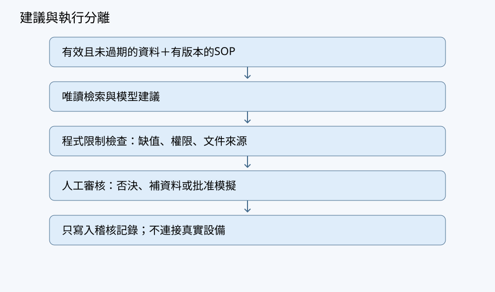

# 第19章 風險、限制與人類覆核

## 學習目標與先備知識

本章把第18章的檢索與工具介面，放在一個更嚴格的目標下：agent 不能只生成文字，還要在資料缺損、資料過期或候選操作越界時停止，並把批准權交還現場專業人員。讀者應能用殘差理解觀測與訓練均值的偏差，用 Mahalanobis 距離理解尺度與相關結構如何影響「偏離幅度」，並用線性不等式界定候選操作的可行集合。先備知識包括第4章的秩與一致性、第7章的對稱正定矩陣、第9章的樣本共變異數與資料切分、第17章的缺值與時間切分，以及第18章的 agent 介面。本章不預設機率檢定、深度學習或自動控制；所有數值皆為教學合成，不提供真實物種閾值。

## 從池A提出問題

池A的流水線是：感測器與影像生成特徵，模型產生候選摘要，agent 檢索來源明確的 SOP，最後由人類批准。本節只取兩項感測：$temperature_c\in\mathbb{R}$ 與 $do_mg_l\in\mathbb{R}$，寫成欄向量 $\mathbf{x}\in\mathbb{R}^2$，shape 為 $(2,1)$。訓練時段有 $n=10$ 筆完整觀測，已算出均值 $\boldsymbol{\mu}\in\mathbb{R}^2$ 與樣本共變異數 $\Sigma\in\mathbb{R}^{2\times2}$，分母為 $n-1$。

新資料進來時，agent 先做三類檢查。第一是資料有效性：若任一欄位缺值，或時間戳落在容許窗口外，agent 應拒絕執行，並以不同原因碼標記「缺值」或「過期／未來時間」，不得用零值、訓練均值或最近值悄悄補齊。第二是分布偏差：若資料完整，才計算它偏離訓練分布的 Mahalanobis 距離；高值只代表與訓練期不一致，不能等同病害診斷。第三是操作可行性：候選操作 $\boldsymbol{\delta}$ 必須滿足由現場專業人員制定的線性限制 $A\boldsymbol{\delta}\le\mathbf{b}$；模型不能自行修改 $A$ 或 $\mathbf{b}$。本章 Python 實驗只模擬檢查與候選建議，不連真實設備，也不發出投餌、加藥或增氧指令。

## 概念與推導

殘差定義為
$$
\mathbf{r}=\mathbf{x}-\boldsymbol{\mu}\in\mathbb{R}^d,
$$
shape 為 $(d,1)$。它回答觀測比訓練均值多或少了多少。若只用歐氏範數 $\|\mathbf{r}\|^2=\mathbf{r}^\top\mathbf{r}$，溫度偏 $2$ 度與溶氧偏 $2$ mg/L 會被同等看待；但兩者的訓練方差不同，且可能相關，因此需要納入尺度與相關結構的距離。

Mahalanobis 距離平方定義為
$$
d_M^2(\mathbf{x})=(\mathbf{x}-\boldsymbol{\mu})^\top\Sigma^{-1}(\mathbf{x}-\boldsymbol{\mu}),
$$
其中 $\Sigma$ 為 $d\times d$ 樣本共變異數矩陣。這裡的「$-1$」是矩陣逆，不是逐元素倒數。對實對稱矩陣，可逆的充要條件是 $\det(\Sigma)\neq0$；對共變異數矩陣，若對角變異數皆正且相關係數絕對值小於 $1$，則 $\det(\Sigma)>0$。對樣本共變異數，還需注意：中心化後資料矩陣的秩必須達到 $d$，因此 $n\ge d+1$ 才可能不奇異；這是必要條件，不是充分條件，感測器高度相關時仍可能接近奇異。

幾何上，$\Sigma$ 描述訓練資料的相關與尺度，形成橢圓方向；$\Sigma^{-1}$ 會把这些方向拉回接近單位尺度，使不同方向的偏離幅度可比較。若 $\Sigma$ 奇異，存在非零 $\mathbf{v}$ 使 $\Sigma\mathbf{v}=0$，也就是資料在某個組合方向沒有變異，此時 $\Sigma^{-1}$ 不存在。可以改用偽逆 $\Sigma^+$ 定義廣義 Mahalanobis 距離：
$$
\tilde{d}_M^2(\mathbf{x})=(\mathbf{x}-\boldsymbol{\mu})^\top\Sigma^+(\mathbf{x}-\boldsymbol{\mu}).
$$
但這個距離對零特徵值方向的偏差不懲罰，會低估那些方向的風險。教學上應把它視為「降維或合併冗餘感測」的信號，而不是完整異常判定。

線性限制採用一般形式
$$
A\boldsymbol{\delta}\le\mathbf{b},
$$
其中 $\boldsymbol{\delta}\in\mathbb{R}^m$ 是候選操作的量，$A\in\mathbb{R}^{k\times m}$，$\mathbf{b}\in\mathbb{R}^k$。第 $i$ 列是一條線性不等式：$A_{i,:}\boldsymbol{\delta}\le b_i$。可行集合為
$$
\mathcal{F}=\{\boldsymbol{\delta}\in\mathbb{R}^m:A\boldsymbol{\delta}\le\mathbf{b}\}.
$$
例如現場人員可限制單項操作幅度與總資源量：$|\delta_1|\le2$、$|\delta_2|\le3$、$\delta_1+\delta_2\le4$。互斥、離散開關或時序邏輯不宜只靠連續變數線性不等式硬套；本章只處理能清楚寫成 $A\boldsymbol{\delta}\le\mathbf{b}$ 的部分。若 $\mathcal{F}=\varnothing$，agent 應輸出「無可行候選」並停止，而不是放寬 $\mathbf{b}$。

## 手算例題

取 $d=2$，訓練統計量
$$
\boldsymbol{\mu}=\begin{pmatrix}28\\5.0\end{pmatrix},\quad
\Sigma=\begin{pmatrix}4&-0.6\\-0.6&0.25\end{pmatrix}.
$$
先檢查可逆性：
$$
\det(\Sigma)=4(0.25)-(-0.6)^2=1-0.36=0.64\neq0.
$$
對 $2\times2$ 矩陣，
$$
\Sigma^{-1}=\frac{1}{0.64}\begin{pmatrix}0.25&0.6\\0.6&4\end{pmatrix}
=\begin{pmatrix}0.390625&0.9375\\0.9375&6.25\end{pmatrix}.
$$
新觀測 $\mathbf{x}=\begin{pmatrix}33\\2.0\end{pmatrix}$，殘差
$$
\mathbf{r}=\mathbf{x}-\boldsymbol{\mu}=\begin{pmatrix}5\\-3\end{pmatrix}.
$$
計算 $d_M^2$。先算 $\Sigma^{-1}\mathbf{r}$：
$$
\Sigma^{-1}\mathbf{r}=
\begin{pmatrix}
0.390625(5)+0.9375(-3)\\
0.9375(5)+6.25(-3)
\end{pmatrix}
=
\begin{pmatrix}
1.953125-2.8125\\
4.6875-18.75
\end{pmatrix}
=
\begin{pmatrix}
-0.859375\\
-14.0625
\end{pmatrix}.
$$
再與 $\mathbf{r}$ 做內積：
$$
d_M^2=\mathbf{r}^\top\Sigma^{-1}\mathbf{r}
=5(-0.859375)+(-3)(-14.0625)
=-4.296875+42.1875=37.890625.
$$
這個數值本身尚不能判定「高低」；必須與事先制定、只用訓練／驗證時段擬合並經人工審核的比較規則相比較。在此，我們只把它作為觸發覆核的訊號，不作病害診斷。

接著檢查線性限制。設候選操作 $\boldsymbol{\delta}=\begin{pmatrix}3.0\\1.0\end{pmatrix}$，限制寫成
$$
A=\begin{pmatrix}1&0\\-1&0\\0&1\\0&-1\\1&1\end{pmatrix},\quad
\mathbf{b}=\begin{pmatrix}2\\2\\3\\3\\4\end{pmatrix}.
$$
五列分別對應 $\delta_1\le2$、$-\delta_1\le2$、$\delta_2\le3$、$-\delta_2\le3$、$\delta_1+\delta_2\le4$。代入：
$$
A\boldsymbol{\delta}=
\begin{pmatrix}
3.0\\-3.0\\1.0\\-1.0\\4.0
\end{pmatrix},\quad
A\boldsymbol{\delta}-\mathbf{b}=
\begin{pmatrix}
1.0\\-5.0\\-2.0\\-4.0\\0.0
\end{pmatrix}.
$$
第一列 $3.0>2$ 越界，因此 $\boldsymbol{\delta}\notin\mathcal{F}$。agent 應拒絕該候選，並回報「第一條限制超出上限」，而不是自行改成 $2.5$。

## Python實驗

以下程式碼在隔離環境執行，使用 NumPy。它示範：缺值與時間戳的布林檢查、$\Sigma$ 可逆性檢查、Mahalanobis 距離、一般形式 $A\boldsymbol{\delta}\le\mathbf{b}$ 的可行檢查。這裡的一維 NumPy 陣列作為欄向量的程式表示；若需嚴格 shape，可改寫為 $(d,1)$ 兩維陣列。

```python
import numpy as np

np.random.seed(42)
np.set_printoptions(precision=4, suppress=True)

# 訓練統計量（教學合成，非真實閾值）
mu = np.array([[28.0],
               [5.0]])
Sigma = np.array([[4.0, -0.6],
                  [-0.6, 0.25]])

# 新資料與外部檢查輸入
x = np.array([[33.0],
              [2.0]])
missing = bool(np.isnan(x).any())
obs_time = 100.0
now_time = 105.0
staleness_limit = 60.0

if missing:
    print("status: reject")
    print("reason: missing")
elif obs_time > now_time or now_time - obs_time > staleness_limit:
    print("status: reject")
    print("reason: stale_or_future")
else:
    det = np.linalg.det(Sigma)
    cond = np.linalg.cond(Sigma)
    print(f"det(Sigma)={det:.4f}, cond(Sigma)={cond:.4f}")

    # 小型示範：固定相對容差；近奇異應改用分解或條件數判斷
    tol = 1e-8 * max(Sigma.shape) * np.linalg.norm(Sigma, ord=2)
    if abs(det) < tol:
        print("status: reject")
        print("reason: singular_or_near_singular_sigma")
    else:
        r = x - mu
        Sigma_inv_r = np.linalg.solve(Sigma, r)
        d2 = float(r @ Sigma_inv_r)
        print(f"d_M^2={d2:.4f}")

        delta = np.array([[3.0],
                          [1.0]])
        A = np.array([[1, 0],
                      [-1, 0],
                      [0, 1],
                      [0, -1],
                      [1, 1]])
        b = np.array([[2.0],
                      [2.0],
                      [3.0],
                      [3.0],
                      [4.0]])
        margin = A @ delta - b
        feasible = bool(np.all(margin <= 1e-12))
        print(f"feasible={feasible}")
        print(f"margin={margin.ravel()}")
```

預期輸出：
```
det(Sigma)=0.6400, cond(Sigma)=34.6250
d_M^2=37.8906
feasible=False
margin=[ 1.  -5.  -2.  -4.   0.]
```
若把 `x[1,0]` 改成 `np.nan`，程式輸出 `status: reject` 與 `reason: missing`；若把 `obs_time` 改成 `200.0`，程式輸出 `status: reject` 與 `reason: stale_or_future`。此處的行列式容差只用於小型教學示範，實務上近奇異情況應檢查條件數或使用分解。

## 連回生成式AI、多模態與Agent

本章的工具放在池A流水線的「模型建議之前」與「人類批准之後」之間。生成式模型可能把高 Mahalanobis 距離解釋成自然語言，例如「水質異常」；但線性代數只提供距離與越界資訊，不承擔生物因果判斷。多模態融合時，若影像模態缺值或感測時間戳過期，融合前的有效性檢查就應拒絕，不能把缺模態補零後再計算相似度。Agent 的角色因此是：檢索來源、整理候選、列出拒絕原因、把批准權留給現場專業人員。R7、R8 只支持 agent 推理、行動與檢索的背景，不證實任何養殖安全閾值。



## 常見錯誤與限制

第一，把異常分數當診斷。$d_M^2$ 高可能來自感測漂移、季節變化、訓練期不足或資料缺失，不能推論特定病原或操作必要。第二，忽略 $\Sigma$ 的來源。$\boldsymbol{\mu}$ 與 $\Sigma$ 必須只用訓練時段估計；若混入測試日或實際日資料，會高估穩定性。第三，假設 $n>d$ 就夠。樣本共變異數還需中心化資料具有足夠秩；感測器高度相關時仍可能奇異或接近奇異。第四，用廣義 Mahalanobis 距離隱藏零特徵值方向。$\Sigma^+$ 方便計算，但會忽略冗餘方向上的偏差，應搭配降維或來源檢索使用。第五，把互斥或離散操作硬寫成連續線性不等式。若操作包含開關、順序或不可同時執行，需要更完整的約束模型，超出本章線性範圍。第六，agent 在越界時自動修補。可行集合為空時，正確行為是停止、回報原因並等待人類調整，而不是自行降低限制。

## 習題

**習題1（基本計算）**  
池A兩維感測 $\mathbf{x}=(t,o)^\top$。訓練集得 $\boldsymbol{\mu}=(30,4.0)^\top$，$\Sigma=\begin{pmatrix}1&0\\0&0.16\end{pmatrix}$。新觀測 $\mathbf{x}=(32,2.0)^\top$。  
(a) 求 $\Sigma^{-1}$。  
(b) 算 $d_M^2$。  
(c) 若限制為 $|t-30|\le3$ 且 $|o-4.0|\le1.5$，寫成 $A\boldsymbol{\delta}\le\mathbf{b}$ 並判斷 $\boldsymbol{\delta}=(2,-2)^\top$ 是否可行。

**習題2（觀念）**  
為何 $\Sigma$ 正定比「行列式不為零」更適合 Mahalanobis 距離的教學要求？若樣本共變異數 $\Sigma$ 奇異，使用偽逆 $\Sigma^+$ 會帶來什麼解釋上的限制？

**習題3（養殖應用）**  
池A的 agent 設定：若 $d_M^2>10$，則自動把溶氧目標設為 $6$ mg/L 並執行增氧。請指出此設計在資料有效性、因果診斷與操作安全上的至少三處問題，並改寫成符合本章原則的「拒絕—回報—批准」流程。

## 習題解答

**習題1**  
(a) $\Sigma$ 為對角矩陣，$\Sigma^{-1}=\begin{pmatrix}1&0\\0&6.25\end{pmatrix}$。  
(b) $\mathbf{r}=(2,-2)^\top$，
$$
d_M^2=
\begin{pmatrix}2&-2\end{pmatrix}
\begin{pmatrix}1&0\\0&6.25\end{pmatrix}
\begin{pmatrix}2\\-2\end{pmatrix}
=4+25=29.
$$
(c) 限制 $|t-30|\le3$ 與 $|o-4.0|\le1.5$ 可寫成
$$
\begin{pmatrix}1&0\\-1&0\\0&1\\0&-1\end{pmatrix}
\boldsymbol{\delta}
\le
\begin{pmatrix}3\\3\\1.5\\1.5\end{pmatrix}.
$$
代入 $\boldsymbol{\delta}=(2,-2)^\top$ 得
$$
A\boldsymbol{\delta}=
\begin{pmatrix}2\\-2\\-2\\2\end{pmatrix},\quad
A\boldsymbol{\delta}-\mathbf{b}=
\begin{pmatrix}-1\\-5\\-3.5\\0.5\end{pmatrix}.
$$
第四列 $0.5>0$，故不可行。

**習題2**  
Mahalanobis 距離要求 $\Sigma^{-1}$ 存在，且對任何非零 $\mathbf{v}$，$\mathbf{v}^\top\Sigma^{-1}\mathbf{v}>0$，這樣距離平方才非負且只在 $\mathbf{x}=\boldsymbol{\mu}$ 時為零。行列式不為零只保證可逆；對稱正定還保證特徵值皆正，避免出現負距離平方或異常的橢圓方向。若 $\Sigma$ 奇異，$\Sigma^+$ 會把零特徵值方向的偏差不計入距離，等於假設那些方向「不重要」。但那些方向可能正是感測器共線或冗餘造成的資訊缺口，必須標記為低置信、降維、合併變數或請人類補充資料，不能直接當作正常。

**習題3**  
(1) 缺值或過期未先拒絕：若 $do_mg_l$ 缺值，agent 不該用訓練均值或零值補齊後繼續計算。應輸出 `reject` 與 `missing` 或 `stale_or_future` 原因。  
(2) 把異常當診斷：$d_M^2>10$ 只表示與訓練期不一致，不能推出溶氧不足，更不能自動決定增氧；$10$ 也不是通用閾值。  
(3) 自動執行目標濃度：把「溶氧目標 $6$ mg/L」當自動指令，忽略現場設備、量測延遲、人員批准與資源限制。應改為：agent 只生成候選操作 $\boldsymbol{\delta}$，用 $A\boldsymbol{\delta}\le\mathbf{b}$ 檢查；若可行，輸出候選與來源；若不可行或資料缺損，停止並回報；由現場專業人員批准後才可能進入外部流程，而本章示範不連接設備。

## 本章小結

本章把風險控制拆成三個可檢查的線性代數步驟：殘差量化觀測與訓練均值的偏差；Mahalanobis 距離把尺度與相關結構納入偏差，但要求 $\Sigma$ 可逆，奇異時只能以偽逆降級並標明限制；線性限制 $A\boldsymbol{\delta}\le\mathbf{b}$ 界定候選操作的可行集合。異常分數不是病害診斷，缺值或過期資料應先拒絕，可行集合為空應停止。Agent 的價值在於檢索來源、整理候選、列出拒絕原因，而不是替代養殖專業或自動操作。

## 參考來源

- R1: NumPy linear algebra reference.
- R2: Deep Learning, Chapter 2: Linear Algebra.
- R7: ReAct: Synergizing Reasoning and Acting in Language Models.
- R8: Retrieval-Augmented Generation for Knowledge-Intensive NLP Tasks.