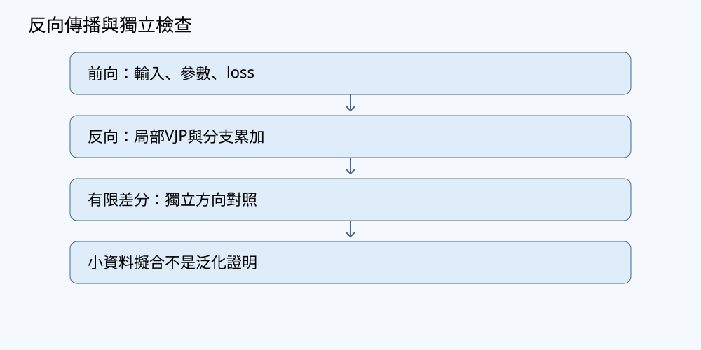

# 第07章 矩陣微分、VJP與反向傳播

## 學習目標與先備知識

本章把「函數可微」轉化為「模型可以有效訓練」。完成本章後，讀者應能：

1. 區分 Jacobian、梯度、Jacobian-vector product（JVP）與 vector-Jacobian product（VJP）。
2. 使用微分與 Frobenius 內積推導矩陣梯度。
3. 依計算圖的反向拓撲順序執行反向傳播。
4. 在中間值或參數被多條路徑使用時，正確累加梯度。
5. 不建立大型完整 Jacobian，直接計算所需 VJP。
6. 用中央有限差分及內積對偶核對解析梯度。
7. 明確區分訓練損失、驗證指標與測試結果。

本卷約定矩陣橫列為 row、縱行為 column。批次資料採

$$
X\in\mathbb{R}^{B\times D_{\mathrm{in}}},
$$

每筆樣本儲存在一個 row。仿射映射寫成

$$
Y=XW+b,
$$

其中

$$
W\in\mathbb{R}^{D_{\mathrm{in}}\times D_{\mathrm{out}}},
\qquad
b\in\mathbb{R}^{D_{\mathrm{out}}}.
$$

偏置 $b$ 沿 batch 軸廣播。這與微分教材常把單一向量寫成 column 向量並不衝突；只要每一式的 shape 一致即可。梯度必須與被微分變數具有相同 shape。

---

## 問題與直覺

設模型依序進行

$$
X\longrightarrow Z=XW+b\longrightarrow A=\tanh Z\longrightarrow L.
$$

若參數與輸出各有大量元素，直接建立「每個輸出對每個參數的偏導數」會產生巨大 Jacobian。然而訓練的終點通常是純量損失 $L$，我們真正需要的是：

> 損失的微小變化，如何沿計算圖反向分配到每個參數？

反向傳播是鏈式法則的有效實作。每個節點接收下游梯度，以局部導數計算對其輸入的 VJP，再把結果傳向上游。若同一值流向多個分支，各分支都會產生梯度貢獻，這些貢獻必須相加，不能互相覆寫。



### 模型、目標與證據契約

本章的程式實驗遵守以下契約：

- **資料**：只使用程式產生的合成二分類資料，不下載模型或語料。
- **生成規則**：$x\in\mathbb{R}^2$ 由標準常態抽樣，且
  $P(y=1\mid x)=\sigma(x_1-0.7x_2+0.2)$。
- **機率域**：$\sigma(s)=1/(1+e^{-s})\in(0,1)$，標籤為 $\{0,1\}$。有限樣本的類別比例不是真實條件分布本身。
- **切分**：訓練、驗證與測試索引互不重疊。只用訓練集更新參數；驗證集供模型選擇；測試集不參與調參。
- **損失**：二元交叉熵沿 batch 軸取 mean，反向時只除以 $B$ 一次。
- **基線**：使用訓練集多數類別作固定預測。
- **驗收**：有限差分或方向導數超出明列容差時，程式必須中止。
- **故障規則**：非法標籤、空 batch、非有限 logit 或非法容差若未被拒絕，測試本身必須失敗。
- **可重現性**：固定 seed 只約束該次 NumPy 隨機流程，不保證跨版本與平台逐位一致。
- **能力邊界**：低訓練損失不保證泛化、因果正確性或應用安全。

本章沒有執行程式，因此後文只描述預期行為，不聲稱測試已通過或模型已訓練。

---

## 定義、定理與推導

### 微分、梯度與Frobenius內積

對純量函數 $f(X)$，其中 $X\in\mathbb{R}^{m\times n}$，梯度 $\nabla_Xf$ 由下式定義：

$$
df=\operatorname{tr}\left((\nabla_Xf)^T\,dX\right).
$$

矩陣的 Frobenius 內積為

$$
\langle A,B\rangle_F
=\operatorname{tr}(A^TB)
=\sum_{i,j}A_{ij}B_{ij}.
$$

因此

$$
df=\langle\nabla_Xf,dX\rangle_F.
$$

這個表示把所有元素偏導數組成與 $X$ 同 shape 的矩陣。若 $W$ 的 shape 是 $(D_{\mathrm{in}},D_{\mathrm{out}})$，則 $\nabla_Wf$ 也必須具有相同 shape。

### Jacobian、JVP與VJP

考慮

$$
y=f(x),
\qquad
x\in\mathbb{R}^n,
\quad
y\in\mathbb{R}^m.
$$

Jacobian 定義為

$$
J_f(x)_{ij}=\frac{\partial y_i}{\partial x_j},
\qquad
J_f(x)\in\mathbb{R}^{m\times n}.
$$

給定輸入方向 $u\in\mathbb{R}^n$，JVP 為

$$
J_f(x)u\in\mathbb{R}^m.
$$

若 $f$ 可微，則

$$
f(x+\epsilon u)=f(x)+\epsilon J_f(x)u+o(\epsilon).
$$

給定輸出端向量 $v\in\mathbb{R}^m$，VJP 為

$$
v^TJ_f(x)\in\mathbb{R}^{1\times n}.
$$

若梯度寫成 column 向量，反向傳播為

$$
\nabla_xL=J_f(x)^T\nabla_yL.
$$

實作只需計算這個乘積，不必配置完整的 $m\times n$ Jacobian。

### 小命題：JVP與VJP的內積對偶

**命題。** 若 $f:\mathbb{R}^n\rightarrow\mathbb{R}^m$ 在 $x$ 可微，則對任意 $u\in\mathbb{R}^n$ 與 $v\in\mathbb{R}^m$，

$$
\langle v,J_f(x)u\rangle=\langle J_f(x)^Tv,u\rangle.
$$

**證明。**

由歐氏內積定義，

$$
\langle v,J_f(x)u\rangle=v^TJ_f(x)u.
$$

右側是 $1\times1$ 純量，故等於自己的轉置。利用 $(ABC)^T=C^TB^TA^T$，

$$
\left(v^TJ_f(x)u\right)^T=u^TJ_f(x)^Tv.
$$

再由內積的定義與對稱性，

$$
u^TJ_f(x)^Tv=\langle u,J_f(x)^Tv\rangle=\langle J_f(x)^Tv,u\rangle.
$$

所以

$$
\langle v,J_f(x)u\rangle=\langle J_f(x)^Tv,u\rangle.
$$

證畢。

這個命題可用來核對反向傳播：左側 JVP 可由前向方向有限差分近似，右側 VJP 可由解析反傳取得，最後只比較兩個純量。

### 向量鏈式法則

若

$$
x\overset{f}{\longmapsto}y\overset{g}{\longmapsto}z,
$$

其中 $y=f(x)$、$z=g(y)$，則

$$
J_{g\circ f}(x)=J_g(y)J_f(x).
$$

若最終損失 $L$ 是純量，反向形式為

$$
\nabla_xL=J_f(x)^T\nabla_yL.
$$

若還有下游變數 $z$，則

$$
\nabla_xL=J_f(x)^TJ_g(y)^T\nabla_zL.
$$

矩陣由右向左作用，正好對應由損失端往輸入端傳播。

### 矩陣乘法的反向傳播

令

$$
Z=XW,
$$

其中

$$
X\in\mathbb{R}^{B\times D_{\mathrm{in}}},
\quad
W\in\mathbb{R}^{D_{\mathrm{in}}\times D_{\mathrm{out}}},
\quad
Z\in\mathbb{R}^{B\times D_{\mathrm{out}}}.
$$

微分為

$$
dZ=dX\,W+X\,dW.
$$

設上游梯度為

$$
G=\nabla_ZL\in\mathbb{R}^{B\times D_{\mathrm{out}}}.
$$

由 Frobenius 梯度定義，

$$
dL=\operatorname{tr}(G^TdZ).
$$

代入 $dZ$：

$$
dL=\operatorname{tr}(G^TdXW)+\operatorname{tr}(G^TXdW).
$$

利用 trace 的循環性，

$$
\operatorname{tr}(G^TdXW)
=\operatorname{tr}((GW^T)^TdX),
$$

以及

$$
\operatorname{tr}(G^TXdW)
=\operatorname{tr}((X^TG)^TdW).
$$

故

$$
\nabla_XL=GW^T,
\qquad
\nabla_WL=X^TG.
$$

shape 核對：

- $GW^T:(B,D_{\mathrm{out}})(D_{\mathrm{out}},D_{\mathrm{in}})
  \rightarrow(B,D_{\mathrm{in}})$；
- $X^TG:(D_{\mathrm{in}},B)(B,D_{\mathrm{out}})
  \rightarrow(D_{\mathrm{in}},D_{\mathrm{out}})$。

### 廣播偏置的梯度

若

$$
Z=XW+b,
\qquad
b\in\mathbb{R}^{D_{\mathrm{out}}},
$$

則

$$
Z_{ij}=(XW)_{ij}+b_j.
$$

所以

$$
\frac{\partial L}{\partial b_j}
=
\sum_{i=1}^{B}\frac{\partial L}{\partial Z_{ij}},
$$

即

$$
\nabla_bL=\sum_{i=1}^{B}G_{i,:}.
$$

廣播的反向必須 sum 回原 shape。若 $Z$ 是 $(B,T,D)$、$b$ 是 $(D,)$，則 $\nabla_bL$ 要沿 batch 軸 $0$ 與時間軸 $1$ 求和。

### 分支梯度累加

若

$$
q=x^2,\qquad r=3x,\qquad L=q+r,
$$

則

$$
dL=dq+dr=(2x+3)dx,
$$

所以

$$
\frac{dL}{dx}=2x+3.
$$

平方分支傳回 $2x$，線性分支傳回 $3$，兩者必須相加。更一般地，若 $x$ 被 $k$ 個下游節點使用，

$$
\nabla_xL
=
\sum_{r=1}^{k}
\left(\frac{\partial y^{(r)}}{\partial x}\right)^T
\nabla_{y^{(r)}}L.
$$

共享參數、殘差連接與重複索引都遵循此規則。

### 反向拓撲順序

反向傳播的基本步驟為：

1. 將純量損失的梯度設為 $1$。
2. 從損失端依反向拓撲順序處理節點。
3. 每個節點以局部導數計算對輸入的 VJP。
4. 將結果累加到各輸入的梯度槽。
5. 某節點所有下游貢獻到齊後，才繼續往上游傳播。

若分支尚未全部處理便提早往上游傳播，所得梯度會缺少路徑貢獻。實作時可為每個節點準備與其輸出同形狀的梯度槽，初值為零。每處理一條下游路徑，就把傳回的貢獻加入梯度槽；待所有路徑處理完畢，才用累積結果向更上游傳播。這說明反向拓撲順序不只是走訪方向，也決定了何時能傳播一個節點的梯度。

除錯時，應先核對前向值和各節點的梯度形狀，再檢查矩陣乘法的因子次序、偏置廣播所需的求和軸，以及平均損失的除數是否只套用一次。若解析梯度與有限差分不符，還須檢查差分步長及輸入是否位於不可微點；不能只靠放寬容差掩蓋錯誤。數值吻合也不能取代局部規則的數學推導。

---

## 逐步手算例題

### 例一：仿射層與平方損失

給定

$$
X=\begin{bmatrix}1&2\end{bmatrix},
\quad
W=\begin{bmatrix}1&-1\\2&0\end{bmatrix},
\quad
b=\begin{bmatrix}1&2\end{bmatrix}.
$$

此處 $B=1$、$D_{\mathrm{in}}=2$、$D_{\mathrm{out}}=2$。即使 $B=1$，仍保留 batch 軸，因此 $X$ 是 $(1,2)$。

正向計算：

$$
XW
=
\begin{bmatrix}1&2\end{bmatrix}
\begin{bmatrix}1&-1\\2&0\end{bmatrix}
=
\begin{bmatrix}5&-1\end{bmatrix},
$$

$$
Z=XW+b=\begin{bmatrix}6&1\end{bmatrix}.
$$

本例沿單筆樣本的輸出特徵軸取平方和：

$$
L=\frac12\sum_{j=1}^{2}Z_{1j}^2.
$$

因 $B=1$，沒有額外 batch 平均因子。因此

$$
L=\frac12(6^2+1^2)=18.5,
$$

且

$$
G=\nabla_ZL=Z=\begin{bmatrix}6&1\end{bmatrix}.
$$

對輸入的梯度：

$$
\nabla_XL=GW^T
=
\begin{bmatrix}6&1\end{bmatrix}
\begin{bmatrix}1&2\\-1&0\end{bmatrix}
=
\begin{bmatrix}5&12\end{bmatrix}.
$$

對權重的梯度：

$$
\nabla_WL=X^TG
=
\begin{bmatrix}1\\2\end{bmatrix}
\begin{bmatrix}6&1\end{bmatrix}
=
\begin{bmatrix}6&1\\12&2\end{bmatrix}.
$$

偏置梯度沿 batch 軸求和：

$$
\nabla_bL=\begin{bmatrix}6&1\end{bmatrix}.
$$

在 NumPy 約定下，$b$ 與 $\nabla_bL$ 採 shape $(2,)$；紙筆上顯示為 row 只是排版方式。

### 例二：共享中間值的分支反傳

考慮

$$
a=2x,\qquad b=a^2,\qquad c=3a,\qquad L=b+c.
$$

取 $x=1.5$。正向計算：

$$
a=3,\qquad b=9,\qquad c=9,\qquad L=18.
$$

反向從 $\partial L/\partial L=1$ 開始：

$$
\frac{\partial L}{\partial b}=1,
\qquad
\frac{\partial L}{\partial c}=1.
$$

平方分支對 $a$ 的貢獻：

$$
\left.\frac{\partial L}{\partial a}\right|_b
=
1\cdot2a=6.
$$

線性分支的貢獻：

$$
\left.\frac{\partial L}{\partial a}\right|_c
=
1\cdot3=3.
$$

累加後：

$$
\frac{\partial L}{\partial a}=6+3=9.
$$

再經 $a=2x$：

$$
\frac{\partial L}{\partial x}=9\cdot2=18.
$$

直接展開可驗算：

$$
L=(2x)^2+3(2x)=4x^2+6x,
$$

$$
\frac{dL}{dx}=8x+6.
$$

代入 $x=1.5$ 亦得 $18$。

### 例三：batch平均只除一次

兩筆樣本的損失為

$$
\ell_1=(w-1)^2,
\qquad
\ell_2=(2w-1)^2,
$$

batch mean 為

$$
L=\frac{\ell_1+\ell_2}{2}.
$$

取 $w=0$：

$$
\frac{d\ell_1}{dw}=2(w-1)=-2,
$$

$$
\frac{d\ell_2}{dw}=2(2w-1)\cdot2=-4.
$$

所以

$$
\frac{dL}{dw}=\frac{-2-4}{2}=-3.
$$

若先把每筆梯度除以 $2$，最後又取 mean，會錯得 $-1.5$；若完全不除，則得到 sum loss 的梯度 $-6$。

---

## 實作與程式

以下程式只依賴 NumPy，使用 CPU 建立二分類模型

$$
Z=XW+b.
$$

對有限 logit $z$ 與硬標籤 $y\in\{0,1\}$，穩定二元交叉熵為

$$
\ell(z,y)=\max(z,0)-zy+\log(1+e^{-|z|}).
$$

batch loss 沿軸 $0$ 取 mean：

$$
L=\frac1B\sum_{i=1}^{B}\ell(z_i,y_i),
$$

所以

$$
\frac{\partial L}{\partial z_i}
=
\frac{\sigma(z_i)-y_i}{B}.
$$

程式包含解析反傳、逐參數有限差分、方向導數、正常／邊界／故障測試及訓練／驗證／測試切分。以下程式未執行。

```python
import numpy as np


def normalize_tolerances(atol, rtol):
    try:
        atol = float(atol)
        rtol = float(rtol)
    except (TypeError, ValueError) as error:
        raise ValueError("atol與rtol必須可轉成實數") from error

    if not np.isfinite(atol) or not np.isfinite(rtol):
        raise ValueError("atol與rtol必須有限")
    if atol < 0.0 or rtol < 0.0:
        raise ValueError("atol與rtol不可為負數")
    return atol, rtol


def sigmoid(x):
    x = np.asarray(x, dtype=np.float64)
    out = np.empty_like(x)
    positive = x >= 0.0
    out[positive] = 1.0 / (1.0 + np.exp(-x[positive]))
    exp_x = np.exp(x[~positive])
    out[~positive] = exp_x / (1.0 + exp_x)
    return out


def bce_logits_mean(logits, y):
    logits = np.asarray(logits, dtype=np.float64)
    y = np.asarray(y, dtype=np.float64)

    if logits.shape != y.shape:
        raise ValueError("logits與y必須具有相同shape")
    if logits.ndim != 2 or logits.shape[1] != 1:
        raise ValueError("本例要求shape為(B, 1)")
    if logits.shape[0] == 0:
        raise ValueError("不可對空batch取mean")
    if not np.all(np.isfinite(logits)):
        raise ValueError("logits必須全部有限")
    if not np.all(np.isfinite(y)):
        raise ValueError("標籤必須全部有限")
    if not np.all((y == 0.0) | (y == 1.0)):
        raise ValueError("硬標籤必須為0或1")

    per_item = (
        np.maximum(logits, 0.0)
        - logits * y
        + np.log1p(np.exp(-np.abs(logits)))
    )
    loss = np.mean(per_item, axis=0).item()
    dlogits = (sigmoid(logits) - y) / logits.shape[0]
    return loss, dlogits


def forward_backward(X, y, W, b):
    X = np.asarray(X, dtype=np.float64)
    W = np.asarray(W, dtype=np.float64)
    b = np.asarray(b, dtype=np.float64)

    if X.ndim != 2 or X.shape[0] == 0:
        raise ValueError("X必須是非空的(B, Din)矩陣")
    if not np.all(np.isfinite(X)):
        raise ValueError("X必須全部有限")
    if W.ndim != 2 or W.shape != (X.shape[1], 1):
        raise ValueError("W必須具有shape (Din, 1)")
    if b.shape != (1,):
        raise ValueError("b必須具有shape (1,)")
    if not np.all(np.isfinite(W)) or not np.all(np.isfinite(b)):
        raise ValueError("參數必須全部有限")

    logits = X @ W + b
    loss, dlogits = bce_logits_mean(logits, y)

    dX = dlogits @ W.T
    dW = X.T @ dlogits
    db = np.sum(dlogits, axis=0)

    if dX.shape != X.shape:
        raise AssertionError("dX shape錯誤")
    if dW.shape != W.shape:
        raise AssertionError("dW shape錯誤")
    if db.shape != b.shape:
        raise AssertionError("db shape錯誤")

    return loss, logits, dX, dW, db


def parameter_loss(theta, X, y):
    theta = np.asarray(theta, dtype=np.float64)
    din = X.shape[1]
    if theta.shape != (din + 1,):
        raise ValueError("theta必須含Din個權重及1個偏置")
    W = theta[:din].reshape(din, 1)
    b = theta[din:].reshape(1)
    return forward_backward(X, y, W, b)[0]


def finite_difference_gradient(theta, X, y, eps=1e-6):
    try:
        eps = float(eps)
    except (TypeError, ValueError) as error:
        raise ValueError("eps必須可轉成實數") from error
    if not np.isfinite(eps) or eps <= 0.0:
        raise ValueError("eps必須是有限正數")

    grad = np.zeros_like(theta, dtype=np.float64)
    for i in range(theta.size):
        plus = theta.copy()
        minus = theta.copy()
        plus[i] += eps
        minus[i] -= eps
        grad[i] = (
            parameter_loss(plus, X, y)
            - parameter_loss(minus, X, y)
        ) / (2.0 * eps)
    return grad


def gradient_checks(atol=1e-8, rtol=1e-6):
    atol, rtol = normalize_tolerances(atol, rtol)

    X = np.array([[1.0, -2.0],
                  [0.5, 3.0]], dtype=np.float64)
    y = np.array([[1.0], [0.0]], dtype=np.float64)
    W = np.array([[0.2], [-0.4]], dtype=np.float64)
    b = np.array([0.1], dtype=np.float64)

    loss, _, dX, dW, db = forward_backward(X, y, W, b)
    theta = np.concatenate([W.ravel(), b])
    analytic = np.concatenate([dW.ravel(), db])
    numeric = finite_difference_gradient(theta, X, y)

    parameter_error = float(
        np.max(np.abs(analytic - numeric))
    )
    parameter_ok = np.allclose(
        analytic, numeric, atol=atol, rtol=rtol
    )

    direction = np.array([0.3, -0.8, 0.5])
    direction /= np.linalg.norm(direction)
    eps = 1e-6
    fd_direction = (
        parameter_loss(theta + eps * direction, X, y)
        - parameter_loss(theta - eps * direction, X, y)
    ) / (2.0 * eps)
    vjp_direction = float(analytic @ direction)
    direction_error = abs(fd_direction - vjp_direction)
    direction_ok = np.isclose(
        fd_direction, vjp_direction, atol=atol, rtol=rtol
    )

    print("gradient-check loss:", loss)
    print("parameter max abs error:", parameter_error)
    print("directional abs error:", direction_error)

    if not parameter_ok or not direction_ok:
        raise AssertionError(
            "梯度檢查失敗；"
            f"parameter_error={parameter_error}, "
            f"direction_error={direction_error}, "
            f"X={X.shape}, dX={dX.shape}, "
            f"W={W.shape}, dW={dW.shape}, "
            f"b={b.shape}, db={db.shape}"
        )


def make_split(seed=7, n_train=80, n_val=20, n_test=20):
    sizes = (n_train, n_val, n_test)
    if not all(isinstance(n, (int, np.integer)) for n in sizes):
        raise ValueError("切分大小必須是整數")
    if min(sizes) <= 0:
        raise ValueError("每個切分都必須至少有一筆")

    rng = np.random.default_rng(seed)
    n_total = sum(sizes)
    X = rng.normal(size=(n_total, 2))
    true_logits = X[:, [0]] - 0.7 * X[:, [1]] + 0.2
    probability = sigmoid(true_logits)
    y = (
        rng.random((n_total, 1)) < probability
    ).astype(np.float64)

    indices = rng.permutation(n_total)
    train_idx = indices[:n_train]
    val_idx = indices[n_train:n_train + n_val]
    test_idx = indices[n_train + n_val:]

    return (
        (X[train_idx], y[train_idx]),
        (X[val_idx], y[val_idx]),
        (X[test_idx], y[test_idx]),
    )


def accuracy(X, y, W, b):
    prediction = ((X @ W + b) >= 0.0).astype(np.float64)
    return np.mean(prediction == y).item()


def majority_baseline(train_y, eval_y):
    label = float(np.mean(train_y) >= 0.5)
    return np.mean(eval_y == label).item()


def expect_value_error(name, function):
    try:
        function()
    except ValueError as error:
        print(f"{name}: rejected ({error})")
        return
    raise AssertionError(
        f"{name}: expected ValueError, but input was accepted"
    )


def normal_and_boundary_tests():
    gradient_checks()

    X = np.array([[2.0, -1.0]])
    y = np.array([[1.0]])
    W = np.array([[0.1], [0.2]])
    b = np.array([0.0])
    _, logits, dX, dW, db = forward_backward(X, y, W, b)

    if logits.shape != (1, 1):
        raise AssertionError("B=1時遺失batch軸")
    if dX.shape != X.shape or dW.shape != W.shape:
        raise AssertionError("B=1梯度shape錯誤")
    if db.shape != b.shape:
        raise AssertionError("B=1偏置梯度shape錯誤")

    extreme = np.array([[1000.0], [-1000.0]])
    labels = np.array([[1.0], [0.0]])
    loss, grad = bce_logits_mean(extreme, labels)
    if not np.isfinite(loss) or not np.all(np.isfinite(grad)):
        raise AssertionError("有限極端logits產生非有限結果")


def failure_tests():
    expect_value_error(
        "invalid label",
        lambda: bce_logits_mean(
            np.array([[0.0]]), np.array([[0.3]])
        ),
    )
    expect_value_error(
        "empty batch",
        lambda: bce_logits_mean(
            np.empty((0, 1)), np.empty((0, 1))
        ),
    )
    expect_value_error(
        "non-finite logit",
        lambda: bce_logits_mean(
            np.array([[np.inf]]), np.array([[1.0]])
        ),
    )
    expect_value_error(
        "NaN logit",
        lambda: bce_logits_mean(
            np.array([[np.nan]]), np.array([[1.0]])
        ),
    )
    expect_value_error(
        "wrong label shape",
        lambda: bce_logits_mean(
            np.zeros((2, 1)), np.zeros((2,))
        ),
    )
    expect_value_error(
        "string tolerance",
        lambda: gradient_checks(atol="not-a-number"),
    )
    expect_value_error(
        "NaN tolerance",
        lambda: gradient_checks(atol=np.nan),
    )
    expect_value_error(
        "infinite tolerance",
        lambda: gradient_checks(rtol=np.inf),
    )
    expect_value_error(
        "negative tolerance",
        lambda: gradient_checks(atol=-1.0),
    )


def train_demo():
    train, val, test = make_split()
    X_train, y_train = train
    X_val, y_val = val
    X_test, y_test = test

    W = np.zeros((2, 1), dtype=np.float64)
    b = np.zeros((1,), dtype=np.float64)
    learning_rate = 0.2

    for _ in range(200):
        _, _, _, dW, db = forward_backward(
            X_train, y_train, W, b
        )
        W -= learning_rate * dW
        b -= learning_rate * db

    print(
        "train/val/test loss:",
        forward_backward(X_train, y_train, W, b)[0],
        forward_backward(X_val, y_val, W, b)[0],
        forward_backward(X_test, y_test, W, b)[0],
    )
    print(
        "train/val/test accuracy:",
        accuracy(X_train, y_train, W, b),
        accuracy(X_val, y_val, W, b),
        accuracy(X_test, y_test, W, b),
    )
    print(
        "majority baseline val/test:",
        majority_baseline(y_train, y_val),
        majority_baseline(y_train, y_test),
    )


if __name__ == "__main__":
    normal_and_boundary_tests()
    failure_tests()
    train_demo()
```

主程式先執行正常、邊界及故障測試；任一檢查不符都會拋出例外，使訓練不會繼續。`normalize_tolerances` 先把輸入轉為 `float`，再拒絕 NaN、無限值與負值，避免非法容差產生未定義的驗收行為。

---

## 測試與預期結果

以下均為預期，不是實測聲明。

### 正常測試

`gradient_checks()` 預期：

- 解析梯度與中央有限差分在 `atol=1e-8`、`rtol=1e-6` 下接近。
- 方向有限差分與 `analytic @ direction` 接近。
- `dW.shape == (2, 1)`、`db.shape == (1,)`、`dX.shape == X.shape`。
- 若比較不符，拋出包含誤差與 shape 的 `AssertionError`。

這些容差只適用於本例的 float64 小問題，不是所有函數與平台的普遍保證。

### 邊界測試

1. **$B=1$**：輸入保持 `(1, Din)`，不壓成一維。
2. **極端有限 logits**：`1000.0` 與 `-1000.0` 預期產生有限損失和梯度。
3. **飽和 sigmoid**：梯度可能接近零，這是函數性質。
4. **單類標籤**：可計算，但必須同時報告多數類別基線。

### 故障測試

以下輸入應被明確拒絕：

- 非 $\{0,1\}$ 的硬標籤；
- 空 batch；
- `inf` 或 `nan` logit；
- logits 與標籤 shape 不同；
- 無法轉成實數的容差；
- NaN、無限或負容差。

`expect_value_error` 在函式意外接受非法輸入時會主動拋出 `AssertionError`，不會靜默繼續。

### 有限差分失敗時的診斷

應依序檢查：

1. loss 是 sum 還是 mean；
2. batch 平均是否只除一次；
3. 廣播軸是否求和；
4. 梯度 shape 是否與參數一致；
5. 是否把 `X.T @ dY` 錯寫為 `dY.T @ X`；
6. 步長是否過大或過小；
7. 是否落在不可微點；
8. 是否存在非有限值。

單次合成切分不能支持統計顯著性主張。若根據測試結果反覆調參，該集合就不再是未見測試集。

---

## 反例與常見陷阱

### 一維陣列的轉置

```python
x = np.array([1.0, 2.0])
print(x.shape)    # (2,)
print(x.T.shape)  # 仍為(2,)
```

NumPy 一維陣列沒有明確 row／column 軸。單筆 batch 應使用 `x.reshape(1, 2)`，column 向量則使用 `x.reshape(2, 1)`。reshape 與 transpose 不是同一操作。

### 錯誤廣播

若 logits 是 $(B,1)$、標籤是 $(B,)$，相減可能廣播成 $(B,B)$。程式可能執行，但每筆樣本會錯誤地與所有標籤配對，因此必須核對完整 shape。

### 分支梯度覆寫

錯誤：

```python
da = db * (2.0 * a)
da = dc * 3.0
```

正確：

```python
da = db * (2.0 * a)
da += dc * 3.0
```

### 有限差分不能取代證明

中央差分

$$
\frac{f(x+\epsilon)-f(x-\epsilon)}{2\epsilon}
$$

只提供數值證據。$\epsilon$ 太大有截斷誤差，太小則有浮點消去誤差。可比較 $10^{-4}$、$10^{-5}$、$10^{-6}$ 等多個步長，但仍不能把數值吻合當成一般性證明。

### 非光滑點

ReLU 在 $x=0$ 沒有唯一導數。實作可約定梯度為 $0$，但中央差分給出約 $1/2$。兩者不同不必然是反向程式錯誤。

### 不要建立大型Jacobian

若輸入及輸出各有一百萬個元素，完整 Jacobian 有 $10^{12}$ 個元素。反向傳播的價值正是直接計算 VJP，而不是配置這個矩陣。

### 梯度正確不等於模型正確

梯度檢查不能證明資料無洩漏、標籤規則合理、測試集未被調參使用、模型能分布外泛化或應用決策安全。

---

## AI、幾何與養殖案例

### AI：共享參數的梯度

若同一參數 $W$ 被兩條路徑使用，

$$
L=L_1(W)+L_2(W),
$$

則

$$
\nabla_WL=\nabla_WL_1+\nabla_WL_2.
$$

注意力投影、殘差網路、循環計算及權重共享都依賴此原則。

### 幾何：梯度與最陡方向

一階近似為

$$
f(x+\epsilon u)\approx f(x)+\epsilon\nabla f(x)^Tu.
$$

限制 $\|u\|_2=1$，由 Cauchy–Schwarz 不等式，

$$
\nabla f(x)^Tu\leq\|\nabla f(x)\|_2.
$$

當 $\nabla f(x)\ne0$ 時，取

$$
u=\frac{\nabla f(x)}{\|\nabla f(x)\|_2}
$$

可達到等號，因此梯度是歐氏距離下的局部最陡上升方向。若 $\nabla f(x)=0$，上述除法沒有定義；此時所有單位方向的一階內積皆為零，最陡方向在一階近似下不唯一。負梯度的最陡下降敘述同樣只是局部結果，不保證大步長下降或到達全域最小值。

### 合成養殖案例

以完全合成的標準化感測摘要 $x_1,x_2$ 建立離線人工複核模型：

$$
z=x_1w_1+x_2w_2+b.
$$

若損失對 logit 的梯度為 $\delta$，則

$$
\nabla_wL=
\begin{bmatrix}x_1\\x_2\end{bmatrix}\delta,
\qquad
\nabla_xL=
\begin{bmatrix}w_1&w_2\end{bmatrix}\delta.
$$

資料應先按養殖槽、來源群組或時間切分，再只用訓練集擬合標準化統計。此案例沒有真實操作閾值，模型輸出不是設備控制授權，不得據此控制曝氣、投餌、泵浦、加藥或其他設備。

---

## 習題

### 一、手算題

給定

$$
X=\begin{bmatrix}1&0\\2&-1\end{bmatrix},
\quad
W=\begin{bmatrix}2\\3\end{bmatrix},
\quad
b=\begin{bmatrix}-1\end{bmatrix},
$$

令 $Z=XW+b$，且

$$
L=\frac{1}{2B}\sum_{i=1}^{B}Z_i^2.
$$

求 $Z$、$L$、$\nabla_ZL$、$\nabla_XL$、$\nabla_WL$、$\nabla_bL$ 及各自 shape。

### 二、程式題

加入輸入 $X$ 的方向導數檢查，比較

$$
\frac{L(X+\epsilon U)-L(X-\epsilon U)}{2\epsilon}
$$

與

$$
\langle\nabla_XL,U\rangle_F.
$$

容差必須是有限非負實數；比較失敗時須拋出例外。

### 三、反例題

對 $z=x+x$，說明為何不能只把下游梯度傳回 $x$ 一次。

### 四、整合題

設 $X$、$W$、$b$ 的 shape 分別為 $(B,T,D)$、$(D,K)$、$(K,)$，且

$$
Z_{b,t,:}=X_{b,t,:}W+b,
$$

$$
L=\frac{1}{2BT}\sum_{b,t,k}Z_{btk}^2.
$$

推導三個梯度。若有 mask $M\in\{0,1\}^{B\times T}$，如何改為有效位置平均？空有效集合如何處理？

---

## 習題解答

### 一、手算題解答

此處 $B=2$：

$$
XW=
\begin{bmatrix}1&0\\2&-1\end{bmatrix}
\begin{bmatrix}2\\3\end{bmatrix}
=
\begin{bmatrix}2\\1\end{bmatrix},
$$

$$
Z=
\begin{bmatrix}2\\1\end{bmatrix}
+
\begin{bmatrix}-1\\-1\end{bmatrix}
=
\begin{bmatrix}1\\0\end{bmatrix}.
$$

因此

$$
L=\frac{1}{4}(1^2+0^2)=\frac14,
$$

$$
\nabla_ZL=\frac{Z}{B}
=
\begin{bmatrix}1/2\\0\end{bmatrix}.
$$

再算

$$
\nabla_XL=\nabla_ZL\,W^T
=
\begin{bmatrix}1&3/2\\0&0\end{bmatrix},
$$

$$
\nabla_WL=X^T\nabla_ZL
=
\begin{bmatrix}1/2\\0\end{bmatrix},
$$

$$
\nabla_bL=\sum_{i=1}^{2}(\nabla_ZL)_i=\frac12.
$$

shape 依序為 $(2,1)$、純量、$(2,1)$、$(2,2)$、$(2,1)$、$(1,)$。

### 二、程式題解答

```python
def input_direction_check(
    X, y, W, b, U, eps=1e-6, atol=1e-8, rtol=1e-6
):
    atol, rtol = normalize_tolerances(atol, rtol)

    try:
        eps = float(eps)
    except (TypeError, ValueError) as error:
        raise ValueError("eps必須可轉成實數") from error
    if not np.isfinite(eps) or eps <= 0.0:
        raise ValueError("eps必須是有限正數")

    X = np.asarray(X, dtype=np.float64)
    U = np.asarray(U, dtype=np.float64)
    if U.shape != X.shape:
        raise ValueError("U必須與X具有相同shape")
    if not np.all(np.isfinite(U)):
        raise ValueError("U必須全部有限")

    _, _, dX, _, _ = forward_backward(X, y, W, b)
    loss_plus = forward_backward(X + eps * U, y, W, b)[0]
    loss_minus = forward_backward(X - eps * U, y, W, b)[0]

    finite_difference = (
        loss_plus - loss_minus
    ) / (2.0 * eps)
    vjp_inner_product = float(np.sum(dX * U))
    error = abs(finite_difference - vjp_inner_product)

    if not np.isclose(
        finite_difference,
        vjp_inner_product,
        atol=atol,
        rtol=rtol,
    ):
        raise AssertionError(
            f"輸入方向導數檢查失敗；error={error}, "
            f"X={X.shape}, U={U.shape}"
        )

    return finite_difference, vjp_inner_product, error
```

`np.sum(dX * U)` 沿所有軸取 sum，正是 Frobenius 內積。NaN、無限、負值及不可轉成實數的容差都由 `normalize_tolerances` 拒絕。

### 三、反例題解答

令

$$
z=x+x,\qquad L=z^2,
$$

並取 $x=3$。則 $z=6$、$L=36$，且

$$
\frac{dL}{dz}=12.
$$

兩條加法路徑各貢獻 $12$：

$$
\frac{dL}{dx}=12+12=24.
$$

直接展開 $L=4x^2$，亦有 $dL/dx=8x=24$。只傳一次會錯得 $12$。

### 四、整合題解答

先令

$$
G=\nabla_ZL=\frac{Z}{BT},
$$

shape 為 $(B,T,K)$。平均因子只引入一次。三個梯度為

$$
\nabla_XL=GW^T,
$$

$$
\nabla_WL
=
\sum_{b=1}^{B}\sum_{t=1}^{T}
X_{bt,:}^TG_{bt,:},
$$

$$
\nabla_bL
=
\sum_{b=1}^{B}\sum_{t=1}^{T}G_{bt,:}.
$$

NumPy 對應為

```python
dX = G @ W.T
dW = np.einsum("btd,btk->dk", X, G)
db = np.sum(G, axis=(0, 1))
```

若有 mask，令

$$
N_{\mathrm{eff}}=\sum_{b,t}M_{bt}.
$$

損失改為

$$
L=
\frac{1}{2N_{\mathrm{eff}}}
\sum_{b,t,k}M_{bt}Z_{btk}^2,
$$

所以

$$
G_{btk}
=
\frac{M_{bt}Z_{btk}}{N_{\mathrm{eff}}}.
$$

mask 可寫成 `M[:, :, None]`，沿 $K$ 軸廣播。除數是有效位置數，不是 $BTK$。若 $N_{\mathrm{eff}}=0$，必須明確拒絕。

---

## 本章小結

- 矩陣梯度以 $df=\operatorname{tr}(G^TdX)$ 定義。
- JVP 將輸入方向推向輸出；VJP 將輸出端梯度拉回輸入。
- 對 $Z=XW+b$，有 $\nabla_XL=GW^T$、$\nabla_WL=X^TG$，偏置梯度沿廣播軸求和。
- 計算圖必須依反向拓撲順序處理。
- 分支、共享參數與重複使用都要求梯度累加。
- mean loss 的平均因子只施加一次。
- 有限差分是核對工具，不是證明。
- 驗收程式必須拒絕非法容差並在失敗時中止。
- 梯度正確不等於資料無洩漏、模型能泛化或應用安全。

---

## 參考來源

1. Vaswani et al., *Attention Is All You Need*, <https://arxiv.org/abs/1706.03762>。僅作後續 Transformer 計算圖的背景入口；依來源註記，未完整核對論文。
2. NumPy, *Broadcasting*, <https://numpy.org/doc/stable/user/basics.broadcasting.html>。依來源註記尚待逐條核對；本章廣播梯度由 shape 與微分直接推導。
3. Dive into Deep Learning, <https://d2l.ai/>。僅列為未逐章核對的延伸入口。
4. PyTorch, *Reproducibility*, <https://docs.pytorch.org/docs/stable/notes/randomness.html>。僅列為延伸入口；本章不據此宣稱跨平台逐位重現。