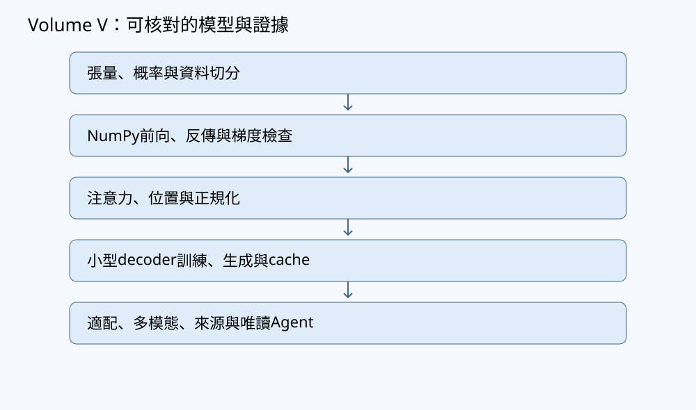

# 第12章 訓練流程、資料洩漏與除錯

## 學習目標與先備知識

完成本章後，讀者應能：

1. 區分訓練集、驗證集與測試集的角色。
2. 說明為何資料切分必須早於標準化、詞表建立、缺值填補與窗口建立。
3. 以群組或時間為單位切分，避免同來源的近似樣本跨集合。
4. 只用訓練資料擬合預處理參數，再把同一轉換套用到驗證集與測試集。
5. 實作早停、模型選擇及可從 epoch 邊界恢復的 checkpoint。
6. 分辨資料洩漏、過擬合、最佳化失敗與程式錯誤。
7. 明確記錄張量 shape、loss 平均軸、隨機種子與資料切分。
8. 在超參數與模型全部鎖定後，才使用測試集估計最終表現。

本章使用 NumPy 與 softmax 線性分類器。設每筆樣本橫向儲存：

- 特徵矩陣 $X\in\mathbb{R}^{B\times D}$；
- 權重 $W\in\mathbb{R}^{D\times C}$；
- 偏置 $b\in\mathbb{R}^{C}$；
- logits 為 $Z=XW+b\in\mathbb{R}^{B\times C}$；
- 標籤 $y\in\{0,\ldots,C-1\}^{B}$。

其中 $B$ 是批次大小，$D$ 是特徵維度，$C$ 是類別數。偏置由 $(C,)$ 廣播至 $(B,C)$，反向梯度沿 batch 軸求和：

$$
dW=X^\mathsf{T}dZ,\qquad
db=\sum_{i=1}^{B}dZ_{i,:}.
$$

因此 $dW$ 與 $W$ 同 shape，$db$ 與 $b$ 同 shape。

---

## 問題與直覺

一個常見但錯誤的流程如下：

1. 將全部資料一起標準化。
2. 從同一長序列建立大量重疊窗口。
3. 隨機把窗口分成訓練、驗證與測試集。
4. 反覆觀察測試結果並修改模型。
5. 報告其中最好的一次測試分數。

這個流程可能產生漂亮數字，卻不能回答「模型對真正未見來源是否有效」。

第一，若標準化的均值與標準差來自全部資料，測試集已影響模型使用的輸入座標系。即使沒有讀取測試標籤，仍屬資料洩漏。

第二，若先建立重疊窗口再隨機切分，相鄰窗口可能共享大部分觀測。例如

$$
[x_1,x_2,x_3,x_4]
$$

與

$$
[x_2,x_3,x_4,x_5]
$$

共享三個元素。若前者進入訓練集、後者進入測試集，測試樣本不再代表真正未見的序列片段。

第三，若測試集參與超參數選擇，它便實際扮演驗證集。嘗試許多模型後挑出測試分數最高者，本身就是對測試集的選擇性過擬合。

較可靠的證據鏈是：

> 定義預測時點與可用資訊 → 以來源、群組或時間切分 → 在各集合內建立窗口 → 只用訓練集擬合預處理 → 用驗證集選模與早停 → 鎖定全部決策 → 最後評估測試集。

低訓練誤差只表示模型能擬合已見資料，不等於泛化能力、因果能力、安全性或跨時間穩定性。



---

## 定義、定理與推導

### 1. 訓練、驗證與測試集合

設完整資料單位集合為 $\mathcal D$，切分成互不重疊的：

$$
\mathcal D_{\mathrm{train}},\qquad
\mathcal D_{\mathrm{val}},\qquad
\mathcal D_{\mathrm{test}}.
$$

三者角色如下：

- **訓練集**：估計模型參數，也擬合標準化、詞表及缺值填補值等預處理狀態。
- **驗證集**：選擇學習率、模型容量、正規化強度、早停輪次及決策閾值。
- **測試集**：在全部選擇完成後，估計最終程序對未見資料的表現。

「資料單位」不一定是一列。對同一池槽、裝置、文件、病患或連續日誌，正確切分單位往往是整個群組或時間區段，而不是切割後的窗口。

### 2. 經驗風險、機率域與平均方式

對分類樣本 $i$，穩定的負對數似然為

$$
\ell_i=-z_{i,y_i}+\log\sum_{c=0}^{C-1}\exp(z_{i,c}).
$$

實作時令 $m_i=\max_c z_{i,c}$：

$$
\log\sum_c e^{z_{i,c}}
=
m_i+\log\sum_c e^{z_{i,c}-m_i}.
$$

batch loss 沿樣本軸平均：

$$
L=\frac{1}{B}\sum_{i=1}^{B}\ell_i.
$$

softmax 機率為

$$
p_{i,c}
=
\frac{e^{z_{i,c}-m_i}}
{\sum_k e^{z_{i,k}-m_i}},
$$

且在精確算術下，若所有 logits 有限，則

$$
p_{i,c}>0,\qquad \sum_c p_{i,c}=1.
$$

有限精度浮點計算有所不同：當兩個有限 logits 的差距極大時，較小的 `exp` 項可能下溢成零。因此程式算出的某些 `probs` 可能恰為零。本章不以「先算 softmax、再取 log」計算 NLL，而直接使用穩定的 logits 公式；這避免因概率下溢為零而產生不必要的 $\log 0$。若 logits 含 NaN 或正負無限，程式直接拒絕。

梯度為

$$
\frac{\partial L}{\partial Z_{i,c}}
=
\frac{p_{i,c}-\mathbf 1[c=y_i]}{B}.
$$

平均因子 $1/B$ 只能除一次。若 `dlogits` 已除以 $B$，計算 $dW=X^\mathsf{T}dZ$ 時不可再次除以 $B$。

### 3. 預處理也是訓練狀態

對第 $j$ 個特徵，訓練統計為

$$
\mu_j=
\frac{1}{N_{\mathrm{train}}}
\sum_{i\in\mathrm{train}}X_{ij},
$$

$$
\sigma_j=
\sqrt{
\frac{1}{N_{\mathrm{train}}}
\sum_{i\in\mathrm{train}}(X_{ij}-\mu_j)^2
}.
$$

本章採母體式分母 $N_{\mathrm{train}}$，即 NumPy 的 `ddof=0`。轉換為

$$
\widetilde X_{ij}
=
\frac{X_{ij}-\mu_j}{\sigma_j}.
$$

驗證集與測試集必須沿用訓練集的 $\mu_j,\sigma_j$，不可各自重新擬合。若某訓練特徵滿足 $\sigma_j=0$，本章程式直接拒絕。另一種合法政策是刪除常數特徵，但必須把刪除欄位記入模型狀態。

### 4. 小命題：訓練標準化後的均值與方差

**命題。** 對固定特徵 $j$，若訓練樣本數 $N>0$，且以 `ddof=0` 計算的 $\sigma_j>0$，則訓練集標準化值 $\widetilde X_{ij}$ 沿樣本軸的均值為 $0$、方差為 $1$。

**證明。**

由均值定義，

$$
\frac{1}{N}\sum_{i=1}^{N}\widetilde X_{ij}
=
\frac{1}{N}\sum_i\frac{X_{ij}-\mu_j}{\sigma_j}
=
\frac{\sum_iX_{ij}-N\mu_j}{N\sigma_j}
=0.
$$

因轉換後均值為零，其使用分母 $N$ 的方差為

$$
\frac{1}{N}\sum_i\widetilde X_{ij}^2
=
\frac{1}{N}\sum_i
\frac{(X_{ij}-\mu_j)^2}{\sigma_j^2}
=
\frac{\sigma_j^2}{\sigma_j^2}
=1.
$$

因此結論成立。證畢。

這個結論只適用於擬合 $\mu_j,\sigma_j$ 的訓練資料。驗證集或測試集的轉換值不必均值為零、方差為一；差異可能正是分布偏移的證據。

### 5. 群組切分與時間切分

群組切分要求同一來源只屬於一個集合：

$$
g_i=g_k\Longrightarrow s_i=s_k,
$$

其中 $g_i$ 是群組識別碼，$s_i$ 是 train、val 或 test 指派。

若三個時間區段必須嚴格依序且互不重疊，條件應完整寫成

$$
\max t_{\mathrm{train}}
<
\min t_{\mathrm{val}},
$$

以及

$$
\max t_{\mathrm{val}}
<
\min t_{\mathrm{test}}.
$$

只寫 $\min t_{\mathrm{val}}<\min t_{\mathrm{test}}$ 不足以排除驗證集含有比測試集更晚的資料。若任務使用滾動窗口或交錯的回測協定，則應逐折明確定義訓練截止時點、驗證區間及測試區間，不能只用一句「按時間切分」帶過。

實際任務應依部署問題選擇：

- 預測既有群組的未來：每群組內按時間切分。
- 預測全新群組：按群組切分。
- 預測未來的新群組：測試集同時要求群組未見且時間較晚。

不能只因某種切法分數較高就採用它。

### 6. 早停與模型選擇

令第 $e$ 輪的驗證 loss 為 $V_e$。若

$$
V_e<V_{\mathrm{best}}-\delta,
$$

便保存當輪參數並清空未改善計數；否則計數加一。當計數達到 `patience` 時停止，最後恢復最佳驗證輪次，而不是最後一輪。

早停本身也是模型選擇，因此會消耗驗證資訊。若反覆嘗試大量架構，驗證集也可能被過度使用；可考慮巢狀交叉驗證或另設確認集。測試集仍不可成為日常監看儀表板。

### 7. checkpoint 與可重現性

可續訓的 checkpoint 至少應保存：

- 當前模型參數；
- 優化器狀態；
- 當前 epoch 或 step；
- 最佳驗證值、最佳輪次與最佳參數；
- 早停計數；
- 預處理統計；
- 切分識別碼；
- 隨機數產生器狀態；
- 資料游標或明確的恢復邊界；
- seed、dtype、資料生成規則及超參數。

本章使用沒有動量的 SGD，因此沒有額外的動量張量。checkpoint 固定在完整 epoch 結束後寫入，恢復點也限定在 epoch 邊界；因此不必保存批次內游標。

固定 seed 只約束指定的偽隨機流程，不保證跨 NumPy 版本、硬體、執行緒或演算法逐位相同。

---

## 逐步手算例題

### 例題一：只用訓練資料標準化

訓練與測試特徵為

$$
X_{\mathrm{train}}
=
\begin{bmatrix}
2\\
4\\
6
\end{bmatrix},
\qquad
X_{\mathrm{test}}
=
\begin{bmatrix}
100
\end{bmatrix}.
$$

第一步，訓練均值為

$$
\mu=\frac{2+4+6}{3}=4.
$$

第二步，訓練方差為

$$
\sigma^2
=
\frac{(2-4)^2+(4-4)^2+(6-4)^2}{3}
=
\frac{8}{3}.
$$

因此

$$
\sigma=\sqrt{\frac83}\approx1.633.
$$

第三步，轉換訓練集：

$$
\widetilde X_{\mathrm{train}}
\approx
\begin{bmatrix}
-1.225\\
0\\
1.225
\end{bmatrix}.
$$

第四步，使用相同統計轉換測試值：

$$
\widetilde X_{\mathrm{test}}
=
\frac{100-4}{1.633}
\approx58.79.
$$

這個大值是分布偏移訊號，不應透過重新擬合測試統計把它隱藏。

若錯誤地使用全部四筆資料，均值變成

$$
\mu_{\mathrm{all}}
=
\frac{2+4+6+100}{4}
=28.
$$

測試特徵 100 已改變訓練資料的座標系，即使未使用測試標籤，仍構成洩漏。

### 例題二：重疊窗口造成來源洩漏

某群組序列為

$$
[10,11,12,13,14,15].
$$

以窗口長度 $T=3$、步長一建立：

$$
w_1=[10,11,12],\quad
w_2=[11,12,13],
$$

$$
w_3=[12,13,14],\quad
w_4=[13,14,15].
$$

若 $w_1,w_3$ 分到訓練集，而 $w_2,w_4$ 分到測試集：

- $w_1$ 與 $w_2$ 共享 $11,12$；
- $w_3$ 與 $w_2$ 共享 $12,13$；
- $w_3$ 與 $w_4$ 共享 $13,14$。

雖然四個完整窗口都不同，測試集仍幾乎是訓練片段的平移副本。正確流程是先指派整個群組或時間區段，再於每個集合內建立窗口。

### 例題三：測試集不能反過來決定模型

有兩個候選模型：

| 模型 | 驗證 loss | 測試 loss |
|---|---:|---:|
| A | 0.40 | 0.52 |
| B | 0.45 | 0.41 |

依事先契約，應由驗證 loss 選 A，再報告 A 的測試 loss 0.52。不能看到 B 的測試結果較好後改選 B，否則測試集已參與模型選擇。

測試結果較差只表示驗證估計存在抽樣不確定性，或測試分布不同；改善方式是重新設計資料與驗證程序，不是反覆查詢同一測試集。

---

## 實作與程式

以下自足程式只依賴 Python 標準庫與 NumPy，在 CPU 上完成：

1. 產生具有 `group`、`time` 與 `seed` 的合成資料；
2. 先按群組切分；
3. 只用訓練資料擬合標準化；
4. 訓練 softmax 線性分類器；
5. 以驗證 loss 早停；
6. 保存並恢復 epoch 邊界 checkpoint；
7. 在選模完成後才評估測試集。

本例固定支援三個特徵與兩個類別。程式使用 `.npz` 儲存純陣列，載入時指定 `allow_pickle=False`；其他中繼資料使用 JSON。`stop_after_epoch` 是模擬外部中止的測試介面：中止時會保存狀態，但不讀取測試集。程式未在本章寫作流程中執行。

```python
import copy
import json
from dataclasses import asdict, dataclass
from pathlib import Path

import numpy as np


@dataclass
class Config:
    seed: int = 7
    groups: int = 12
    times: int = 20
    features: int = 3
    classes: int = 2
    epochs: int = 200
    batch_size: int = 16
    lr: float = 0.08
    patience: int = 20
    min_delta: float = 1e-6


def validate_config(cfg):
    if cfg.groups < 12:
        raise ValueError("固定群組切分至少需要12個群組")
    if cfg.times < 2:
        raise ValueError("每群組至少需要2個時點")
    if cfg.features != 3 or cfg.classes != 2:
        raise ValueError("本例固定支援3個特徵與2個類別")
    if cfg.epochs < 1 or cfg.batch_size < 1:
        raise ValueError("epochs與batch_size必須為正整數")
    if not np.isfinite(cfg.lr) or cfg.lr <= 0.0:
        raise ValueError("lr必須是有限正數")
    if cfg.patience < 1 or cfg.min_delta < 0.0:
        raise ValueError("patience須為正，min_delta不可為負")


def make_data(cfg):
    """回傳X(N,3)、y(N,)、group(N,)、time(N,)；均為合成資料。"""
    validate_config(cfg)
    rng = np.random.default_rng(cfg.seed)
    rows, labels, groups, times = [], [], [], []

    for g in range(cfg.groups):
        group_offset = rng.normal(0.0, 0.7)
        for t in range(cfg.times):
            x = np.array([
                group_offset + 0.05 * t,
                np.sin(t / 3.0) + rng.normal(0.0, 0.15),
                rng.normal(0.0, 1.0),
            ], dtype=np.float64)
            score = 1.2 * x[0] - 0.8 * x[1] + 0.3 * x[2]
            score += rng.normal(0.0, 0.25)

            rows.append(x)
            labels.append(int(score > 0.0))
            groups.append(g)
            times.append(t)

    return (
        np.stack(rows),
        np.asarray(labels, dtype=np.int64),
        np.asarray(groups, dtype=np.int64),
        np.asarray(times, dtype=np.int64),
    )


def split_by_group(X, y, group, time):
    """群組0..7訓練、8..9驗證、10以上測試。"""
    if not (len(X) == len(y) == len(group) == len(time)):
        raise ValueError("X、y、group、time長度不一致")

    masks = {
        "train": group < 8,
        "val": (group >= 8) & (group < 10),
        "test": group >= 10,
    }

    if any(np.count_nonzero(mask) == 0 for mask in masks.values()):
        raise ValueError("train、val、test皆必須非空")
    if not np.all(masks["train"] | masks["val"] | masks["test"]):
        raise AssertionError("存在未指派樣本")
    if np.any(masks["train"] & masks["val"]):
        raise AssertionError("train與val重疊")
    if np.any(masks["train"] & masks["test"]):
        raise AssertionError("train與test重疊")
    if np.any(masks["val"] & masks["test"]):
        raise AssertionError("val與test重疊")

    return {
        name: {
            "X": X[mask],
            "y": y[mask],
            "group": group[mask],
            "time": time[mask],
        }
        for name, mask in masks.items()
    }


def assert_disjoint_groups(parts):
    names = ("train", "val", "test")
    sets = {
        name: set(parts[name]["group"].tolist()) for name in names
    }
    for i, left in enumerate(names):
        for right in names[i + 1:]:
            overlap = sets[left] & sets[right]
            if overlap:
                raise AssertionError(
                    f"{left}與{right}共享群組：{sorted(overlap)}"
                )


def fit_standardizer(X):
    if X.ndim != 2 or X.shape[0] == 0:
        raise ValueError("X必須是非空(N,D)矩陣")
    if not np.all(np.isfinite(X)):
        raise ValueError("訓練特徵含非有限值")

    mean = X.mean(axis=0)        # (D,)
    std = X.std(axis=0, ddof=0)  # (D,)
    if np.any(std == 0.0):
        raise ValueError("訓練資料含零方差特徵")
    return mean, std


def transform(X, mean, std):
    if X.ndim != 2:
        raise ValueError("X必須是(N,D)")
    if mean.shape != (X.shape[1],) or std.shape != mean.shape:
        raise ValueError("mean或std的shape錯誤")
    if not np.all(np.isfinite(X)):
        raise ValueError("輸入特徵含非有限值")
    if np.any(std <= 0.0) or not np.all(np.isfinite(std)):
        raise ValueError("std必須有限且為正")

    Xz = (X - mean) / std  # mean與std沿樣本軸廣播
    if not np.all(np.isfinite(Xz)):
        raise ValueError("標準化結果含非有限值")
    return Xz


def loss_and_grad(X, y, W, b):
    """平均CE；X(B,D)、W(D,C)、b(C,)、y(B,)。"""
    if X.ndim != 2:
        raise ValueError("X必須是(B,D)")
    B, D = X.shape
    if B == 0:
        raise ValueError("空批次沒有已定義的平均loss")
    if W.ndim != 2 or W.shape[0] != D:
        raise ValueError("W的shape錯誤")

    C = W.shape[1]
    if b.shape != (C,):
        raise ValueError("b的shape錯誤")
    if y.shape != (B,) or np.any(y < 0) or np.any(y >= C):
        raise ValueError("標籤shape或範圍錯誤")

    logits = X @ W + b  # (B,C)
    if not np.all(np.isfinite(logits)):
        raise ValueError("logits含非有限值")

    shifted = logits - logits.max(axis=1, keepdims=True)
    exp_shifted = np.exp(shifted)
    denominator = exp_shifted.sum(axis=1, keepdims=True)
    probs = exp_shifted / denominator

    # 直接由穩定logits計算，不對probs取log。
    nll = (
        -shifted[np.arange(B), y]
        + np.log(denominator[:, 0])
    )
    loss = nll.mean(axis=0)  # 只沿batch軸平均一次

    dlogits = probs.copy()
    dlogits[np.arange(B), y] -= 1.0
    dlogits /= B

    dW = X.T @ dlogits       # (D,C)
    db = dlogits.sum(axis=0) # 沿batch軸求和成(C,)
    return float(loss), dW, db


def evaluate(X, y, W, b):
    loss, _, _ = loss_and_grad(X, y, W, b)
    pred = np.argmax(X @ W + b, axis=1)
    accuracy = np.mean(pred == y)
    return {"loss": float(loss), "accuracy": float(accuracy)}


def checkpoint_paths(prefix):
    prefix = Path(prefix)
    return prefix.with_suffix(".npz"), prefix.with_suffix(".json")


def save_checkpoint(prefix, arrays, metadata):
    array_path, json_path = checkpoint_paths(prefix)
    np.savez(array_path, **arrays)
    json_path.write_text(
        json.dumps(metadata, ensure_ascii=False, indent=2),
        encoding="utf-8",
    )


def load_checkpoint(prefix):
    """NPZ禁止pickle；仍只應載入來源受控、未被竄改的檔案。"""
    array_path, json_path = checkpoint_paths(prefix)
    with np.load(array_path, allow_pickle=False) as data:
        arrays = {name: data[name].copy() for name in data.files}
    metadata = json.loads(json_path.read_text(encoding="utf-8"))
    return arrays, metadata


def prepare(cfg):
    X, y, group, time = make_data(cfg)
    parts = split_by_group(X, y, group, time)
    assert_disjoint_groups(parts)

    mean, std = fit_standardizer(parts["train"]["X"])
    for name in ("train", "val", "test"):
        parts[name]["Xz"] = transform(parts[name]["X"], mean, std)
    return parts, mean, std


def train(cfg, checkpoint_prefix="chapter12_checkpoint",
          resume=False, stop_after_epoch=None):
    """
    stop_after_epoch模擬epoch邊界中止。
    中止時只回傳狀態，不評估測試集。
    """
    validate_config(cfg)
    if stop_after_epoch is not None:
        if stop_after_epoch < 0 or stop_after_epoch >= cfg.epochs:
            raise ValueError("stop_after_epoch超出合法範圍")

    parts, mean, std = prepare(cfg)
    Xtr = parts["train"]["Xz"]
    ytr = parts["train"]["y"]

    expected_groups = {
        name: np.unique(parts[name]["group"])
        for name in ("train", "val", "test")
    }

    if resume:
        arrays, meta = load_checkpoint(checkpoint_prefix)
        if meta["config"] != asdict(cfg):
            raise ValueError("checkpoint設定與目前Config不一致")

        for name in ("train", "val", "test"):
            if not np.array_equal(
                arrays[f"{name}_groups"], expected_groups[name]
            ):
                raise ValueError("checkpoint資料切分不一致")

        if not np.array_equal(arrays["mean"], mean):
            raise ValueError("checkpoint標準化均值不一致")
        if not np.array_equal(arrays["std"], std):
            raise ValueError("checkpoint標準化標準差不一致")

        W = arrays["W"]
        b = arrays["b"]
        best_W = arrays["best_W"]
        best_b = arrays["best_b"]
        best_val = float(meta["best_val"])
        best_epoch = int(meta["best_epoch"])
        stale = int(meta["stale"])
        start_epoch = int(meta["epoch"]) + 1

        rng = np.random.default_rng()
        rng.bit_generator.state = meta["rng_state"]
    else:
        rng = np.random.default_rng(cfg.seed + 1)
        W = rng.normal(
            0.0, 0.05, size=(cfg.features, cfg.classes)
        )
        b = np.zeros(cfg.classes, dtype=np.float64)
        best_W = W.copy()
        best_b = b.copy()
        best_val = np.inf
        best_epoch = -1
        stale = 0
        start_epoch = 0

    if stale >= cfg.patience:
        start_epoch = cfg.epochs

    interrupted = False
    last_epoch = start_epoch - 1

    for epoch in range(start_epoch, cfg.epochs):
        order = rng.permutation(len(ytr))
        for start in range(0, len(ytr), cfg.batch_size):
            idx = order[start:start + cfg.batch_size]
            _, dW, db = loss_and_grad(Xtr[idx], ytr[idx], W, b)
            W -= cfg.lr * dW
            b -= cfg.lr * db

        val = evaluate(parts["val"]["Xz"], parts["val"]["y"], W, b)
        if val["loss"] < best_val - cfg.min_delta:
            best_val = val["loss"]
            best_epoch = epoch
            best_W = W.copy()
            best_b = b.copy()
            stale = 0
        else:
            stale += 1

        arrays = {
            "W": W.copy(),
            "b": b.copy(),
            "best_W": best_W.copy(),
            "best_b": best_b.copy(),
            "mean": mean.copy(),
            "std": std.copy(),
            "train_groups": expected_groups["train"],
            "val_groups": expected_groups["val"],
            "test_groups": expected_groups["test"],
        }
        metadata = {
            "epoch": epoch,
            "best_epoch": best_epoch,
            "best_val": best_val,
            "stale": stale,
            "rng_state": copy.deepcopy(rng.bit_generator.state),
            "config": asdict(cfg),
            "resume_boundary": "end_of_epoch",
            "dtype": "float64",
        }
        save_checkpoint(checkpoint_prefix, arrays, metadata)
        last_epoch = epoch

        if stop_after_epoch is not None and epoch >= stop_after_epoch:
            interrupted = True
            break
        if stale >= cfg.patience:
            break

    if interrupted:
        return {
            "status": "interrupted",
            "last_epoch": last_epoch,
            "best_epoch": best_epoch,
        }

    if best_epoch < 0:
        raise RuntimeError("沒有取得有效驗證模型")

    # 僅在訓練與選模完成後評估測試集。
    metrics = {
        name: evaluate(
            parts[name]["Xz"], parts[name]["y"], best_W, best_b
        )
        for name in ("train", "val", "test")
    }
    return {
        "status": "completed",
        "metrics": metrics,
        "W": best_W,
        "b": best_b,
        "mean": mean,
        "std": std,
        "best_epoch": best_epoch,
        "last_epoch": last_epoch,
    }


if __name__ == "__main__":
    result = train(Config())
    print(result["status"])
    print(result["metrics"])
```

`resume=True` 時，程式重建相同合成資料及切分，核對設定、群組和標準化統計，再恢復當前參數、最佳參數、早停計數與 RNG 狀態。因 checkpoint 在每個 epoch 結束後寫入，下一輪由 `epoch+1` 開始。

這仍不保證跨 NumPy 版本逐位一致。更嚴格的實驗還需記錄 Python、NumPy、作業系統、CPU、執行緒設定及程式版本。`.npz` 與 JSON 也應放在受控目錄並配合完整性雜湊；`allow_pickle=False` 不等於檔案一定可信。

---

## 測試與預期結果

以下測試未在本章寫作時執行；所述皆為預期結果。

### 正常測試：shape、切分與標準化

```python
cfg = Config()
X, y, g, t = make_data(cfg)
parts = split_by_group(X, y, g, t)
assert_disjoint_groups(parts)

mu, sd = fit_standardizer(parts["train"]["X"])
Xtr = transform(parts["train"]["X"], mu, sd)

assert X.shape == (240, 3)
assert y.shape == (240,)
assert parts["train"]["X"].shape == (160, 3)
assert parts["val"]["X"].shape == (40, 3)
assert parts["test"]["X"].shape == (40, 3)
assert np.allclose(Xtr.mean(axis=0), 0.0, atol=1e-12)
assert np.allclose(Xtr.std(axis=0), 1.0, atol=1e-12)
```

預期：shape 成立，三集合群組互斥；訓練標準化後各特徵均值近零、母體標準差近一。驗證與測試資料不應被要求具有相同性質。

### 正常測試：checkpoint 讀回

```python
prefix = "checkpoint_test"
cfg = Config(epochs=3, patience=3)
train(cfg, checkpoint_prefix=prefix)

arrays, meta = load_checkpoint(prefix)
assert arrays["W"].shape == (3, 2)
assert arrays["b"].shape == (2,)
assert arrays["mean"].shape == (3,)
assert meta["config"] == asdict(cfg)
assert meta["resume_boundary"] == "end_of_epoch"
```

預期：測試先建立 checkpoint，再從同一前綴載入，不依賴其他測試留下的檔案。

### 正常測試：中止後恢復

```python
cfg = Config(epochs=6, patience=20)

full = train(
    cfg,
    checkpoint_prefix="full_run",
)

partial = train(
    cfg,
    checkpoint_prefix="resume_run",
    stop_after_epoch=2,
)
assert partial["status"] == "interrupted"
assert partial["last_epoch"] == 2

before_arrays, before_meta = load_checkpoint("resume_run")
assert before_meta["epoch"] == 2

resumed = train(
    cfg,
    checkpoint_prefix="resume_run",
    resume=True,
)
after_arrays, after_meta = load_checkpoint("resume_run")

assert resumed["status"] == "completed"
assert after_meta["epoch"] == 5
assert after_meta["best_epoch"] == resumed["best_epoch"]
assert np.array_equal(full["W"], resumed["W"])
assert np.array_equal(full["b"], resumed["b"])
assert np.array_equal(
    after_arrays["best_W"], resumed["W"]
)
```

預期：部分訓練在 epoch 2 結束後保存，但不評估測試集；恢復後從 epoch 3 繼續。若同一環境、同一 NumPy 版本、同一 dtype、相同執行順序及確定性運算皆成立，完整執行與中止後恢復應得到相同的最佳參數。跨環境不保證逐位一致；此處也不宣稱測試已實際通過。

這個測試同時覆蓋：

- epoch 接續；
- 當前與最佳參數恢復；
- RNG 狀態接續；
- 早停計數與最佳輪次恢復；
- 中止階段不查詢測試集。

### 邊界測試：最後一個小批次

訓練集有 $8\times20=160$ 筆。若 batch 大小為 31，最後一批只有 5 筆：

```python
result = train(
    Config(batch_size=31, epochs=3),
    checkpoint_prefix="small_last_batch",
)
```

預期：不因最後批次較小而產生 shape 錯誤。`loss_and_grad` 使用該批實際的 $B$ 平均。

### 邊界測試：單筆批次

```python
X1 = np.array([[0.2, -0.1, 0.7]])  # (1,3)，不是(3,)
y1 = np.array([1])
W = np.zeros((3, 2))
b = np.zeros(2)

loss, dW, db = loss_and_grad(X1, y1, W, b)
assert dW.shape == W.shape
assert db.shape == b.shape
assert np.isfinite(loss)
```

預期：$B=1$ 時仍保留 batch 軸，梯度 shape 正確。

### 邊界測試：極端但有限 logits

```python
Xb = np.array([[1.0]])
yb = np.array([1])
W = np.array([[1000.0, -1000.0]])
b = np.zeros(2)

loss, dW, db = loss_and_grad(Xb, yb, W, b)
assert np.isfinite(loss)
assert np.all(np.isfinite(dW))
assert np.all(np.isfinite(db))
```

預期：某個 softmax 指數項可能下溢成零，但 NLL 由穩定 logits 公式計算，仍應為有限值；不使用 `np.log(probs)`。

### 故障測試：不相容設定

```python
make_data(Config(groups=10))
make_data(Config(features=4))
make_data(Config(classes=3))
```

預期：三者分別拋出 `ValueError`，避免空集合、特徵 shape 不一致及名義三分類但實際只有二元標籤。

### 故障測試：群組洩漏

```python
cfg = Config()
X, y, g, t = make_data(cfg)
parts = split_by_group(X, y, g, t)
parts["test"]["group"][0] = parts["train"]["group"][0]
assert_disjoint_groups(parts)
```

預期：拋出 `AssertionError`，指出訓練集與測試集共享群組。

### 故障測試：零方差、NaN 與錯誤標籤

```python
fit_standardizer(np.ones((4, 3)))
```

預期：拒絕零方差特徵。

```python
fit_standardizer(
    np.array([[1.0, np.nan], [2.0, 3.0]])
)
```

預期：拒絕非有限值。

```python
loss_and_grad(
    np.zeros((2, 3)),
    np.array([0, 2]),  # C=2時只允許0、1
    np.zeros((3, 2)),
    np.zeros(2),
)
```

預期：拒絕超出類別支撐的標籤。

---

## 反例與常見陷阱

### 1. 先標準化再切分

問題不只在於是否讀取測試標籤。測試特徵一旦參與估計 $\mu,\sigma$，便已改變模型輸入空間。

### 2. 各集合各自標準化

這會讓驗證集或測試集使用自身分布資訊，通常不符合單筆部署情境。它們應套用訓練統計。

### 3. 先切窗口再隨機分配

相鄰窗口高度重疊，同一事件甚至同一標籤可能跨集合。必須先切文件、來源、群組或時間，再於集合內建窗。

### 4. 每輪都觀察測試結果

只要研究者根據測試曲線修改任何決策，測試集就已成為驗證集，最終數字帶有選擇偏差。

### 5. 用訓練 loss 選 checkpoint

訓練 loss 下降只代表對已見樣本的擬合改善。若目標是泛化，應使用預先指定的驗證指標。

### 6. 混淆最佳化失敗、過擬合與洩漏

- 訓練 loss 不下降：檢查梯度、學習率、標籤、輸入尺度與 shape。
- 訓練 loss 下降、驗證 loss 上升：可能過擬合或分布偏移。
- 訓練與驗證異常地好：檢查標籤、群組或時間洩漏。
- 訓練與驗證正常、測試很差：可能是驗證代表性不足或測試分布偏移。
- loss 成為 NaN：檢查非有限輸入、學習率及數值穩定性。

### 7. 只固定 seed 就宣稱可重現

seed 不包含程式版本、資料排序、dtype、執行緒、硬體及數值函式庫差異。可重現性是一份完整契約，不是一個整數。

### 8. 將準確率當唯一證據

類別不平衡時，全猜多數類別也可能有高準確率。應同時記錄類別比例、NLL、混淆矩陣及簡單基線，並寫明 reduction 軸。

### 9. checkpoint 只有權重

權重通常足以推論，卻不一定足以續訓。續訓還需要優化器、RNG、早停狀態、資料位置、預處理與切分契約。

### 10. 把安全格式等同可信資料

`allow_pickle=False` 降低任意 Python 物件反序列化的風險，但不能證明檔案未被替換。實務上仍需限制路徑、權限、來源與完整性。

---

## AI、幾何與養殖案例

考慮完全合成的養殖感測資料。每個 `group` 代表虛構池槽，每個時間點含三個合成特徵：

$$
x_{g,t}\in\mathbb{R}^{3}.
$$

模型輸入是三維特徵空間中的點。以訓練均值平移，再以訓練標準差逐軸縮放，相當於建立由訓練資料決定的座標系。若測試點遠離訓練點雲，標準化值可能很大；幾何上表示模型正在外插，不應重新擬合測試統計來隱藏偏移。

若目標是預測「全新池槽」，應按池槽群組切分。若目標是預測「已知池槽的未來」，則應按時間切分，且任何輸入窗口只能使用預測時點以前的資料。未來測量、未來維護紀錄或事後填寫的結果欄位都不可成為輸入。

例如由 $t-3,t-2,t-1,t$ 預測 $t+1$，單一窗口 shape 為

$$
X^{(i)}\in\mathbb{R}^{T\times D}
=
\mathbb{R}^{4\times3}.
$$

組成 batch 後為 $(B,T,D)$。若線性分類器需要攤平，才可 reshape 成 $(B,TD)=(B,12)$。reshape 不會交換軸；若原始資料是 $(B,D,T)$，必須先 transpose 成 $(B,T,D)$，再 reshape。

可稽核報告至少應保留：

- 合成規則與 seed；
- 每個池槽的 `group` 與 `time`；
- 切分清單；
- 訓練標準化統計；
- 模型與 checkpoint 選擇規則；
- 未使用測試集調參的聲明；
- 基線、失敗案例及分布偏移觀察。

這些池槽、特徵與標籤都是教學用合成資料，不代表真實操作閾值，也不能轉為投餌、曝氣、加藥或設備控制建議。

---

## 習題

### 一、手算題

訓練特徵為 $[1,3,5,7]^\mathsf{T}$，驗證特徵為 $[9]^\mathsf{T}$。

1. 用 `ddof=0` 計算訓練均值與標準差。
2. 標準化四筆訓練資料及驗證資料。
3. 說明為何不應加入驗證值重新計算統計量。

### 二、程式題

修改本章程式，使切分方式改為每個群組內：

- $t<12$ 為訓練；
- $12\le t<16$ 為驗證；
- $t\ge16$ 為測試。

要求檢查三集合非空、同一 `(group,time)` 不重複，並只用訓練資料擬合標準化。

### 三、反例題

某研究者建立長度 10、步長 1 的時間窗口，再隨機以 80/10/10 切分。他聲稱：「每個完整窗口只出現一次，所以沒有洩漏。」指出錯誤，並構造兩個跨集合但共享九個元素的窗口。

### 四、整合題

有三個候選學習率 $0.1,0.01,0.001$，每個各訓練五個 seed。設計一個不使用測試集調參的流程，回答：

1. 預處理統計從哪裡取得？
2. 如何使用驗證集選學習率與 checkpoint？
3. 多 seed 結果如何報告？
4. 測試集何時使用？
5. checkpoint 至少保存哪些狀態？

---

## 習題解答

### 一、手算題解答

均值為

$$
\mu=\frac{1+3+5+7}{4}=4.
$$

方差為

$$
\sigma^2
=
\frac{(1-4)^2+(3-4)^2+(5-4)^2+(7-4)^2}{4}
=5,
$$

所以 $\sigma=\sqrt5$。

訓練轉換值為

$$
\left[
-\frac3{\sqrt5},
-\frac1{\sqrt5},
\frac1{\sqrt5},
\frac3{\sqrt5}
\right]^\mathsf{T}.
$$

驗證值為

$$
\widetilde x_{\mathrm{val}}
=
\frac{9-4}{\sqrt5}
=
\sqrt5.
$$

若加入驗證值重新計算，驗證資料便會改變輸入座標系。因此應保留訓練統計 $\mu=4,\sigma=\sqrt5$。

### 二、程式題解答

```python
def split_by_time(X, y, group, time):
    masks = {
        "train": time < 12,
        "val": (time >= 12) & (time < 16),
        "test": time >= 16,
    }
    if any(np.count_nonzero(m) == 0 for m in masks.values()):
        raise ValueError("train、val、test皆必須非空")

    parts, seen = {}, set()
    for name, mask in masks.items():
        pairs = list(zip(
            group[mask].tolist(),
            time[mask].tolist(),
        ))
        pair_set = set(pairs)
        if len(pair_set) != len(pairs):
            raise AssertionError(f"{name}內有重複(group,time)")
        if seen & pair_set:
            raise AssertionError("不同集合共享(group,time)")
        seen |= pair_set

        parts[name] = {
            "X": X[mask],
            "y": y[mask],
            "group": group[mask],
            "time": time[mask],
        }

    if len(seen) != len(y):
        raise AssertionError("存在遺漏或重複樣本")
    return parts
```

標準化仍須寫成：

```python
mean, std = fit_standardizer(parts["train"]["X"])
for name in ("train", "val", "test"):
    parts[name]["Xz"] = transform(
        parts[name]["X"], mean, std
    )
```

此切法評估「已見群組的未來」，不是「全新群組」。建立窗口時也必須禁止窗口跨越 $t=12$ 或 $t=16$。

### 三、反例題解答

設原序列為 $[x_1,x_2,\ldots,x_{11}]$，兩個窗口為

$$
w_1=[x_1,x_2,\ldots,x_{10}],
$$

$$
w_2=[x_2,x_3,\ldots,x_{11}].
$$

它們不完全相同，卻共享 $x_2,\ldots,x_{10}$ 共九個元素。若分屬訓練集與測試集，測試資料就不是獨立的新時間區段。應先按序列或時間區間切分，再在集合內建立窗口。

### 四、整合題解答

1. 標準化、缺值填補與詞表等狀態只能由訓練集擬合；所有候選模型共用固定的訓練預處理狀態。
2. 每個學習率與 seed 都依驗證 NLL 保存最佳 checkpoint。可預先規定以五個 seed 的平均最佳驗證 NLL 選學習率，並預先設定平手規則。
3. 報告每個 seed、平均值與離散程度，不可只挑最好 seed。五個 seed 不代表普遍統計顯著。
4. 學習率、早停、架構及報告方法全部鎖定後才評估測試集。若依測試結果再改模型，便需要新的未使用測試集。
5. 至少保存當前與最佳模型、優化器狀態、epoch/step、最佳驗證值、最佳輪次、早停計數、RNG 狀態、資料游標或恢復邊界、切分識別碼、預處理統計、dtype、設定與資料版本。

---

## 本章小結

可靠訓練不是單一最佳化迴圈，而是一套證據契約。訓練集負責估計模型與預處理狀態；驗證集負責早停與選模；測試集只在全部決策完成後使用。若資料具有群組、文件或時間結構，必須先依真正的部署單位切分，再標準化及建立窗口。

除錯時應先檢查 shape、集合交集、非有限值、標籤範圍、loss reduction 與梯度尺度，再討論模型容量。checkpoint 也不只是權重檔案；要續訓，還需保存優化器、RNG、早停狀態、資料位置、預處理及切分契約。

最重要的原則是：測試集不是可反覆查詢的答案伺服器。只要測試資料參與座標建立、窗口混合、超參數選擇或人工決策，報告數字便不再是獨立的泛化證據。

---

## 參考來源

1. NumPy，*Broadcasting*，<https://numpy.org/doc/stable/user/basics.broadcasting.html>。本章僅列為延伸入口，未宣稱已逐條核對。
2. Dive into Deep Learning，<https://d2l.ai/>。延伸閱讀入口，未逐章核對。
3. PyTorch，*Reproducibility*，<https://docs.pytorch.org/docs/stable/notes/randomness.html>。延伸入口；本章不據此宣稱跨版本或跨硬體逐位可重現。
4. Vaswani et al., “Attention Is All You Need,” 2017，<https://arxiv.org/abs/1706.03762>。與後續 Transformer 訓練流程相關；本章不依賴其注意力實作。